# 课程P54：IOU与mAP指标计算详解 🎯

在本节课中，我们将学习目标检测任务中的两个核心评估指标：IOU和mAP。理解这些指标对于衡量和比较不同检测模型的性能至关重要。

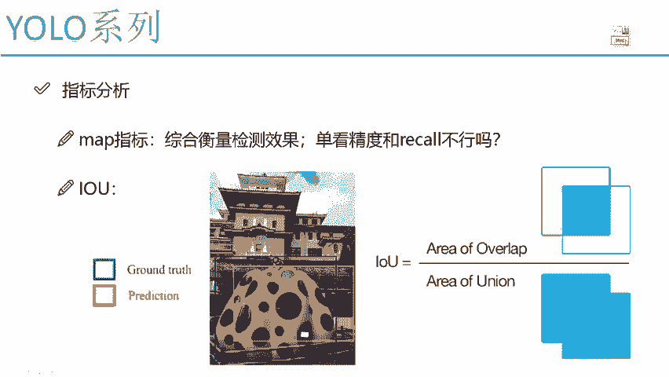

上一节我们介绍了目标检测的基本任务，本节中我们来看看如何量化评估一个检测模型的好坏。

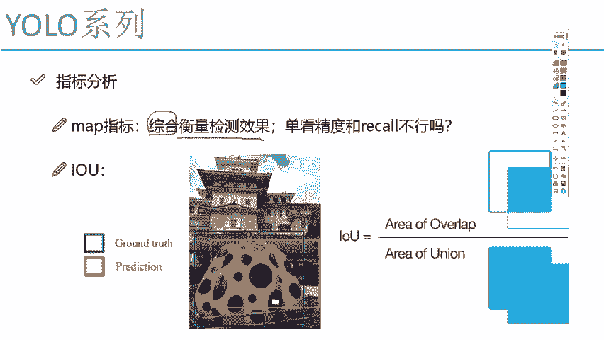

## 综合评估指标：mAP

mAP（mean Average Precision）是一个综合衡量检测效果的指标。对于检测效果，我们可以从精度（Precision）和召回率（Recall）两个角度分析。

*   **精度**：指检测到的物体框与实际标注框的吻合程度。
*   **召回率**：指所有实际存在的物体中，有多少被成功检测出来。

在机器学习中，精度和召回率通常是矛盾的：一个指标升高，另一个往往会降低。因此，单独看其中任何一个指标都难以全面评价模型性能。mAP正是为了解决这个问题而提出的，它综合了精度和召回率的信息。

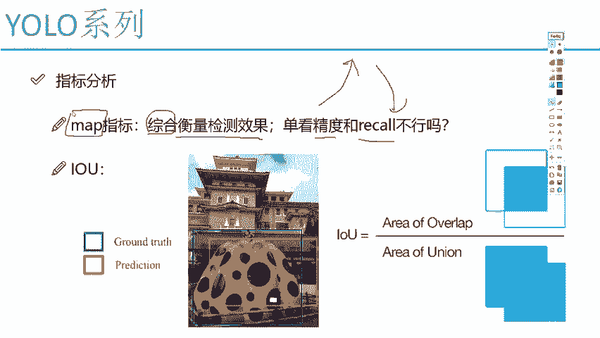

在介绍mAP的计算方法之前，我们需要先理解另一个基础且重要的概念。

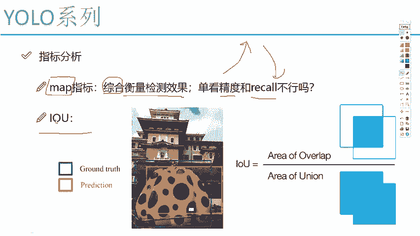

## 基础概念：IOU（交并比）

IOU是“Intersection over Union”的缩写，中文称为交并比。它衡量的是预测框与真实标注框之间的重叠程度。

以下是IOU的计算原理：

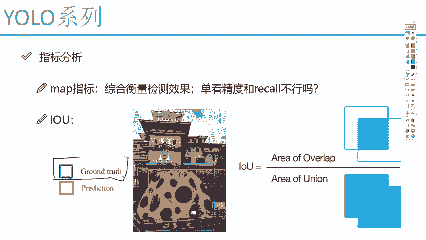

*   **分子**：是**交集（Intersection）**，即预测框与真实框重叠的区域（图中红色部分）。
*   **分母**：是**并集（Union）**，即预测框与真实框所覆盖的总区域。

其计算公式可以表示为：
**IOU = 交集面积 / 并集面积**

在目标检测中：
*   **真实值（Ground Truth）**：数据集中人工标注的、物体实际所在位置的边界框（图中蓝色框）。
*   **预测值（Prediction）**：模型预测出的物体边界框（图中黄色框）。

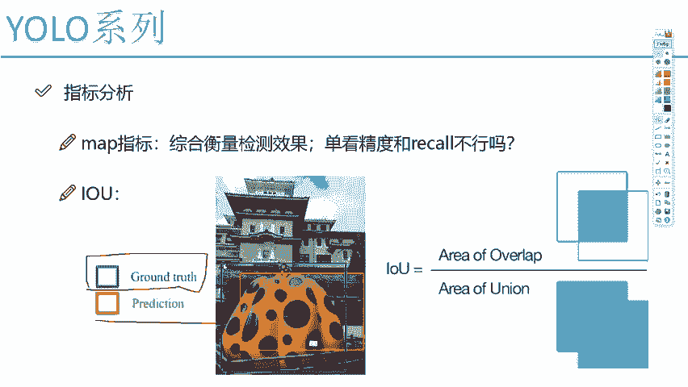

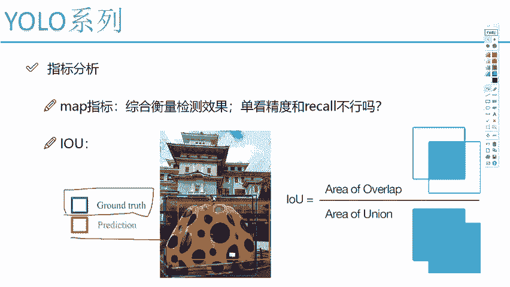

我们希望预测框能尽可能与真实框重合，即**IOU值越高越好**。IOU越高，说明预测的位置越准确；IOU越低，则说明预测偏差越大。

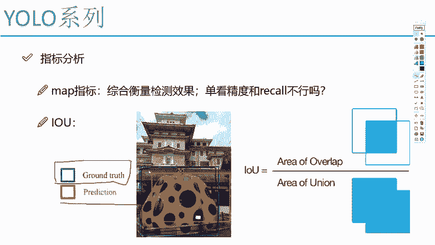

理解了IOU这个衡量“位置吻合度”的指标后，我们再回到对整体“检测效果”的评估。

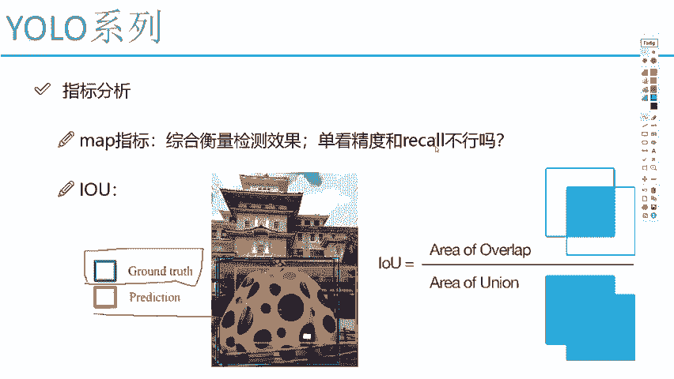

## 精度与召回率的矛盾

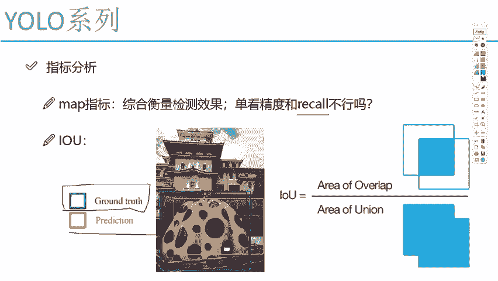

为了更直观地理解mAP的必要性，我们来看看精度和召回率为何会矛盾。

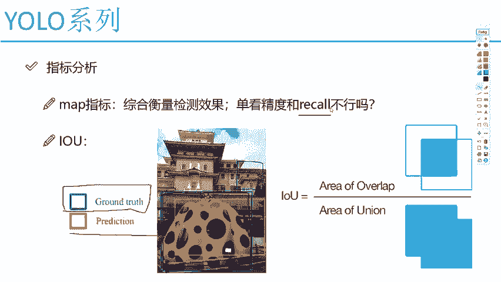

*   **精度**关注的是“检测得准不准”，即每一个预测框是否都对应着一个真实的物体（高IOU）。
*   **召回率**关注的是“检测得全不全”，即是否把所有真实的物体都找出来了。

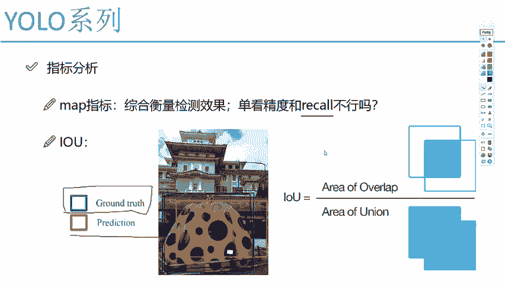

举个例子：如果一个模型为了不漏掉任何物体（提高召回率），它可能会输出非常多的预测框，其中必然包含大量错误或重叠的框，这会导致精度下降。反之，如果模型只输出把握最大的几个框（提高精度），就可能漏掉一些不明显的物体，导致召回率降低。

因此，我们需要一个像**mAP**这样的单一指标，来平衡精度和召回率，从而对模型性能给出一个综合评分。

---

### 本节课总结

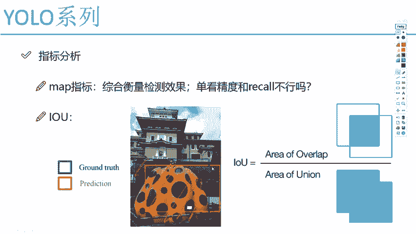

本节课中我们一起学习了目标检测的核心评估指标：
1.  **IOU（交并比）**：用于计算预测框与真实框的重叠程度，是衡量定位精度的基础指标，其值越高越好。
2.  **mAP（平均精度均值）**：一个综合了精度（Precision）和召回率（Recall）的指标，用于全面评估检测模型的整体性能。它是比较和优化模型的关键依据。

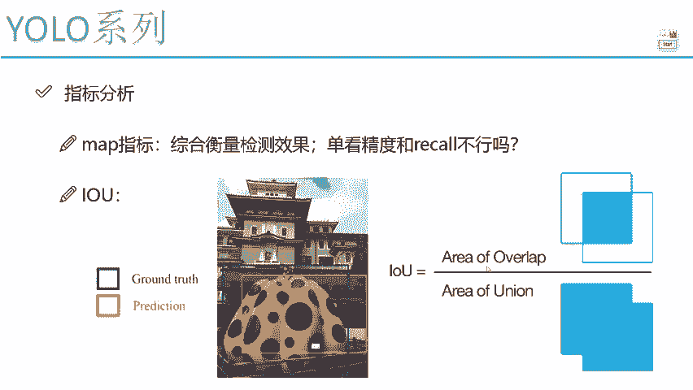

理解IOU和mAP，是分析后续YOLO等目标检测算法改进与性能对比的基础。