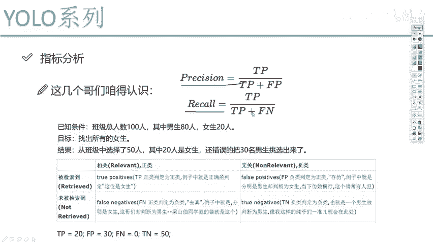
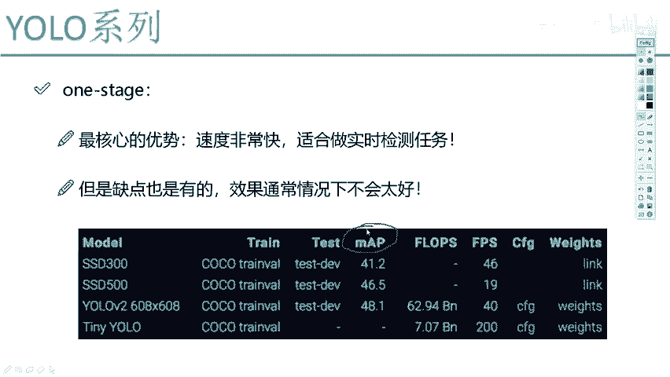
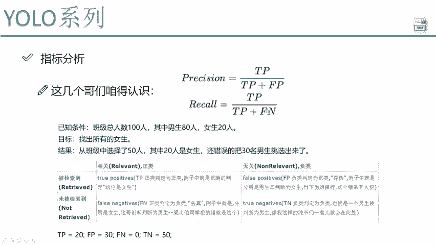

# 课程P55：4-评估所需参数计算 📊

在本节课中，我们将学习目标检测任务中两个至关重要的评估指标：精度（Precision）与召回率（Recall）。理解这两个指标是计算mAP（平均精度均值）的基础，也是阅读论文和进行技术交流的核心。

---

## 核心概念：TP、FP、FN、TN

上一节我们介绍了评估指标的重要性，本节中我们来看看计算这些指标所需的基础参数。为了理解精度和召回率的公式，我们必须先明确几个核心概念：TP、FP、FN和TN。

这些术语通常会让初学者感到困惑。我们通过一个简单的例子来理解它们。

假设有一个班级，共有100人，其中男生80人，女生20人。我们的任务是“找出所有女生”。现在，我们从这个班级中挑选了50人进行预测，结果挑出了20名女生和30名男生。

以下是各个参数的含义及其在该例子中的计算：

*   **TP (True Positive)**：**做对了**，并且正确地将其判断为**正例**。在我们的任务中，正例是“女生”。因此，TP代表“该学生本是女生，且我们正确地将其预测为女生”。例子中，我们挑出了20名女生，所以 **TP = 20**。
*   **FP (False Positive)**：**做错了**，并且错误地将其判断为**正例**。这代表“该学生本是男生（负例），但我们错误地将其预测为女生（正例）”。例子中，我们错误地将30名男生当作女生挑出，所以 **FP = 30**。
*   **FN (False Negative)**：**做错了**，并且错误地将其判断为**负例**。这代表“该学生本是女生（正例），但我们错误地将其预测为男生（负例）或背景（即漏检）”。例子中，我们目标是找所有女生，且挑出的20名女生都已找到，没有遗漏，所以 **FN = 0**。
*   **TN (True Negative)**：**做对了**，并且正确地将其判断为**负例**。这代表“该学生本是男生（负例），我们也正确地将其预测为男生（负例）”。例子中，未被挑选的50人全是男生，且我们都将其视为背景（非女生），所以 **TN = 50**。

理解这些参数的关键在于拆分单词：**T/F** 代表预测**正确/错误**，**P/N** 代表预测结果为**正例/负例**。结合真实情况，就能推导出具体含义。

---

## 精度 (Precision) 详解

理解了基础参数后，我们首先来看精度指标。精度关注的是“在你所有认为是正例的预测中，有多少是真正正确的”。

精度的计算公式为：

**Precision = TP / (TP + FP)**

*   **分子 TP**：你正确检测到的目标数量。
*   **分母 (TP + FP)**：你做出的所有正例预测的总数（包括正确的和错误的）。

代入我们例子中的数值：Precision = 20 / (20 + 30) = 0.4。
这意味着，在我们所有“认为是女生”的预测中，只有40%是真正的女生。精度越高，说明模型的误报（将背景误认为目标）越少。

---

## 召回率 (Recall) 详解

接下来我们看看召回率，它也被称为查全率。召回率关注的是“在所有真实的正例中，你成功找出了多少”。

召回率的计算公式为：

**Recall = TP / (TP + FN)**

*   **分子 TP**：你正确检测到的目标数量。
*   **分母 (TP + FN)**：数据中所有真实正例的总数（包括你检测到的和漏掉的）。

代入我们例子中的数值：Recall = 20 / (20 + 0) = 1.0。
这意味着，所有真实的女生都被我们找了出来，没有遗漏。召回率越高，说明模型的漏检越少。

---

## 精度与召回率的关系

我们已经分别介绍了精度和召回率。它们各自从不同角度评估模型性能：精度衡量“准不准”，召回率衡量“全不全”。

然而，在绝大多数情况下，精度和召回率是相互矛盾的。提高检测阈值（更确信时才判定为目标）可以提升精度（减少FP），但会导致更多漏检（FN增加），从而降低召回率。反之，降低阈值以找到更多目标（提升召回率），往往会引入更多误报（FP增加），导致精度下降。

因此，单独使用任何一个指标都不足以全面评估模型。我们需要一个能综合权衡二者的指标，这就是下节课将重点介绍的**mAP (mean Average Precision)**。

---

本节课中我们一起学习了目标检测评估的基础。我们明确了TP、FP、FN、TN四个核心参数的定义与计算方法，并深入探讨了精度（Precision）和召回率（Recall）这两个关键指标的含义、公式及其内在的权衡关系。理解这些内容是掌握更高级评估标准mAP的必经之路。