# 课程P56：5-map指标计算 📊

在本节课中，我们将学习目标检测任务中一个非常重要的综合评价指标——mAP（平均精度均值）。我们将从基础概念入手，解释精度、召回率、置信度等术语，并通过一个具体的例子，一步步演示如何计算这些指标，最终理解mAP的含义。

## 概述

在目标检测任务中，我们需要一个综合指标来评价模型的性能。mAP就是这样一个指标，它综合考虑了模型在不同置信度阈值下的精度和召回率表现。理解mAP的计算过程，有助于我们更全面地评估和比较不同模型的优劣。

## 精度与召回率的概念

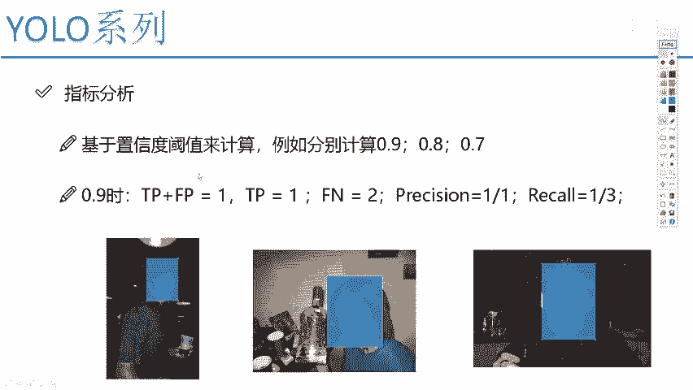

上一节我们介绍了目标检测的基本任务，本节中我们来看看如何评价检测结果的好坏。这通常涉及两个核心指标：精度和召回率。

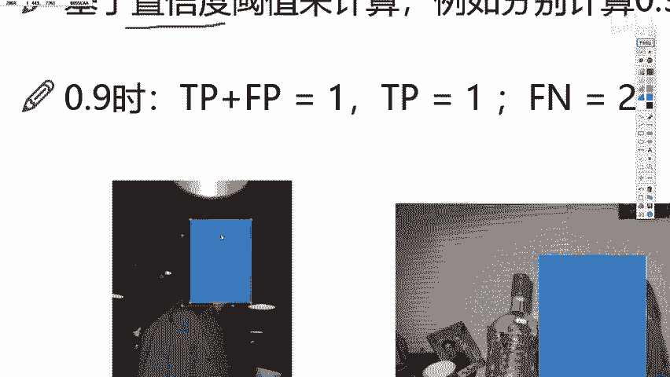

*   **精度**：衡量模型检测出的结果中有多少是正确的。它关注的是检测框与真实框的匹配程度，希望预测框与真实框越接近越好。
*   **召回率**：衡量模型找出了多少本该被找出的目标。它关注的是是否存在漏检的问题。

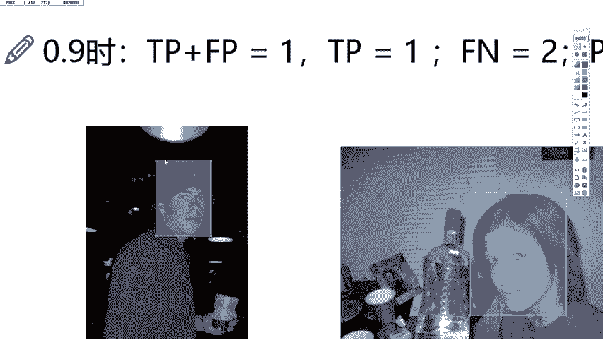

例如，在下图中，左图的精度较高，因为检测框（蓝色）与真实框（蓝色）重合度高。右图的召回率较低，因为存在预测框与真实值IOU较小或未被检测到的情况，即出现了漏检。

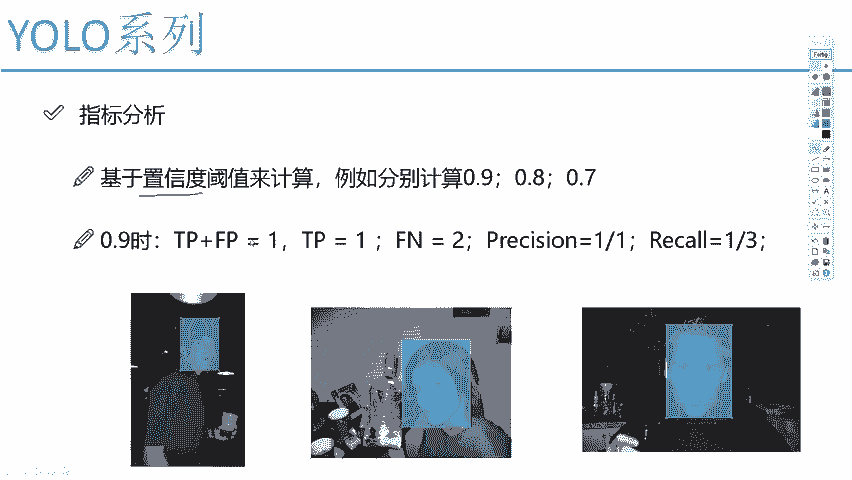

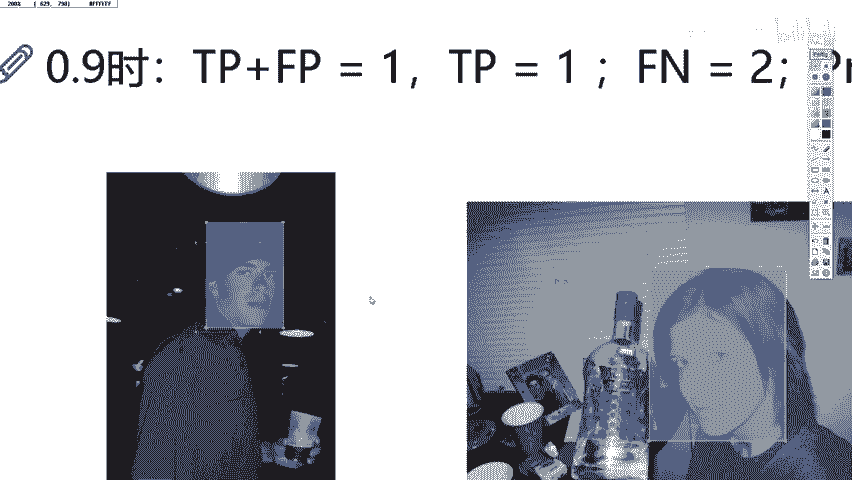

## 置信度与阈值

在开始计算前，我们需要理解一个关键概念：**置信度**。

置信度描述了模型对其检测出的框包含目标（在本例中为人脸）的确信程度。它是一个介于0到1之间的值，值越高表示模型越确信。

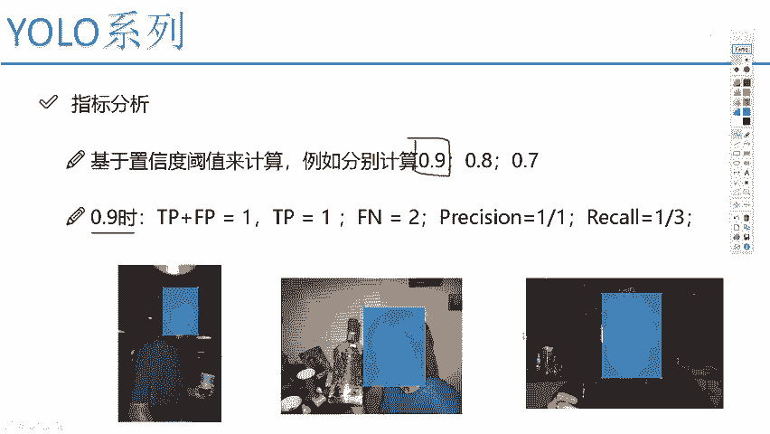

在模型的输出中，每个预测框都会附带一个置信度分数，如下图所示中的0.9、0.8、0.7。

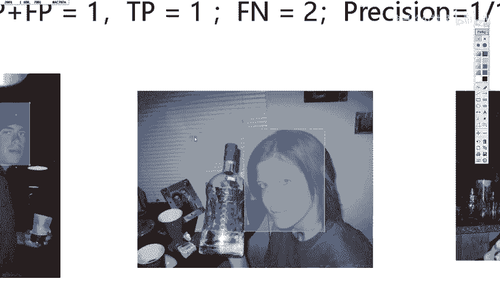

由于一张图片可能产生大量重叠的预测框，我们需要设定一个**置信度阈值**来进行筛选。高于此阈值的预测框将被保留，低于的则被过滤掉，以避免图像中出现过多无效的框。

## 指标计算示例

让我们通过一个具体例子，来计算在不同置信度阈值下的精度和召回率。假设我们有三张测试图片的检测结果，其置信度分别为0.9、0.8和0.7。

首先，我们需要定义几个基础变量：
*   **TP**：真正例。模型正确检测到的人脸。
*   **FP**：假正例。模型误将背景检测为人脸。
*   **FN**：假反例。模型未能检测到实际存在的人脸。

### 情况一：阈值 = 0.9

当我们将置信度阈值设置为0.9时：
*   只有置信度为0.9的第一个预测框被保留。
*   置信度为0.8和0.7的预测框被过滤掉。

以下是各指标的计算过程：
*   **TP = 1**（第一个框正确检测到人脸）
*   **FP = 0**（没有错误的检测被保留）
*   **FN = 2**（第二、三个实际存在的人脸未被检测到，属于漏检）

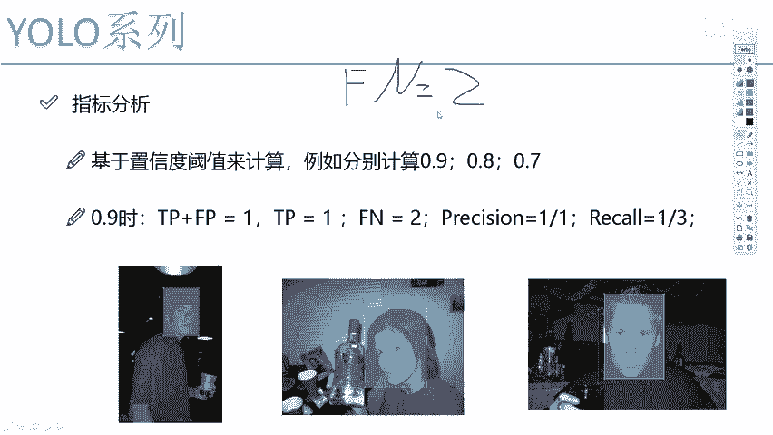

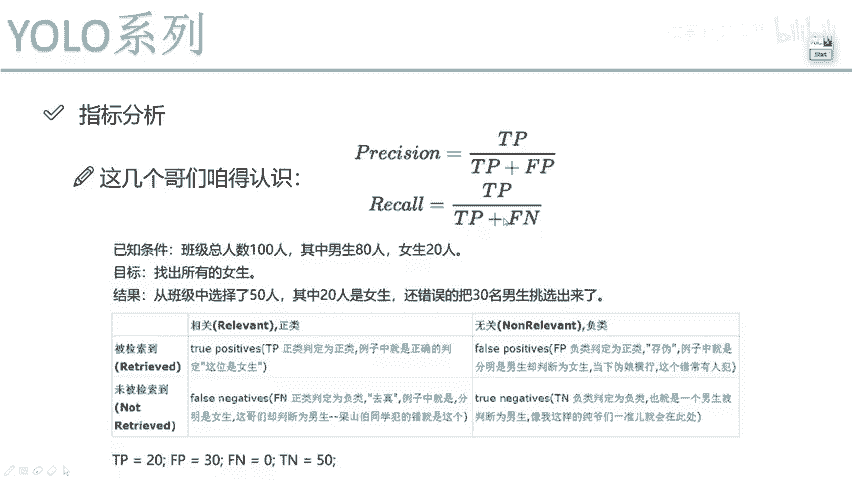

根据公式计算：
*   **精度 = TP / (TP + FP) = 1 / (1 + 0) = 1**
*   **召回率 = TP / (TP + FN) = 1 / (1 + 2) = 1/3**

在这个高阈值下，模型精度很高（100%），但召回率很低（33.3%），因为很多目标被漏掉了。

### 情况二：阈值变化的影响

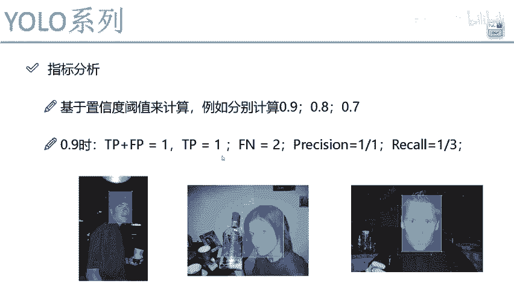

显然，我们可以将阈值设置为0.8、0.7等其他值。每一个阈值都会对应计算出一组精度和召回率。

## PR曲线与mAP

如果我们为从0到1的每一个可能阈值（或一系列阈值）都计算出对应的精度和召回率，并将这些点绘制在图上，就能得到一条**精度-召回率曲线**，即PR曲线。

在PR曲线中，通常可以看到一种趋势：当精度较高时，召回率往往较低；反之，当召回率较高时，精度则会降低。

**mAP** 的核心思想就源于此。对于一条PR曲线，我们计算其**下方所围成的面积**，这个面积值就是**平均精度**。对于多类别检测，对所有类别的平均精度再取平均，即得到**mAP**。

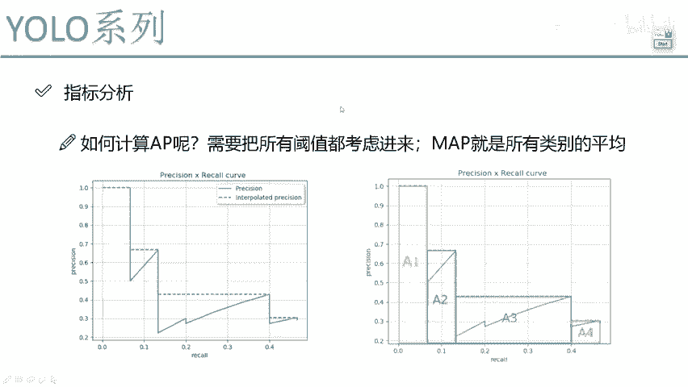

计算面积时，通常需要对PR曲线进行平滑处理，即对于每个召回率点，取其右侧精度的最大值，然后计算曲线下的面积，如上图阴影部分所示。

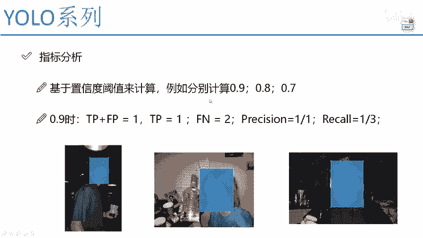

**mAP值越接近1，表示模型的综合性能越好。**

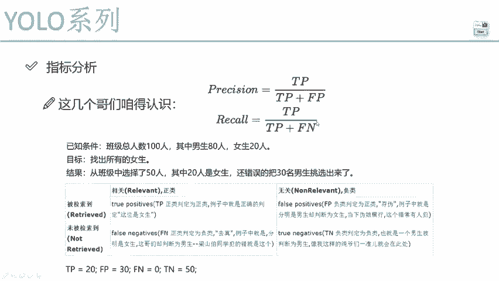

## 总结

本节课我们一起学习了目标检测中的关键评价指标mAP。
1.  我们首先理解了**精度**和**召回率**分别衡量了检测结果的准确性和完整性。
2.  然后，我们认识了**置信度**和**阈值**的概念，它们用于筛选预测结果。
3.  接着，我们通过一个实例，演示了如何计算**TP、FP、FN**，并由此算出特定阈值下的精度和召回率。
4.  最后，我们了解到通过遍历不同阈值可以得到**PR曲线**，而**mAP**正是这条曲线下面积的体现，它是一个综合考量精度与召回率的稳健指标。

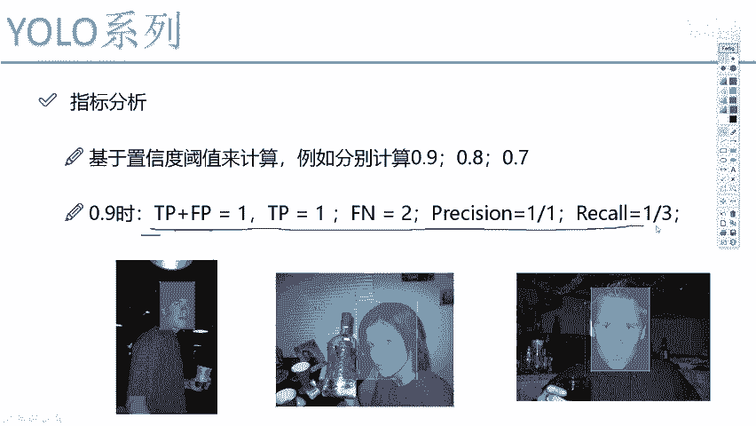

掌握这些基础概念和计算逻辑，对于后续理解和分析目标检测模型的性能至关重要。