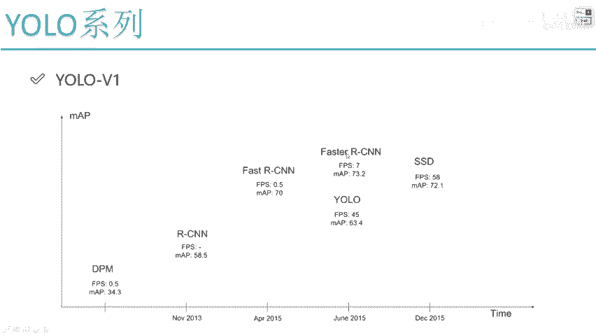
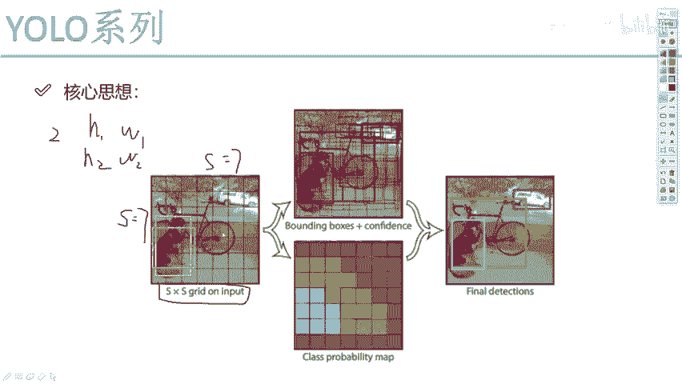

# 课程P57：YOLO算法整体思路解读 🎯

在本节课中，我们将从细节角度学习YOLO系列的第一代版本——YOLO V1。这是一个经典的**单阶段（one-stage）** 目标检测方法，其核心思想是将检测问题简化为一个回归任务，通过一个网络架构直接输出预测结果。

上一节我们介绍了目标检测的背景，本节中我们来看看YOLO V1是如何实现“只看一次（You Only Look Once）”的。

---

## YOLO V1的设计动机

YOLO V1于2016年提出，其主要任务是实现视频的实时检测。在应用层面，它的前景非常广阔。

在2016年，虽然以Faster R-CNN为代表的两阶段（two-stage）检测算法已经出现，并且**mAP（平均精度均值）** 很高，但其**FPS（每秒帧数）** 非常低，难以满足实时检测的需求。相比之下，YOLO V1虽然在许多问题上的mAP值比Faster R-CNN低了约10个百分点，但其FPS非常高，对于检测简单物体（如人或常见物品）的场景非常实用和高效。因此，YOLO系列算法从V1开始便迅速流行起来。

---

## YOLO V1的核心思想

YOLO V1的核心思想非常直接。作者的想法是：预测一张图像中有哪些物体。

以下是其核心步骤的分解：

首先，将输入图像划分为一个 **S × S** 的网格。例如，假设S=7，我们就得到了一个7x7的网格。每个网格单元负责预测中心点落在该单元内的物体。

例如，在一张包含狗和自行车的图片中，狗的中心点（用一个红点表示）落在了某个网格内。那么，这个网格单元就需要负责预测“狗”这个物体。

---

## 预测机制：从先验框到回归

那么，每个网格单元如何进行预测呢？我们可以观察到，在每个网格单元中，通常会预设两个**先验框（Prior Boxes）**，在图中用黄色框表示。

这些先验框不是最终结果，而是基于经验设定的、常见物体的长宽比例。例如，一个可能是长方形（H1, W1），另一个可能是正方形（H2, W2）。

对于要检测的狗，我们比较这两个先验框。直观上，长方形的框（H1, W1）可能更贴合狗的形状。然而，这个先验框与实际边界框仍有差距。

因此，网络需要对这个看起来“更靠谱”的先验框进行微调。微调的本质是调整框的**中心点坐标（x, y）**、**高度（h）** 和**宽度（w）**，使其与真实框匹配。

这个过程就是一个**回归任务**。网络需要预测出中心点坐标的偏移量以及长宽的缩放比例。归根结底，YOLO V1将目标检测问题转化为了对一个 **7x7网格 x (B个框 x 5个值 + C个类别)** 的张量的回归预测。

其核心预测值可以用以下公式表示：
**每个网格预测值 = [P_obj, x, y, w, h, class_1, class_2, ..., class_C]**
其中，`P_obj`是存在物体的置信度，`x, y`是边界框中心相对于网格单元的偏移，`w, h`是相对于图像尺寸的宽高，`class`是类别概率。

---

## 总结

本节课中，我们一起学习了YOLO V1算法的整体思路。

我们了解到YOLO V1是一个单阶段检测器，它将输入图像划分为SxS的网格，每个网格负责预测中心点落在其中的物体。算法通过预设先验框，并利用回归网络对这些框的位置和大小进行微调，从而直接输出检测结果。虽然其精度在初期略低于两阶段方法，但其极高的速度使其在实时检测领域获得了巨大成功，为后续YOLO系列的发展奠定了基础。