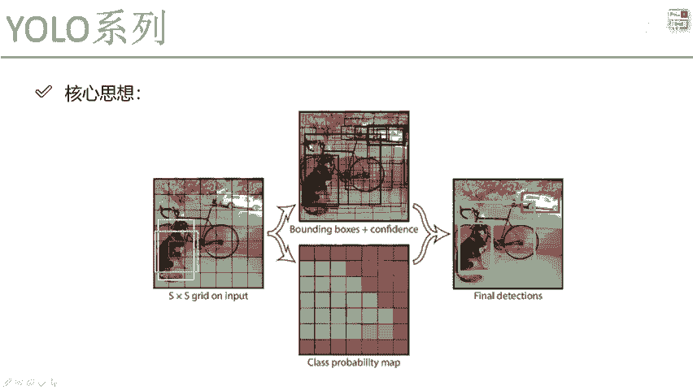
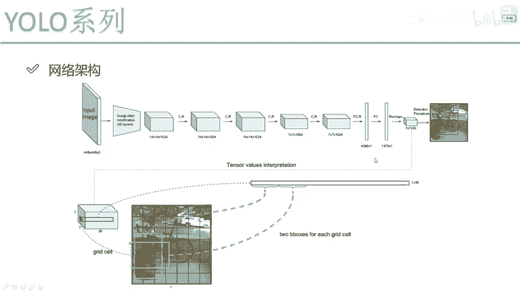

# YOLO目标检测算法详解（P58）🚀

在本节课中，我们将要学习YOLO V1目标检测算法的核心思想与具体实现步骤。我们将从输入数据的处理开始，逐步讲解候选框的生成、筛选、微调以及最终检测框的获取过程。

---

## 输入与候选框生成

上一节我们介绍了目标检测的基本概念，本节中我们来看看YOLO V1如何处理输入数据。

YOLO V1将输入图像划分为一个 **S x S** 的网格。每个网格单元负责预测其中心点落入该单元的物体。

在每个网格单元中，算法会预先设定生成两种候选框（Bounding Box）。在V1版本的论文中，这个数量B被设定为2。

**公式：**
`B = 2`

这意味着每个格子会生成两个不同尺寸或比例的初始预测框，作为检测的起点。

---

## 候选框的筛选与微调

生成了候选框后，我们需要决定哪个框更有可能匹配真实的物体。这就引入了筛选机制。

对于每个网格单元，算法会计算其生成的两个候选框与真实标注框（Ground Truth）之间的重合度。这个重合度通过交并比（IOU）来衡量。

**公式：**
`IOU = (Area of Overlap) / (Area of Union)`

计算过程如下：
1.  获取当前网格对应的真实物体标注框。
2.  分别计算两个候选框与该真实框的IOU值。
3.  选择IOU值更大的那个候选框作为“优胜者”。

这个“优胜”的候选框将被用于后续的微调（即位置和尺寸的修正），而另一个候选框在此步骤中暂时不被考虑。这类似于从两个替补队员中选择状态更好的一个上场比赛。

---

## 置信度（Confidence）预测

仅仅预测框的位置是不够的。网络还需要判断这个框内“是否有物体”。

因此，对于每个网格单元，网络除了预测**B个候选框的坐标偏移量（Δx, Δy, Δw, Δh）**外，还必须预测一个至关重要的值：**置信度（Confidence）**。

置信度反映了模型认为当前网格单元包含物体的概率，以及预测框与真实框的吻合程度。一个高的置信度（例如0.9）意味着模型高度确信该位置存在一个物体，且预测框较为准确。一个低的置信度（例如0.2）则意味着该位置很可能是背景或预测框质量很差。

以下是每个网格单元需要预测的全部内容：

*   **B个边界框的预测**：每个框包含4个坐标值（中心点偏移和宽高缩放）。
*   **1个物体类别概率**：表示该网格内物体属于各个类别的概率（C个类别）。
*   **B个置信度分数**：每个候选框对应一个置信度。

在V1中，B=2，所以每个网格最终输出一个长度为 `(B * 5 + C)` 的张量。例如，在PASCAL VOC数据集（20个类别）上，输出维度为 `(2*5 + 20) = 30`。

**代码表示（概念性）：**
```python
# 每个网格的输出向量示例 [x1, y1, w1, h1, conf1, x2, y2, w2, h2, conf2, class_prob1, class_prob2, ...]
grid_cell_output = [bbox1_coords, bbox1_confidence, bbox2_coords, bbox2_confidence, class_probabilities]
```

---

## 最终检测结果的生成

经过网络前向传播，我们得到了所有S x S个网格的预测值，其中包含大量候选框和其置信度。

为了得到最终简洁、准确的检测结果，需要进行以下后处理步骤：

1.  **置信度阈值过滤**：设定一个阈值（如0.5）。将所有置信度低于该阈值的预测框直接过滤掉。这一步去除了大量被认为是背景的无效预测。
2.  **非极大值抑制（NMS）**：经过阈值过滤后，对于同一个物体，可能仍有多个重叠度很高的框（来自相邻网格或多个候选框）。NMS用于解决这个问题，其步骤是：
    *   将所有框按置信度从高到低排序。
    *   选取置信度最高的框，将其加入最终输出列表。
    *   计算该框与剩余所有框的IOU。
    *   移除那些IOU超过设定阈值（如0.45）的框（因为它们很可能检测的是同一个物体）。
    *   重复上述过程，直到处理完所有框。

经过“置信度过滤”和“非极大值抑制”两步处理后，剩下的预测框就是算法最终输出的、简洁明了的目标检测结果。

---

## 核心流程总结

本节课中我们一起学习了YOLO V1目标检测算法的核心流程，让我们再回顾一下整个过程：



1.  **划分网格**：将输入图像划分为S x S的网格。
2.  **生成候选框**：每个网格预设生成B个（V1中B=2）初始候选框。
3.  **预测与计算**：每个网格预测B个框的坐标、B个置信度以及物体类别概率。通过计算IOU筛选出与真实物体最匹配的候选框进行重点优化。
4.  **输出与过滤**：网络输出所有网格的预测值，首先通过**置信度阈值**过滤掉低置信度的预测，然后通过**非极大值抑制（NMS）** 去除对同一物体的冗余检测框。
5.  **得到结果**：最终剩下的预测框即为检测到的物体，其位置由框坐标确定，类别由类别概率确定。



这个过程实现了“只看一眼（You Only Look Once）”就能完成图像中多个物体的定位与分类，是YOLO系列算法高效性的基石。