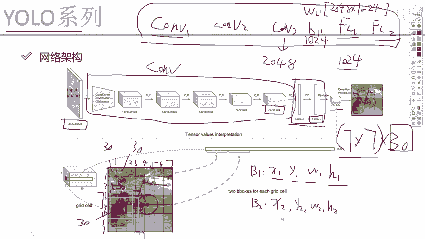
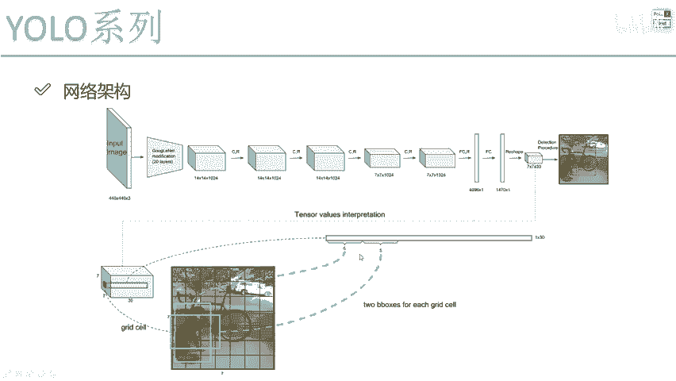

# YOLO V1 整体网络架构解读 🧠 - 课程 P59

在本节课中，我们将学习YOLO V1版本的整体网络架构。我们将从输入图像开始，一步步解析网络如何处理数据，并最终输出检测结果。理解这个流程是掌握YOLO工作原理的关键。

## 输入图像尺寸的限制 📏

首先，第一步是获取输入图像。在V1版本中，网络指定的输入大小是**448×448×3**。这是一个固定值。

你可能会认为，固定输入大小意味着只能检测固定尺寸的物体。其实并非如此。固定值只是意味着我们将所有输入图像都缩放（resize）到这个固定尺寸。图像中物体的坐标会相应地进行变换，最终结果可以映射回原始输入图像的大小。

然而，由于在V1版本中，网络只训练**448×448×3**尺寸的图像，这确实限制了我们的输入。输入图像的大小被固定了。在后续的改进版本中，这个尺寸可以被改变，但在当前V1版本中无法改变。

## 为何输入尺寸必须固定？🔗

上一节我们介绍了输入尺寸的限制，本节中我们来看看其根本原因。大家可能会想，一个卷积神经网络的输入大小为什么不能改变？原因是什么？

一个卷积神经网络通常包含卷积层和全连接层。例如：

```
卷积层1 -> 卷积层2 -> 卷积层3 -> 全连接层1 (FC1) -> 全连接层2 (FC2)
```

那么，最终网络大小不能改变的主要原因在于卷积层还是全连接层？

卷积层对输入大小有严格要求吗？实际上，只要我们设置好卷积核，卷积操作可以在任何尺寸的原始图像上提取特征。无论是400×400还是800×800的图像，卷积都能进行，只是得到的特征图尺寸会不同。

但是，全连接层可以吗？可以这么说，全连接层的结构是“定死”的。例如，假设卷积层输出的特征图被拉平（flatten）后得到2048个特征。然后，FC1层要将其转换为1024个特征。这需要一个权重参数矩阵 **W1** 和一个偏置参数矩阵 **B1**。

*   **W1** 的尺寸必须是 **2048 × 1024**。
*   **B1** 的尺寸取决于输出，即 **1024**。

这里有一个关键问题：在训练网络时，**W1** 和 **B1** 的维度能动态改变吗？例如，**W1** 这次是2048×1024，下次变成1024×1024？这似乎从未见过。也就是说，全连接层要求前一层的特征数量必须是固定的。如果前面的特征数量不固定，全连接层就无法工作。

因此，由于YOLO V1版本中包含了全连接层，我们必须限制输入数据的大小，必须是 **448×448×3**。

## 特征提取网络 🔍

中间过程，也就是图中蓝色框起来的部分，是特征提取网络。在V1版本中，其特征提取方法相对简单（例如使用了类似GoogLeNet的结构，但现在已较少使用）。后续版本会有重大改进。

对于V1，你不需要深入理解这个具体网络。你只需将其视为一个标准的卷积神经网络即可。它对输入图像进行了多次卷积操作，最终得到一个特征图。

例如，这里我们得到了一个 **7×7×1024** 的特征图。你可能会问，这个卷积网络重要吗？实际上，相对于更先进的V3版本，V1的这个网络结构比较简单，学习价值有限。我们将在讲解V3版本时详细讨论网络细节，因为V3的改进更有实际价值。在这里，你只需将其理解为一个完成特征提取的卷积模块即可。

## 全连接层与最终输出 🎯

卷积完成后，我们得到了一个 **7×7×1024** 的特征图。那么，我们最终要从这个特征图中得到什么呢？这需要我们关注全连接层的结果。

以下是全连接层的结构：
*   第一个全连接层将特征转换为 **4096** 个特征。
*   第二个全连接层输出 **1470** 个特征。

1470这个数字看起来有些奇怪。为了理解它，我们需要将其 **reshape（重塑）** 一下。将其重塑为 **7×7×30**。这个值在V1版本中至关重要。

我们需要理解 **7×7** 和 **30** 分别代表什么。

**7×7 的含义：**
它表示将最终的预测空间划分为一个 **7×7** 的网格。如下图所示，可以将其想象成一个7×7的棋盘格。每个格子负责预测其中心区域可能存在的物体。

**30 的含义：**
30表示每个格子需要预测的30个值。可以理解为：一个7×7的网格，每个格子带有30个值。

那么，这30个值具体是什么？让我们来拆解一下。之前我们提到，每个格子需要预测2个边界框（Bounding Box）。

以下是每个格子30个值的组成：

1.  **第一个边界框 (B1) 的预测值 (5个)：**
    *   边界框的中心坐标 **(x1, y1)**
    *   边界框的宽度和高度 **(w1, h1)**
    *   边界框的置信度 **(C1)**，表示该框内包含物体的概率以及预测的准确度。
    *   **注意：** 这里的坐标值 (x, y, w, h) 不是原始图像的绝对像素坐标，而是相对于整个图像尺寸的归一化值（范围在0到1之间）。在代码实现中，还会涉及一些对数变换等操作，我们将在代码讲解部分详细说明。

2.  **第二个边界框 (B2) 的预测值 (5个)：**
    *   与B1相同，包含 **(x2, y2, w2, h2, C2)**。

3.  **类别概率 (20个)：**
    *   这对应于数据集的类别数。以PASCAL VOC数据集为例，它有20个类别（如：狗、汽车、自行车等）。
    *   这20个值表示当前格子所预测的物体属于每个类别的**条件概率**（即在该格子包含物体的前提下，属于各个类别的概率）。



现在，我们汇总一下：**5 (B1) + 5 (B2) + 20 (类别) = 30**。

因此，最终网络输出的 **7×7×30** 张量的含义就是：
*   **7×7**： 空间网格划分。
*   **30**： 每个网格预测的2个边界框信息（共10个值）和20个类别的概率。

## 网络如何学习这种结构？🤖

之前讲解时，很多同学会问：老师，你说前5个值是B1，接下来5个是B2，最后20个是类别概率。我认可这个解释，但计算机凭什么按照这个顺序来理解和输出呢？

计算机之所以能这样做，是因为我们为其指定了**损失函数（Loss Function）**。在损失函数中，我们明确告诉网络什么样的输出是“好”的（即损失值小）。网络在训练过程中，通过反向传播不断调整内部参数，其目标就是最小化这个损失函数。

为了最小化损失，网络会逐渐“学会”如何组织它的输出，以符合我们的预期：即前10个值最好能准确描述边界框，后20个值最好能准确分类。整个神经网络的魅力之一就在于此：你只需要设计合适的目标（损失函数），它就能通过数据驱动的方式，自动学习到完成复杂任务的方法。

许多论文的核心思想正是如此：作者提出一种创新的输出表示和对应的损失函数，最终网络真的能训练出令人惊叹的结果。

## 总结 📝

本节课中，我们一起学习了YOLO V1的整体网络架构：

1.  **固定输入**： 由于全连接层的存在，V1要求固定的 **448×448×3** 输入尺寸。
2.  **特征提取**： 通过一个卷积神经网络（主干网络）将输入图像转换为 **7×7×1024** 的特征图。
3.  **全连接与重塑**： 特征图经过全连接层后输出1470维向量，并重塑为关键的 **7×7×30** 张量。
4.  **输出解析**： **7×7** 代表空间网格，**30** 代表每个网格的预测值，包括：
    *   2个边界框的坐标 **(x, y, w, h)** 和置信度 **C**。
    *   20个类别的条件概率。
5.  **学习机制**： 网络通过我们设计的**损失函数**来学习如何正确组织这30个输出值，从而完成物体定位和分类的任务。

理解这个 **7×7×30** 的输出结构，是掌握YOLO V1工作原理的基石。在后续课程中，我们将深入探讨损失函数的具体构成以及代码实现细节。

---


---



