# 课程P6：2-Notebook与IDE环境配置教程 📚💻

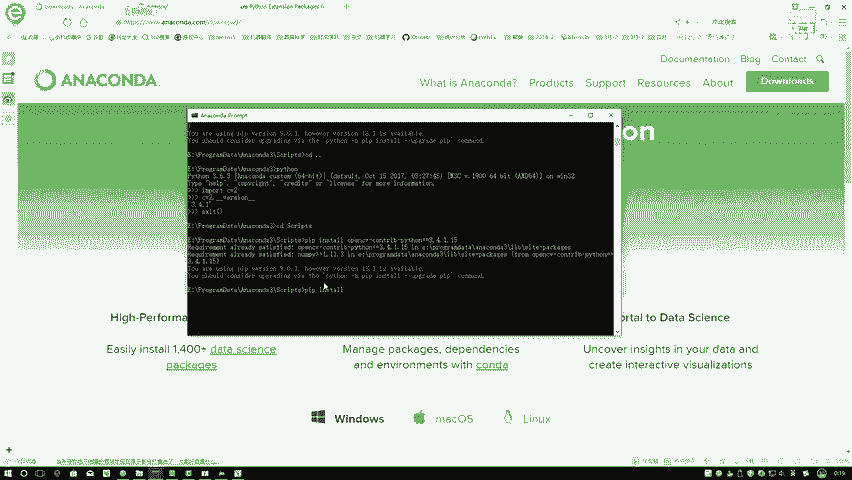

在本节课中，我们将学习如何配置OpenCV以及两种主要的代码编写环境：Jupyter Notebook和集成开发环境（IDE）。掌握这些工具是顺利进行后续课程的基础。

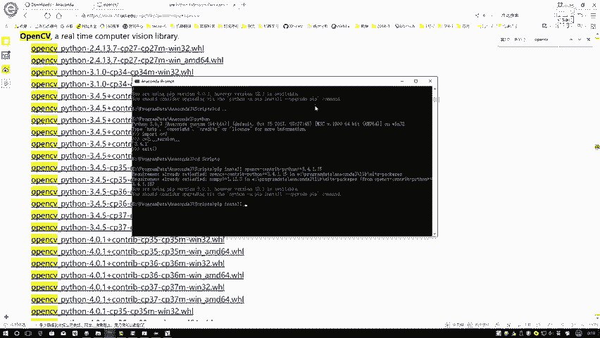

## 概述

课程内容主要分为两部分：首先介绍Python工具包（以OpenCV为例）的安装方法；其次，讲解我们将使用的两种编程环境——Jupyter Notebook和IDE（如Eclipse或PyCharm）的配置与用途。

---

## 第一部分：Python工具包安装方法 🔧

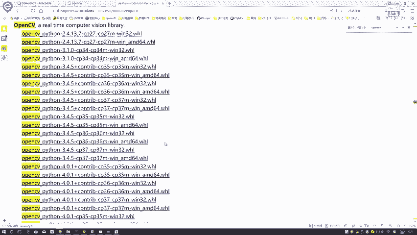

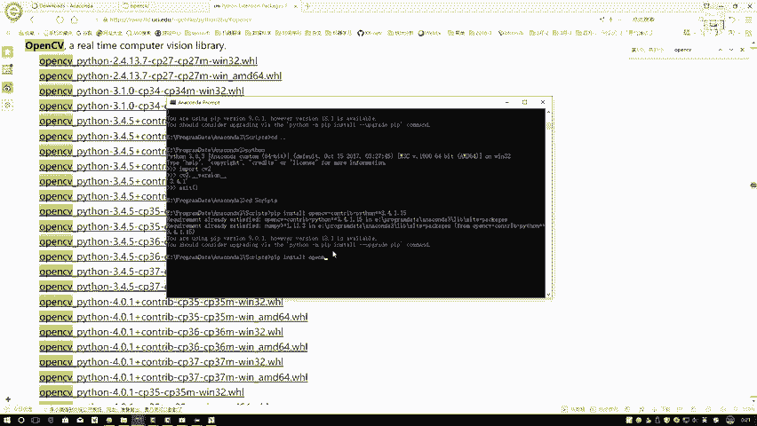

安装Python工具包时，首选方法是使用`pip install`命令。

### 标准安装方法

以下是标准安装步骤：
1.  打开命令行工具。
2.  输入命令 `pip install 工具包名称` 并执行。
3.  如果安装成功，则配置完成。

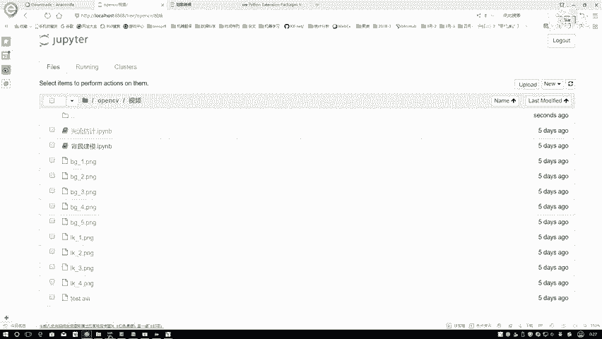

### 备用安装方案

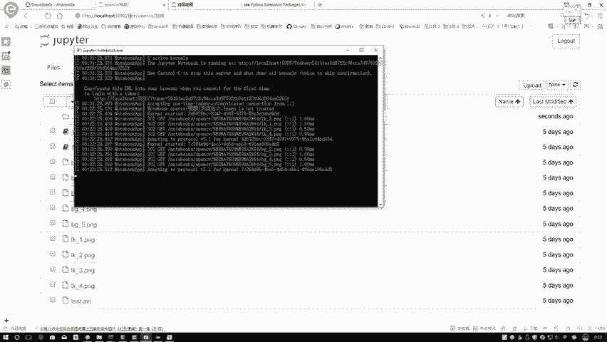

如果使用`pip install`命令安装失败（可能由于版本冲突或网络问题），可以采用备用方案。

备用方案是访问一个收录了大量Python工具包的非官方Windows平台网站。在该网站可以搜索并下载特定版本的`.whl`文件进行安装。

操作步骤如下：
1.  在网站中使用`Ctrl+F`搜索所需工具包（例如`opencv`）。
2.  在搜索结果中，选择符合要求的文件。文件名通常包含以下信息：
    *   **工具包名称**：例如 `opencv-python`。
    *   **版本号**：例如 `3.4.5`。
    *   **Python版本**：`cp35`、`cp36`、`cp37`分别对应Python 3.5、3.6、3.7。
    *   **操作系统**：`win32` 或 `win_amd64` 对应32位或64位系统。
3.  下载对应的`.whl`文件。
4.  将下载的`.whl`文件复制到Python安装目录下的`Scripts`文件夹中。
5.  在命令行中进入`Scripts`目录，执行安装命令：
    ```bash
    pip install 文件名.whl
    ```

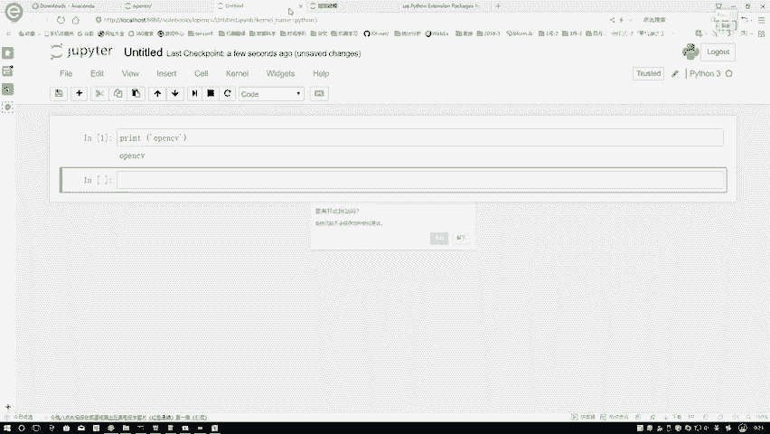


**版本选择建议**：对于OpenCV，建议选择较为稳定的版本（如3.4.1），避免使用最新的4.x版本，以减少可能遇到的兼容性问题。如果课程或项目需要安装其他老版本工具包，可以通过搜索引擎查找对应的资源。

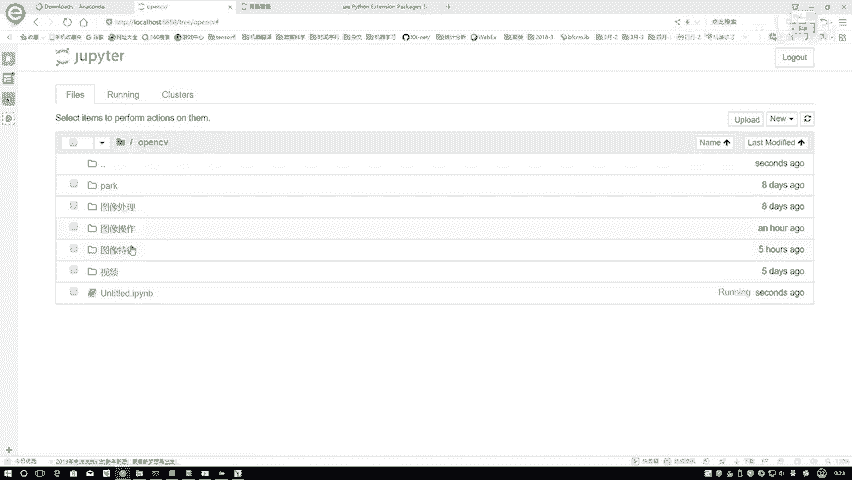

---


## 第二部分：代码编写环境配置 🖥️

我们将使用两种环境进行学习和开发：Jupyter Notebook用于理论学习和笔记整理，IDE用于项目实战和调试。


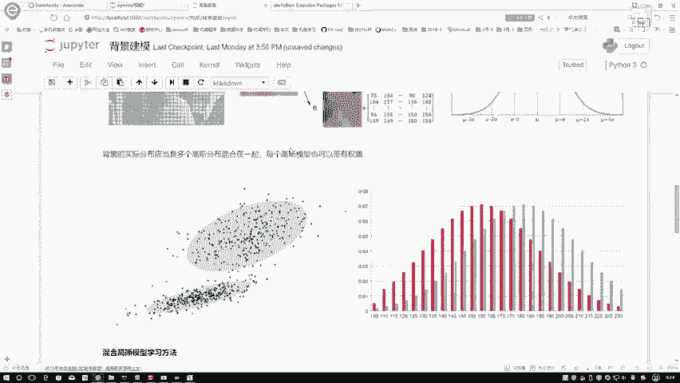

### Jupyter Notebook环境


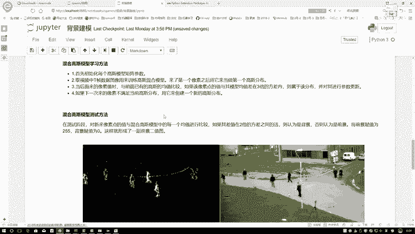

Anaconda已内置Jupyter Notebook。启动方法如下：
1.  从开始菜单打开`Anaconda3`，然后启动`Jupyter Notebook`。
2.  启动后，会先弹出一个命令行窗口，随后在默认浏览器中打开Jupyter的Web界面（地址通常是`localhost:8888`）。
3.  如果浏览器没有自动打开，可以将命令行中显示的地址（如`http://localhost:8888/?token=...`）手动复制到浏览器地址栏访问。

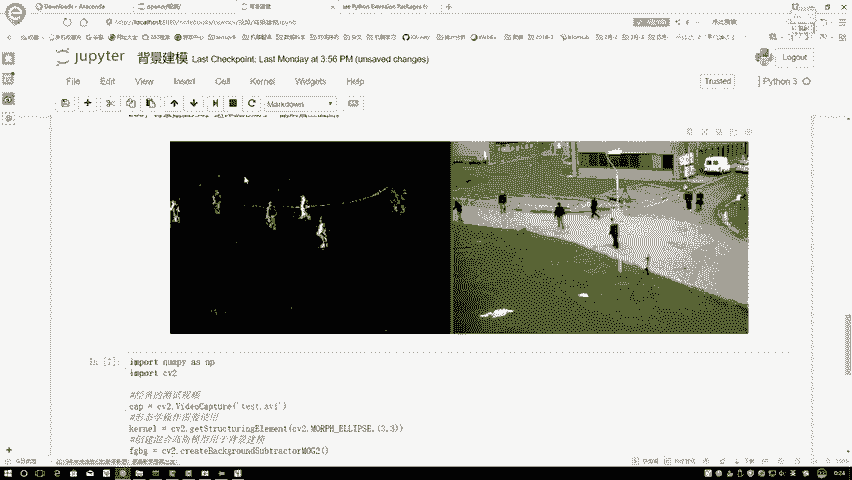

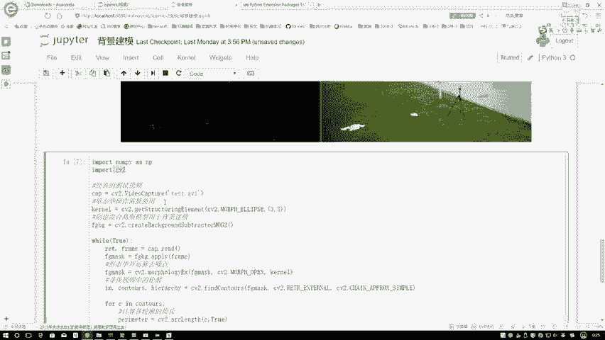

在Jupyter Notebook中，可以新建Python笔记本进行测试：
```python
import cv2
print(cv2.__version__)
```
执行代码（按`Shift+Enter`）后，若能正常输出版本号，则环境配置成功。

#### Jupyter Notebook的优势


Jupyter Notebook将代码、文档和可视化结果结合在一个文件中，非常适合教学和笔记。
*   **文档功能**：支持使用Markdown语法编写文本、插入图片和公式，形成结构化的“教案”或博客。
*   **交互式编程**：代码以“单元格”（Cell）为单位执行，可以随时查看中间变量的值，便于分步理解和调试。
*   **结果展示**：代码的输出（包括图表、图像）直接显示在单元格下方，使学习过程连贯直观。


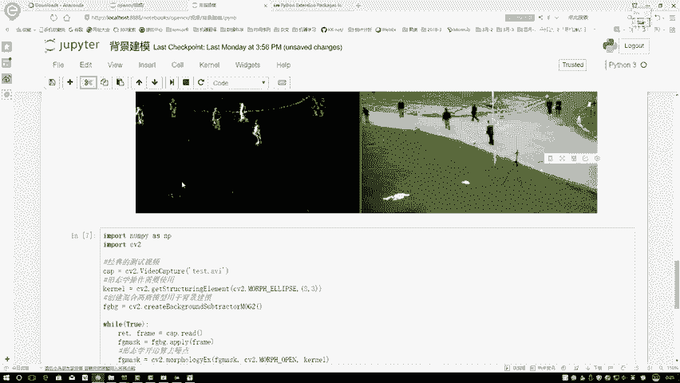

课程中所有理论部分的讲解和算法演示都将基于Jupyter Notebook进行，方便大家将知识点和代码实践紧密结合，复习时也无需在PPT和代码编辑器间频繁切换。

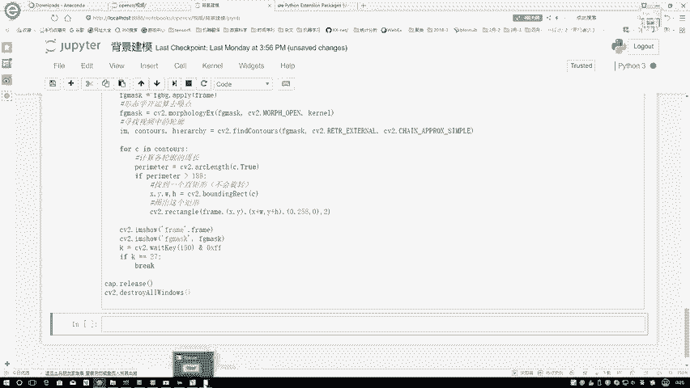

---

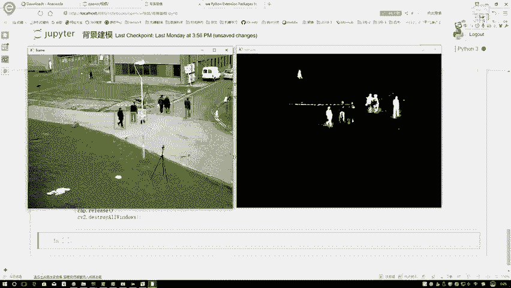

### 集成开发环境（IDE）


对于代码量较大的项目实战，我们推荐使用功能更全面的IDE。

#### IDE的必要性

1.  **项目管理**：IDE更适合管理包含多个模块和文件的大型项目结构。
2.  **调试功能**：IDE提供强大的调试（Debug）功能，可以设置断点、逐行执行代码、实时观察变量值的变化，这对于理解复杂代码的逻辑至关重要。
3.  **代码提示与导航**：IDE通常具备智能代码补全、函数定义跳转等功能，能提升开发效率。

#### IDE的选择

课程项目实战将使用Eclipse进行演示，因为它支持多种语言（Java, C++, Python等），且作者使用习惯。
*   **其他选择**：大家完全可以根据自己的喜好选择其他IDE，例如在Python开发中非常流行的**PyCharm**。
*   **核心要求**：只要所选的IDE具备**代码执行**和**调试（Debug）** 功能即可，我们的代码在所有主流IDE中都是通用的。

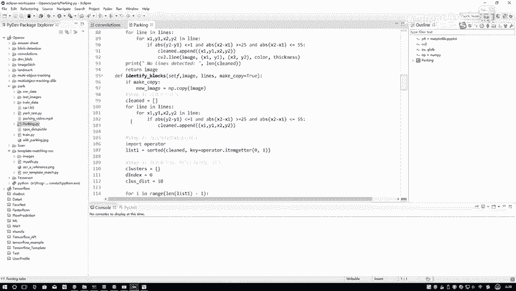

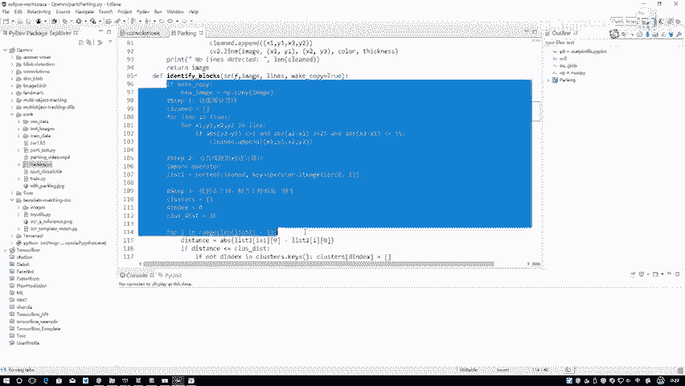

---

## 环境配置地址汇总 📌

为了方便大家，以下是课程中提到的关键资源地址：
*   **Anaconda下载地址**：`https://www.anaconda.com/products/individual`
*   **Python `.whl`文件下载地址**：`https://www.lfd.uci.edu/~gohlke/pythonlibs/`
*   **IDE选择**：Eclipse (`https://www.eclipse.org`)、PyCharm (`https://www.jetbrains.com/pycharm/`) 或其他具备Debug功能的IDE。

---

## 总结 🎯

本节课我们一起学习了OpenCV等Python工具包的两种安装方法，并配置了两种编程环境。
1.  **工具包安装**：优先使用`pip install`，失败时可从指定网站下载对应版本的`.whl`文件进行安装。
2.  **Jupyter Notebook**：用于课程理论学习和笔记记录，它集代码、文档、结果于一体，交互性强。
3.  **集成开发环境（IDE）**：用于项目实战开发，其强大的调试功能是理解和编写复杂代码的利器。

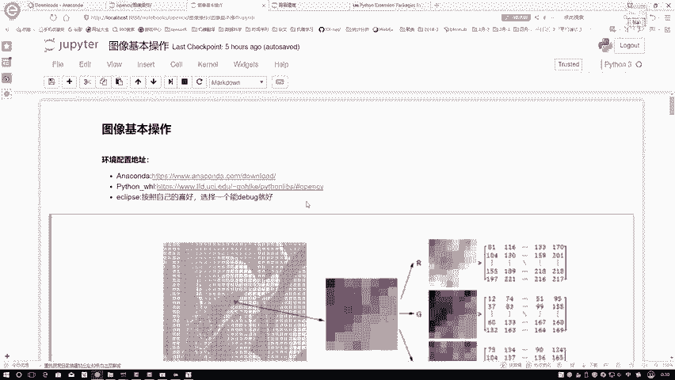

请确保按照建议的版本（如OpenCV 3.4.1）配置好环境，这样能最大程度避免后续课程中出现意外的版本兼容性问题。准备好这些工具后，我们就可以正式开始精彩的OpenCV学习之旅了。