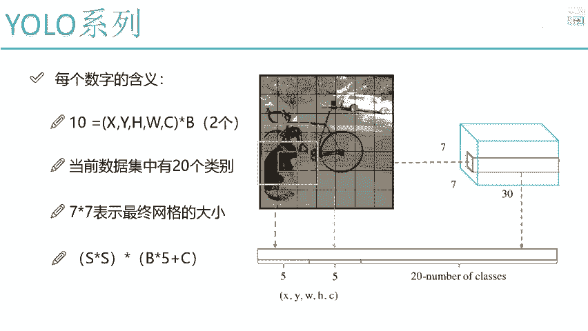
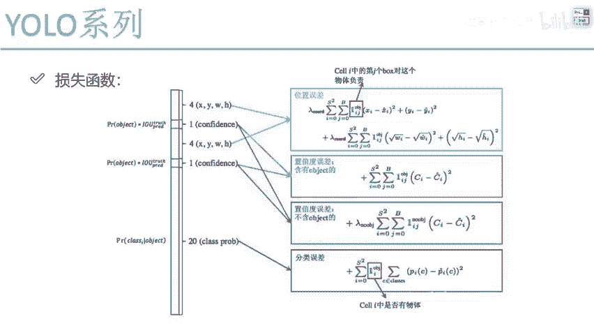

# 课程P60：YOLOv1位置损失计算详解 🎯

在本节课中，我们将深入探讨YOLOv1算法中一个核心组成部分——位置损失的计算方法。我们将学习如何量化预测边界框与真实边界框之间的差异，并理解损失函数的设计思路。

## 网络输出与损失函数概述

上一节我们介绍了YOLOv1的网络结构和最终输出值的含义。本节中我们来看看如何定义损失函数来指导网络学习。

一个完整的算法通常需要关注两点：网络结构如何得到输出值，以及如何定义损失函数来衡量输出值与真实值之间的差距。解决了这两个问题，我们就掌握了算法的核心。

## 位置损失函数解析

我们的预测任务包括边界框的中心坐标（X, Y）和尺寸（宽W，高H）。预测值与真实值之间必然存在差异，我们希望这个差异越小越好。因此，需要定义一个损失函数来最小化这些位置参数的误差。

以下是位置损失函数的核心公式及其组成部分的详细解释：

$$
\text{位置损失} = \lambda_{\text{coord}} \sum_{i=0}^{S^2} \sum_{j=0}^{B} \mathbb{1}_{ij}^{\text{obj}} \left[ (x_i - \hat{x}_i)^2 + (y_i - \hat{y}_i)^2 + (\sqrt{w_i} - \sqrt{\hat{w}_i})^2 + (\sqrt{h_i} - \sqrt{\hat{h}_i})^2 \right]
$$

**公式解读：**

*   `S^2`： 表示网格总数。YOLOv1将图像划分为 `S x S` 个网格（原文中为 `7x7`），因此需要对每个网格进行计算。
*   `B`： 表示每个网格预测的边界框数量。在YOLOv1中，`B=2`，即每个网格预测两个不同尺寸的候选框。
*   `1_{ij}^{obj}`： 这是一个指示函数。对于每个网格 `i` 和其中的边界框 `j`，只有当该边界框对某个真实物体的预测“负责”（即与该真实物体的IOU最大）时，其值才为1，否则为0。这确保了只有最匹配的预测框才参与位置损失的计算。
*   `(x_i - \hat{x}_i)^2` 和 `(y_i - \hat{y}_i)^2`： 计算预测的中心坐标 `(x, y)` 与真实中心坐标 `(\hat{x}, \hat{y})` 之间的平方误差。
*   `\lambda_{\text{coord}}`： 这是一个权重系数，用于调整位置损失在总损失中的重要性。通常在论文中会给出一个具体值（如5），以强调定位准确性的重要性。

## 宽高损失的特殊处理：开根号的原因

观察公式可以发现，对于宽（W）和高（H）的误差计算，我们对其进行了开平方根处理：`(\sqrt{w} - \sqrt{\hat{w}})^2`。这与直接计算坐标误差不同。

**为什么要这样做？**

这主要是为了解决物体尺度不同带来的问题。考虑以下场景：
*   **大物体**： 假设一个物体的宽为100像素，预测误差为10像素。这个误差相对于物体本身尺寸（100）来说，比例较小。
*   **小物体**： 假设另一个物体的宽仅为10像素，同样有10像素的误差。这个误差相对于物体尺寸（10）来说，比例就非常大，是致命的。

如果直接使用 `(w - \hat{w})^2`，损失函数对大小物体的绝对误差敏感度相同。但我们更希望网络能**更精细地处理小物体的定位**，因为小物体本身容错率低，几个像素的偏差就可能导致完全漏检。

**开根号的作用**：
函数 `y = \sqrt{x}` 的特性是，当 `x` 较小时，函数值 `y` 的变化率（导数）较大；当 `x` 较大时，变化率较小。将宽高开根号后再计算误差，相当于：
*   对于**较小的宽高值**（小物体），给予其误差变化**更高的权重**，使网络对其更敏感。
*   对于**较大的宽高值**（大物体），给予其误差变化**相对较低的权重**。

这是一种让损失函数对不同尺度物体定位误差具有不同敏感度的工程技巧。虽然在YOLOv1中这只是一个初步的改进，但它指明了优化方向，后续版本（如YOLOv2/v3）使用了更完善的尺度处理方法。

---

**本节课中我们一起学习了**：
1.  YOLOv1损失函数的核心组成部分之一——位置损失。
2.  位置损失函数的具体数学形式，包括对每个网格（`S^2`）、每个预测框（`B`）的计算，以及使用指示函数（`1_{ij}^{obj}`）筛选负责预测的边界框。
3.  对边界框中心坐标（X, Y）直接计算平方误差。
4.  对边界框宽高（W, H）采用先开根号再计算平方误差的特殊处理，其目的是让网络在训练时更关注小物体的定位精度。这是YOLOv1针对多尺度物体检测问题的一个重要设计考量。