# YOLO系列课程 P61：置信度误差与优缺点分析 📊

在本节课中，我们将学习YOLO v1目标检测算法中置信度误差的计算方法，并分析其整体架构的优缺点。我们将深入理解损失函数的构成，特别是如何处理前景与背景的置信度预测，并探讨YOLO v1的局限性。

---

## 置信度误差计算 🧮

上一节我们介绍了边界框位置误差的计算。本节中，我们来看看如何计算置信度误差。

在图像中，有些区域是前景（有物体），有些区域是背景。通常，背景区域远多于前景区域。因此，在计算置信度时，需要分类讨论：预测为前景和预测为背景的情况。

*   对于背景，置信度的真实值应为 `0`。
*   对于前景，置信度的真实值应为 `1`。

### 如何确定一个候选框的置信度真实值？

以下是确定置信度真实值的步骤：

1.  计算候选框与所有真实框的交并比（IOU）。
2.  如果候选框与某个真实框的IOU大于阈值（例如0.5），则认为该候选框负责预测前景。
3.  此时，置信度的真实值并非简单地设为 `1`，而是设为该最大IOU值（例如0.7）。我们希望模型预测的置信度接近这个IOU值。
4.  如果一个真实框有多个候选框与之重叠（IOU>0.5），则只选择IOU最大的那个候选框负责预测，其余候选框视为背景。
5.  对于所有IOU小于阈值（或与任何真实框都不重叠）的候选框，其置信度真实值设为 `0`，代表背景。

### 置信度损失函数 📉

在YOLO论文中，置信度损失分为两部分：含有物体的部分和不含物体的部分。

**含有物体的置信度损失**：
模型预测的置信度应接近真实IOU值（当IOU>0.5时）。其损失计算如下：
`λ_coord * Σ_i^S² Σ_j^B 1_{ij}^{obj} (C_i - Ĉ_i)²`
其中，`1_{ij}^{obj}` 是指示函数，当第 `i` 个网格的第 `j` 个预测框负责预测物体时为1，否则为0。`C_i` 是预测值，`Ĉ_i` 是真实IOU值。

**不含物体的置信度损失**：
对于背景，我们希望预测的置信度接近 `0`。其损失计算如下：
`λ_noobj * Σ_i^S² Σ_j^B 1_{ij}^{noobj} (C_i - Ĉ_i)²`
其中，`1_{ij}^{noobj}` 是背景的指示函数。

这里引入了权重参数 `λ_coord`（例如5）和 `λ_noobj`（例如0.5）。这是因为背景样本数量远多于前景样本，存在样本不均衡问题。增加前景损失的权重，降低背景损失的权重，可以防止模型被大量的背景样本主导，从而更好地学习识别前景物体。

---

## 分类误差与总损失函数 ➕

接下来，我们看最后一个误差项：分类误差。

分类误差处理的是物体类别的识别问题（例如20分类或80分类）。这本质上是一个多分类问题，通常使用交叉熵损失函数来计算预测类别概率与真实类别之间的差异。

**分类损失**：
`Σ_i^S² 1_i^{obj} Σ_c∈classes (p_i(c) - p̂_i(c))²`
其中，`p_i(c)` 是预测的类别概率，`p̂_i(c)` 是真实的类别标签（one-hot编码）。

### 总损失函数

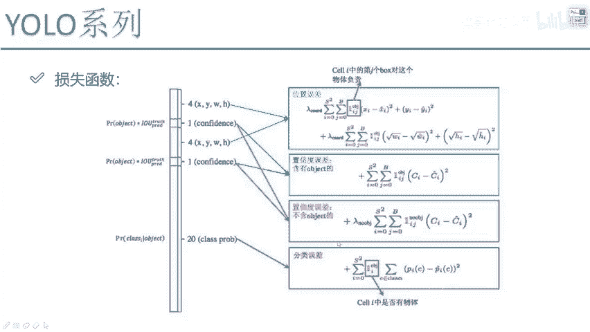

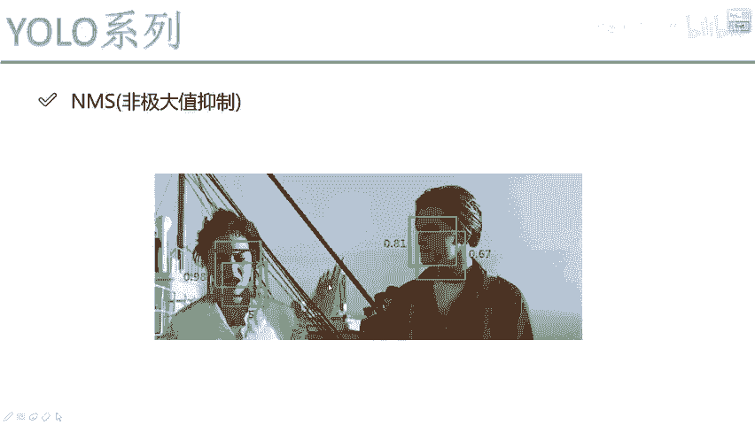

YOLO v1的总损失函数是上述所有误差项的加权和：
`Loss = λ_coord * 位置误差 + 置信度误差（含物体） + λ_noobj * 置信度误差（不含物体） + 分类误差`

这个框架在YOLO后续版本中也基本保持不变，仅在细节上有所优化。

---

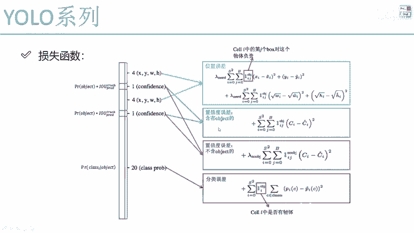

## YOLO v1 网络架构与流程回顾 🔄

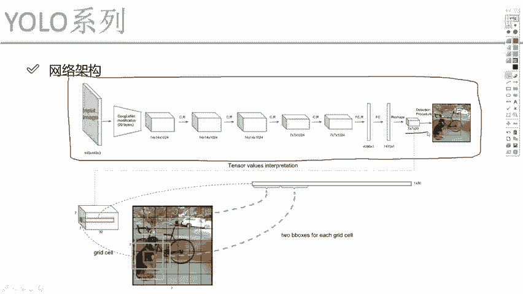

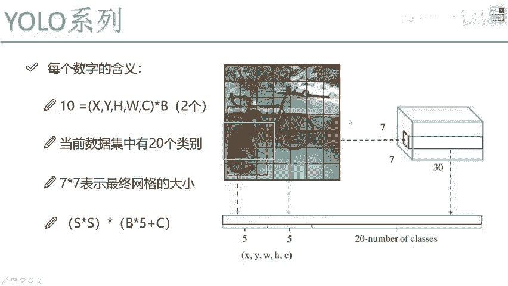

现在，让我们回顾一下YOLO v1的整体流程。

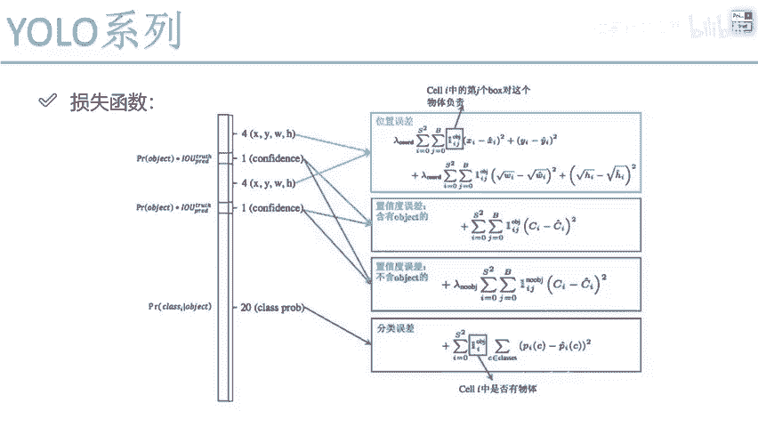

网络架构非常简单，最终输出一个 `7x7x30` 的张量。我们需要理解 `30` 的含义，并在构建损失函数时描述位置、置信度和分类这三类问题的损失。将这两部分结合起来，就能完成模型的训练。

在预测（测试）阶段，经常会遇到同一个物体被多个重叠的边界框检测到的情况。此时，需要使用**非极大值抑制（NMS）** 来筛选最终结果。

**NMS的基本步骤**：
1.  将所有预测框按置信度从高到低排序。
2.  选择置信度最高的框，将其加入最终输出列表。
3.  计算该框与剩余所有框的IOU。
4.  移除IOU超过设定阈值（如0.5）的所有框（因为它们很可能检测的是同一个物体）。
5.  重复步骤2-4，直到处理完所有框。

NMS确保了对于每个物体，我们只保留一个最可信的预测框。

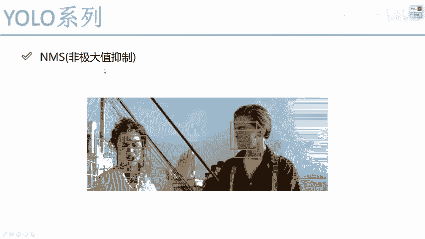

---

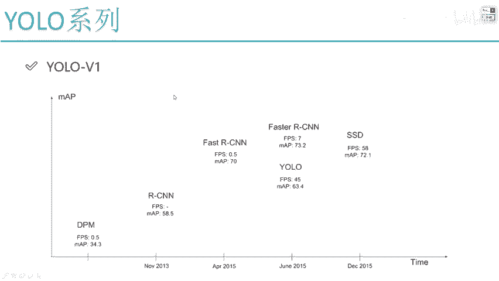

## YOLO v1 优缺点分析 ⚖️

最后，我们来分析YOLO v1的优点与局限性。

### 优点 👍

1.  **速度快**：单次前向传播即可完成检测，流程简单，速度远超当时的双阶段检测器（如R-CNN系列）。
2.  **全局推理**：对整张图像进行卷积操作，能更好地利用上下文信息，减少背景误检。

### 缺点 👎

1.  **空间限制**：每个网格（`7x7`）只能预测**一个**主要物体类别。当多个物体中心落入同一个网格时（尤其是小物体或重叠物体），模型难以检测。
2.  **先验框单一**：每个网格只预设两个边界框（`B=2`），且形状固定。这难以适应数据集中所有物体多变的尺度和长宽比，特别是对于非常规形状或小物体的检测效果不佳。
3.  **损失函数问题**：均方误差损失对大小边界框的误差同等对待，但实际上大框的小偏差影响不如小框的同等级偏差敏感。此外，样本不均衡（背景远多于前景）虽有权重调整，但仍是一个挑战。
4.  **多标签问题**：使用Softmax进行单标签分类，无法处理一个物体属于多个类别（例如“狗”和“哈士奇”）的情况。

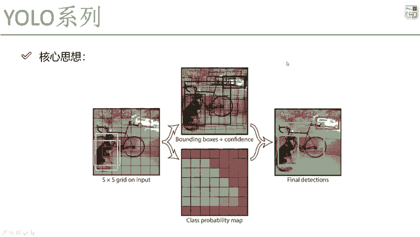

---

## 总结 📝

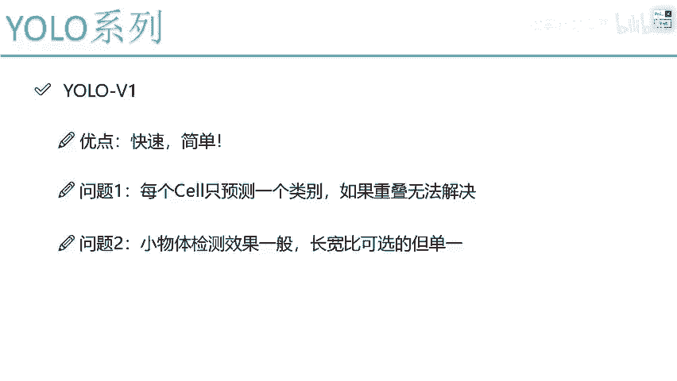

本节课中，我们一起学习了YOLO v1目标检测算法的核心部分。

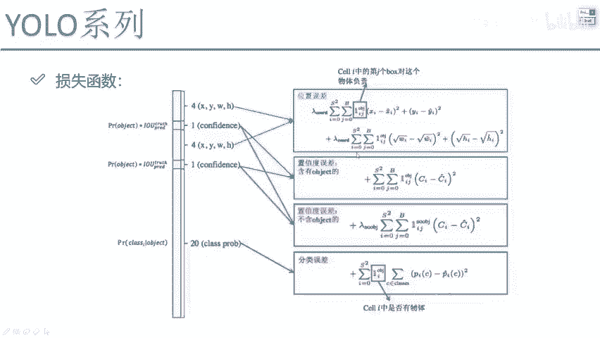

我们详细剖析了其损失函数，特别是**置信度误差**如何区分前景与背景，并通过权重参数解决样本不均衡问题。我们还回顾了网络输出 `7x7x30` 的含义以及训练、预测（包括NMS）的整体流程。

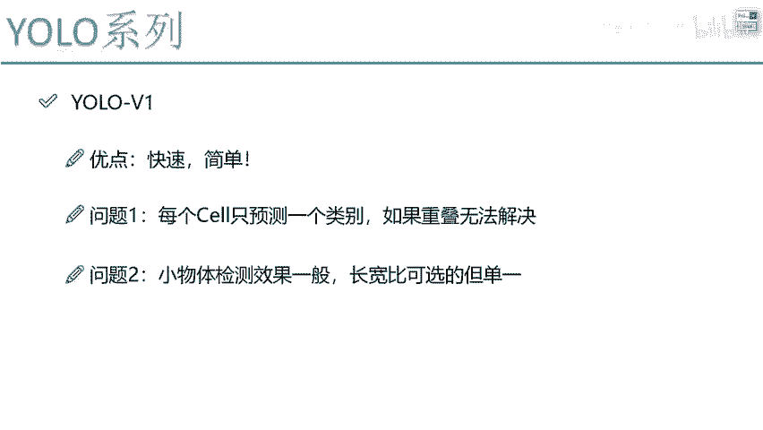

最后，我们系统地分析了YOLO v1**速度快、结构简单**的优点，以及其**难以检测重叠与小物体、先验框设计单一**等主要缺点。理解YOLO v1的这些核心思想和局限性，是学习后续YOLO v2、v3等改进版本的重要基础。