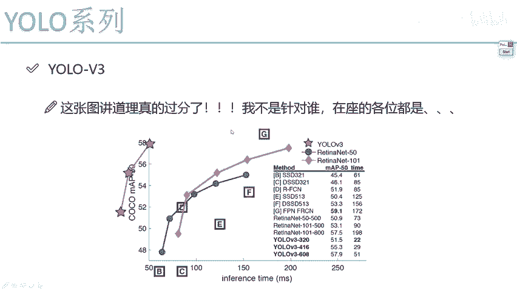
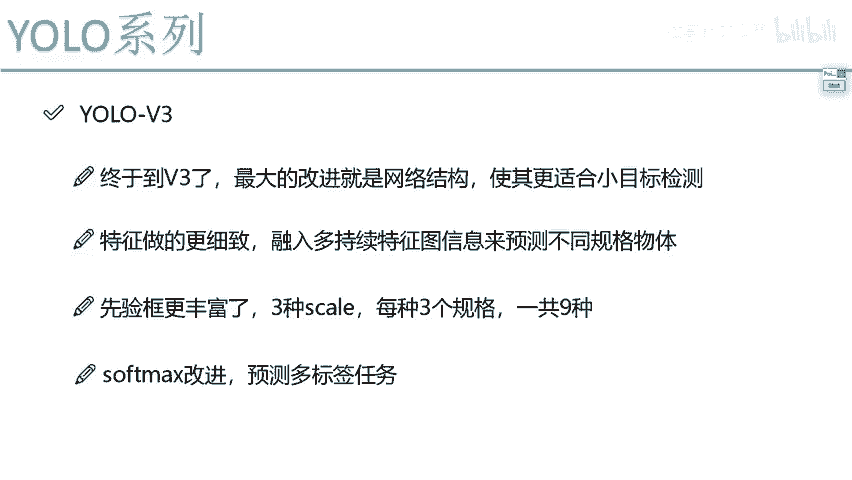

# 课程P62：YOLO V3版本改进概述 🚀

在本节课中，我们将学习YOLO V3版本的核心改进内容。与V2版本包含众多细节优化不同，V3版本主要围绕一个核心目标：升级整体网络架构以提升特征提取能力。其出发点是设计一个能更好地检测大、中、小各类目标的网络结构，使检测结果更进一步。

上一节我们介绍了YOLO V2的改进，本节中我们来看看YOLO V3做了哪些关键升级。

## 性能表现与背景

首先，我们来看一张有趣的性能对比图。这张图来自原论文，其绘制方式颇具深意。

X轴表示预测一张图像所需的时间（速度），Y轴表示mAP值（精度）。值得注意的是，图的原点并非(0,0)，而是(50,0)。作者故意将YOLO V3的数据点绘制在了第二象限。

这种绘制方式意在强调，YOLO V3在速度和精度上，都远超当年的其他代表性算法，仿佛“跑到了另一个象限”。这直观地展示了YOLO V3的强大性能。

此外，关于YOLO系列的后续发展有一个小插曲。在2020年初，YOLO的作者宣布将不再继续更新该系列，并退出计算机视觉研究领域。原因是他不希望自己的研究成果被过度应用于军事打击等用途。虽然官方系列可能止步于V3，但其高实用价值促使社区在其基础上进行了大量延伸和改进。

YOLO V3的实用性极高，许多企业级项目，如实时检测和目标追踪任务，都直接参考或套用其框架。对于工程师而言，掌握YOLO意味着可以直接利用现成的论文、源码和预训练模型来解决实际问题。

## 核心改进点

进入正式内容，我们来详细看看YOLO V3的具体改进。其最大的改进集中于网络结构本身。

YOLO V1和V2曾因检测精度（尤其是对小目标）而受到质疑。V3的主要出发点不再是单纯追求速度，而是显著提升检测效果，特别是针对小目标。既然YOLO本质上是单阶段（one-stage）检测器，基于一个大CNN网络，那么提升效果就只能从优化这个主干特征提取网络入手。

以下是YOLO V3的几个核心改进方向：

### 1. 主干网络升级：Darknet-53

YOLO V3引入了一个全新的主干特征提取网络，称为Darknet-53。

Darknet-53借鉴了ResNet的残差思想，通过堆叠残差块来构建更深的网络，从而提取更丰富的特征。其设计在深度与效率之间取得了良好平衡。

### 2. 多尺度预测与更丰富的先验框

为了提升对不同尺寸目标的检测能力，YOLO V3采用了多尺度预测机制。

*   **多尺度特征图**：网络会在三个不同尺度的特征图上进行预测（例如13x13, 26x26, 52x52），分别负责检测大、中、小目标。
*   **先验框（Anchor Boxes）**：YOLO V2通过聚类得到了5种先验框。V3在此基础上，针对上述三个预测尺度，通过聚类得到了9种不同尺寸的先验框（例如，每个尺度分配3种尺寸）。这为模型提供了更丰富的初始框选择。

### 3. 分类器改进：逻辑回归替代Softmax

在目标分类环节，YOLO V3用多个独立的逻辑回归（Logistic）分类器替代了传统的Softmax分类器。

*   **Softmax的局限**：Softmax输出一个概率分布，强制模型为每个目标只预测一个最可能的类别。这适用于互斥的单标签分类任务。
*   **逻辑回归的优势**：YOLO V3为每个类别独立使用一个二分类器（逻辑回归），判断目标“是”或“不是”该类别。这种方式支持**多标签分类**（Multi-label Classification）。例如，一张图片中可能同时包含“人”和“自行车”，使用独立的逻辑回归可以预测出这两个标签，而Softmax只能输出其中一个。

其核心公式可以简化为对每个类别 `c` 进行独立的二分类预测：
`P(class=c) = σ(t_c)`
其中，`σ` 是Sigmoid函数，`t_c` 是网络对该类别的输出值。

---

本节课中我们一起学习了YOLO V3版本的核心改进。主要包括：1）引入了更强大的主干网络Darknet-53以提升特征提取能力；2）采用多尺度预测和更多先验框来增强对不同尺寸目标（尤其是小目标）的检测；3）将分类器从Softmax改为多个逻辑回归，以支持多标签分类任务。这些改进使得YOLO V3在保持实时性的同时，大幅提升了检测精度，成为当时极具实用价值的检测框架。