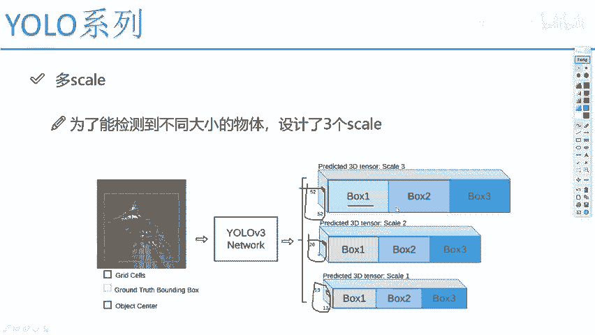
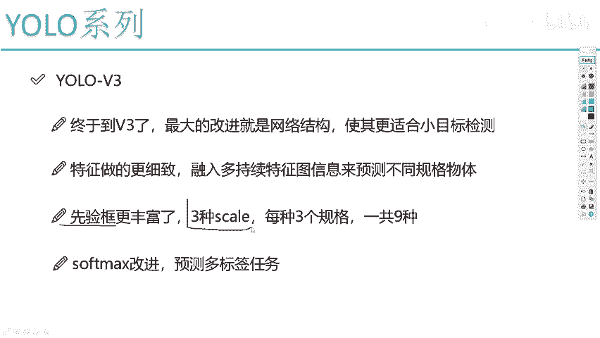
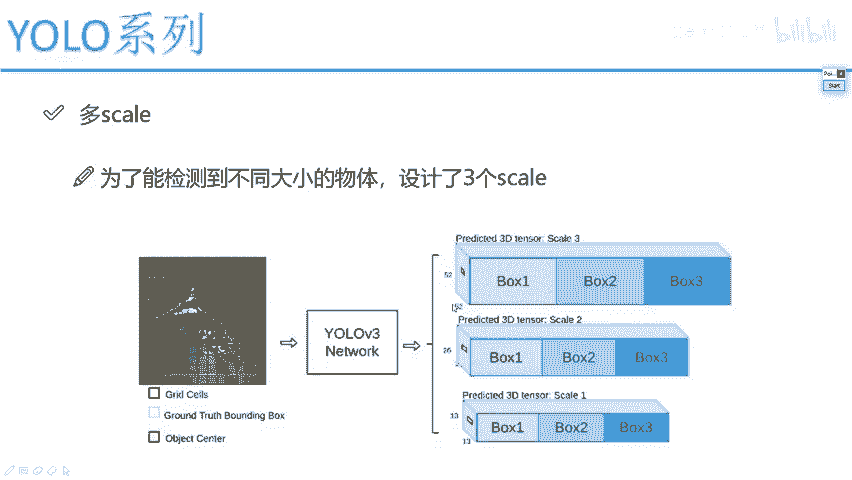
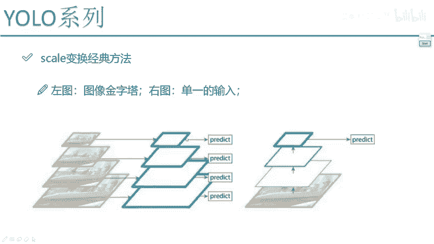
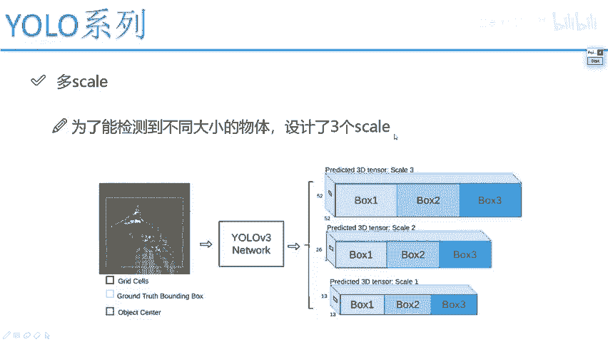

# 课程P63：多尺度方法改进与特征融合 🎯

在本节课中，我们将学习YOLOv3中一个核心的改进思想：多尺度检测与特征融合。我们将理解为何需要为不同大小的物体设计专门的检测层，以及如何通过特征融合来提升检测性能。

## 多尺度检测的核心思想

上一节我们介绍了YOLO的基本检测流程。本节中我们来看看YOLOv3如何改进以更好地检测不同大小的物体。

物体在图像中是有大小之分的。在YOLOv2中，我们曾尝试将最后一层的特征图与前一层特征图融合，形成一个大的特征向量。但这种方法存在潜在问题。

举个例子，假设有两位专家，一位精通电器维修，另一位精通水电焊接。如果将他们强行融合成一个团队去执行综合任务，可能反而会淹没各自最擅长的技能。电器专家的专长在水电任务中可能无法完全发挥。

因此，YOLOv3的设计理念是“术业有专攻”。既然我们的目标包含大、中、小三种不同尺寸的物体，那就让网络的不同部分专门负责预测特定尺寸的目标。

## 三种特征图与感受野

以下是YOLOv3中三种不同尺度的特征图及其分工：

*   **13×13的特征图**：感受野最大，专门负责预测**大目标**。
*   **26×26的特征图**：感受野中等，专门负责预测**中目标**。
*   **52×52的特征图**：感受野较小，专门负责预测**小目标**。

网络输入图像后，经过一系列卷积层，会自然生成由深到浅、尺寸由小到大的特征图。YOLOv3的做法是让每种尺寸的特征图“各司其职”，完成自己最擅长的检测任务。



## 先验框（Anchor Box）的设置



上一节我们了解了特征图的分工，本节中我们来看看每种特征图上如何生成预测框。

在YOLOv3中，为了平衡检测效果与速度，**每一种尺度的特征图上都预设了3个不同大小比例的先验框（Anchor Box）**。

因此，对于52×52、26×26、13×13这三种特征图，每种都会产生3个预测框。最终，整个模型一共使用了 **`3种尺度 × 3个先验框 = 9个`** 先验框。这使得模型能够更灵活地适应不同形状和尺寸的物体。

## 特征融合的必要性





仅仅从网络的不同深度提取52、26、13的特征图直接进行预测就足够了吗？答案是否定的。我们需要进行特征融合。

我们可以用一个比喻来理解：
*   **13×13特征图** 好比一位**百岁老人**，阅历丰富，眼界宽广，能看清事物本质，适合预测大目标。
*   **26×26特征图** 好比一位**中年人**，人生走到一半，对前路可能感到迷茫。它在预测中目标时，需要向“见过世面”的13×13特征图借鉴思想。
*   **52×52特征图** 好比一位**年轻人**，眼界尚浅。它在预测小目标时，需要向“经验更多”的26×26特征图取经，以避开可能的“坑”。

因此，YOLOv3的网络结构并不是简单地提取三层特征。它通过**特征融合**，将深层特征图的语义信息（知道“是什么”）与浅层特征图的位置细节信息（知道“在哪里”）结合起来。

具体来说：
1.  26×26的特征图会与更深层（例如13×13上采样后）的特征图进行融合。
2.  52×52的特征图会与中层（例如26×26上采样后）的特征图进行融合。

这个过程通常通过**上采样（Upsampling）和拼接（Concatenation）** 操作来实现。

```python
# 特征融合的简化示意代码（非完整YOLOv3结构）
# 假设 deep_feat 是13x13的深层特征， mid_feat 是26x26的中层特征
upsampled_deep = upsample(deep_feat, scale_factor=2) # 上采样到26x26
fused_mid_feat = concatenate([mid_feat, upsampled_deep]) # 通道维度拼接
# fused_mid_feat 将同时包含细节和语义信息，用于预测中目标
```

## 总结

本节课中我们一起学习了YOLOv3的多尺度检测与特征融合机制。核心要点包括：
1.  **分而治之**：使用13×13、26×26、52×52三种不同尺度的特征图，分别负责检测大、中、小目标。
2.  **先验框设计**：每种尺度特征图配备3个先验框，共9个，以提升模型灵活性。
3.  **特征融合**：通过上采样与拼接，将深层特征的强语义信息与浅层特征的精细位置信息相结合，使每一层的预测都更加准确。



这种设计显著提升了YOLOv3对不同尺寸物体的检测能力，尤其是在复杂场景中小目标的检测效果。