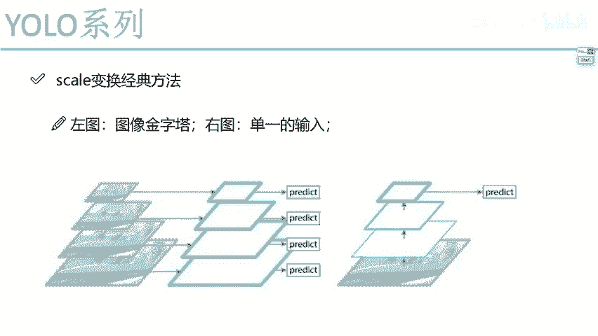
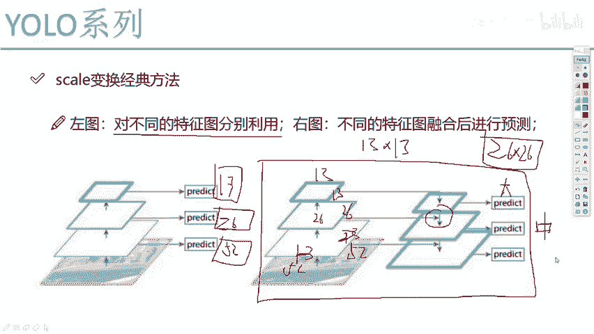
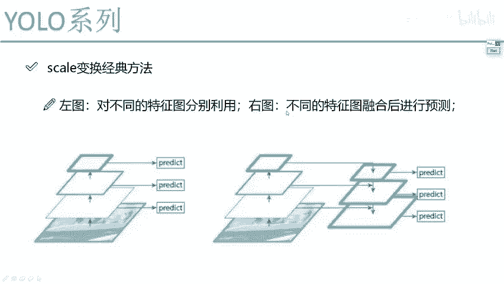

# 课程P64：经典变换方法对比分析 🎯

在本节课中，我们将学习目标检测中几种经典的尺度变换方法，并分析它们在YOLO算法中的适用性。我们将重点理解不同方法的原理、优缺点，并最终明确YOLOv3所采用的核心策略。

## 概述

目标检测需要处理不同尺度的物体。为了同时检测大、中、小目标，我们需要设计有效的特征提取与融合策略。本节将对比分析图像金字塔、单尺度预测以及特征金字塔网络（FPN）等方法的思路，并解释YOLOv3为何选择特定的路径。

## 方法一：图像金字塔 🏔️

第一种做法是构建图像金字塔。其核心思想是通过直接调整输入图像的分辨率来获得不同尺度的特征图。

具体做法是：将原始图像数据通过`resize`操作生成多个不同分辨率的版本（例如，原图、缩小一半、缩小四分之一）。将这些不同尺度的图像分别输入到同一个网络中，自然就能得到对应尺度的特征图输出。

以下是该方法的简要步骤：
1.  对原始图像进行多次下采样，生成一个图像金字塔。
2.  将金字塔中的每一层图像分别输入检测网络。
3.  网络为每一层输入输出对应尺度的检测结果。

然而，这种方法在YOLO算法中并不合适。YOLO的核心优势之一是速度。图像金字塔要求对同一张图片进行多次前向传播（例如三次），这会使处理速度大打折扣。虽然该方法在其他不特别追求速度的算法中可行，但违背了YOLO的设计初衷。

## 方法二：单尺度预测 🔍

第二种方法是单尺度预测，这也是YOLOv1采用的方式。

其过程非常简单：无论输入图像内容如何，只通过一次卷积神经网络（CNN）前向传播，最终在网络的末端输出单一的预测结果（例如一个7x7的网格）。这种方法速度最快，但难以有效检测尺度变化极大的物体，尤其是小目标。

## 方法三：特征金字塔网络（FPN）与融合 🧩

上一节我们介绍了两种较为简单的方法，本节中我们来看看YOLOv3所采用的核心思想——特征金字塔网络（FPN）与跨尺度特征融合。

下图展示了三种不同的特征利用策略：

*   **左图（分别预测）**：网络在不同深度自然产生了13x13、26x26、52x52等不同尺度的特征图。这种方法让各个尺度的特征“各自为战”，只利用自身信息进行预测。问题在于，浅层的特征图（如52x52）感受野小，适合看局部细节（小目标），但缺乏全局语义信息；深层的特征图（如13x13）感受野大，语义信息强，适合看大目标，但空间细节丢失严重。让它们“自己玩自己的”，效果可能不理想。
*   **中图（图像金字塔）**：即我们第一部分分析过的方法，因速度慢而不被YOLO采用。
*   **右图（特征融合）**：这是YOLOv3的核心。它认为，深层特征（如13x13）拥有强大的语义信息（“眼界广”），应该用来帮助提升浅层特征（如26x26、52x52）的检测能力。

那么，不同尺度的特征图如何融合呢？关键在于**上采样（Upsampling）**。

以预测中目标（26x26尺度）为例，融合过程如下：
1.  将深层、语义信息丰富的13x13特征图进行上采样（例如使用最近邻插值或转置卷积），使其尺寸变为26x26。
2.  将这个上采样后的特征图，与网络中间层原生的26x26特征图进行融合（通常是通道维度上的拼接（Concatenation）或相加（Addition））。
3.  融合后的新特征图同时具备了深层的强语义信息和浅层的精细空间信息，用于预测中尺度目标。

同理，对于预测小目标（52x52尺度）：
1.  将用于预测中目标的、已经融合过的特征图（26x26）再进行一次上采样，得到52x52的特征图。
2.  将其与网络最浅层原生的52x52特征图进行融合。
3.  用融合后的特征预测小目标。

这个过程如下图所示，清晰地展示了特征自上而下传递并融合的路径：

这种设计的优势在于，它只用了一次前向传播，就通过巧妙的特征融合，让不同尺度的输出都同时具备了高分辨率的细节和丰富的语义信息，从而实现了速度与精度的良好平衡。

## 总结

本节课中我们一起学习了目标检测中三种经典的尺度变换方法。
1.  **图像金字塔**：通过多尺度输入实现多尺度检测，但速度慢，不适合YOLO。
2.  **单尺度预测**：YOLOv1的做法，速度快但多尺度检测能力弱。
3.  **特征金字塔网络（FPN）**：YOLOv3采用的核心方法。它通过**上采样**将深层特征的语义信息与浅层特征的空间细节进行**融合**，公式化地看，融合过程可表示为：
    `Fused_Feature[l] = Concat( Upsample( Feature[l+1] ), Feature[l] )`
    其中`l`代表特征图层级。这种方法在单次前向传播中高效地实现了对不同尺度目标的鲁棒检测。