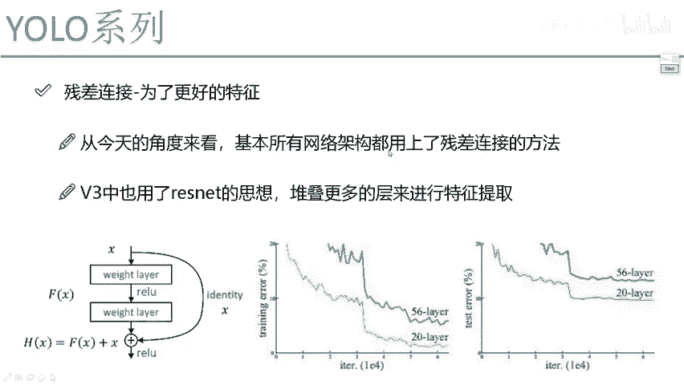
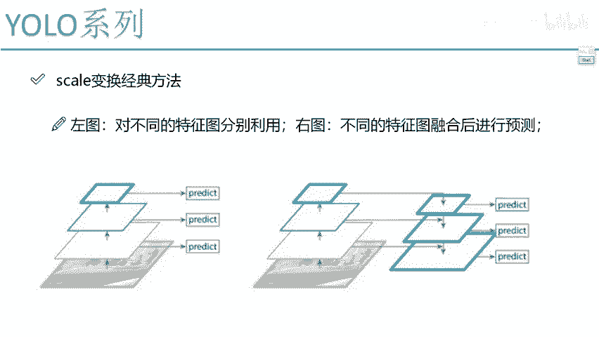
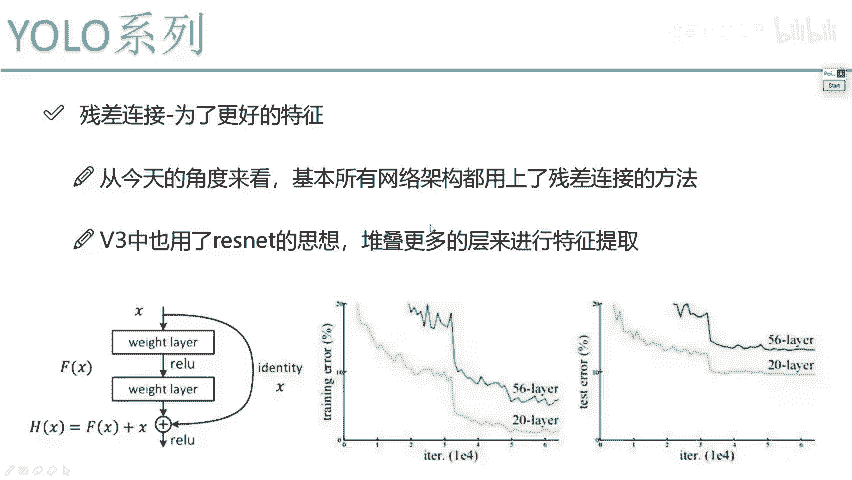

# 课程P65：4-残差连接方法解读 🧠





在本节课中，我们将要学习深度学习中一个至关重要的概念——残差连接。我们将从它被提出的背景开始，解释其核心思想，并说明它为何能成为现代主流神经网络架构的基石。

## 背景：深度网络的困境

上一节我们介绍了特征融合与尺度变换，本节中我们来看看网络深度带来的挑战。

在2014年，VGG网络通过堆叠卷积层取得了巨大成功，但人们发现，当网络层数继续增加时（例如超过19层），模型的性能反而会下降。无论是训练误差还是测试误差，更深的网络表现得更差。这引发了深度学习的瓶颈问题：网络越深，学习效果越“回旋”。

## 残差连接的提出 🚀

为了解决上述问题，ResNet（深度残差网络）在2016年横空出世，它提出的残差连接思想几乎挽救了深度学习的“深度”探索。

其核心思想是：**让网络至少不比原来的浅层网络差**。它通过一种巧妙的结构，确保增加的网络层不会损害模型的性能，甚至可能带来提升。

## 残差连接的核心思想

以下是残差连接的基本工作原理：

假设我们有一个输入 `X`，它经过了一些网络层（例如第19层）。现在，我们想在此基础上增加新的层（例如第20层和第21层）。传统做法是让 `X` 连续通过这些新层，得到输出 `F(X)`。

ResNet的做法不同。它构建了两条路径：
1.  **主路径**：输入 `X` 经过新的卷积层等操作，得到变换后的输出 `F(X)`。
2.  **捷径（Shortcut）连接**：输入 `X` 本身通过一条“捷径”被原封不动地（或经过简单的线性变换如1x1卷积）传递过来。

最后，将这两条路径的结果相加：
`输出 = F(X) + X`

这个加法操作就是**残差连接**。

## 残差连接为何有效？💡

这种结构赋予了网络强大的自选择能力。

*   如果新增的层（`F(X)`）学习到了有用的特征，那么 `F(X)` 将是一个有效的补充，最终输出会优于原始的 `X`。
*   如果新增的层学习效果很差，甚至产生了有害的变换，网络可以通过训练将 `F(X)` 的权重参数学习为接近零。此时，输出 `≈ 0 + X = X`，即网络自动“跳过”了这些无效层，退化回原始输入的状态。

因此，**残差连接保证了网络的性能下限**：增加层数后，效果最差也不过是和浅层网络一样（即 `F(X)=0`），而只要新增的层有一点点贡献，整体效果就会提升。这就像团队合作，新成员如果表现好就加分，表现不好也不会拖累原有团队的平均分。

## 残差块（Residual Block）

在实际应用中，上述结构被封装成一个可重复堆叠的基本模块，称为**残差块**。

一个基础的残差块可以用以下伪代码描述：
```python
# 假设 identity 是捷径连接，主路是两层卷积
def residual_block(x):
    identity = x  # 保存输入
    out = conv1(x)
    out = conv2(out)
    out = out + identity  # 残差连接：相加操作
    out = activation(out) # 激活函数
    return out
```
你可以将数十甚至数百个这样的残差块堆叠起来，构建极深的网络（如ResNet-50, ResNet-101）。即使其中只有部分块是有效的，整体网络也能从中受益。

## 总结

本节课中我们一起学习了残差连接这一深度学习中的核心思想。

1.  **背景**：我们了解到单纯增加网络深度会导致性能下降。
2.  **解决方案**：ResNet提出了残差连接，通过将输入与经过变换的输出相加（`输出 = F(X) + X`），构建了“捷径”。
3.  **核心优势**：这种结构确保了深度网络**至少不差于**其对应的浅层网络，并让网络能自动选择是否利用新增的层，从而使得训练成百上千层的超深网络成为可能。
4.  **广泛应用**：正如YOLOv3等众多先进算法所示，残差连接已成为现代神经网络设计中不可或缺的标准组件。



理解残差连接，是理解当今主流深度学习模型架构的关键一步。