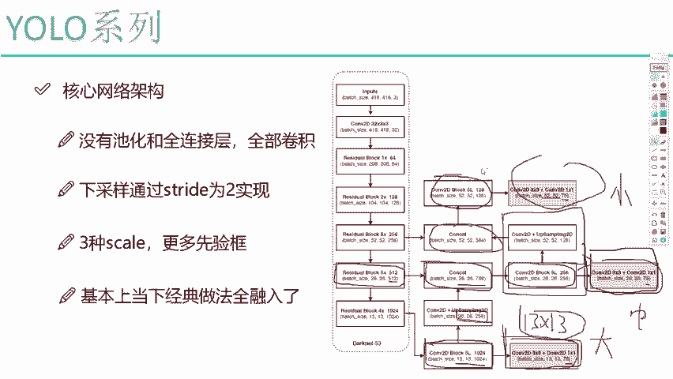
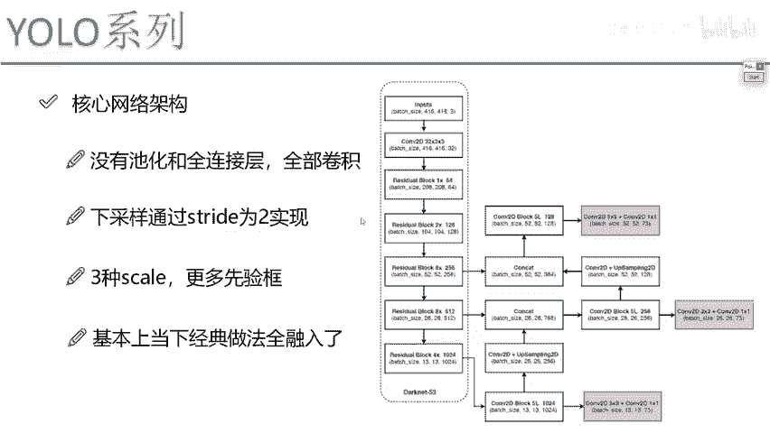
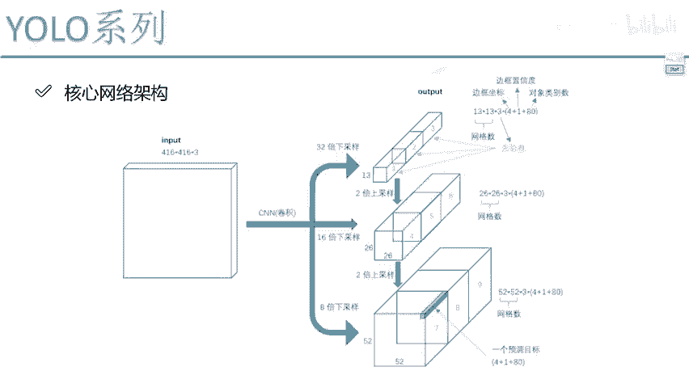

# 课程P66：YOLOv3整体网络模型架构分析 🧠

在本节课中，我们将要学习YOLOv3的整体网络模型架构。我们将深入解析其核心设计思想、网络结构特点以及多尺度特征融合的策略，帮助你理解这个经典目标检测模型的工作原理。

## 概述

YOLOv3的网络结构被称为Darknet-53。你可以将其理解为与ResNet类似的残差网络，其核心设计理念是高效和简洁。

## 网络结构特点

上一节我们介绍了YOLOv3的基本概念，本节中我们来看看其网络结构的主要特点。

最大的特点是：该网络中**没有池化层和全连接层**。在之前的YOLO版本中，我们已经解释过全连接层在实际应用中效率不高，因此被移除。而池化层会对特征图进行压缩，可能导致信息丢失，影响效果。因此，YOLOv3决定完全舍弃池化层。

那么，一个随之而来的问题是：如果全部使用卷积，如何将特征图的尺寸缩小为原来的1/2（如下采样）？

这里我们来看卷积操作中的一个关键参数：步长（stride）。
*   当卷积的 `stride=1` 时，特征图大小保持不变。
*   当我们将卷积的 `stride` 设置为2时，卷积核每次滑动两个单元格，这样就能让特征图的高（H）和宽（W）都变为原来的1/2。

因此，在YOLOv3中，凡是需要进行下采样的地方，就使用 `stride=2` 的卷积层；不需要改变尺寸的地方，则使用 `stride=1` 的卷积层。这是一种趋势，因为卷积操作省时省力、速度快且效果好，所以能简化的结构都尽量简化，全部使用卷积来完成。

## 多尺度预测与特征融合

了解了网络的基础构成后，我们进一步探讨YOLOv3实现多尺度目标检测的核心机制。

在网络末端，我们得到了三种不同尺度的特征图：13×13、26×26和52×52。其中，13×13的深层特征图适合预测大目标。

其具体操作流程如下：
1.  首先，网络会生成一个13×13×1024的特征图（红色部分）。
2.  接着，将该特征图进行**上采样**操作，并经过卷积，变换为26×26×256的特征图。
3.  然后，将这个上采样得到的特征图与网络中较早层生成的26×26×512的特征图进行**拼接（融合）**。拼接后的特征图尺寸为26×26×（256+512）= 26×26×768。
4.  最后，对这个融合后的特征进行进一步的卷积以提取信息，并完成最终的预测。

对于52×52的小目标预测分支，原理是相同的：将26×26的特征图上采样后，与更早层的52×52特征图进行拼接融合，再经过卷积得到最终的输出。

以下是整个特征融合过程的简要总结：
*   **13×13特征图**：用于预测大目标。
*   **26×26特征图**：由13×13特征图上采样后，与中层特征拼接融合得到，用于预测中目标。
*   **52×52特征图**：由26×26特征图上采样后，与浅层特征拼接融合得到，用于预测小目标。

从整体思想来看，其核心并不复杂。它基于残差网络得到了三种不同尺度的输出特征图。为了使特征图包含更丰富的信息，它不仅利用了当前层的信息，还通过上采样融合了深层特征的信息，从而使检测效果更加完善。

## 总结

本节课中我们一起学习了YOLOv3的网络架构。我们了解到其主干网络Darknet-53完全由卷积层构成，利用`stride=2`的卷积进行下采样。同时，我们重点分析了其多尺度预测与特征融合机制，即通过上采样和拼接操作，将深层语义信息与浅层细节信息相结合，从而实现对不同大小目标的有效检测。