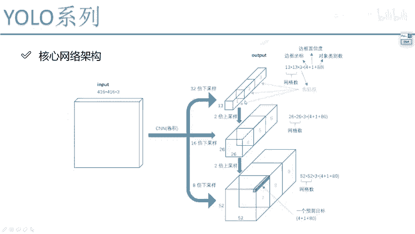
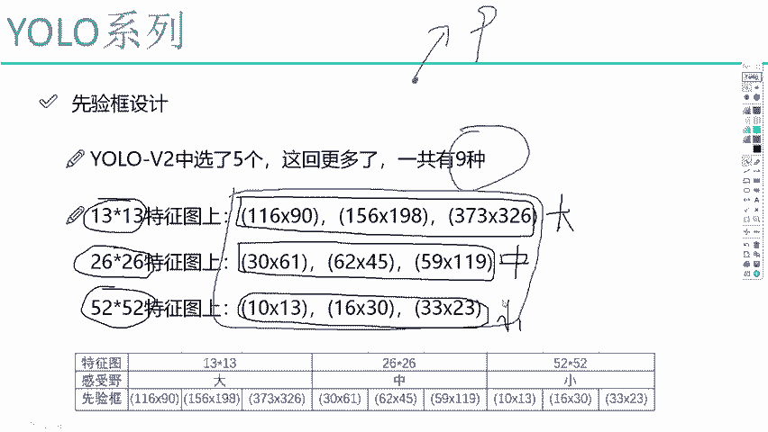
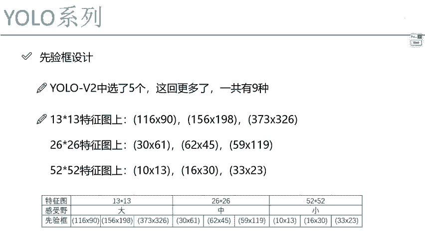

# 课程P67：先验框设计改进 🎯

在本节课中，我们将学习YOLO V3模型在目标检测任务中，对先验框（Anchor Boxes）设计所做的关键改进。我们将详细解释其设计思路、具体实现以及与之前版本（如YOLO V2）的区别。

---

## 网络输出结构解析

上一节我们介绍了YOLO V3的网络架构，本节中我们来看看其具体的输出结构。网络通过不同步长的卷积层进行下采样，最终会得到多个尺度的特征图，例如32倍、16倍和8倍下采样的结果。

最终预测结果的典型维度是 **13×13×3×85**。这个值可能因数据集而异，但其结构是固定的。我们来分解这个维度的含义：

以下是每个维度的具体解释：
*   **13×13**：这是特征图的网格大小。它类似于YOLO V1中的7×7网格，或YOLO V2中的13×13网格。在YOLO V3中，我们会有三种不同尺度的网格：13×13、26×26和52×52。
*   **×3**：这代表每个网格单元（Grid Cell）会预测3个不同尺寸的先验框。这对应了图中标注的box1、box2、box3。
*   **×85**：这代表每个预测框需要输出的信息量。它由三部分组成：
    *   **4**：边界框的偏移量（`x, y, w, h`）。
    *   **1**：置信度（`confidence`），表示该框内包含物体的可能性。
    *   **80**：在COCO等数据集上，对应80个类别的分类概率（通过Softmax转换得到）。

因此，当看到类似 `13×13×3×85` 的输出时，应理解其每个数字的含义。不同数据集的类别数（如80）可能变化，但网格、先验框数量及4+1的基本结构是固定的。YOLO V3的网络结构核心与V2相似，主要是在细节上进行了优化。

---

## 先验框的聚类与分配策略

理解了输出结构后，我们聚焦于核心改进之一：先验框的设计。在YOLO V2中，我们使用K-means聚类在训练集上得到5个先验框尺寸。YOLO V3延续了聚类方法，但做了更科学的分配。

YOLO V3通过聚类得到了9种不同尺寸的先验框。关键改进在于，它没有让每个尺度的特征图都预测全部9种框，而是根据特征图的感受野大小，将9种框分配给了三个不同的输出层，实现了“术业有专攻”。

以下是具体的分配逻辑：
*   **13×13 特征图**：分配**3个较大尺寸**的先验框。因为该层感受野最大，适合检测图像中的大目标。
*   **26×26 特征图**：分配**3个中等尺寸**的先验框。该层感受野适中，适合检测中等尺寸的目标。
*   **52×52 特征图**：分配**3个较小尺寸**的先验框。该层感受野最小，保留了更多细节信息，因此擅长检测小目标。

这与YOLO V2有显著不同。V2中每个位置预测相同的一组先验框，而V3则根据特征图的能力进行了针对性分配，使不同层专注于检测不同尺度的物体。

---

## 改进效果可视化

为了更直观地理解这种分配策略的效果，我们来看一张示意图。

图中展示了相同输入图像在不同尺度特征图上的先验框情况。其中，黄色框代表真实标签（Ground Truth），蓝色框代表该层分配的候选先验框。

可以清晰地看到：
*   在 **13×13** 的特征图上，蓝色的先验框尺寸**最大**。
*   在 **26×26** 的特征图上，蓝色的先验框尺寸**中等**。
*   在 **52×52** 的特征图上，蓝色的先验框尺寸**最小**。

这种设计使得每个尺度的特征图都使用与其感受野相匹配的先验框进行初始预测，网络只需在此基础上进行微调，从而提升了多尺度目标检测的精度和效率。

---

## 总结

本节课中我们一起学习了YOLO V3在先验框设计上的重要改进。核心在于将聚类得到的9种先验框，根据尺寸大小科学地分配给三个不同尺度的输出特征层（13×13， 26×26， 52×52），让大感受野的层检测大目标，小感受野的层检测小目标。这种“分而治之”的策略相比YOLO V2的均匀分配更为合理，是提升模型多尺度检测性能的关键之一。