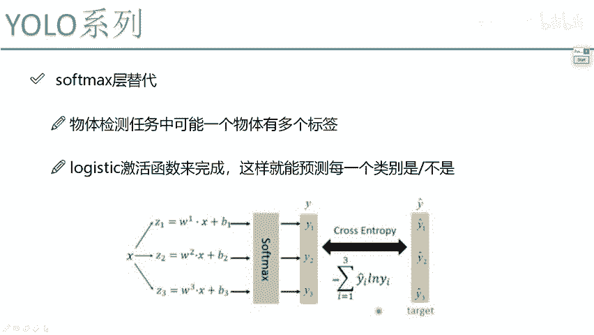
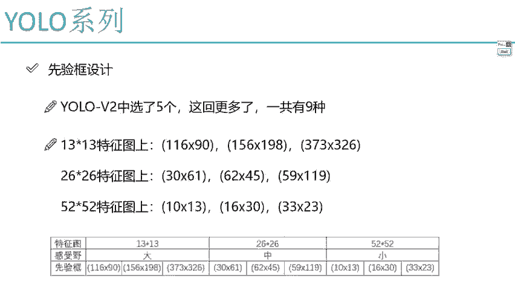
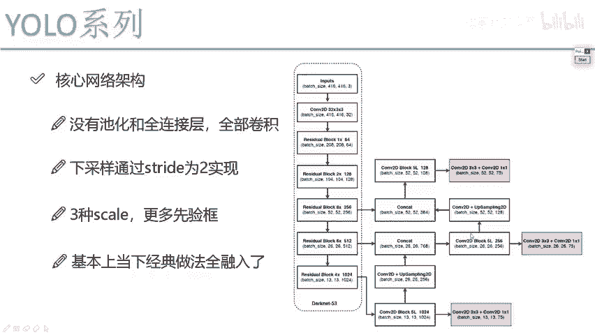
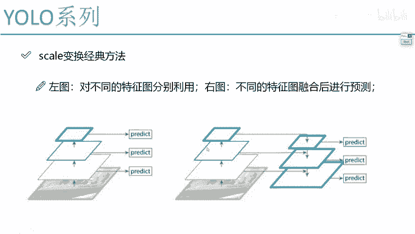
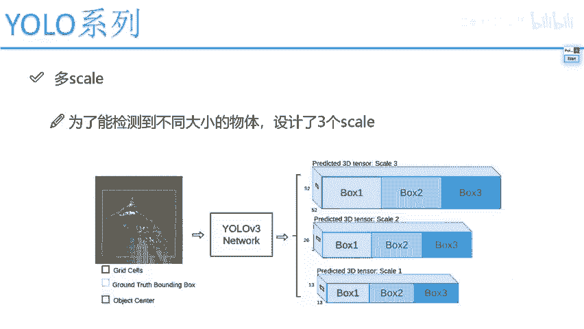
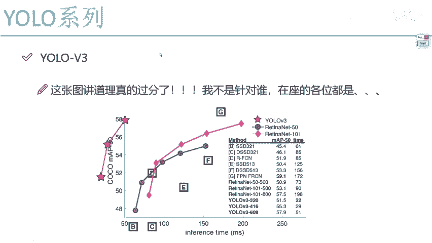

# YOLOv3 课程 P68：Softmax层改进 🧠

在本节课中，我们将学习 YOLOv3 模型在输出层的一个重要改进。上一节我们介绍了 YOLOv3 的整体网络架构，本节中我们来看看其如何通过改进 Softmax 层来处理更复杂的多标签分类任务。

## 概述

YOLOv3 在输出预测时，面临一个实际问题：一个物体可能同时属于多个类别。例如，一张图片中的对象可能既是“狗”，又是“哺乳动物”，还是“哈士奇”。传统的 Softmax 层和交叉熵损失函数是为单标签分类设计的，无法直接处理这种情况。因此，YOLOv3 对此进行了关键性改进。

## 传统 Softmax 与交叉熵的局限

在标准的单标签分类任务中，Softmax 层输出一个概率分布，交叉熵损失函数只关注**正确类别**的预测概率。

其损失函数公式为：
`Loss = -log(P(correct_class))`

其中，`P(correct_class)` 是模型预测物体属于真实类别的概率。

*   当预测正确概率很高（接近1）时，`-log(1) = 0`，损失值接近零。
*   当预测正确概率很低（接近0）时，`-log(0)` 趋近于无穷大，损失值很大。

这种方法只计算一个“正确”标签的损失，忽略了物体可能具有的其它有效标签。

## YOLOv3 的改进方案

为了处理多标签任务，YOLOv3 放弃了使用单一的 Softmax 层进行分类。取而代之的是，它为**每一个类别都独立地执行一次二分类**。

以下是具体的实现思路：

1.  **独立二分类**：网络不再输出一个 N 类的概率分布，而是为 N 个类别中的每一个都输出一个独立的概率值。这个概率值表示对象**属于该类别的置信度**。
2.  **设定阈值**：为这些概率值设定一个阈值（例如 0.5 或 0.7）。
3.  **收集标签**：将所有概率值超过该阈值的类别，都作为该对象的预测标签。

例如，模型对一个对象进行预测，可能得到如下结果：
*   是猫的概率：0.9
*   是狗的概率：0.05
*   是哺乳动物的概率：0.85
*   是汽车的概率：0.01

如果设定阈值为 0.7，那么该对象的最终预测标签就是“猫”和“哺乳动物”。

## 核心网络架构回顾

这个改进是集成在 YOLOv3 的“大内 53”核心网络架构之中的。整个架构的基础是残差块，它有效地解决了深层网络中的梯度消失问题，使网络可以构建得非常深。同时，通过上采样操作融合不同尺度的特征图，使得模型既能检测大物体，也能检测小物体。

## 总结

本节课中我们一起学习了 YOLOv3 模型在输出层的核心改进。主要内容总结如下：

1.  **问题识别**：传统 Softmax 层和交叉熵损失函数无法处理一个对象对应多个标签的现实任务。
2.  **解决方案**：YOLOv3 采用**为每个类别独立进行二分类**的策略，替代了全局的 Softmax。
3.  **预测流程**：对每个类别预测一个置信度分数，并通过设定阈值来筛选出所有符合条件的标签，从而支持多标签预测。
4.  **架构整合**：此改进被无缝整合进基于残差块和特征金字塔的 YOLOv3 主干网络中。

正是这些扎实的改进，使得 YOLOv3 在其发布时取得了“逆天”的性能，并在很长一段时间内成为目标检测领域最经典、最常用的模型之一。尽管已有更先进的模型出现，但 YOLOv3 因其出色的平衡性（速度、精度、易用性）至今仍被广泛使用。