# YOLOv3实战课程：P69 - 数据与环境配置 🚀

在本节课中，我们将从实战角度出发，学习YOLOv3版本的整体网络架构与代码实现细节。我们的核心任务是理解每一行代码的含义，并掌握如何获得最终的预测结果。在开始之前，首先需要配置好开发环境与准备数据集。

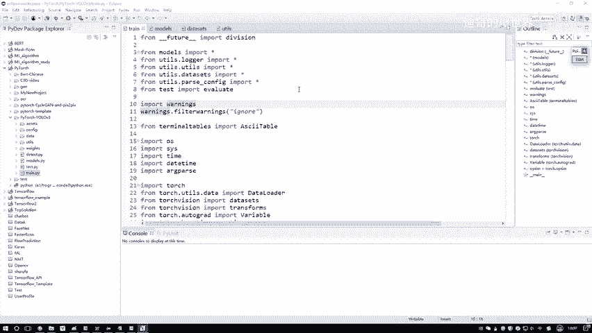

## 🛠️ 环境配置

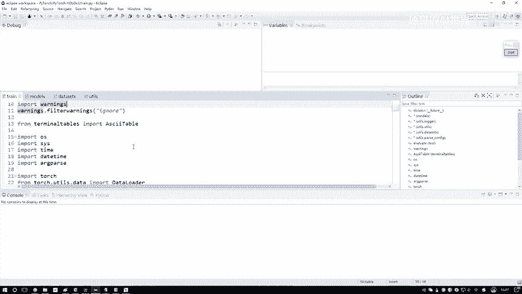

上一节我们介绍了YOLO各版本的改进，本节中我们来看看运行代码所需的环境配置。以下是两个必须准备的核心组件：

**1. 集成开发环境 (IDE)**
你需要一个Python编程工具，用于编写代码和进入Debug模式。我使用的是Eclipse，因为它支持多种语言。你也可以选择PyCharm或其他你喜欢的IDE。如果之前没有使用过IDE，建议跟随教程配置Eclipse，以便后续能同步进入Debug模式逐行追踪代码执行流程。

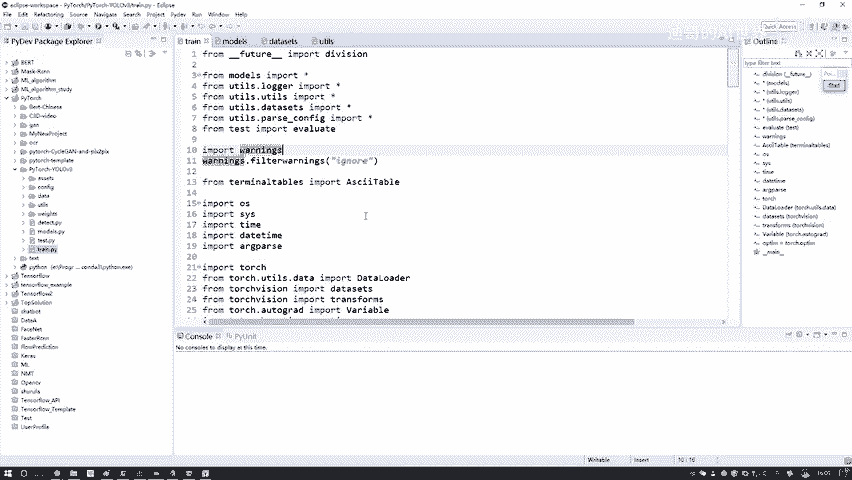

**2. 深度学习框架**
我们将使用当下最流行的PyTorch框架。如果你对PyTorch不熟悉，本课程会介绍其基本用法。你也可以参考专门的PyTorch实战课程进行深入学习。你需要自行安装好PyTorch框架。

除了以上两点，NumPy、Pandas等常用Python包也是必备的。

## 📁 数据准备

环境配置好后，接下来我们需要准备训练数据。我们将使用与论文一致的COCO数据集。

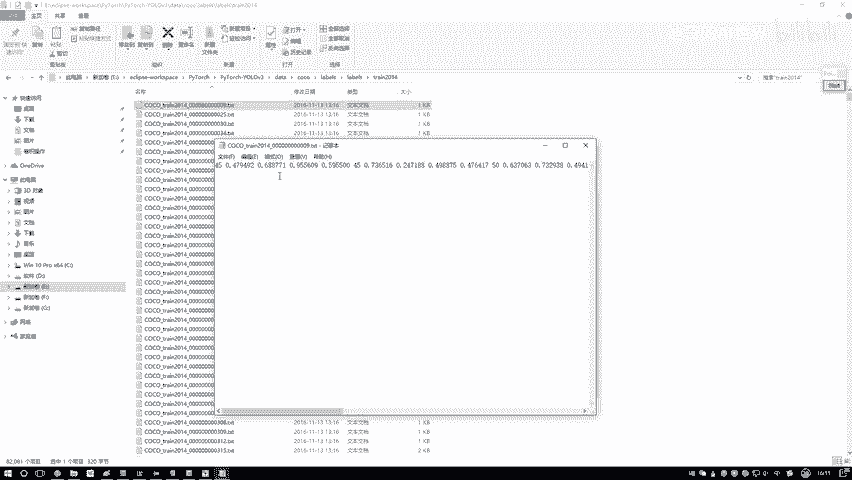

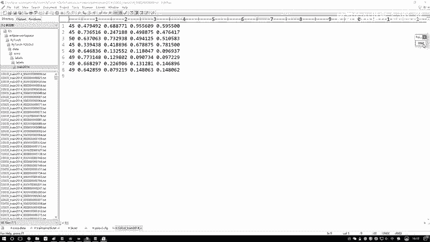

**数据集结构**
COCO数据集主要包含两个部分：
*   **`images` 文件夹**：存放实际的图像文件。例如 `train2014` 和 `val2014` 分别对应训练集和验证集的图片。
*   **`labels` 文件夹**：存放对应的标签文件。标签文件是 `.txt` 格式，其文件名与 `images` 文件夹中的图片名一一对应。

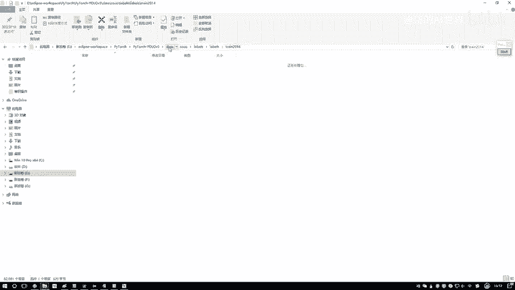

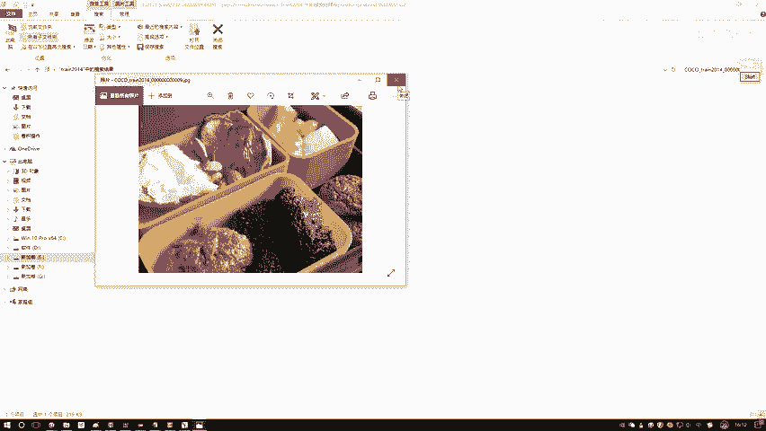

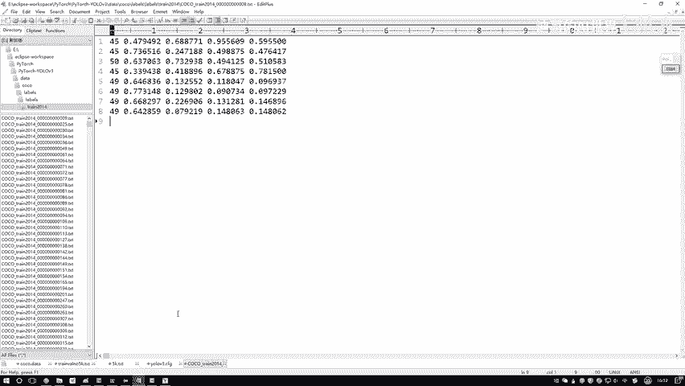

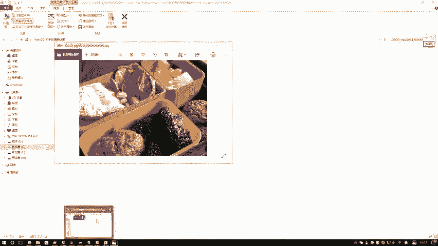

**标签文件内容**
每个标签文件（.txt）内包含多行数据，每行代表图像中的一个物体标注，格式通常为：`[类别ID, 中心点x坐标, 中心点y坐标, 框宽度, 框高度]`。这些坐标是归一化后的值。

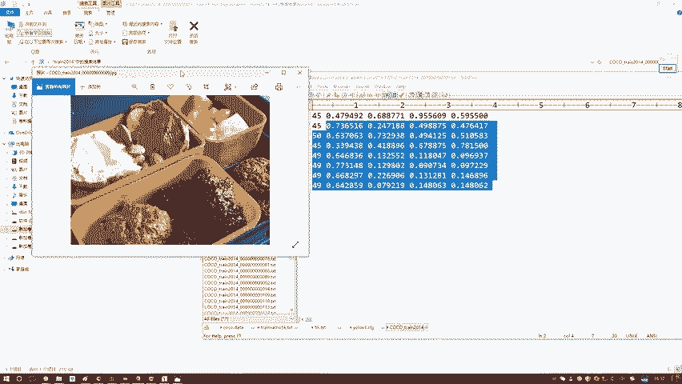

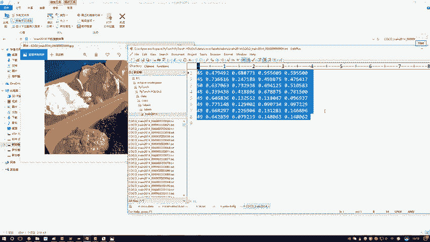

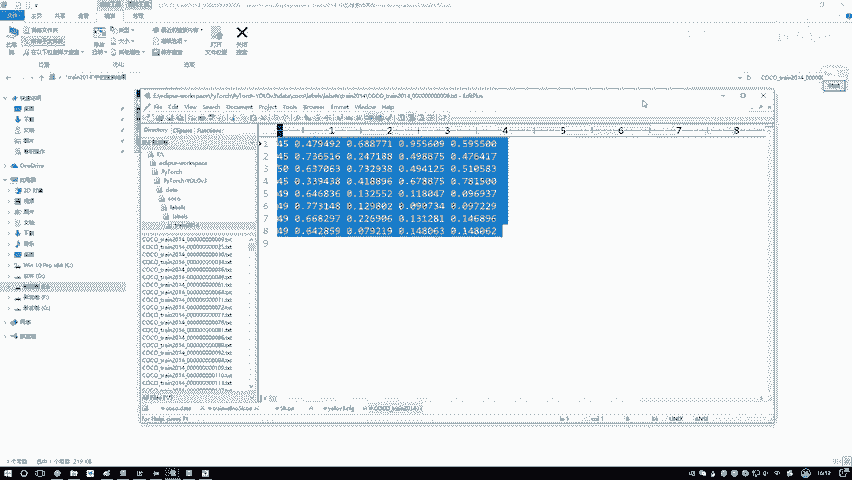

**路径索引文件**
在实际读取数据时，代码并非直接扫描文件夹，而是通过读取一个 `.txt` 文件来获取所有图像的完整路径。因此，你还需要准备：
*   `train.txt`：包含所有训练图像路径的列表。
*   `val.txt` 或 `val5k.txt`：包含所有验证图像路径的列表。

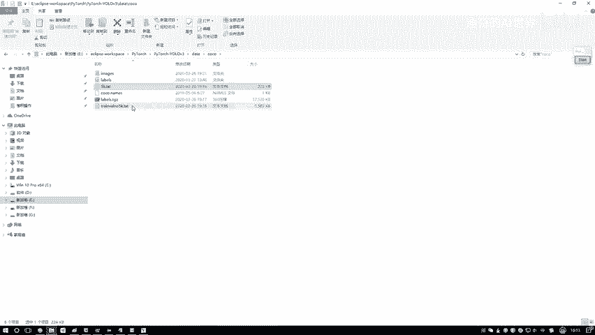

总结一下，你需要准备好的数据相关文件包括：
1.  实际的图像文件夹（如 `train2014/`, `val2014/`）。
2.  对应的标签文件夹（如 `labels/train2014/`, `labels/val2014/`）。
3.  训练集路径文件 `train.txt`。
4.  验证集路径文件 `val5k.txt`。

## ⚙️ 配置文件

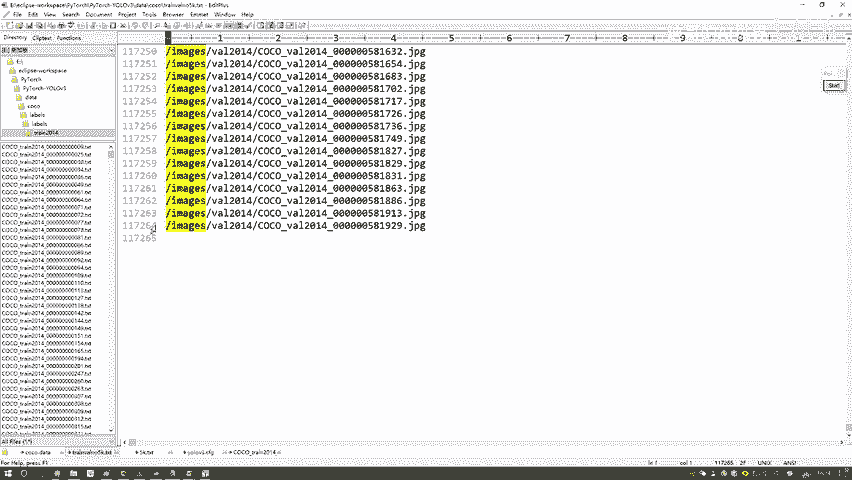

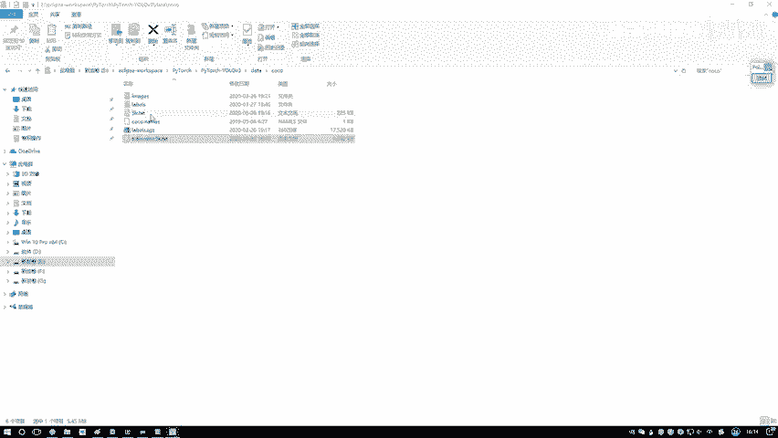

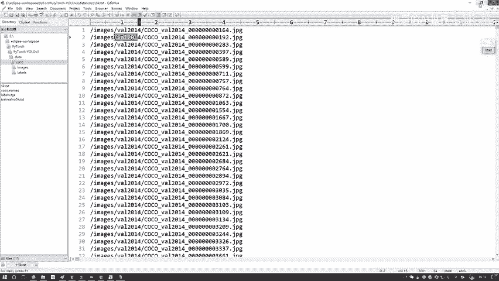

除了数据和环境，另一个核心是网络配置文件。YOLOv3的网络结构定义在一个 `.cfg` 配置文件中（例如 `yolov3.cfg`）。

**配置文件的作用**
该文件按顺序定义了网络的每一层，包括：
*   **卷积层**：指定了卷积核大小、步长（stride）、填充（padding）和输出通道数。
    ```ini
    [convolutional]
    batch_normalize=1
    filters=32
    size=3
    stride=1
    pad=1
    activation=leaky
    ```
*   **快捷连接层**：用于实现残差连接，通过 `from=-3` 这样的参数指定与前面哪一层进行相加。
    ```ini
    [shortcut]
    from=-3
    activation=linear
    ```
*   **YOLO检测层**：定义了锚框（anchor boxes）和最终的检测输出。

在代码中，我们会读取这个配置文件，并根据其中的定义逐层构建出完整的Darknet-53网络模型。对于COCO数据集，通常使用预设的9种锚框，并在三个不同尺度的特征图（13x13, 26x26, 52x52）上进行检测。

## 📝 本节总结

本节课中，我们一起学习了开始YOLOv3代码实战前必须完成的准备工作：
1.  **环境配置**：安装合适的IDE（如Eclipse或PyCharm）以及PyTorch深度学习框架。
2.  **数据准备**：下载并组织COCO数据集，确保图像、标签文件以及路径索引文件正确对应。
3.  **配置文件**：了解网络结构配置文件（`.cfg`）的格式与作用，它是构建模型的蓝图。

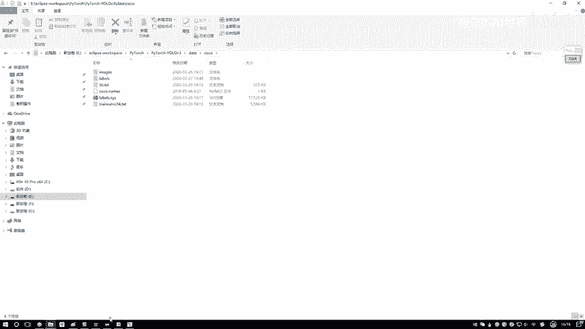

确保以上三点都已就绪，我们就能在接下来的课程中，深入代码内部，一步步理解YOLOv3是如何工作的了。