# 图像处理基础教程 P7：高斯与中值滤波 📊

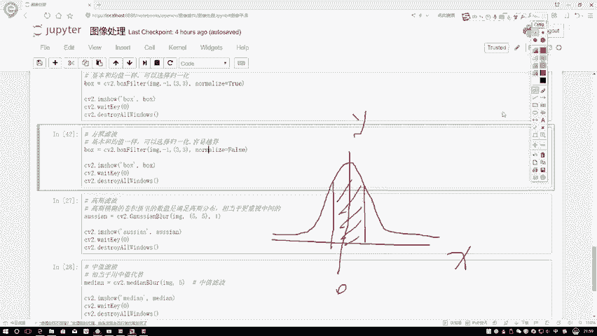

在本节课中，我们将要学习两种重要的图像平滑滤波方法：高斯滤波和中值滤波。我们将了解它们的基本原理、核心思想以及如何应用它们来处理图像中的噪声。

## 高斯滤波 🌀

上一节我们介绍了均值滤波，它平等地对待邻域内的所有像素。本节中我们来看看高斯滤波，它引入了一种更符合直觉的加权思想。

高斯函数是一个大家应该都了解的数学函数。假设均值为零，并指定一个标准差，我们可以得到高斯函数的图像。高斯函数的核心含义是：越接近均值点，其函数值（可能性）越大。这代表在坐标轴上，越接近X等于零的位置，Y的取值相对较大。

我们可以这样理解：在图像处理中，离中心像素越近的像素点，对中心像素最终值的影响应该越大。这与均值滤波中所有像素权重相等的做法不同。

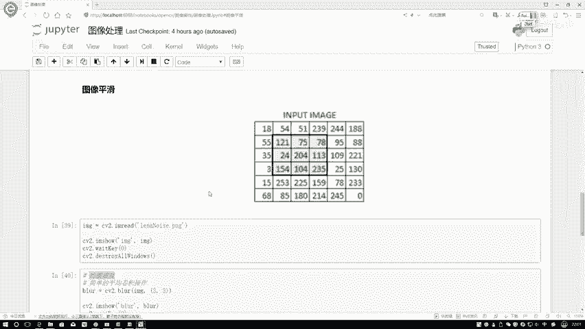

例如，以一个像素值为204的点作为中心点。其邻域内，像素值75离204的距离较近，78离204的距离稍远，113比较近，235比较远，104比较近，154可能比较远。按照高斯函数的思想，离中心点越近的像素，我们应该更重视它。

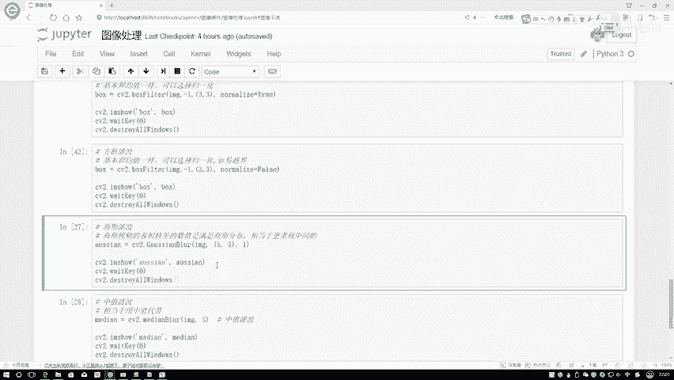

因此，在使用高斯滤波时，我们使用的滤波器（filter）会发生改变。我们可以这样设置权重：最中心的像素权重设为1，表示其权重比较重要；距离中心较近的像素点，可以设置成0.8等较大的值；距离相对较远的像素点，如121、174、235、154，在滤波器中的数值可以设置得稍小一点，表示其重要程度较低。这体现了像素间基于距离的权重关系。

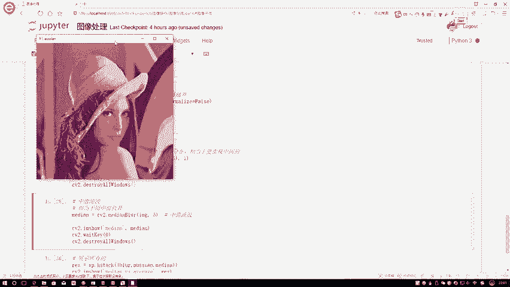

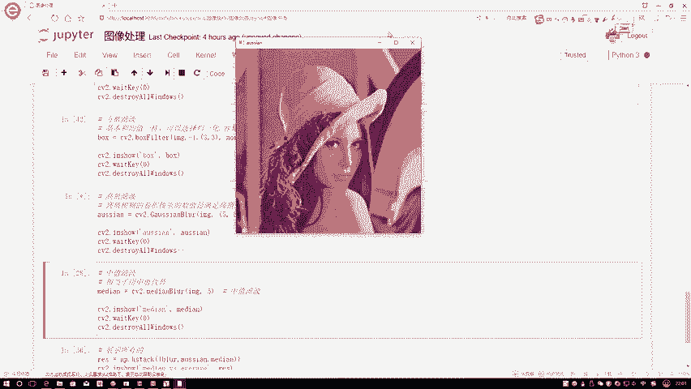

**核心思想公式**：滤波器权重矩阵的构造基于二维高斯函数：
`G(x, y) = (1/(2πσ²)) * exp(-(x² + y²)/(2σ²))`
其中，(x, y)是相对于中心点的坐标，σ是标准差。

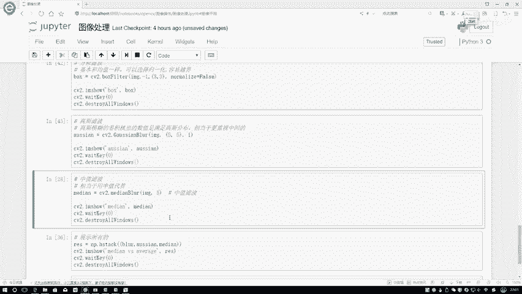

这个道理很简单：离中心点越近的像素，在计算中发挥的效果应当越强；离得越远的像素，其作用就没有那么大了。这相当于我们构造了一个权重矩阵来进行计算，而不是简单地使用均值。

以下是高斯滤波效果的观察：
从整体上看，图像仍然存在一些噪声点，但给人的感觉是噪声点没有使用均值滤波后那么严重了。这就是高斯滤波的效果。

高斯滤波比较简单，核心是回想高斯分布的形状，理解了这一点，再理解高斯滤波就很简单了。

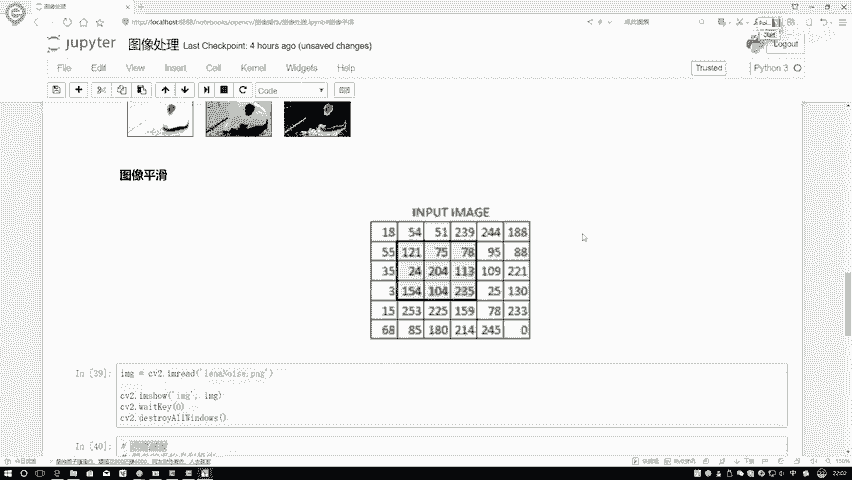

## 中值滤波 🔢

接下来我们介绍中值滤波。中值滤波的核心是“中值”这个概念。

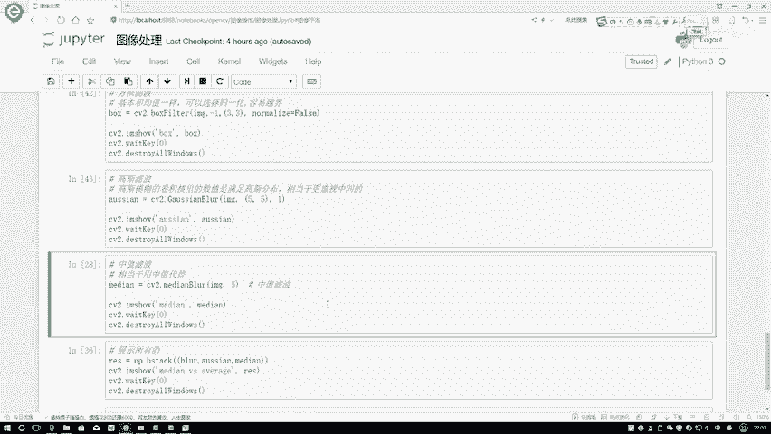

中值是指将一组数值按大小顺序排列后，位于中间位置的那个值。在中值滤波中，我们处理一个像素时，会查看以其为中心的某个区域（例如3x3的方框）内所有像素的值。

例如，对于中心点及其8邻域的像素值：204, 75, 78, 113, 24, 154, 104, 235, 121。我们首先将这些值进行排序（从小到大或从大到小均可）。排序后为：24, 75, 78, 104, 113, 121, 154, 204, 235。排序完成后，我们寻找中间的那个值。前面有4个值，后面有4个值，中间的值是113。那么，经过中值滤波处理后，当前中心像素点的值就变为113。我们使用这个中间值作为平滑处理后的结果。

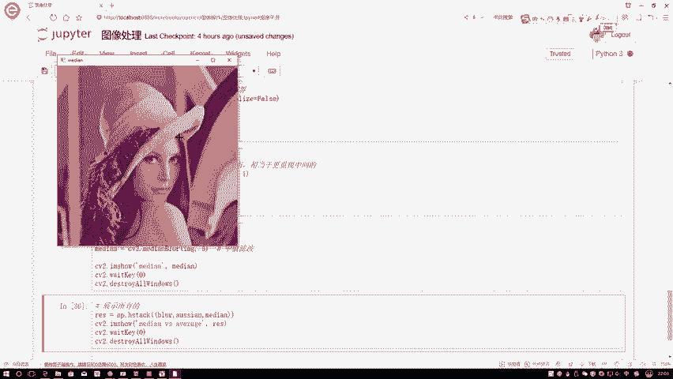

中值滤波的使用比较简单：指定滤波器的大小（例如是5x5还是3x3）。滤波器会框选住对应区域的像素，例如5x5就是25个像素，对这25个值排序后，取第13个值（中间值）作为处理结果。

以下是中值滤波效果的观察：
当使用中值滤波执行后，图像中所有的椒盐噪声点看起来几乎都消失了。因为它是用中间值来替代原值，而噪声点（极大或极小的值）在排序后通常不会成为中值，从而不会被“拷贝”到结果中。因此，当我们的图像数据中存在一些噪声点，特别是类似椒盐噪声的孤立噪点时，使用中值滤波通常能非常有效地处理掉这个问题。

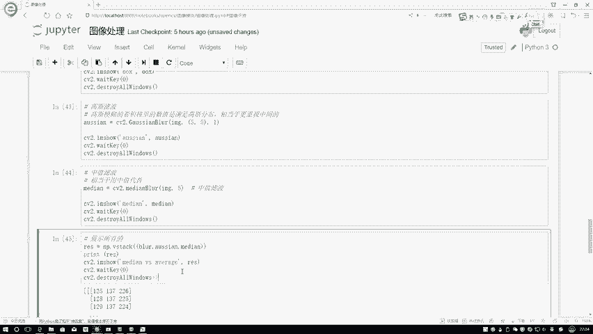

## 结果对比与展示 🖼️

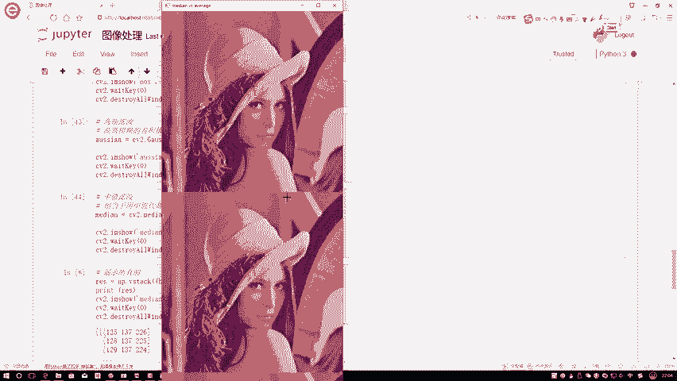

最后，介绍一个展示多个结果的方法。当我们使用`cv2.imshow`时，可以将多种滤波的结果组合在一起展示。例如，我们可以将均值滤波、高斯滤波和中值滤波的结果通过`np.hstack`或`np.vstack`函数水平或垂直拼接在一起。

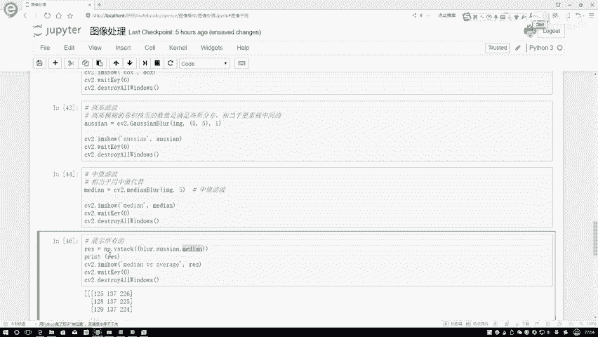

这样，我们可以一次性观察不同滤波方法处理后的效果对比。例如，从左到右依次展示：原始图像（或均值滤波结果）、高斯滤波结果、中值滤波结果。通过对比可以清晰地看到，中值滤波在去除椒盐噪声方面效果最为显著，而高斯滤波则在平滑图像的同时更好地保留了边缘信息。

本节课中我们一起学习了高斯滤波和中值滤波。高斯滤波基于距离赋予像素不同的权重，实现平滑；中值滤波则通过取邻域像素值的中位数来有效滤除孤立噪声点。它们是图像预处理中用于去噪和平滑的两种基本且强大的工具。