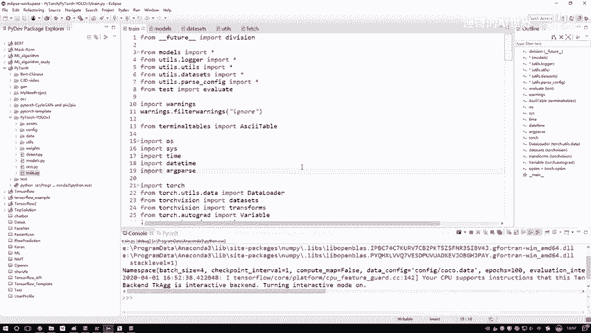
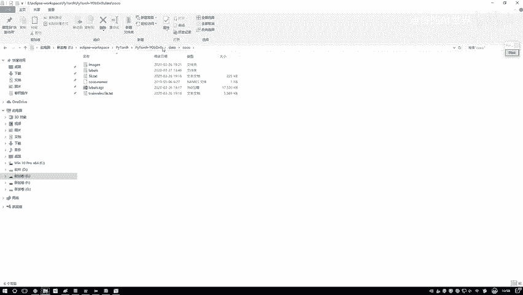
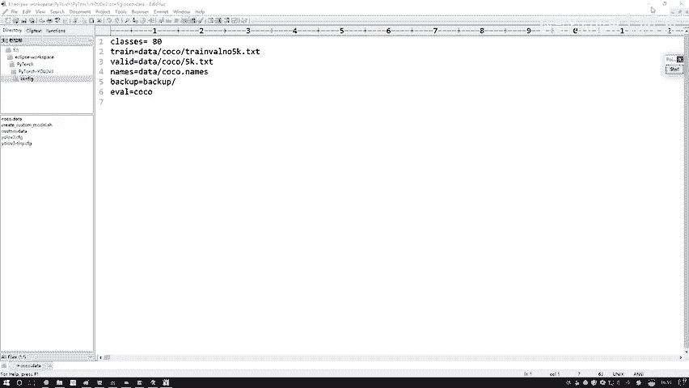
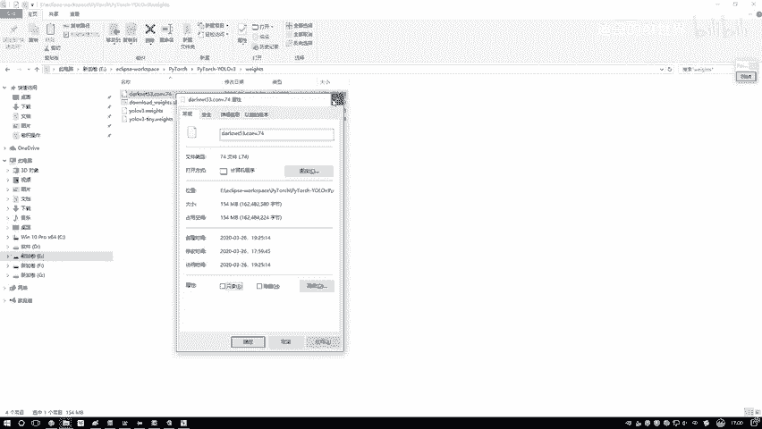
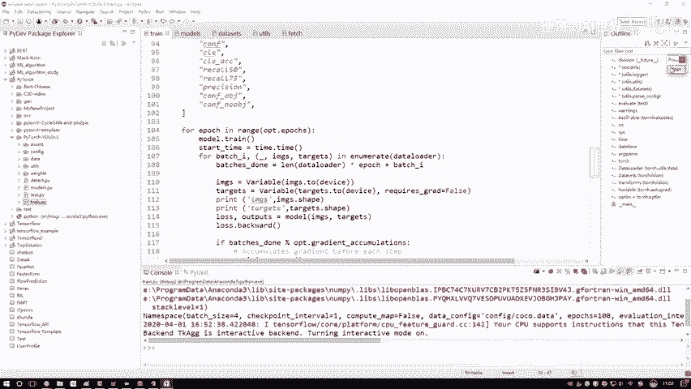

# 课程P70：训练参数设置详解 🛠️

在本节课中，我们将学习如何为YOLO模型训练配置必要的参数。我们将一步步讲解如何传入数据路径和预训练模型，并概述代码执行的整体流程。

## 参数配置步骤

接下来演示这段代码的使用方法。第一步需要传入所有必需的参数。

无需担心这些参数是否需要逐一编写。它们都是常见参数，例如迭代次数、批次大小、模型定义文件以及数据位置。

这些参数均已预先配置好，无需额外设置，例如输入尺寸等。只需要额外写入两个参数即可。

### 配置方法

如果你使用与我相同的IDE，可以按照以下步骤操作：

1.  在代码文件上点击右键。
2.  在运行选项中选择 `Run As`。
3.  选择最后一项以配置当前代码。

点击之后会弹出一个对话框。在对话框中找到参数配置部分。

我已经将两个所需参数写入。如果你初次使用，IDE中不会有这些参数，需要你自行指定。

以下是需要配置的两个参数：

*   **第一个参数 `data configure`**：即 `coco.data` 文件的路径。这个文件描述了训练数据集的所有必要信息，例如这是一个80分类任务、训练数据路径（`train`）、验证数据路径（`valid`）等。我们只需确保数据已准备妥当，路径信息已正确写入 `coco.data` 文件。
*   **第二个参数 `pretrain model`**：即预训练权重模型的路径。我们通常采用迁移学习的方式进行训练，而非从零开始。迁移学习是指加载一个在大型数据集上预训练好的模型，即使其原始任务与我们的任务不同（例如，原模型是800分类，而我们是200分类），其底层的卷积层特征提取能力也是通用的。这相当于有了一个更好的起点。这里使用的是 `yolov3.conv.74` 文件。

配置完成后，点击 `Apply`，然后点击 `Run` 即可开始训练。

为了方便大家使用，可以将配置好的参数字符串复制出来，以便在其他项目中直接粘贴。如果你使用其他IDE，方法也是类似的，所有IDE都支持设置运行参数。

## 代码执行流程概述

在讲解代码时，我会设置断点，逐行分析。为了更清晰地理解，这里先调整一下顺序，概述整体执行流程：

1.  **加载配置参数**：第一步是加载所有输入的配置参数，这一步比较简单直接。
2.  **构建模型**：第二步是构建模型。这涉及到定义Darknet的网络结构，并编写前向传播的逻辑。这些内容都已在 `model` 中实现。你需要完成两件事：定义网络所使用的组件，并指定这些组件如何进行前向传播。反向传播由框架自动处理，无需手动编写。
3.  **加载数据与模型并训练**：第三步是将数据（`data`）和预训练模型（`weights`）加载进来，然后正式开始训练过程。

至此，整个训练流程就完成了。

## 总结

本节课中，我们一起学习了YOLO模型训练前的参数配置。关键点在于正确设置 `data configure`（数据配置文件路径）和 `pretrain model`（预训练模型路径）这两个参数。我们还概述了代码执行的三个主要阶段：参数加载、模型构建以及最终的训练循环。掌握这些步骤是成功启动模型训练的基础。