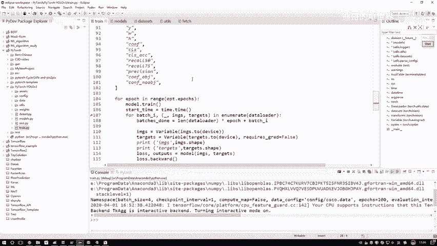
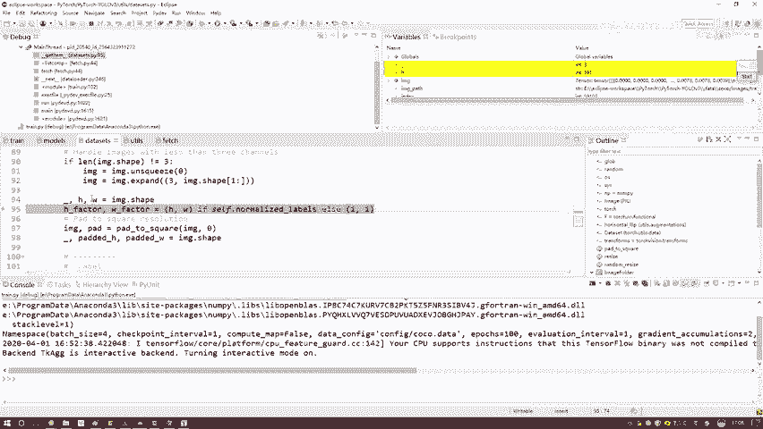

# 课程P71：3-数据与标签读取 📂➡️🔢

在本节课中，我们将要学习在深度学习项目中，如何高效地读取大规模数据集和对应的标签。我们将重点理解“生成器”的概念，并了解数据读取、预处理以及与标签匹配的完整流程。

---

上一节我们介绍了项目的基本结构，本节中我们来看看数据是如何被读取和处理的。

我们通常的想法可能是先将所有数据读入内存，再传入模型。其实不是这样的。这里引入一个核心概念：**生成器**。

生成器是这样工作的：假设我们有一个模型，它需要输入数据。但数据量很大（例如COCO数据集有18G），无法一次性全部加载到内存或显存中。生成器就像一个供应商，它不会一次性购入所有原材料（数据）。当模型在训练中提出需求（例如，一次需要64个数据），生成器就实时读取64个数据，打包好传给模型。下一次迭代时，再读取下一个64个数据。



因此，数据不是在训练开始前读取的，而是在训练过程中实时读取的。我们来看一下代码中的关键部分：

```python
for epoch in range(num_epochs):
    for batch_i, (images, targets) in enumerate(dataloader):
        # 训练步骤...
```

在 `dataloader` 中，数据是在训练循环中被实时读入的。所以，我们的构建顺序通常是：先构建模型和配置优化器，数据读取则在训练时进行。

为了让大家更清晰地理解代码逻辑，我们先讲解数据是如何读取的。

---

在 `dataset` 类中，核心函数是 `__getitem__`。这个函数负责读取单张图像及其对应的标签。

在调试过程中，我们可以看到生成器是如何一张一张图像读取的。当模型需要一个包含64个数据的批次时，生成器会依次读取第1个、第2个数据，直到读满64个。

以下是读取和处理单条数据的关键步骤：



1.  **读取图像路径**：首先，从存储了路径的TXT文件中，读取某一张训练图像的路径。
    *   提示：建议使用**绝对路径**来指定数据位置，这可以避免80%因路径配置错误导致的问题（如空值报错）。

2.  **加载并转换图像**：使用图像处理包打开该路径的图像。无论原始格式是PNG还是JPG，都必须统一转换为**RGB**格式，并进一步转换为PyTorch所需的 **`tensor`** 格式。

3.  **图像预处理（填充）**：原始图像的尺寸可能各不相同（例如391x640的长方形）。但模型输入通常需要固定尺寸的正方形。因此，我们需要对图像进行**填充**操作。
    *   例如，一个391x640的图像，经过填充后，会变成一个640x640的正方形图像。缺失的部分用特定值（如0）填充。

4.  **读取标签**：根据标签文件的路径，读取对应的标签数据。标签的格式（如相对坐标或绝对坐标）取决于具体数据集的规定，需要参照数据集的官方说明。
    *   **关键点**：必须确保图像和标签是**一一对应**的。常见错误是数据和标签不匹配，导致训练结果无效。编写代码后，务必通过调试验证图像和标签的对应关系。

---

本节课中我们一起学习了深度学习中的数据读取机制。我们明白了使用**生成器**可以高效处理大规模数据，避免了内存不足的问题。我们还了解了数据读取的完整流程：从路径读取、图像加载与格式转换、尺寸标准化（填充），到标签的读取与匹配。记住，确保**数据与标签正确对应**是成功训练模型的重要前提。