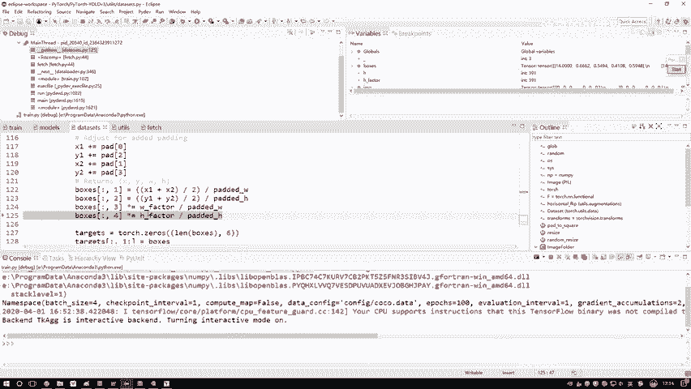
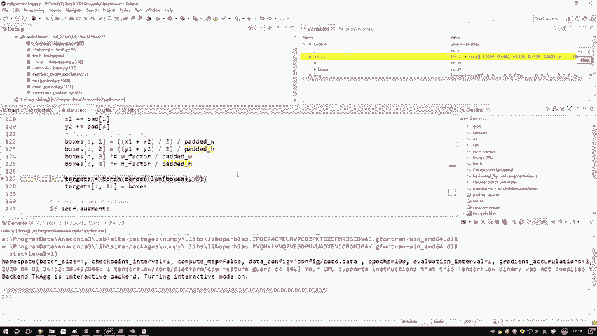
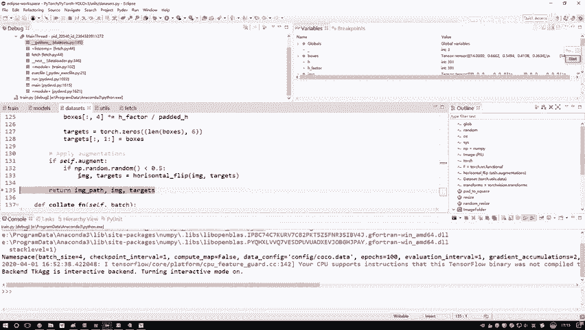
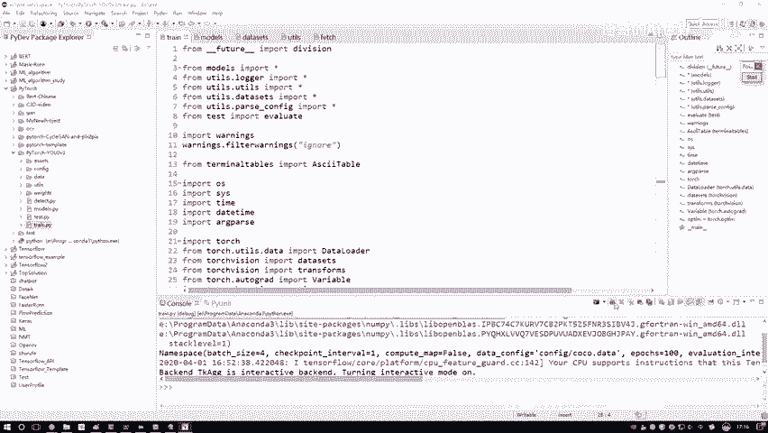

# 课程P72：标签文件读取与处理 📄➡️🔢

在本节课中，我们将学习如何从标签文件中读取目标检测任务所需的边界框数据，并将其转换为模型训练所需的格式。整个过程包括读取原始数据、进行坐标转换以及处理数据增强等步骤。

## 数据读取与格式转换

上一节我们介绍了图像数据的加载与预处理，本节中我们来看看如何读取和处理对应的标签文件。

标签文件通常以 `.txt` 格式存储。我们首先使用 `numpy.loadtxt` 函数将其读入内存。然而，在深度学习框架中，我们通常需要将数据转换为张量格式。

```python
import numpy as np
import torch

# 读取标签文件
boxes = np.loadtxt('label.txt')
# 将NumPy数组转换为PyTorch张量
boxes_tensor = torch.from_numpy(boxes)
```

转换完成后，我们得到一个张量。其中，每一行代表一个边界框。第一个值（例如14）表示该框所属物体在数据集类别（如COCO数据集的80个类别）中的ID编号。后续的四个值则代表该边界框的相对坐标 `[x, y, w, h]`。

## 坐标变换：从原始图像到填充后图像

我们之前对图像数据进行了填充（padding），使其变为正方形。因此，标签中的坐标也必须进行相应的调整，以匹配填充后的图像。

以下是坐标变换的步骤：

1.  **还原实际坐标**：首先，将标签中的相对坐标乘以图像原始的高度（H）和宽度（W），得到在原始图像上的实际像素坐标 `(x1, y1, x2, y2)`。
2.  **应用填充偏移**：根据之前计算出的填充方式（上下填充或左右填充），将对应的偏移量加到坐标上。这样，我们就得到了在填充后正方形图像上的坐标。

经过上述步骤，我们得到了填充后图像上的边界框坐标 `(x1, y1, x2, y2)`。

## 坐标格式转换：从角点式到中心式

在目标检测模型中，我们通常预测边界框的中心点坐标和宽高，而不是两个角点的坐标。因此，我们需要进行第二次坐标转换。

将角点坐标 `(x1, y1, x2, y2)` 转换为相对的中心点坐标 `(cx, cy)` 和相对宽高 `(w, h)` 的公式如下：



```python
# 假设 img_size 是填充后正方形的边长
cx = (x1 + x2) / 2 / img_size
cy = (y1 + y2) / 2 / img_size
w = (x2 - x1) / img_size
h = (y2 - y1) / img_size
```



请注意，这里除以 `img_size` 是为了将坐标值归一化到 `[0, 1]` 区间，得到相对于整个图像尺寸的相对值。这是模型训练所期望的格式。

最终，我们的 `targets` 张量中存储了每个边界框的类别ID以及转换后的相对坐标 `(cx, cy, w, h)`。

## 可选步骤：数据增强



在训练过程中，我们有时会对图像进行数据增强，例如水平翻转、随机裁剪等，以提高模型的泛化能力。

以下是进行数据增强时需要注意的事项：

*   **同步变换**：对图像进行任何几何变换时，必须同步地对标签中的边界框坐标进行完全相同的变换。
*   **可选性**：对于数据量已经足够大的任务，数据增强可能带来的提升有限，可以根据实际情况选择是否使用。

如果决定实施数据增强，需要在数据加载的循环中，对每一张图像及其对应的标签同步应用选定的增强操作。

## 数据加载循环

在训练时，数据加载器会循环遍历数据集。每次迭代，它都会执行上述所有步骤，为一批（batch）数据生成对应的图像张量 `imgs` 和标签张量 `targets`。

这个过程确保了模型在训练时接收到的每一对图像和标签都是正确对齐且格式统一的。

---



本节课中我们一起学习了目标检测任务中标签文件的完整处理流程。我们从读取原始的 `.txt` 文件开始，经历了转换为张量、根据图像填充调整坐标、将坐标格式从角点式转换为模型所需的中心式，并简要探讨了数据增强的注意事项。理解这个过程对于构建和调试目标检测模型的数据管道至关重要。