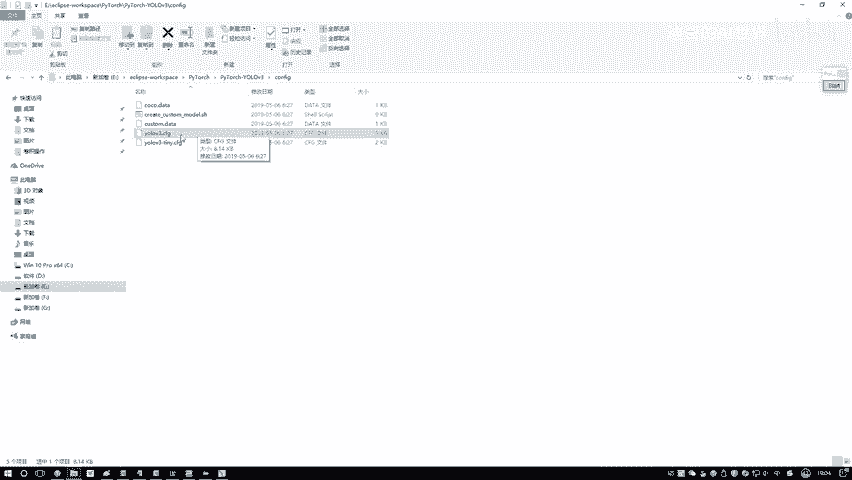
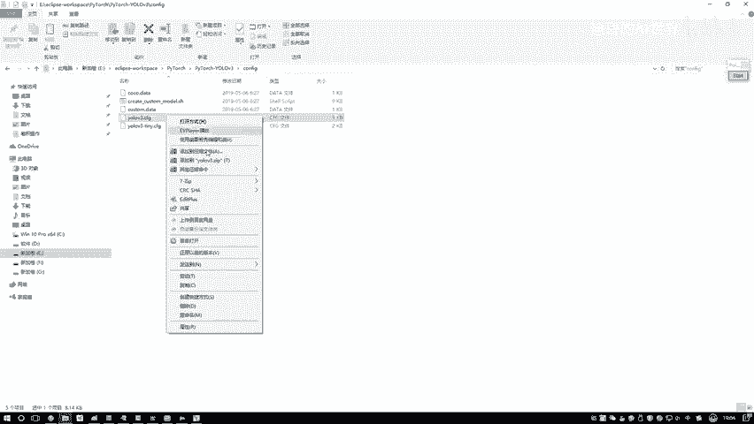
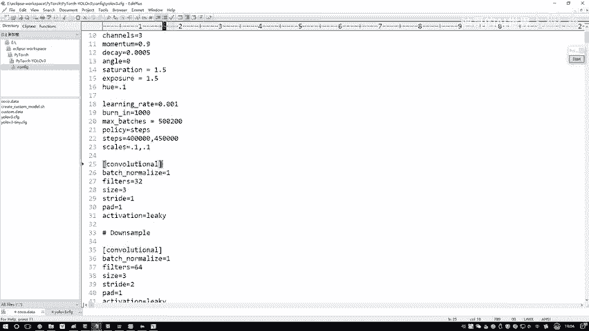
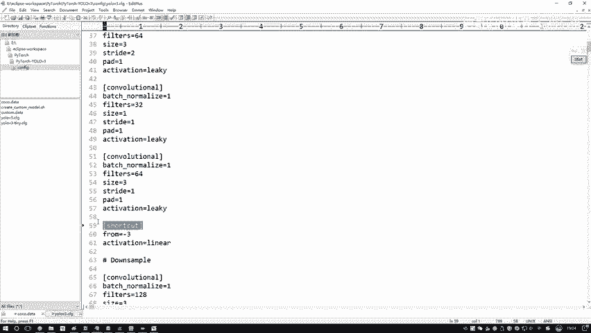
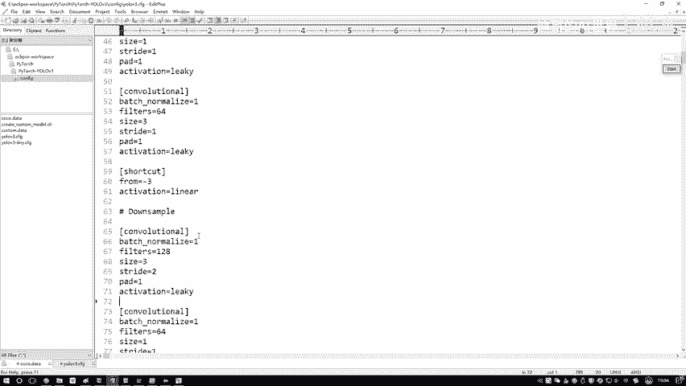
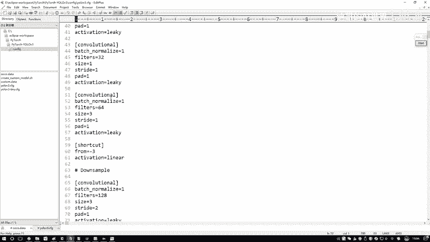
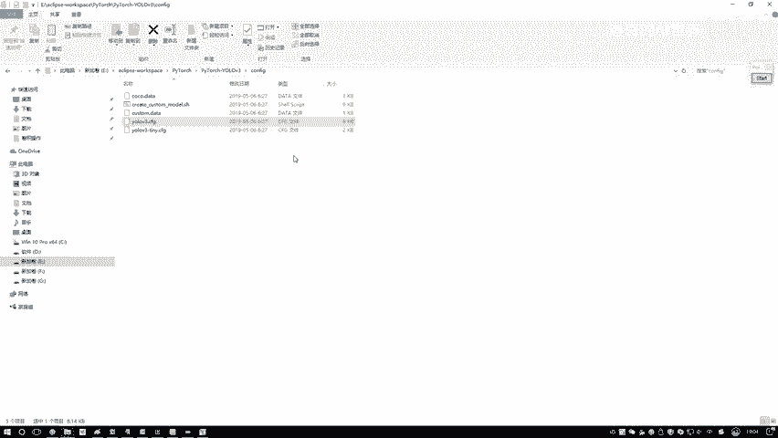

# 课程 P73：YOLOv3模型架构与计算流程详解 🧠

在本节课中，我们将学习YOLOv3模型的核心架构及其前向传播的计算流程。我们将深入代码，了解如何根据配置文件构建网络，以及数据是如何在网络中流动并最终产生预测结果的。

---

## 模型架构与计算流程概述

说完了数据之后，接下来就是模型整体的架构。在这里会说明YOLOv3模型该如何进行构造，以及在前向传播过程中实际是怎么计算的。这相当于要讲两部分内容。

第一部分是模型，或者说Darknet-53网络，它是怎样组成的。第二部分是实际数据输入后，从前到后一步一步是怎么计算的。因此，讲解模型要讲两部分：一个是它的架构，一个是它的计算方法。

所有核心的代码都在一个名为 `models.py` 的文件中。接下来会进入代码进行讲解。首先，需要了解在PyTorch框架中，我们的结构该怎么去写。

## PyTorch网络结构编写逻辑



这里定义了一个名为 `Darknet` 的类，它其实就是论文中的Darknet-53。因为我们的框架是用PyTorch去做的，所以在这里需要写两块逻辑。



第一块逻辑是构造函数。在这个构造函数中，需要指定好接下来这个网络模型都用到了哪些模块。



在我们的配置文件中，有一个 `yolov3.cfg` 文件。它就是我们整体要使用哪些结构的全部定义，包括一些参数和网络层的名字。

以下是配置文件的示例内容：



```
[net]
# 超参数



[convolutional]
# 第一个卷积层



[convolutional]
# 第二个卷积层

[shortcut]
# 残差连接层



[yolo]
# YOLO输出层
```

配置文件是按顺序写的，先有第一个层是什么层，然后第二层是什么层。每一个层它做了什么事，这里全有。因此，在代码中，我们要做的第一步就是把这个配置文件读进来。

读进来之后，按照配置文件当中写的顺序，逐层把我们的结构定义好。把结构定义好，就是说现在要定义一个卷积层，那卷积里边有些参数需要设置，比如Batch Normalization层可能有些参数，还有一些YOLO层。每一层都有参数，我们需要从上到下指定好都有哪些层，以及这些层之间的参数。这是我们要做的第一件事，即在构造函数中把需要的东西先都指定好。

## 前向传播计算过程

下一个部分就是 `forward` 函数。这个函数的作用是：刚才你已经定义了第一层、第二层、第三层、第四层分别是什么。接下来，就要实际去走一遍计算流程。

实际计算流程是这样的：真正来数据的时候，输入 `x` 要进来走一步。比如这是一个卷积层，好，马上就走。然后，如果它是一个 `shortcut` 层（即残差连接层），我们就做一个残差连接。接下来再往下走，可能又是一些卷积层，然后可能还有一个比较复杂的YOLO层。YOLO层相当于要得到最终的一个输出结果以及损失值计算。

因此，在 `forward` 函数中，我们会说明一个输入 `x` 来了之后，怎么样一步步去走，最终是如何得出预测结果的。大家自己写网络结构时，逻辑也是一样的。只要使用PyTorch框架或其他框架，其实也大同小异。

第一步都需要去写构造函数，来写一写里边用到什么东西。然后接下来就是一个 `forward` 函数。`forward` 函数中的代码虽然看起来不多，但大部分核心内容都在这里，我们要讲怎么样去实际做计算。这一步都是需要大家自己去写的，这些是比较核心的东西。

接下来，我们会进入到Debug模式中，为大家逐一讲解。

---

## 总结

本节课中，我们一起学习了YOLOv3模型的两大核心部分：**架构定义**与**前向传播计算**。

1.  **架构定义**：我们了解了如何通过读取 `yolov3.cfg` 配置文件，在PyTorch的类构造函数中按顺序定义网络所需的各个层（如卷积层、残差连接层、YOLO层）及其参数。
2.  **前向传播**：我们明确了在 `forward` 函数中，输入数据 `x` 是如何按照定义好的层顺序，一步步进行计算，并最终通过YOLO层得到预测框和类别信息的。

理解这两部分是将理论模型转化为可运行代码的关键。在接下来的课程中，我们将进入代码的Debug模式，详细查看每一部分的实现细节。