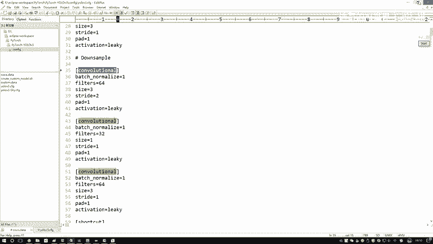
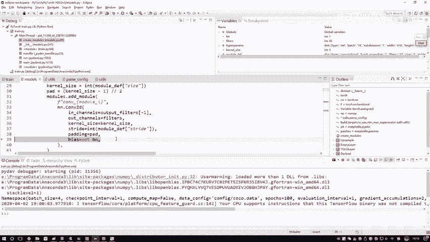
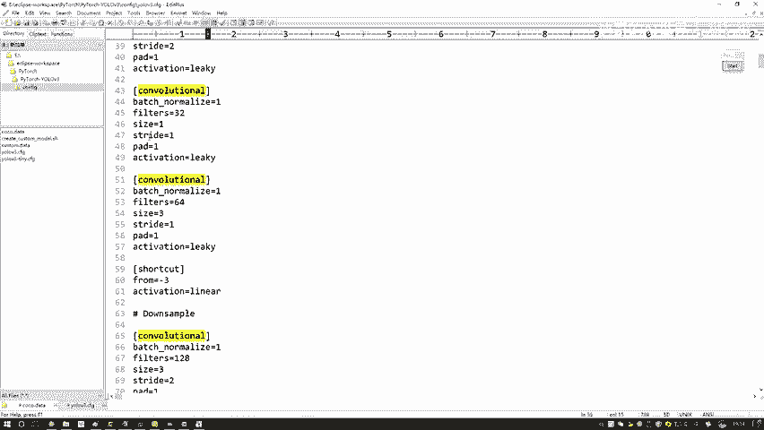

# 课程P74：基于配置文件构建网络模型 🧠

在本节课中，我们将学习如何根据一个配置文件来构建一个复杂的神经网络模型。我们将深入代码，一步步解析模型是如何从配置文件中读取信息，并组装成最终的神经网络结构的。

---

## 概述

我们将通过分析一段代码，了解如何从一个YOLOv3的配置文件（`.cfg`）中读取网络结构定义和超参数，并据此动态地构建出对应的神经网络模型。这个过程涉及读取文件、解析模块、创建层（如卷积、批归一化、激活函数）并按顺序组合它们。

---

## 第一步：读取配置文件

首先，我们需要从指定的路径读取配置文件。配置文件包含了网络的所有结构信息和训练所需的超参数。

以下是读取配置文件的核心代码：

```python
# 假设配置文件路径为 'yolov3.cfg'
with open('yolov3.cfg', 'r') as f:
    lines = f.read().split('\n')
```

读取后，`lines` 变量包含了配置文件的所有行。配置文件通常分为两部分：顶部的超参数部分和下面的网络结构定义部分。

---

## 第二步：解析网络结构



上一节我们介绍了如何读取配置文件，本节中我们来看看如何解析其中的网络结构定义。

网络结构由多个“模块”按顺序组成。每个模块在配置文件中以一个 `[type]` 开头（例如 `[convolutional]`），后面跟着该模块的参数（如 `filters=32`， `size=3`）。

以下是解析过程的关键步骤：


1.  初始化一个空的模块列表 `module_list`，用于按顺序存放构建好的网络层。
2.  遍历配置文件的每一行。
3.  当遇到以 `[` 开头的行时，表示一个新的模块开始了。
4.  根据模块类型（如 `convolutional`， `upsample`），读取其后的参数行，并创建对应的PyTorch层。
5.  将创建好的层添加到 `module_list` 中。

---

## 第三步：构建“三合一”卷积模块

在YOLOv3的配置中，一个 `[convolutional]` 模块实际上代表了一个“三合一”的组合：**卷积层 (Conv2D) + 批归一化层 (BatchNorm) + 激活函数层 (LeakyReLU)**。



以下是构建这个组合模块的代码逻辑：

```python
if module_type == '[convolutional]':
    # 1. 解析参数，例如 filters, size, stride, pad
    filters = int(module_def['filters'])
    size = int(module_def['size'])
    stride = int(module_def['stride'])
    pad = int(module_def['pad'])

    # 2. 创建卷积层
    # 注意：如果后面接了BatchNorm，则卷积层通常不设置偏置 (bias=False)
    conv = nn.Conv2d(in_channels=prev_filters,
                     out_channels=filters,
                     kernel_size=size,
                     stride=stride,
                     padding=pad,
                     bias=False)

    # 3. 创建批归一化层
    bn = nn.BatchNorm2d(filters)

    # 4. 创建激活函数层 (LeakyReLU)
    # 参数0.1表示负半轴的斜率
    activation = nn.LeakyReLU(0.1)

    # 5. 将这三个层按顺序组合成一个序列（一个模块）
    module = nn.Sequential(conv, bn, activation)

    # 6. 将这个“三合一”模块添加到总的 module_list 中
    module_list.append(module)

    # 7. 更新 prev_filters，作为下一层的输入通道数
    prev_filters = filters
```

通过这种方式，配置文件中的一个 `[convolutional]` 行就被转换成了一个功能完整的神经网络模块。

---

## 第四步：处理其他类型的层

除了最常见的卷积模块，配置文件中还定义了其他类型的层，例如上采样层 (`[upsample]`) 和快捷连接（用于构建残差块）。

以下是处理上采样层的示例：

```python
elif module_type == '[upsample]':
    # 解析上采样因子
    stride = int(module_def['stride'])
    # 创建一个上采样层。在构造函数中可能只做记录，实际操作在前向传播中定义。
    # 例如使用 nn.Upsample 或 F.interpolate
    module = nn.Upsample(scale_factor=stride, mode='nearest')
    module_list.append(module)
```

对于快捷连接 (`[shortcut]`) 或路由层 (`[route]`)，它们不直接创建新的参数层，而是在前向传播过程中定义张量的运算逻辑（如相加或拼接）。在模型构建阶段，它们通常被添加为一个自定义的、空的占位层，其具体逻辑在模型的 `forward` 函数中实现。



---

## 总结

本节课中我们一起学习了基于配置文件构建神经网络模型的完整流程：

1.  **读取与解析**：从 `.cfg` 文件中读取所有行，并区分超参数与网络结构定义。
2.  **模块化构建**：遍历结构定义，根据每个模块的类型（如 `[convolutional]`）解析其参数。
3.  **组合层**：重点掌握了如何将卷积、批归一化和激活函数组合成一个高效的“三合一”模块。
4.  **组装模型**：将所有创建好的模块按顺序添加到一个 `nn.ModuleList` 中，形成完整的模型骨架。

这种方法极大地提高了模型的灵活性和可配置性，只需修改文本配置文件即可改变网络结构，无需重写大量代码。理解这一过程对于阅读和修改现代目标检测框架（如YOLO系列）的源码至关重要。