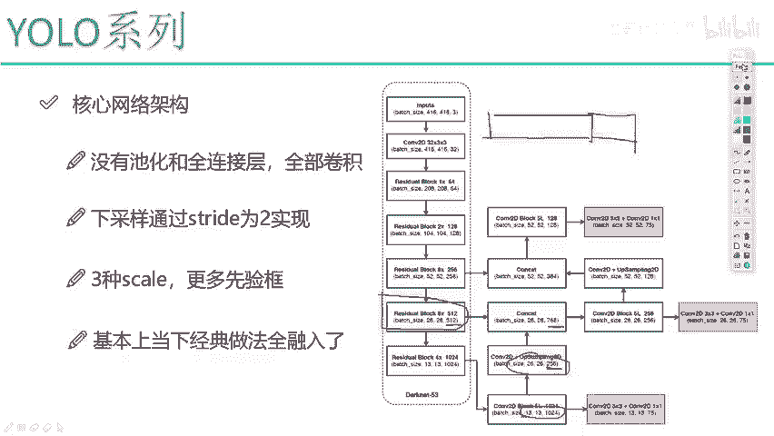
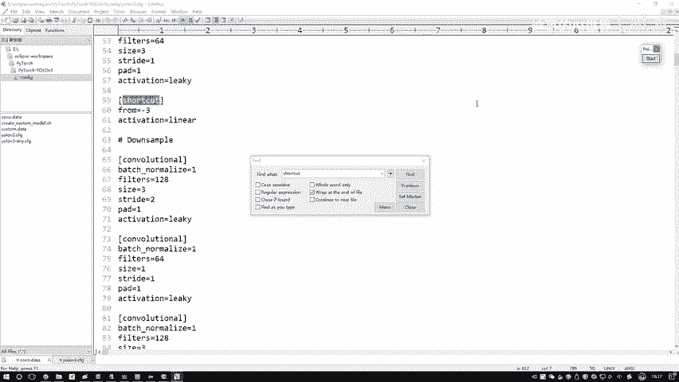
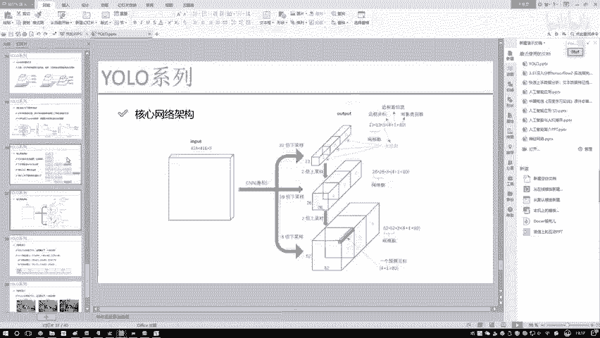
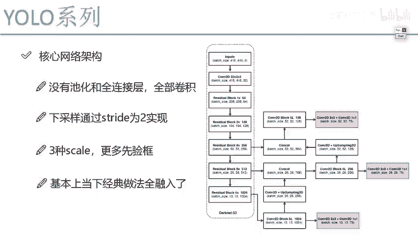
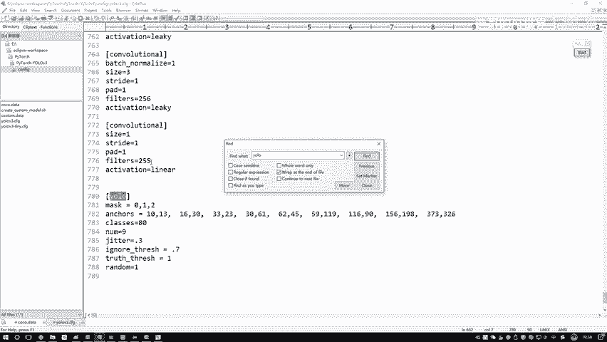
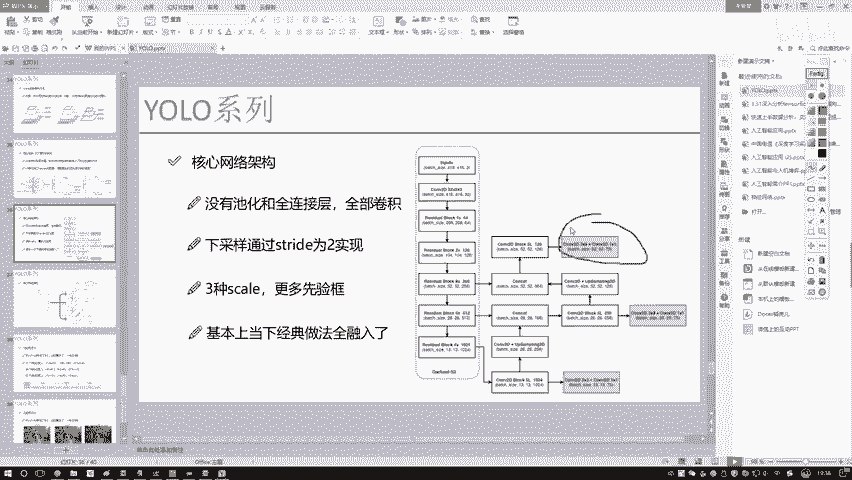
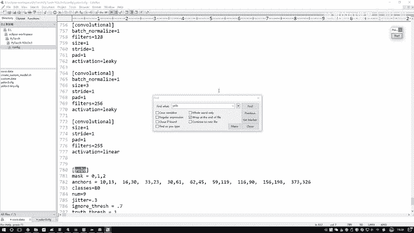

# 课程P75：7-路由层与shortcut层的作用 🧭

在本节课中，我们将学习YOLO网络结构中的两个关键层：**路由层**和**shortcut层**。我们将详细解释它们各自的功能、区别以及在配置文件中的表示方式，帮助你清晰理解这两个容易混淆的概念。

## 路由层的作用

上一节我们介绍了卷积层等基础结构，本节中我们来看看**路由层**。路由层在YOLO网络中的核心作用是进行**特征图的拼接**操作。

具体来说，当网络进行到某一层（例如一个上采样层）时，路由层会将当前层的输出特征图与网络中**更早某一层**的特征图在通道维度上进行拼接。



例如，假设我们有一个上采样后的特征图，尺寸为 `26×26×256`。同时，网络中更早存在一个尺寸为 `26×26×512` 的特征图。路由层会将这两个特征图拼接起来，最终得到一个尺寸为 `26×26×768` 的新特征图。其操作可以表示为：

**公式：** `output = Concat([feature_map_A, feature_map_B], dim=channel)`


在配置文件中，路由层通过 `layers` 参数来指定与前面哪一层进行拼接。

以下是路由层在配置文件中的一个示例：
```
[route]
layers = -4
```
这里的 `layers = -4` 表示当前层需要与前面倒数第4层的输出进行拼接操作。

## Shortcut层的作用

了解了进行拼接的路由层后，我们再来看看 **shortcut层**。Shortcut层是实现**残差连接**的关键，它的核心操作是**加法**，而非拼接。

Shortcut层会将当前层的输出与网络中某一更早层的输出进行**逐元素相加**。这个操作不会改变特征图的尺寸（高度、宽度和通道数），它只是将两部分的特征信息在数值上融合。

例如，一个 `13×13×128` 的特征图经过一个残差块后，输出仍然是 `13×13×128`。Shortcut连接会将这个输出与该残差块的输入（另一个 `13×13×128` 的特征图）直接相加。其操作可以表示为：

**公式：** `output = feature_map_A + feature_map_B`






在配置文件中，shortcut层通过 `from` 参数来指定与前面哪一层进行相加。

以下是shortcut层在配置文件中的一个示例：
```
[shortcut]
from=-3
activation=linear
```
这里的 `from = -3` 表示当前层的输出要与前面倒数第3层的输出进行相加操作。



## 核心区别总结

为了更清晰地对比，以下是路由层与shortcut层的核心区别：

*   **操作不同**：路由层进行**拼接**，会**增加**特征图的通道数；shortcut层进行**加法**，**保持**特征图尺寸不变。
*   **目的不同**：路由层旨在融合不同尺度或阶段的特征，增加特征的丰富性；shortcut层旨在建立残差连接，缓解深层网络中的梯度消失问题，使网络更容易训练。
*   **输出维度**：路由层输出维度改变；shortcut层输出维度不变。




在代码的构造函数中，这两层通常只进行基本的定义和“占位”，具体的拼接或加法计算会在网络的前向传播过程中执行。



## 过渡至YOLO层



到目前为止，我们一起学习了卷积层、路由层和shortcut层。接下来，我们将进入YOLOv3网络中最核心、最复杂的部分——**YOLO层**。

YOLO层负责最终的目标检测输出。在网络中，通常会有三个YOLO层，分别对应大、中、小三种尺度的预测，用于检测不同大小的物体。


在YOLO层的构造函数中，需要完成多项重要工作，例如：
1.  指定该层对应的**先验框**的ID。
2.  获取这些先验框的实际**宽高尺寸**。
3.  定义网络输入的图像尺寸和目标的类别数量（例如COCO数据集的80类）。

这些准备工作是为后续前向传播中计算边界框坐标、置信度和类别概率奠定基础。


## 本节课总结

在本节课中，我们一起学习了YOLO网络中的两个重要层：
1.  **路由层**：执行**特征拼接**操作，用于融合来自网络不同深度的特征图，增加通道维度的信息量。
2.  **Shortcut层**：执行**特征加法**操作，是实现残差连接的核心，通过恒等映射帮助梯度流动，稳定深层网络的训练。

理解这两者的区别对于读懂YOLO网络结构图和配置文件至关重要。路由层扩展了特征的“宽度”，而shortcut层保障了网络训练的“深度”。下一节课，我们将深入剖析最复杂的YOLO层，完成整个网络结构的解读。