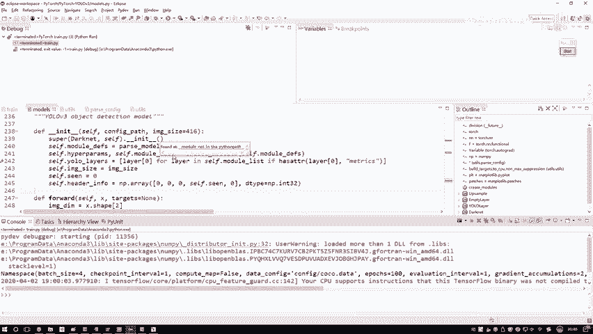
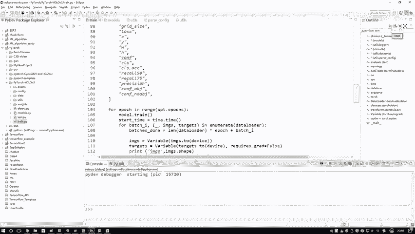
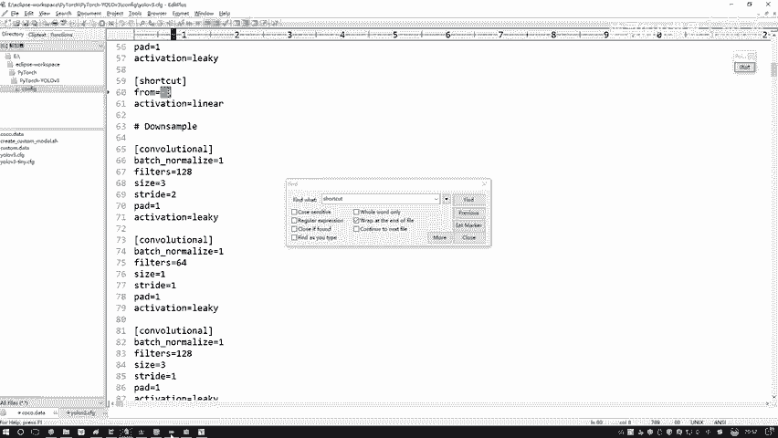
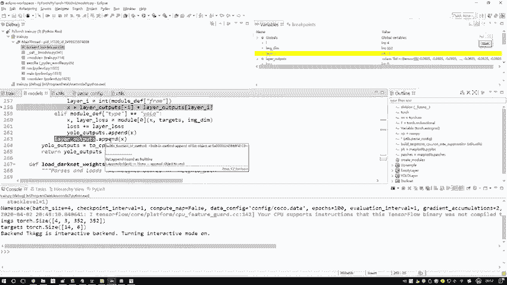
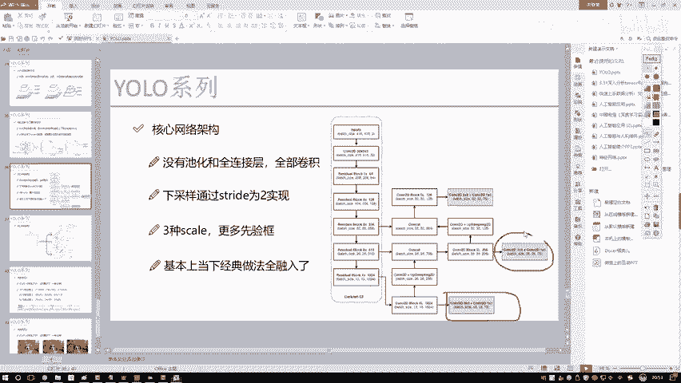

# 课程P76：YOLO层定义解析 🧩

在本节课中，我们将深入解析YOLO（You Only Look Once）目标检测模型中YOLO层的定义与构建过程。我们将从模型的构造函数开始，逐步深入到前向传播的核心逻辑，并重点关注YOLO层如何进行计算。通过本教程，你将理解YOLO模型在代码层面是如何组织并处理数据的。

---

## 模型构建与初始化 🏗️

上一节我们介绍了模型的基本结构，本节中我们来看看YOLO层的具体构建过程。模型构建的第一步是初始化，这通常在构造函数中完成。



在构造函数中，我们根据配置文件读取并定义模型所需的所有层及其参数。这个过程相对简单，主要是读取配置并设置好各个模块的基本属性。

以下是YOLO层在构造函数中定义的一些核心参数：
*   **先验框数量**：`num_anchors = 3`
*   **分类类别数**：`num_classes = 80`
*   **阈值**：一个用于后续处理的阈值参数。
*   **损失函数**：为后续计算损失函数预先定义好所需的组件。

```python
# 示例：YOLO层初始化参数示意
self.num_anchors = 3
self.num_classes = 80
self.threshold = 0.5
# 损失函数相关定义...
```

当前，我们只是完成了模型的基本定义，将配置文件中的结构转化为代码中的层（`ModuleList`）。特别是，我们会构建三个不同尺度的YOLO层，分别用于预测大、中、小目标。

---

## 前向传播流程 🔄



模型构建完成后，真正的计算发生在前向传播（`forward`）过程中。我们需要将输入数据依次通过每一层，并得到最终的输出。

首先，我们拿到输入数据 `x`。这个 `x` 是一个张量（Tensor），包含了经过预处理（如填充padding）的图像数据。我们的目标是将 `x` 通过网络定义的每一层。

以下是前向传播中针对不同类型层的处理逻辑：

**卷积层、上采样层等标准操作**
对于PyTorch中已实现的标准操作（如卷积`Conv2d`、上采样`Upsample`），处理非常简单。我们直接调用该层模块，输入数据 `x`，即可得到输出结果。
```python
x = module(x)  # module 可以是卷积、上采样等层
```

**Shortcut层（跳跃连接）**
Shortcut层实现了类似ResNet中的跳跃连接，其核心操作是加法。它会将当前层的输出与前面某一指定层的输出相加。
```python
# layer_i 指定了与前面第几层进行相加
x = x + layer_outputs[-layer_i]
```
这里的 `layer_outputs` 列表保存了之前每一层的输出结果，方便进行这种跨层连接。

**Route层（路由层）**
Route层的作用是进行张量拼接（Concatenation）。它可以将当前层的输出与之前一层或多层的输出在通道维度上进行拼接。
```python
# 将指定层的输出拼接在一起
x = torch.cat([layer_outputs[i] for i in route_layers], dim=1)
```
在我们的任务中，通常是将两个特征图拼接在一起。

---

## 深入YOLO层 ⚙️

在遍历所有层的过程中，最复杂且核心的部分是YOLO层的前向传播。YOLO层接收特征图，并输出最终的检测结果（边界框、置信度、类别概率）。



YOLO层的计算是代码最多的部分。它会将输入的特征图转换为最终我们需要的预测格式。三个YOLO层会依次执行，通常的顺序是：先预测大目标，然后将其特征图上采样，与中层特征拼接后预测中目标，最后再上采样并与浅层特征拼接预测小目标。

这个过程涉及到将网络输出的密集预测张量，根据先验框（anchors）解码成在原始图像坐标下的边界框，并应用阈值过滤等操作。其输出包含了目标检测所需的所有信息。



---

## 总结 📝



本节课中我们一起学习了YOLO模型层的定义与执行流程。

我们首先了解了模型如何在构造函数中根据配置文件初始化，定义了包括三个YOLO层在内的所有网络层。接着，我们深入探讨了前向传播的过程：数据如何依次通过卷积、Shortcut（加法）、Route（拼接）等标准层。最后，我们指出了整个流程中最关键的环节——YOLO层的前向计算，它将特征图转换为最终的检测预测结果。

理解这一从构建到执行的完整流程，是掌握YOLO模型代码实现的基础。在后续的课程中，我们将进一步剖析YOLO层内部具体的计算细节。