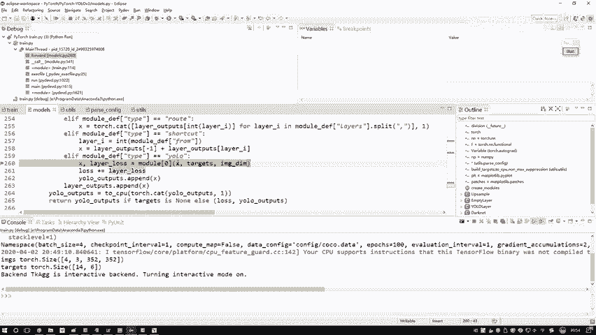
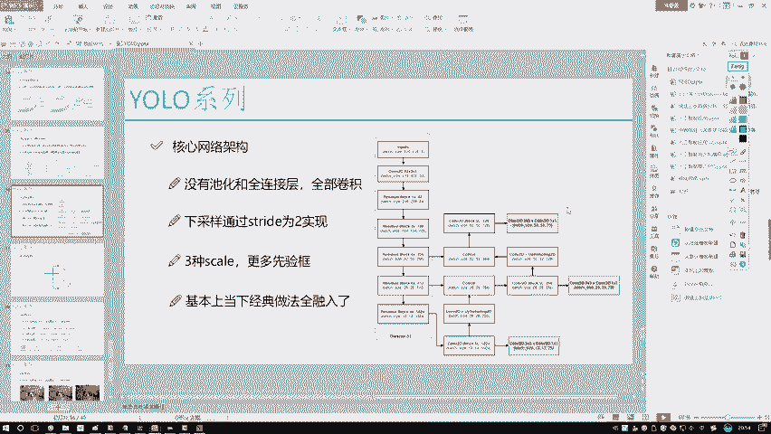
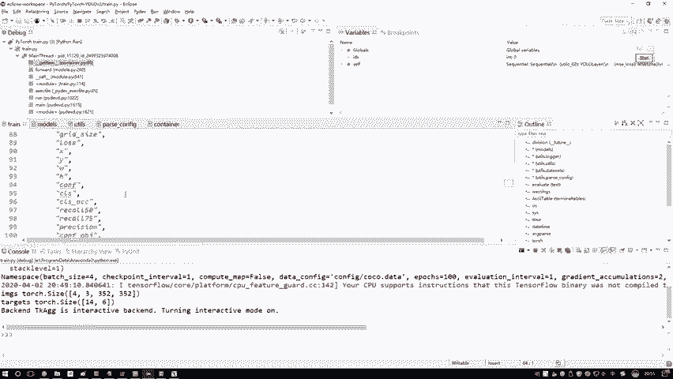
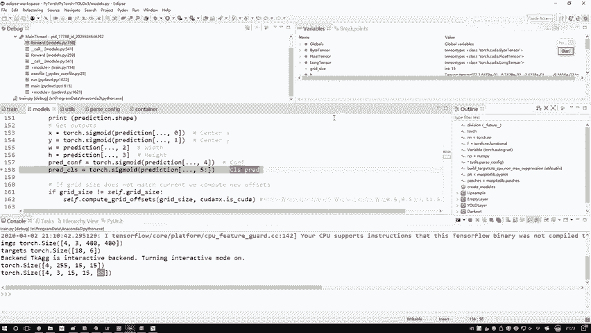
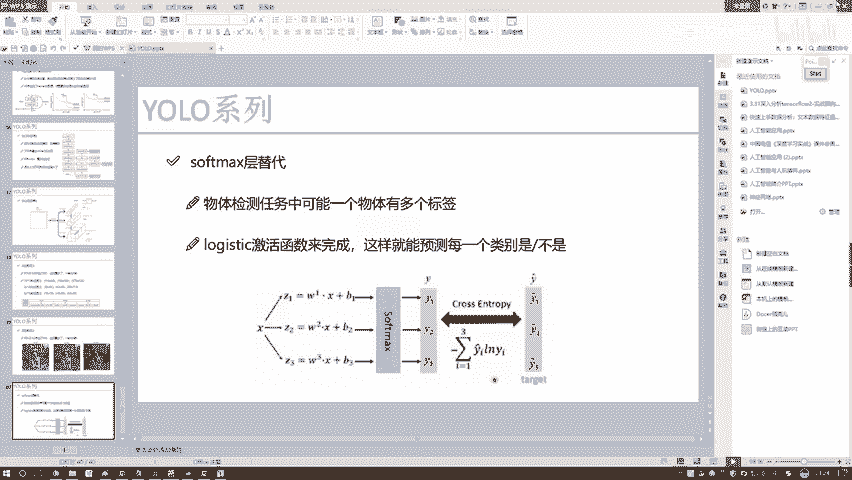
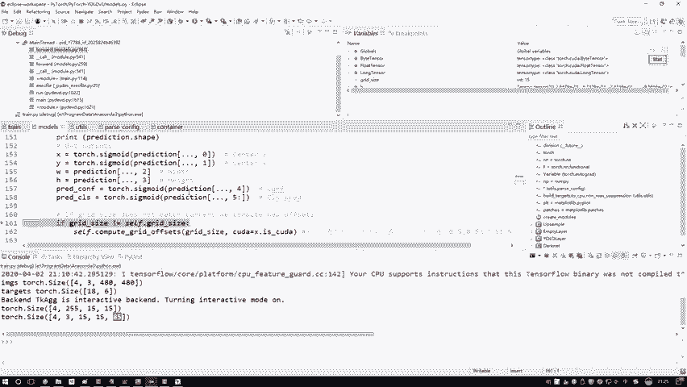

# 课程P77：9-预测结果计算 📊





在本节课中，我们将深入YOLO层的前向传播过程，学习如何将网络输出的特征图转换为具体的边界框预测。我们将重点关注数据的维度变换、预测值的分解以及核心计算步骤。

---

## 进入YOLO层



上一节我们介绍了模型的前向传播流程，本节中我们来看看核心的YOLO层内部是如何工作的。我们通过设置断点，跳入到YOLO层的前向传播函数中。

在YOLO层中，我们需要处理输入数据，进行坐标变换和损失计算等所有关键操作。

## 输入数据解析

以下是输入数据的构成：

*   **`x`**：这不是原始的输入图像数据，而是网络前一层输出的结果。在YOLO层中，`x` 被当作本层的输入。
*   **`targets`**：这是从数据中读取的标签信息，包含了边界框的类别以及坐标信息（如x, y, w, h）。
*   **`img_dim`**：这是输入图像的尺寸。

## 特征图形状分析

为了理解代码在做什么，一个有效的方法是打印并分析数据的形状（`shape`）。我们打印了输入 `x` 的形状：

```python
print(x.shape)
```

假设输出为 `torch.Size([4, 255, 15, 15])`，其含义如下：

*   **`4`**：批处理大小（`batch_size`），表示一次处理4张图像。为了调试演示，我们设置得较小，实际训练时应根据显存尽可能调大。
*   **`255`**：特征图的通道数。这个数字的由来稍后会解释，它代表了每个网格点预测的信息总量。
*   **`15, 15`**：特征图的高度和宽度，即网格的尺寸。在YOLOv3中，输入图像尺寸会随机变化（但需能被32整除），因此网格大小也会相应改变，例如可能是13x13或15x15。PyTorch采用 **通道优先（channel-first）** 的格式。

## 设备与环境设置

在训练时，代码需要兼容GPU和CPU环境。通过判断 `is_cuda` 标志，将张量（`tensor`）设置为对应的设备格式。PyTorch中使用 `.cuda()` 方法将张量移至GPU。

## 维度重塑与预测值分解

接下来是核心操作：将特征图转换为具体的预测值。我们通过 `view` 方法（类似于NumPy的 `reshape`）对数据进行维度变换。

```python
prediction = x.view(num_samples, num_anchors, num_classes + 5, grid_size, grid_size)
prediction = prediction.permute(0, 1, 3, 4, 2).contiguous()
```

变换后的形状为：`(4, 3, 15, 15, 85)`。
其含义解析如下：

*   **`4`**：`batch_size`，4张图片。
*   **`3`**：每个网格对应的先验框（`anchor`）数量。
*   **`15, 15`**：网格尺寸。
*   **`85`**：每个预测框需要预测的数值总数。其构成是：**4个坐标值（x, y, w, h） + 1个置信度（confidence） + 80个类别概率**。

现在，我们从这85个值中分解出各部分预测结果：

1.  **中心点坐标与宽高**：取前4个值，即 `(x, y, w, h)`，代表预测边界框的中心点坐标和尺寸。
2.  **置信度**：取第5个值，代表该框包含物体的可能性，范围应在0到1之间。
3.  **类别概率**：取后80个值，代表属于80个类别中每一个的概率。

## 类别预测的激活函数

对于80个类别概率的预测，YOLOv3使用了 **Sigmoid函数** 而非Softmax。



```python
# 伪代码示意
class_pred = torch.sigmoid(prediction[..., 5:])
```

**为什么使用Sigmoid？**
*   Sigmoid函数将任意输入映射到(0, 1)区间，可以独立地表示每个类别的存在概率。
*   这与YOLOv3的设计一致：**它对每个类别执行独立的二分类判断**，允许一个物体属于多个类别（多标签分类）。这是YOLOv3与早期版本（使用Softmax进行单标签多分类）的一个重要区别。

---





本节课中我们一起学习了YOLO层如何将特征图输出转换为具体的边界框预测。我们分析了输入数据的形状，理解了维度重塑操作的意义，并分解了预测值中的坐标、置信度和类别概率。关键点在于，YOLOv3通过Sigmoid函数为每个类别进行独立的二分类预测，这是其多标签识别能力的基础。