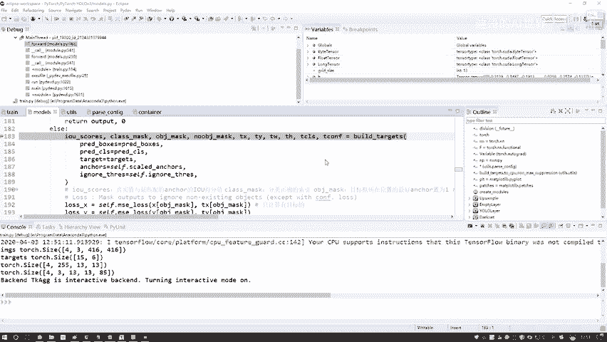
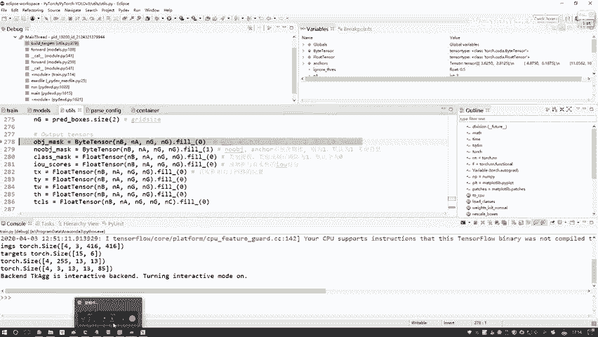
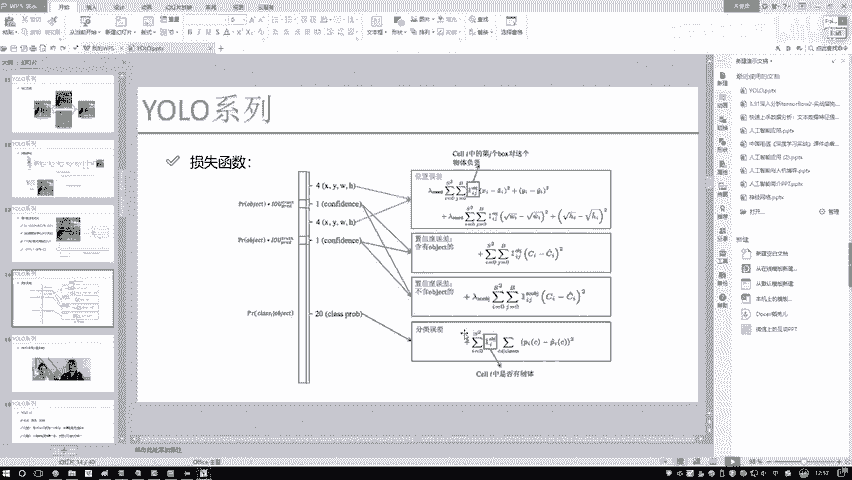

# 课程P78：11-模型要计算的损失概述 📊

在本节课中，我们将要学习如何计算YOLO模型训练过程中的损失值。我们已经了解了前向传播的整体流程，现在只剩下最后一步：根据模型的预测值和真实的标签值来计算损失。本节课将详细解释损失计算的组成部分，以及如何将标签数据转换为与预测值相匹配的格式，以便进行有效的损失计算。

## 损失计算概述

上一节我们介绍了模型的前向传播过程，本节中我们来看看如何计算损失值。要计算损失，我们需要模型的预测值和真实的标签值。然而，预测值和标签值的表示格式并不相同，因此在进行计算之前，必须先将标签值转换为与预测值相对应的“相对格式”。

## 标签格式转换的必要性

现在，我们手里有模型的预测结果，例如边界框的坐标（XYWH）和类别预测。同时，我们也有真实的标签数据（targets）。直接使用它们进行计算似乎可行，但存在一个问题：预测值中的坐标（如XY）是相对于其所在网格单元的“相对位置”，而标签中的坐标通常是相对于整张图像的“绝对位置”。两者的表示层面不同，无法直接比较。

因此，在计算损失之前，我们需要一个辅助函数来处理标签数据。这个函数的核心任务是将标签中所有用于损失计算的值（如位置、置信度、类别）全部转换为与预测值格式一致的“相对格式”。

## 预测值与标签的维度对齐

首先，我们需要理解预测值的张量形状。在预测时，我们得到一个形状为 `(batch_size, num_anchors, grid_size, grid_size, 5 + num_classes)` 的张量。以示例说明：
*   `batch_size = 4`：表示批次中有4个数据样本。
*   `num_anchors = 3`：表示每个网格单元有3种先验框（anchor）。
*   `grid_size = 13`：表示特征图被划分为13x13的网格（具体大小因YOLO层和输入图像尺寸而异）。
*   `5 + num_classes`：其中5代表边界框的4个坐标（x, y, w, h）和1个置信度（confidence），`num_classes=80`代表类别数量。

为了使标签能与预测值进行计算，我们必须将标签数据也处理成完全相同的格式：`(batch_size, num_anchors, grid_size, grid_size, ...)`。这是转换函数要完成的第一步工作。

## 损失函数的组成部分

在将标签格式对齐后，我们就可以计算损失了。YOLO的损失函数通常由几个关键部分组成。让我们回顾一下：

以下是损失函数的主要构成部分：

1.  **位置误差（Bounding Box Coordinate Loss）**：衡量预测边界框（XYWH）与真实边界框之间的差异。计算这个损失需要将标签中的XYWH坐标转换为与预测值相同的相对格式。

2.  **置信度误差（Confidence Loss）**：衡量模型预测的“框中包含物体的置信度”的准确性。它又细分为两部分：
    *   **包含物体的置信度误差**：针对那些确实有物体的网格单元，我们希望模型预测的置信度接近1。
    *   **不包含物体的置信度误差**：针对那些没有物体的网格单元，我们希望模型预测的置信度接近0。

    因此，在准备标签时，我们需要生成两种不同的“置信度标签”来匹配这两种计算：
    *   对于“包含物体”的损失，在真实物体中心的网格单元对应位置标为1，其余位置标为0。
    *   对于“不包含物体”的损失，其标签逻辑与前者相反（通常在代码中通过掩码实现），目的是让模型降低对背景区域的置信度预测。这一点在后续代码中会特别强调。

3.  **分类误差（Classification Loss）**：衡量预测的物体类别是否正确。这是一个标准的多类别分类问题。在标签中，对于有物体的位置，其对应的真实类别索引处标为1（one-hot编码），其他类别标为0。

分类误差的处理相对简单直接。

## 总结

本节课中我们一起学习了YOLO模型损失计算前的准备工作。核心在于理解预测值与真实标签在格式上的差异，并需要通过一个转换函数将标签数据（包括位置、两种置信度和类别信息）全部处理成与模型预测输出维度完全一致的“相对格式”。只有这样，后续才能正确计算位置误差、置信度误差（含物体与不含物体）以及分类误差这三部分损失，从而有效地训练模型。下一节，我们将深入代码，具体查看这个转换过程是如何实现的。