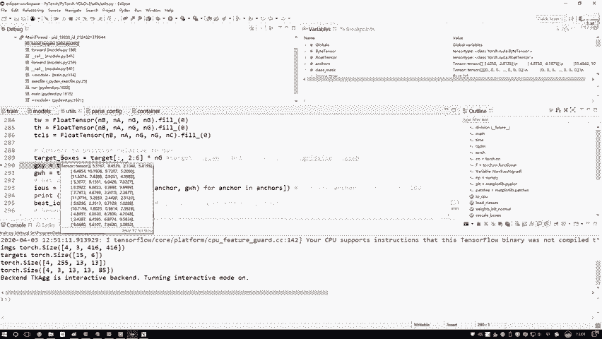
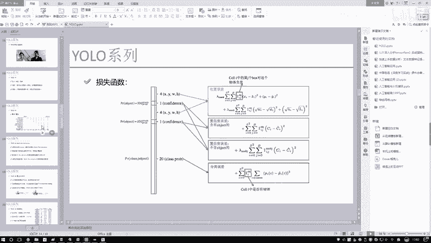
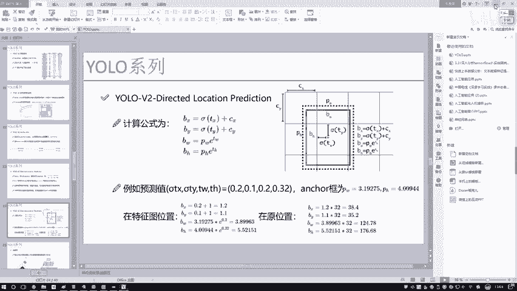
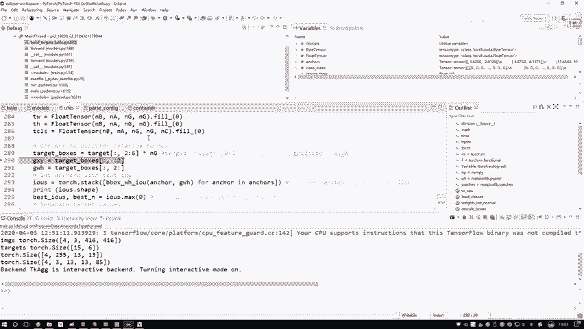
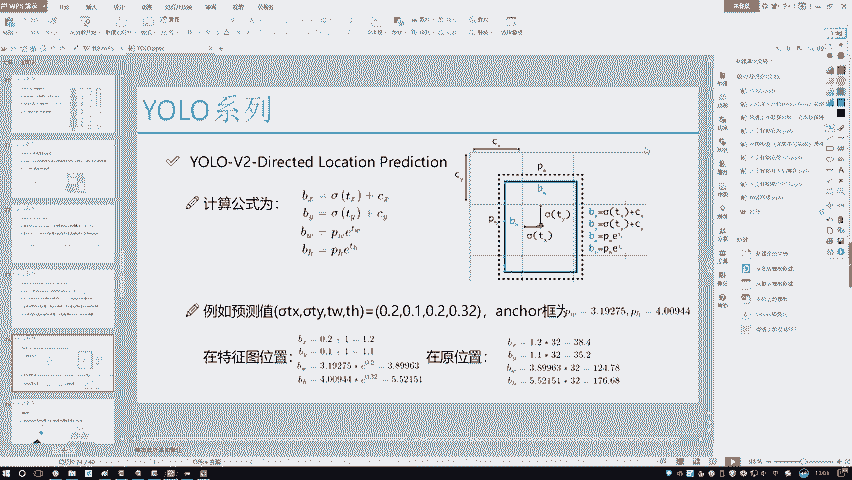
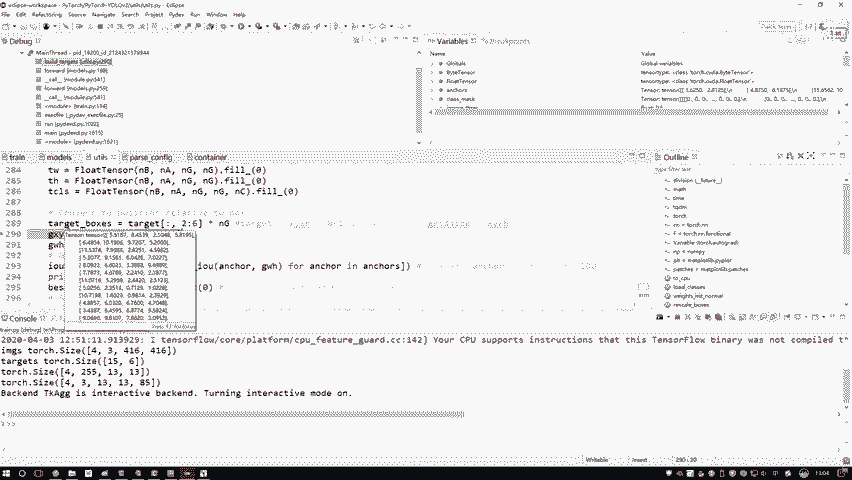
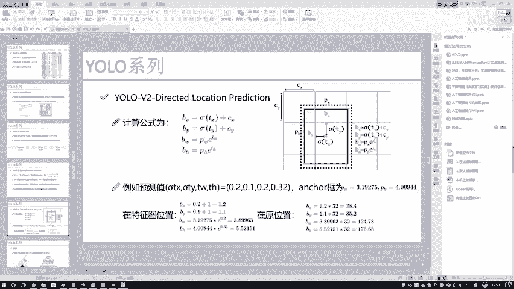
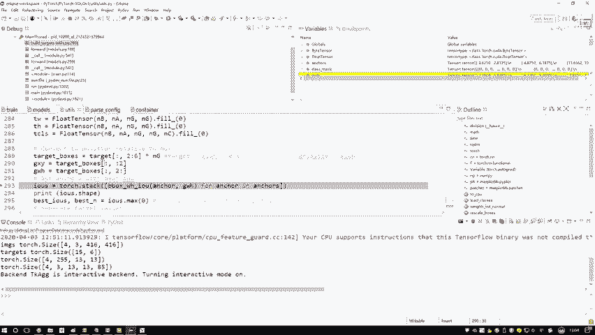

# 课程P79：12-标签值格式修改 📝

在本节课中，我们将学习如何将原始的标签数据转换为与YOLO模型预测值格式相匹配的格式。这一过程是构建损失函数、训练模型的关键步骤。我们将详细讲解转换的逻辑和具体实现。

---

## 概述

原始标签数据中的边界框坐标是相对于整个原始图像的归一化值（0到1之间）。然而，模型的预测值是基于特征图网格的相对位置。因此，我们需要将标签数据转换为与预测值一致的格式，以便计算损失。本节将分步讲解这一转换过程。

---

## 标签初始化

首先，我们需要初始化一个与预测输出维度匹配的标签张量。这个张量将用于存储转换后的标签信息。

以下是初始化过程中涉及的几个核心部分：

*   **物体存在掩码（obj_mask）**：用于标记哪些网格位置存在物体。初始化时全部填充为0，表示初始状态下认为所有位置都没有物体。后续会根据真实标签，将存在物体的位置标记为1。
    *   公式：`obj_mask = zeros([batch_size, grid_size, grid_size, num_anchors])`
*   **无物体掩码（noobj_mask）**：与`obj_mask`相反，用于标记哪些网格位置没有物体。初始化时全部填充为1，表示初始状态下认为所有位置都没有物体。后续会将存在物体的位置标记为0。
    *   公式：`noobj_mask = ones([batch_size, grid_size, grid_size, num_anchors])`
*   **分类标签（class_mask）**：用于标记物体所属的类别。初始化时全部填充为0。后续会根据真实标签，在正确的类别索引位置标记为1。
    *   公式：`class_mask = zeros([batch_size, grid_size, grid_size, num_anchors, num_classes])`
*   **IoU分数（iou_score）**：用于存储预测框与真实框的交并比（IoU）值。初始化时填充为0，后续进行计算和填充。
*   **边界框偏移量（tx, ty, tw, th）**：用于存储真实框相对于其所属网格的偏移量。初始化时全部填充为0，后续进行计算和赋值。
    *   代码：`tx = ty = tw = th = zeros_like(obj_mask)`

通过以上初始化，我们创建了一个结构化的容器，接下来就是将原始标签中的真实值填充到这个容器的对应位置。



---



## 坐标格式转换

上一节我们介绍了标签张量的初始化，本节中我们来看看如何将原始标签坐标转换为模型所需的格式。原始标签坐标是归一化的图像坐标，而模型预测的是基于特征图网格的坐标。



转换过程分为两步：

1.  **转换为特征图绝对坐标**：将归一化坐标乘以特征图的尺寸（例如13），得到边界框在特征图上的绝对坐标位置。
    *   公式：`target_boxes_abs = target_boxes_normalized * grid_size`
2.  **转换为网格相对坐标**：获取边界框中心点所在的网格索引（`gx`, `gy`），并计算中心点相对于该网格左上角的偏移量（`tx`, `ty`）。同时，计算边界框的宽高相对于先验框（anchor）的缩放比例（`tw`, `th`）。
    *   代码示例（获取网格索引）：
        ```python
        gx = target_boxes_abs[..., 0].long()  # 中心点x坐标的整数部分
        gy = target_boxes_abs[..., 1].long()  # 中心点y坐标的整数部分
        ```
    *   代码示例（计算相对偏移）：
        ```python
        tx = target_boxes_abs[..., 0] - gx.float()  # 中心点在网格内的x偏移（0~1）
        ty = target_boxes_abs[..., 1] - gy.float()  # 中心点在网格内的y偏移（0~1）
        ```

经过这两步转换，我们得到的`tx`, `ty`, `tw`, `th`就与模型预测值的格式完全一致，可以用于后续的损失计算。



---



## 总结



本节课中我们一起学习了YOLO标签格式转换的核心步骤。



我们首先初始化了一个结构化的标签张量，用于存放物体掩码、类别标签和边界框偏移等信息。然后，我们重点讲解了坐标转换：将原始图像上的归一化坐标，先转换为特征图上的绝对坐标，再进一步转换为相对于所属网格和先验框的相对坐标。这个过程确保了标签数据与模型预测值在同一个坐标系下，是计算回归损失的基础。



理解并完成标签格式的转换，是正确实现YOLO损失函数、成功训练模型的关键前提。