# 课程 P80：13-坐标相对位置计算 📐

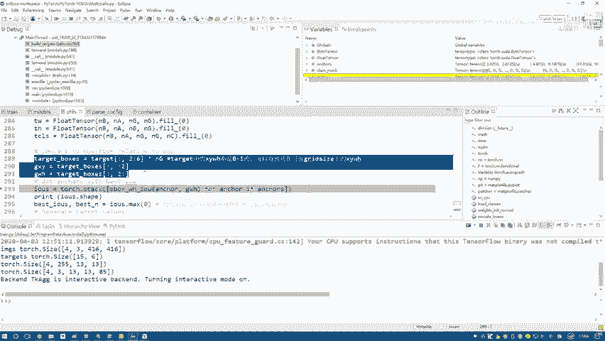

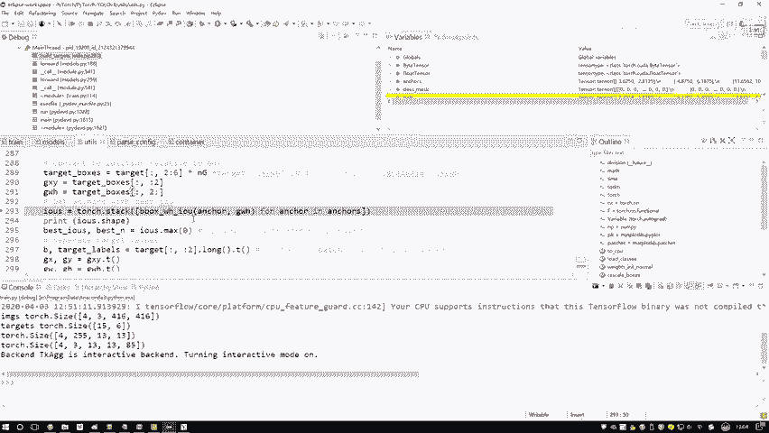

在本节课中，我们将学习如何计算目标检测中预测框与真实框之间的相对位置关系。这是构建YOLO模型训练标签的关键步骤，涉及候选框匹配、IOU计算以及坐标转换。

## 概述

上一节我们介绍了如何在特征图中定位目标的实际位置。本节中，我们来看看如何为每个真实框（ground truth）匹配最合适的候选框（anchor），并计算它们之间的相对偏移量，为后续的回归训练做准备。

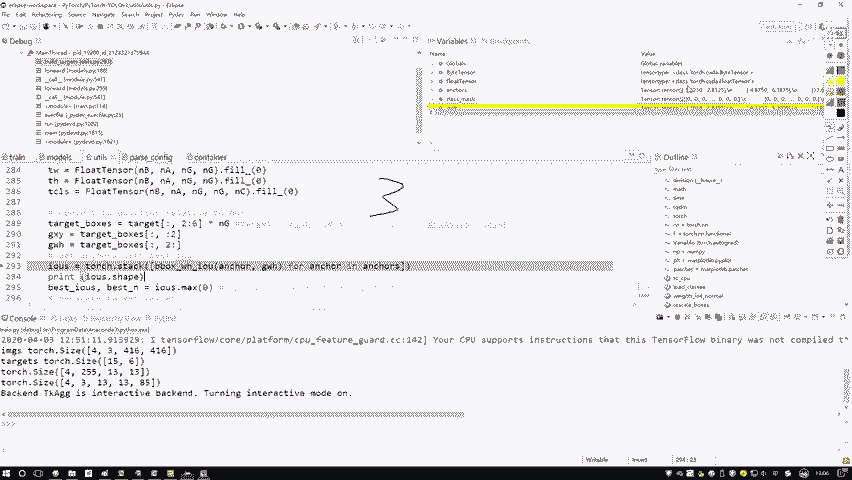

## 候选框匹配逻辑

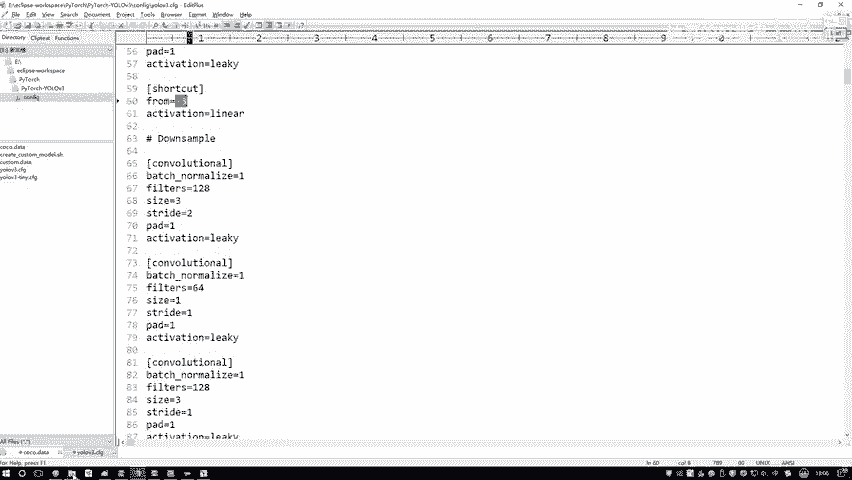

在YOLO模型中，特征图的每个格子会预设三种不同尺寸的候选框。对于一个给定的真实目标，我们需要从这三种候选框中选出与其重叠度最高的一个，作为后续微调的基础。

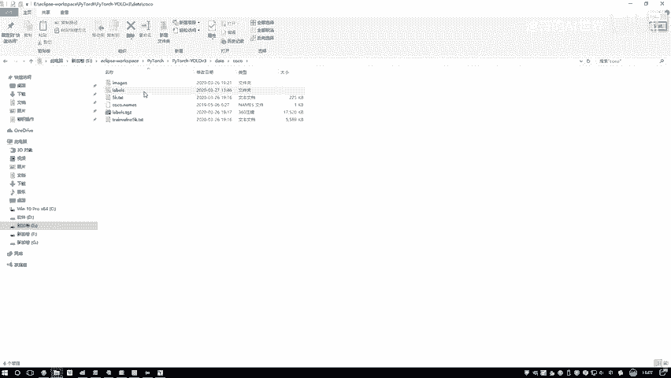

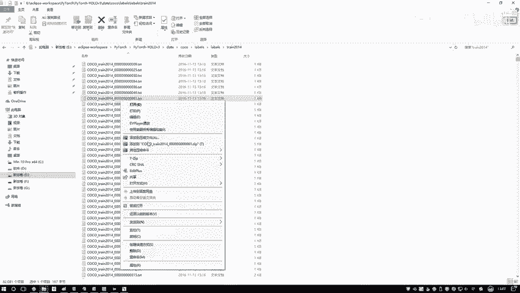

以下是匹配过程的步骤：

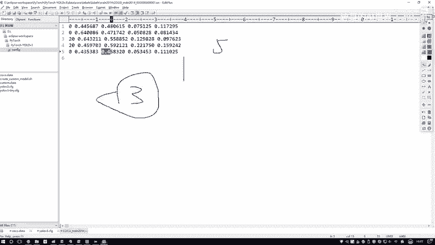

1.  **计算IOU**：对于每个真实框，分别计算它与当前格子对应的三种候选框的交并比（IOU）。
2.  **选择最佳匹配**：比较三个IOU值，选择数值最大的那个候选框作为该真实框的“最佳匹配”。
3.  **记录匹配信息**：记录下最佳匹配候选框的编号（0, 1, 2）以及对应的最大IOU值。

这个过程确保了每个真实目标都由一个最合适的预设框来负责预测。

## 代码实现解析

接下来，我们通过代码来具体理解上述匹配过程。代码的核心是遍历所有真实框，并为每个真实框找到最匹配的候选框规格。

```python
# 假设 `anchors` 是三种候选框的尺寸，`gt_boxes` 是所有真实框的坐标
# 计算每个候选框与每个真实框的IOU
ious = compute_iou(anchors, gt_boxes) # 返回形状为 [3, num_gts] 的矩阵

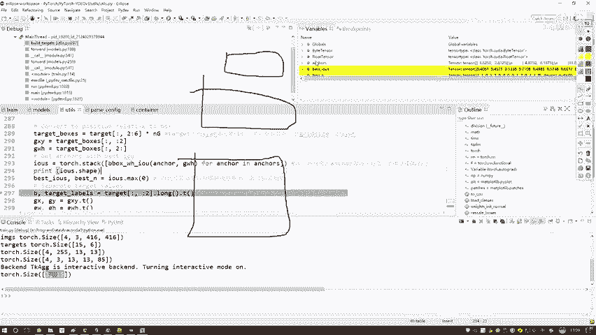

# 找出每个真实框对应的最佳候选框及其IOU
best_ious, best_n = ious.max(dim=0) # best_n 记录了最佳候选框的索引 (0, 1, 2)
```

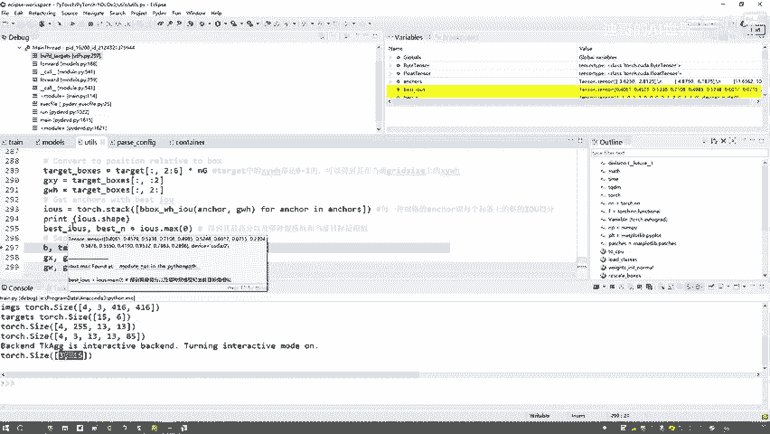

变量 `best_n` 是一个列表，其长度等于真实框的数量。列表中的每个值（0, 1或2）指明了对应真实框最适合由哪种规格的候选框来预测。

## 坐标分离与处理

在匹配完成后，我们需要进一步处理真实框的坐标信息，以便将其转换为模型训练所需的格式。

以下是需要分离和计算的坐标信息：

*   **批次索引 (batch index)**：标识当前真实框属于哪一张输入图像。
*   **类别标签 (class label)**：真实框所属物体的类别ID（0~80之间）。
*   **中心点坐标 (GX, GY)**：真实框在特征图尺度上的中心点坐标。
*   **宽高 (GW, GH)**：真实框在特征图尺度上的宽度和高度。
*   **格子索引 (I, J)**：真实框中心点所在格子的左上角坐标。通过向下取整计算得出：
    *   `I = floor(GX)`
    *   `J = floor(GY)`

例如，如果真实框中心点 `GX = 5.51`, `GY = 8.45`，那么它所在的格子索引就是 `I = 5`, `J = 8`。这个 `(I, J)` 对应对应公式中的 `(c_x, c_y)`，即格子本身的坐标位置。

## 总结

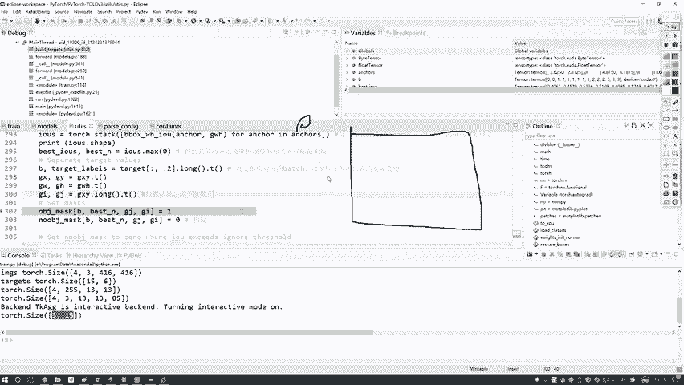

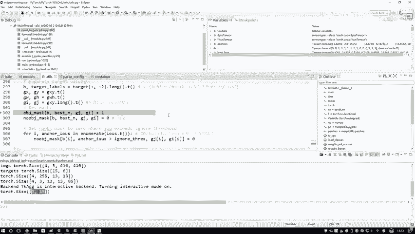

本节课中我们一起学习了目标检测中坐标相对位置计算的核心步骤。我们首先理解了为何以及如何为每个真实框匹配最合适的预设候选框，然后通过代码演示了IOU计算和最佳匹配选择的过程。最后，我们分解了真实框的各项坐标信息，特别是计算了其所在的格子索引 `(I, J)`，为下一节构建完整的训练标签打下了基础。