# 课程P81：14-完成所有损失函数所需计算指标 📊

在本节课中，我们将学习如何为YOLO模型的损失函数计算准备所有必需的指标。核心任务是将真实标签（targets）转换为与模型预测值（predictions）相匹配的格式，以便后续计算损失。

上一节我们介绍了如何匹配预测框与真实框，并计算了IOU。本节中，我们来看看如何填充掩码、计算位置偏移量以及准备类别标签。

## 填充物体与背景掩码

首先，我们需要填充之前构建的 `obj_mask`（物体掩码）和 `noobj_mask`（非物体掩码）。

`obj_mask` 初始化为全零，代表背景。对于真实标签中存在的物体，我们需要将其对应位置填充为1，表示该位置存在物体。

以下是具体步骤：
*   确定真实物体在特征图网格中的坐标 `(i, j)`。
*   将 `obj_mask` 中这些 `(i, j)` 坐标位置的值设置为1。

`noobj_mask` 的填充逻辑与 `obj_mask` 相反。它初始化为全1，代表背景。对于真实物体所在的网格位置，我们需要将其设置为0，表示该位置不是背景。

以下是具体步骤：
*   将 `noobj_mask` 中真实物体坐标 `(i, j)` 位置的值设置为0。

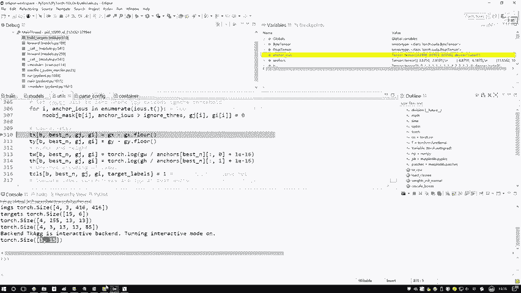

## 基于IOU阈值调整背景掩码

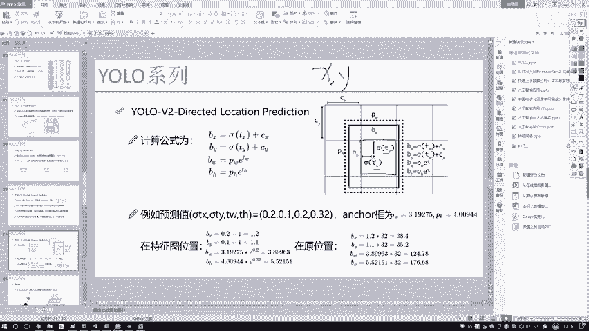

在计算损失时，需要考虑一种情况：某些预测框虽然与真实框的中心点不完全重合，但它们的交并比（IOU）很高。这些预测框不应被简单地视为背景。

因此，我们设定一个IOU阈值（例如0.5）。对于所有预测框，如果其与任一真实框的IOU大于此阈值，即使在 `noobj_mask` 中，我们也应将其视为“可能包含物体”，并将其对应位置设置为0。

以下是具体步骤：
*   遍历所有计算出的IOU值。
*   若某个IOU值大于阈值（如0.5），则在 `noobj_mask` 中将该预测框对应的位置设置为0。

## 计算边界框偏移量（`tx`, `ty`, `tw`, `th`）

预测值输出的是边界框相对于其所在网格单元的偏移量。我们的真实标签也需要转换成相同的格式。

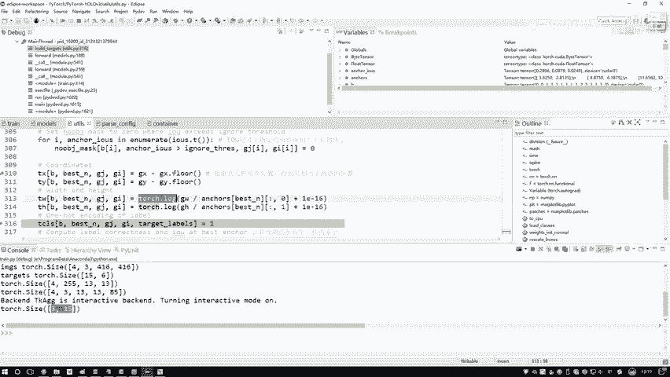

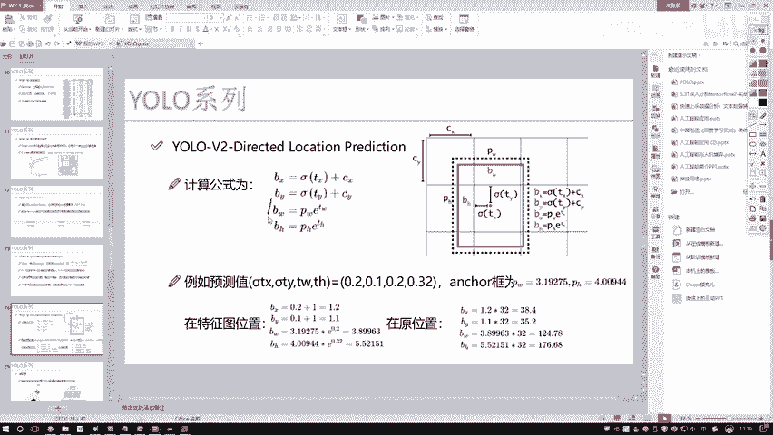

**`tx` 和 `ty` 的计算**：
它们表示物体中心点相对于所属网格左上角的偏移量。公式如下：
`tx = gx - cx`
`ty = gy - cy`
其中，`(gx, gy)` 是物体在特征图上的绝对坐标，`(cx, cy)` 是物体中心点所在网格的左上角坐标。

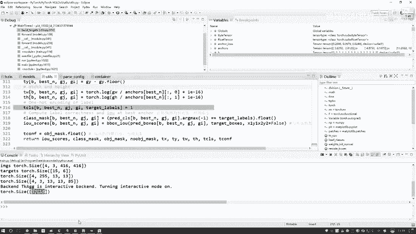

**`tw` 和 `th` 的计算**：
它们表示边界框的宽和高相对于先验框（anchor）尺寸的对数偏移量。这与模型预测时使用 `exp()` 函数还原宽高的操作相对应。因此，在准备真实标签时，我们需要对宽高进行对数变换。
`tw = log(gw / anchor_w)`
`th = log(gh / anchor_h)`
其中，`(gw, gh)` 是真实框的宽高（相对于特征图尺寸），`(anchor_w, anchor_h)` 是匹配到的先验框的宽高。

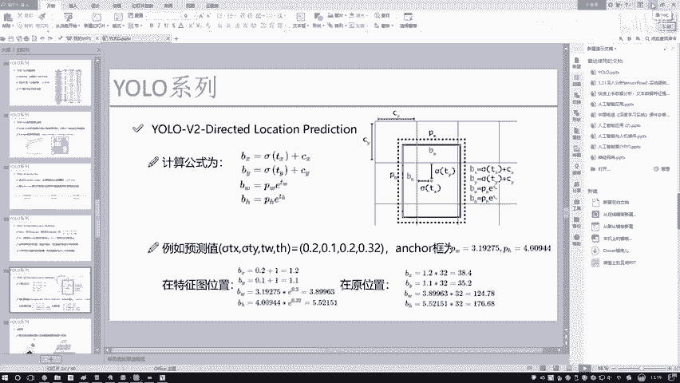

## 准备类别标签（`tcls`）与置信度标签（`tconf`）

**类别标签 `tcls`**：
这是一个one-hot编码向量，表示物体所属的类别。例如，如果物体属于第3类，则向量的第3个位置为1，其余为0。

**置信度标签 `tconf`**：
它表示一个边界框是否包含物体以及定位的准确性。对于与真实框匹配的预测框，其置信度标签为1；对于背景或不匹配的预测框，其置信度标签为0。实际上，我们之前构建的 `obj_mask` 就可以直接作为置信度的真实标签。

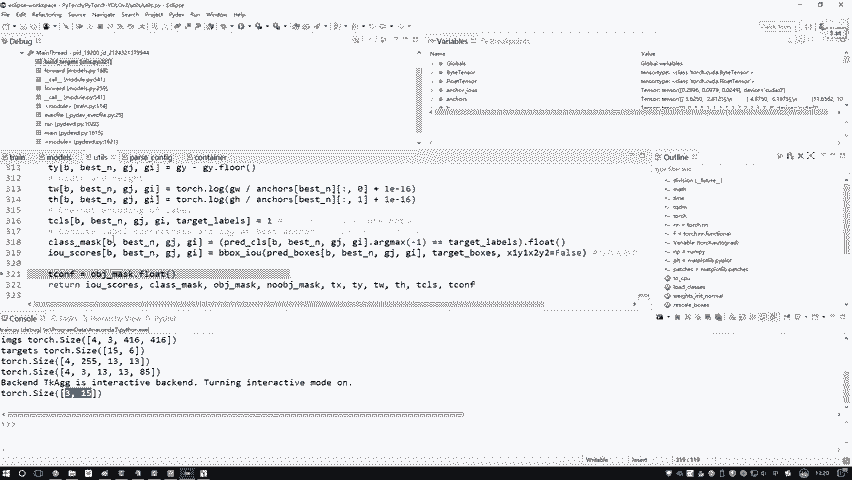

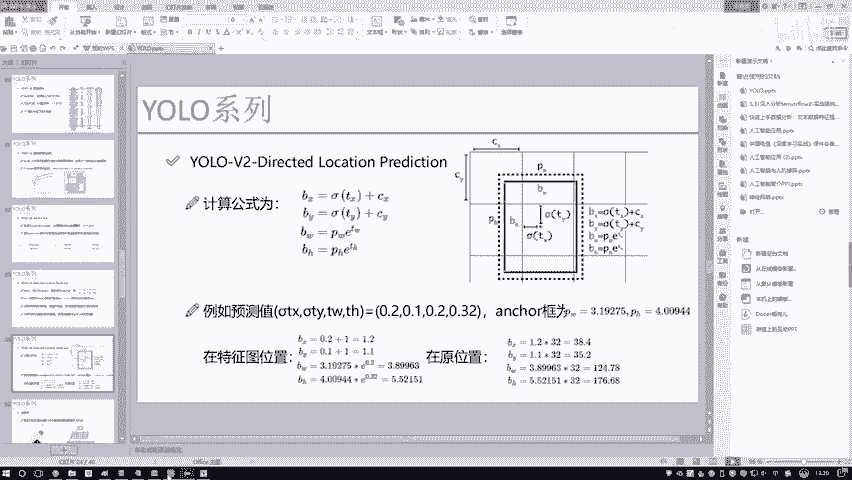

## 计算辅助指标

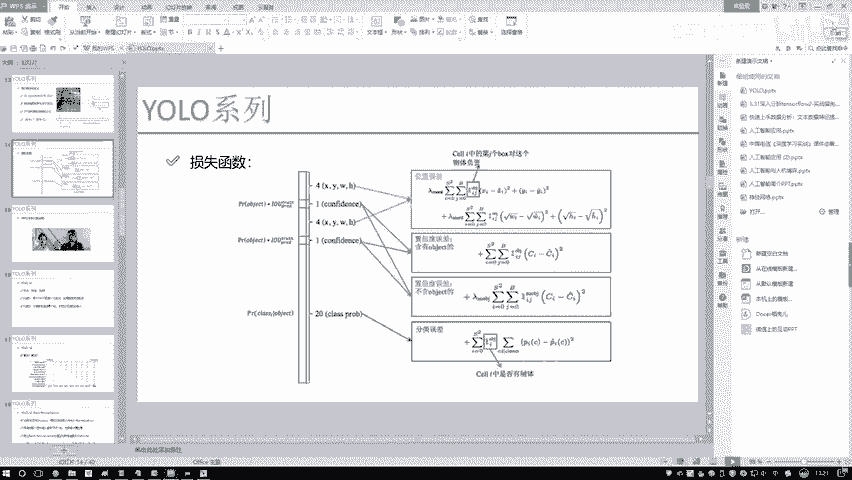

此外，我们还需要计算一些辅助指标，用于后续的损失计算或评估：
*   **预测框与匹配的真实框之间的IOU**：这个值在计算置信度损失时可能会用到。
*   **真实框的置信度**：如前所述，即为1。

## 总结

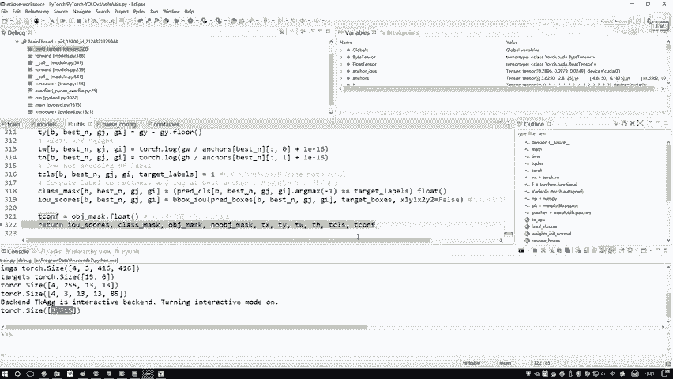

本节课中我们一起学习了为YOLO损失函数准备计算指标的全过程。我们完成了以下关键步骤：
1.  填充了物体掩码（`obj_mask`）和背景掩码（`noobj_mask`）。
2.  根据IOU阈值对 `noobj_mask` 进行了精细化调整。
3.  将真实框的坐标转换成了模型预测所需的偏移量格式（`tx`, `ty`, `tw`, `th`）。
4.  准备了类别标签（`tcls`）和置信度标签（`tconf`）。
5.  计算了预测框与真实框的IOU等辅助指标。

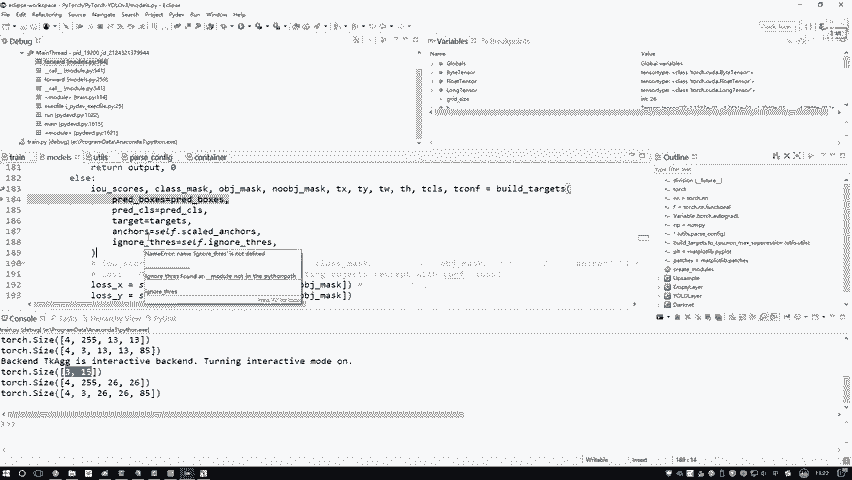

至此，我们已经将真实标签成功转换为与模型预测值维度、格式完全一致的数据，为下一步计算损失函数做好了所有准备。