# 课程P82：YOLOv3模型训练与总结 🎯

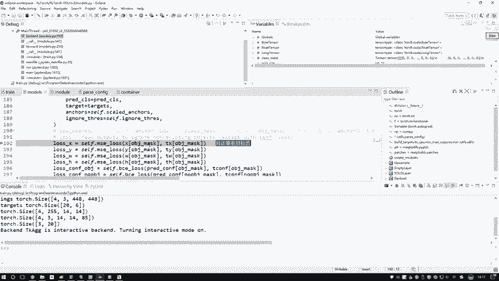

在本节课中，我们将学习YOLOv3模型训练的核心流程，包括损失计算、反向传播以及如何利用开源代码进行实践。我们将详细解析训练代码中的关键步骤，并探讨如何将论文原理与源码实践相结合，以提升深度学习项目的实战能力。

## 📊 损失计算详解

上一节我们介绍了前向传播中预测值与标签的构建。本节中我们来看看如何计算模型的损失。

损失计算的核心是将网络前向传播得到的预测值（`XYWH2`）与通过`build_targets`函数处理好的标签（`T_x, T_y, T_w, T_h2`）进行比较。但在计算之前，我们需要明确一个前提：并非所有预测位置都包含目标物体。

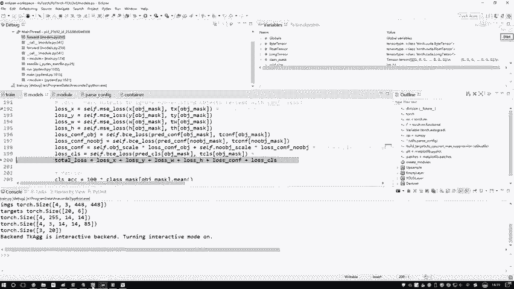

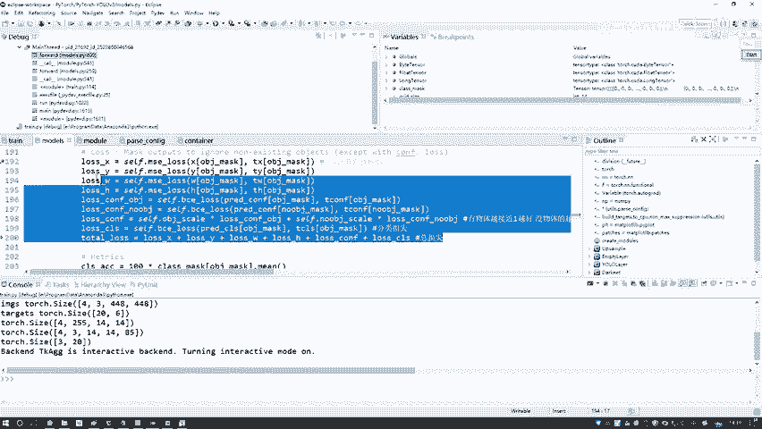

以下是计算各项损失的具体步骤：

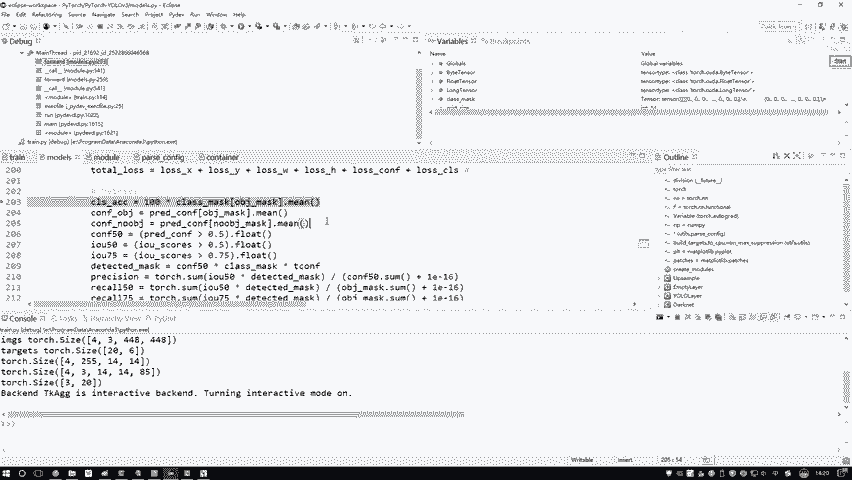

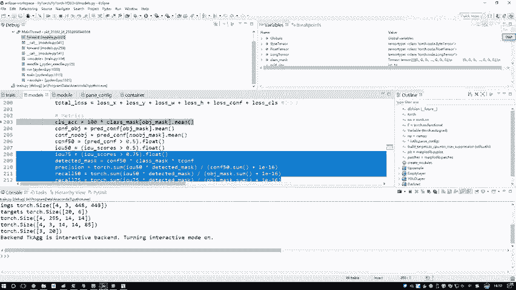

*   **边界框回归损失**：我们只对包含目标物体的位置计算边界框（XYWH）的损失。这通过一个名为`obj_mask`的掩码来实现，该掩码中值为1的位置表示存在目标。
    *   计算公式：`loss_xy = obj_mask * MSE_loss(pred_xy, target_xy)`， `loss_wh`同理。
*   **置信度损失**：置信度预测目标框内包含物体的概率。它分为两部分：
    *   **前景损失**：针对`obj_mask`指示的有目标位置，其真实标签为1。
    *   **背景损失**：针对无目标位置，其真实标签为0。
    *   由于这是一个二分类问题（是物体/不是物体），我们使用二元交叉熵损失（BCE Loss）进行计算。
        *   **公式**：`BCE_loss = -1/N * Σ [y_i * log(x_i) + (1 - y_i) * log(1 - x_i)]`，其中`y_i`是真实标签（0或1），`x_i`是预测值（0~1之间）。
    *   最终置信度损失是前景损失与背景损失的加权和。
*   **分类损失**：计算目标所属类别的损失，同样使用BCE Loss，因为YOLOv3允许一个目标属于多个类别（多标签分类）。

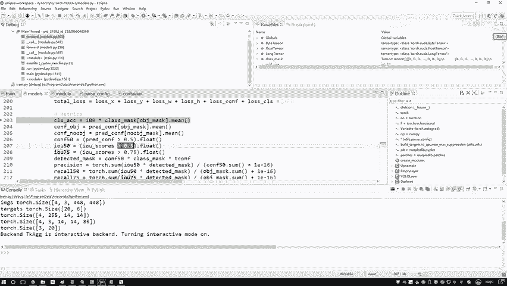

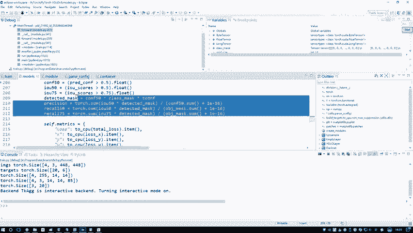

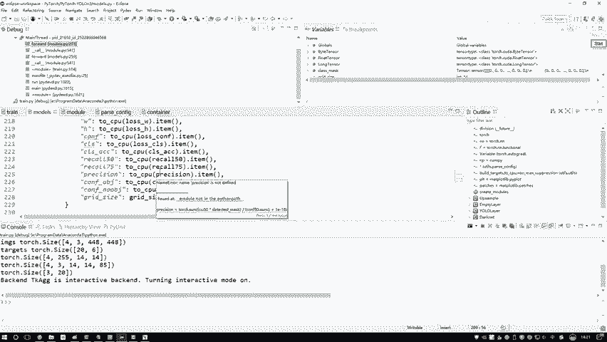

最终，模型的总损失是边界框回归损失、置信度损失和分类损失三项的加权和。这与我们在原理部分讲解的完全一致。

## 🔄 反向传播与模型更新

理解了前向传播和损失计算后，本节我们来看看模型如何通过学习来优化。

在PyTorch等现代深度学习框架中，**反向传播是自动完成的**。我们只需要定义好前向传播过程并计算出损失，框架会自动计算网络中所有参数的梯度。

*   **反向传播**：调用`loss.backward()`一行代码即可完成，无需手动计算梯度。
*   **参数更新**：使用优化器（如SGD或Adam）执行`optimizer.step()`来更新模型参数。
*   **梯度清零**：在下一轮迭代前，需要调用`optimizer.zero_grad()`将梯度归零，防止梯度累积。

因此，训练循环的核心代码结构非常清晰：
```python
# 前向传播
predictions = model(images)
loss = compute_loss(predictions, targets) # 包含我们上面详解的各项损失

# 反向传播与更新
optimizer.zero_grad()
loss.backward()
optimizer.step()
```

训练过程中的其余部分，如日志打印、评估指标计算（如mAP、Recall、IoU等）以及模型保存，都是相对通用的操作，可以根据项目需求灵活添加。

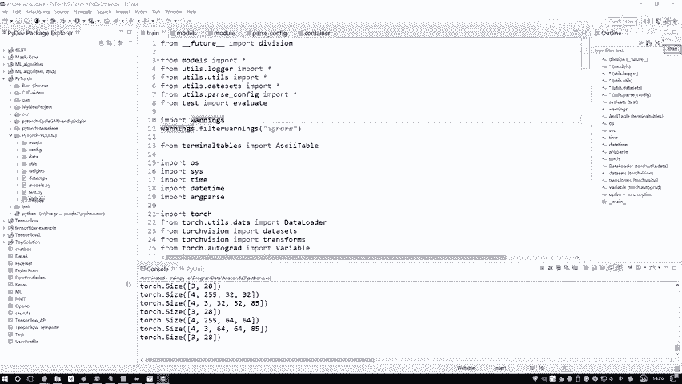

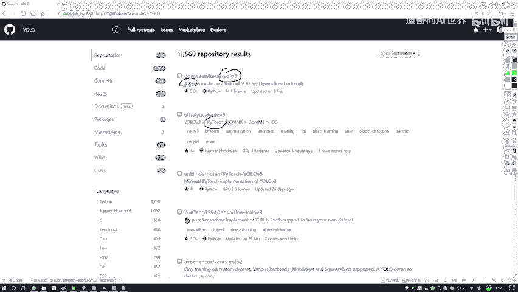

## 🌐 源码使用与进阶学习

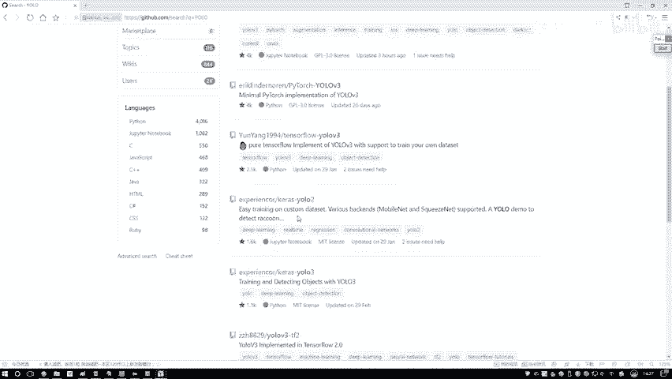

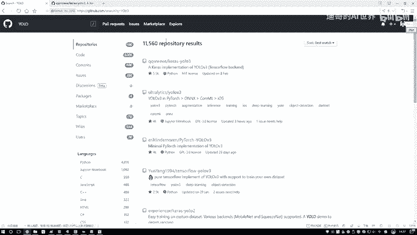

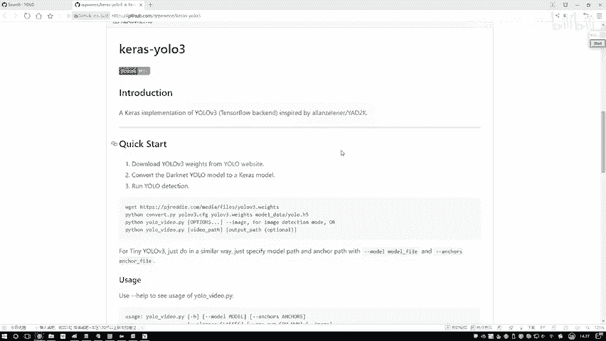

我们已经完整分析了YOLOv3的训练代码。在实际项目中，我们通常直接使用开源实现。本节将介绍如何有效利用这些资源并规划后续学习路径。

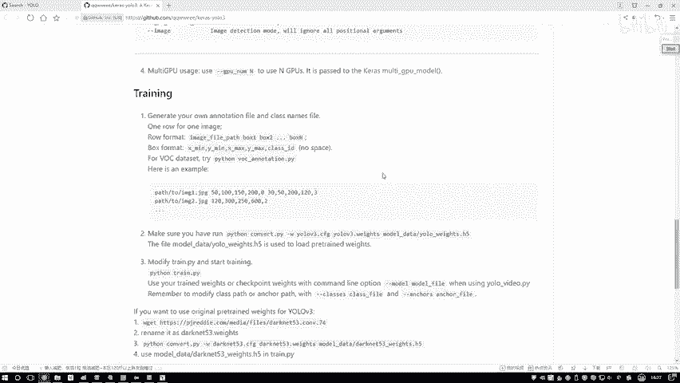

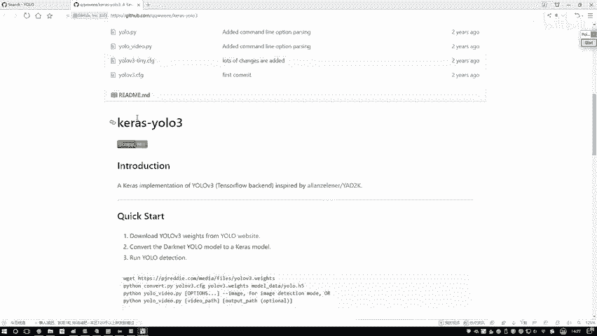

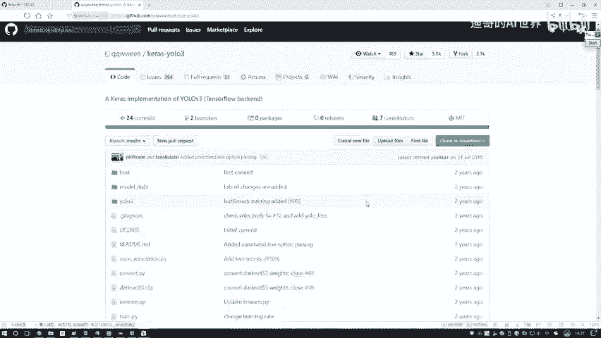

以下是高效使用开源代码和深度学习资源的建议：

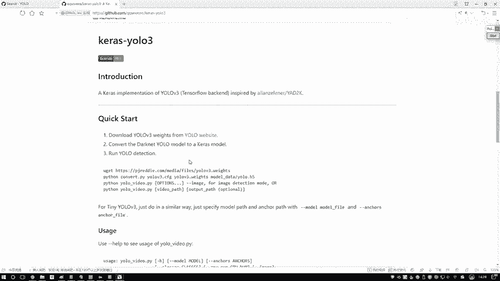

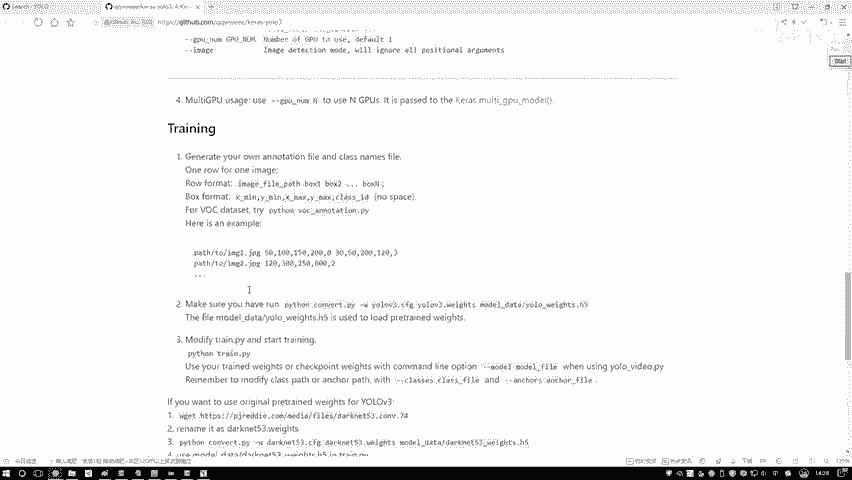

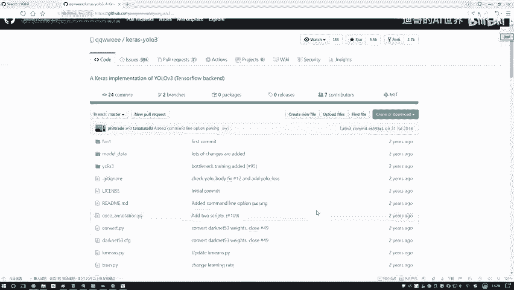

*   **寻找开源实现**：在GitHub等平台，搜索“YOLOv3 PyTorch”、“YOLOv3 TensorFlow”等关键词，可以找到不同框架的官方或高质量复现版本。
*   **阅读项目说明**：仔细阅读项目的`README.md`文件，按照指引配置环境、下载数据和权重、运行训练或推理脚本。
*   **调试与理解**：对于重要的模块，像本课程一样，使用调试工具逐行跟踪代码执行流程，将论文中的理论与代码中的实现细节对应起来。

对于希望进阶的学者或工程师，最好的方法是**结合论文阅读与源码分析**。

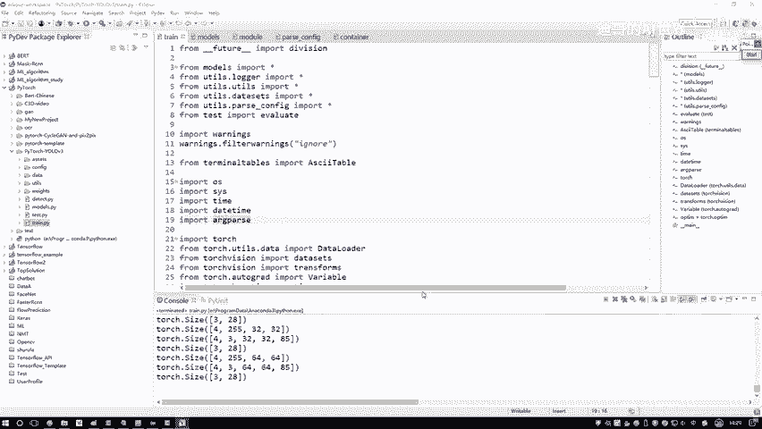


1.  **深入研读论文**：反复阅读原始论文，理解算法的核心思想、网络架构和创新点。论文提供了宏观的蓝图。
2.  **精读与分析源码**：源码包含了所有论文中未提及的实现细节，如数据预处理、损失函数的具体实现、训练技巧等。这是将理论落地的关键。
3.  **应用于实际项目**：尝试将学习的算法应用到自己的任务中，或者对现有代码进行修改以适应新需求。这个过程能极大提升工程能力。

这种“论文+代码”的学习模式，不仅是学术研究的必备技能，也是工业界算法工程师的核心能力。它锻炼了你快速理解、复现和应用前沿算法的能力，这在技术面试和解决实际业务问题时至关重要。

---

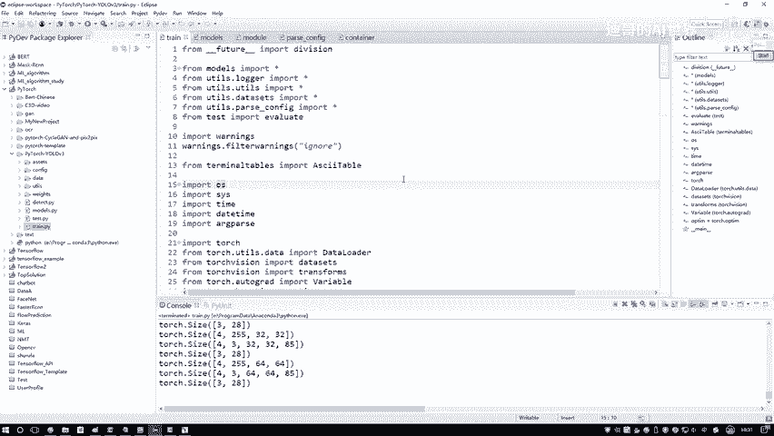

本节课中我们一起学习了YOLOv3模型训练的完整流程，从损失函数的具体计算、反向传播的自动化机制，到如何利用开源代码以及规划未来的进阶学习路线。YOLOv3作为一个经典的检测算法，其代码结构清晰，是理解目标检测训练过程的优秀范例。掌握“原理-代码”相结合的学习方法，将为你打开更广阔的深度学习应用之门。