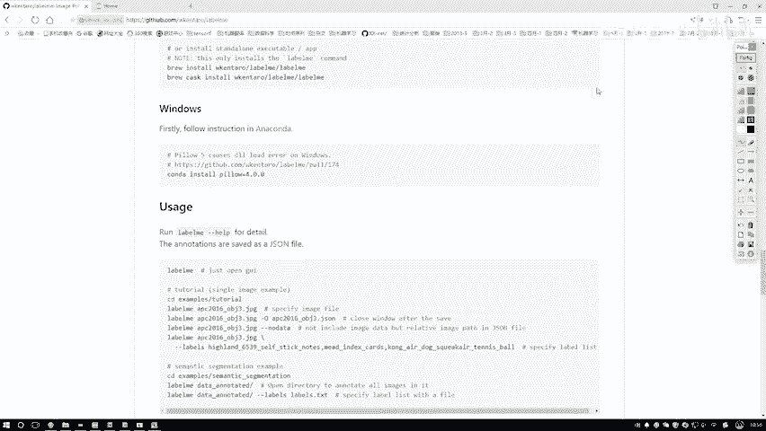
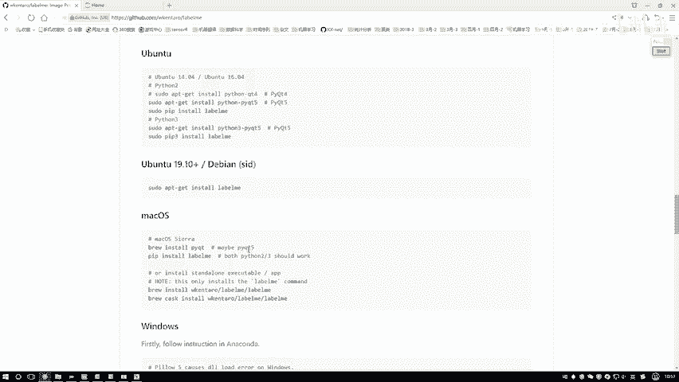
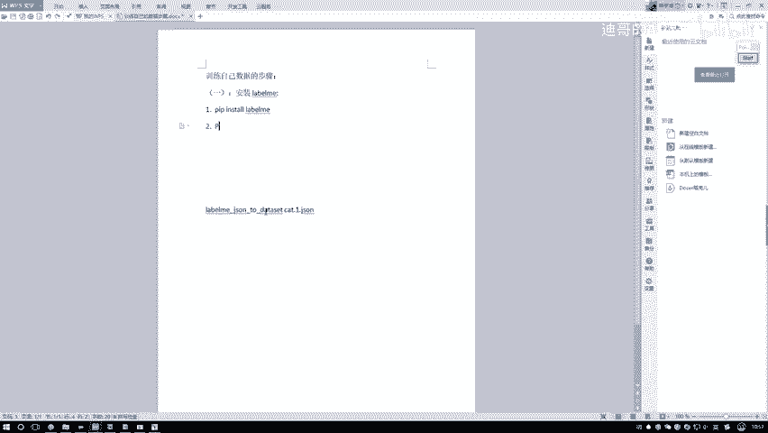
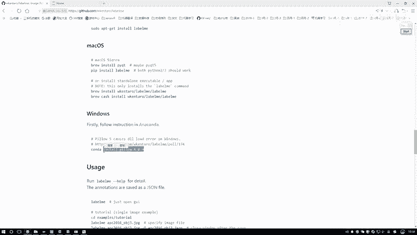
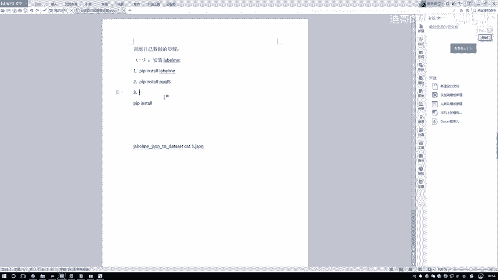
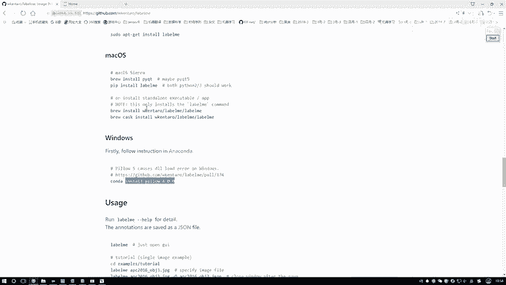
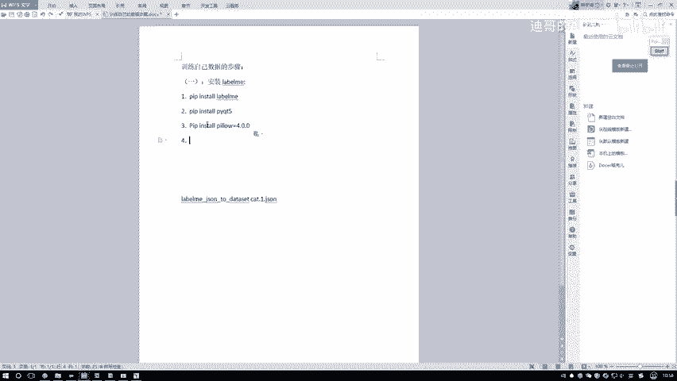
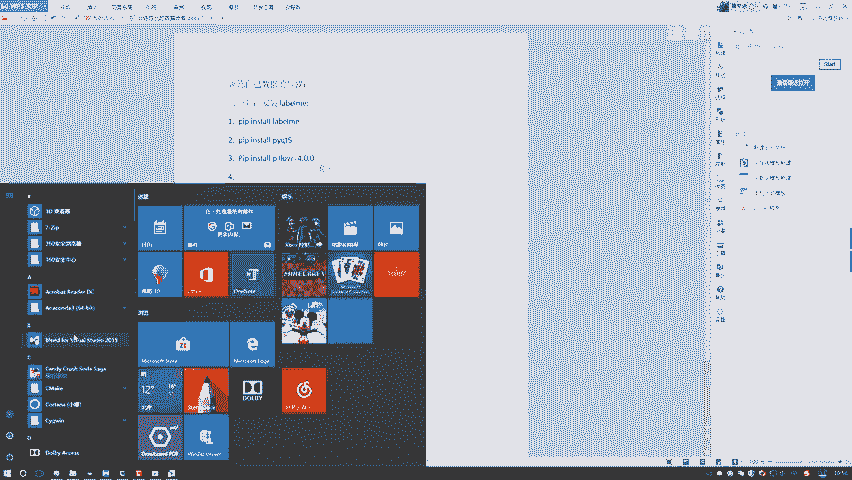
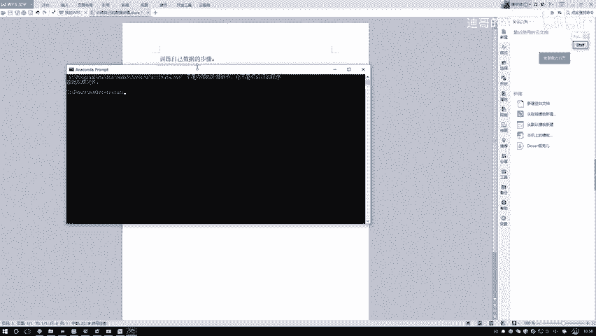
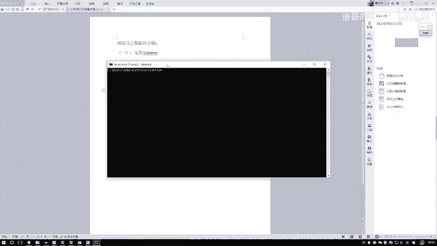

# 课程P84：Labelme工具安装指南 🛠️

在本节课中，我们将学习如何安装Labelme工具。Labelme是一个用于图像标注的图形界面工具，在训练自定义数据集（如用于Mask R-CNN）时，手动为图像创建标签是必不可少的步骤。我们将从安装开始，为后续的数据标注工作做好准备。

## 工具安装步骤

上一节我们介绍了Labelme工具的作用，本节中我们来看看具体的安装流程。安装过程主要涉及三个Python包的安装。



以下是详细的安装步骤列表：

1.  **安装Labelme核心包**
    在命令行或终端中，使用pip命令安装labelme包。
    ```bash
    pip install labelme
    ```




2.  **安装图形界面支持包**
    Labelme工具依赖PyQt5来提供图形用户界面，因此需要安装此包。
    ```bash
    pip install pyqt5
    ```





3.  **安装指定版本的图像处理库**
    根据官方要求，需要安装特定版本的Pillow库以确保兼容性。
    ```bash
    pip install pillow==4.0.0
    ```



## 启动Labelme工具





完成上述三个包的安装后，环境便配置好了。启动工具的方法非常简单。





只需在命令行（例如Anaconda Prompt）中直接输入命令 `labelme` 并回车，系统便会自动运行并打开Labelme的图形界面程序，之后即可开始进行图像标注工作。



本节课中我们一起学习了Labelme标注工具的完整安装流程。我们通过三个简单的pip安装命令，配置好了运行环境，并掌握了启动工具的方法。安装好Labelme是创建自定义数据集标签的第一步，为后续的模型训练奠定了基础。