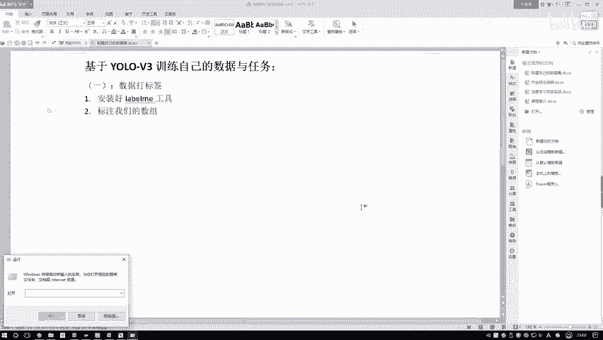
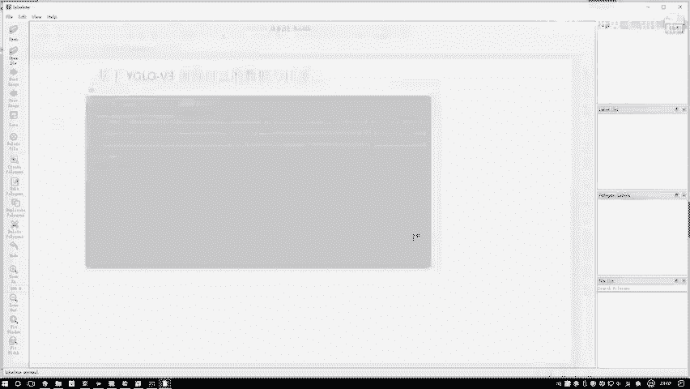
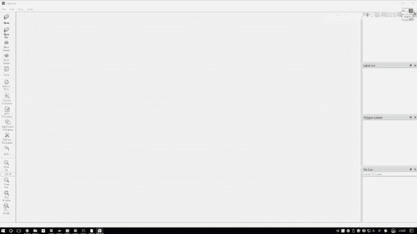
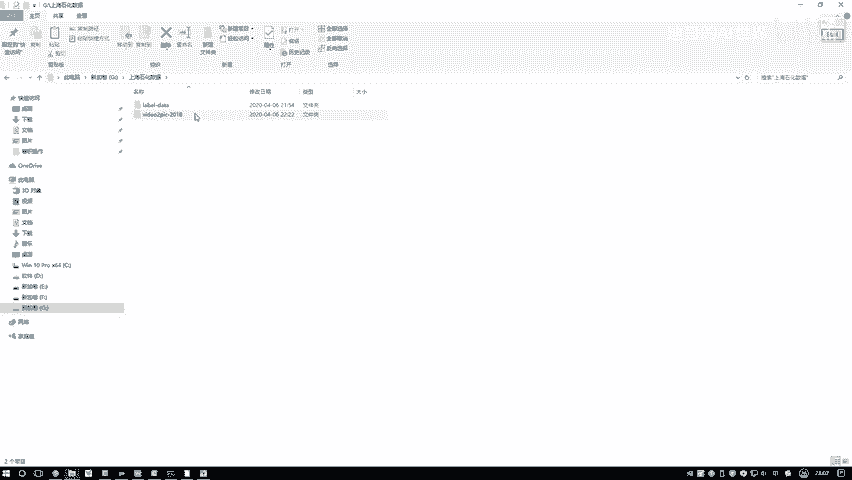
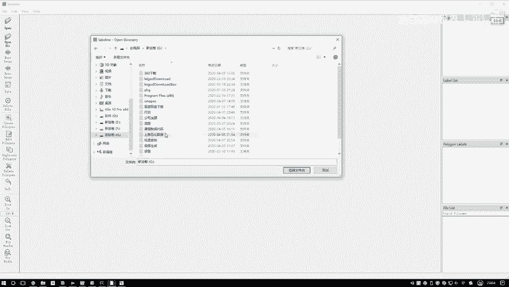
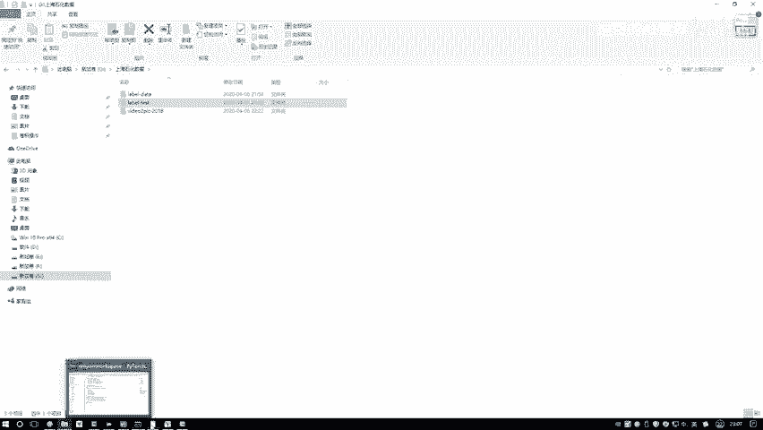

# 课程P85：数据信息标注教程 🖼️📝

在本节课中，我们将学习如何使用LabelMe工具对图像数据进行标注，为后续的计算机视觉任务（如目标检测）准备训练数据。

---

## 打开标注工具

首先，打开命令提示符（CMD），输入命令 `labelme` 来启动标注工具。

输入命令后，LabelMe工具界面会立即弹出。

## 加载图像数据

工具界面提供两个选项来加载数据：“Open”用于打开单张图像，“Open Dir”用于打开包含多张图像的文件夹。

这里我们选择“Open Dir”来打开一个文件夹。你可以使用任何你想练习的数据，例如包含猫或狗的图片。如果后续有特定任务，再使用对应的专门数据。

例如，本教程将使用一个包含现场施工画面的数据集。我们的任务是进行行人检测，即标注出图像中每个人的位置。

打开文件夹后，工具会加载其中的图像。

## 开始标注

上一节我们加载了数据，本节中我们来看看如何进行具体的标注操作。

选择一张人员较多的图像开始标注。初始状态下，标注模式默认是“多边形”，即通过连接多个点来形成区域，这类似于实例分割的标注方式。

但对于目标检测任务，我们通常使用矩形框。右键点击图像区域，可以在菜单中选择不同的标注形状，如点、矩形框、圆形、线等。

选择第二个选项“Create Rectangle”来创建矩形框。

以下是标注一个目标的具体步骤：
1.  选择矩形框工具。
2.  在目标左上角点击并按住鼠标。
3.  拖动鼠标至目标右下角，形成一个包围目标的矩形框。
4.  松开鼠标后，会弹出一个对话框。
5.  在对话框中输入该目标的类别标签（例如 `person`）。
6.  点击“OK”完成当前目标的标注。

重复以上步骤，将图像中所有需要检测的目标（本例中的所有行人）都用矩形框标注出来。

## 保存标注结果

标注完成后，点击工具栏上的“Save”按钮保存标注信息。

系统会提示你选择保存位置。你可以新建一个文件夹（例如 `label_test`）来存放这些标注文件。

保存后，LabelMe会为当前图像生成一个同名的JSON文件，其中包含了所有矩形框的位置坐标和类别信息。

---

本节课中我们一起学习了使用LabelMe工具进行图像数据标注的完整流程，包括启动工具、加载数据、使用矩形框标注目标以及保存标注结果。这是构建自定义计算机视觉模型数据集的关键第一步。