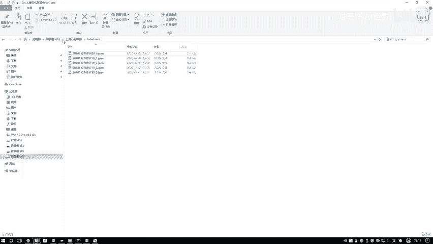
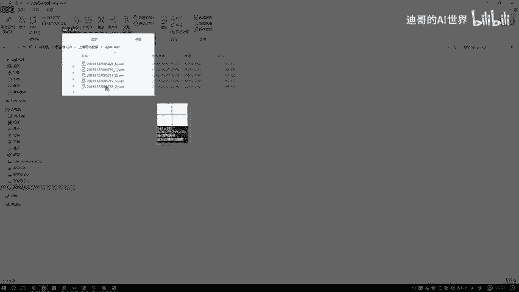
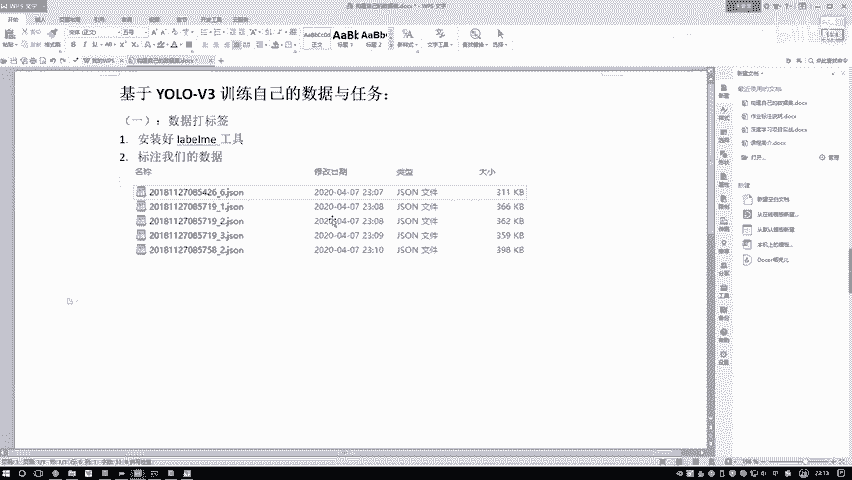

# 课程P86：3-完成标签制作 📝

在本节课中，我们将学习如何完成目标检测任务的数据标注工作。我们将使用LabelMe工具标注多张图像，并了解标注后生成的JSON文件格式。最后，我们会将标注好的数据整合到项目中，为后续的模型训练做好准备。

## 标注剩余图像

上一节我们介绍了如何使用LabelMe标注第一张图像。本节中，我们来看看如何继续标注文件夹中的其他图像。

文件夹中包含多张图像，我们需要从中再选择几张进行标注。为了演示，我们选择一张与之前略有不同的图像。

以下是标注第二张图像的步骤：
*   在图像中，使用矩形框工具框选一个人形目标。
*   在弹出的标签对话框中，输入类别“person”。
*   重复此过程，将图像中可见的其他人形目标都标注为“person”。

我们计划总共标注五张图像用于后续的迁移学习训练。标注完成后，记得保存为JSON文件，例如 `test_2.json`。

接下来，我们继续标注第三张、第四张图像，过程与之前相同，将图像中所有“person”目标框选出来。

在标注过程中，你会发现一个事实：数据标注工作并不轻松。虽然我们只标注“人”这一类别，看起来比较简单，但在实际任务中，可能需要检测的类别多达上百种。这要求标注者先在图像中识别出各类目标，再进行框选，过程会繁琐许多。

此外，LabelMe工具还支持更精细的标注方式。之前提到的“点一个点一个点”的操作，是用于制作“mask”，即图像分割任务，其复杂程度远高于拉一个矩形框。

现在我们已经标注了四张图像，最后再选择一张人像较多、目标稍大的图像进行标注。

以下是标注最后一张图像的要点：
*   这张图像中人物较多，需耐心框选每一个“person”目标。
*   在实际个人项目中，你可以标注多个类别。
*   需要指出的是，仅靠少量标注数据训练模型，效果通常有限。要达到较好的效果，通常需要数千张标注图像。

至此，五张图像的标注工作全部完成。我们可以关闭LabelMe工具了。

## 关于标注工具

市面上存在多种数据标注工具。我们本次使用的LabelMe是其中流行度较高的一款。还有其他如“YOLO-MARK”等专门为YOLO系列算法设计的标注工具。

对于初学者，掌握一个像LabelMe这样用户基数大、功能全面的工具即可，无需安装过多工具。

## 理解标注文件格式

接下来，我们看看标注完成后生成的数据。在 `label_test` 文件夹中，生成了以 `.json` 为后缀的标注文件。

我们打开其中一个JSON文件，查看其内部结构。核心信息如下：

*   **`label`**：表示标注的类别，例如 `"person"`。
*   **`points`**：表示标注框的具体坐标，其格式为 `[[x1, y1], [x2, y2]]`，分别对应矩形框左上角和右下角的坐标。
*   **`shape_type`**：表示标注的形状类型，例如 `"rectangle"` 代表矩形框。如果使用其他形状（如多边形）标注，此处信息会不同。
*   文件还包含图像路径（`imagePath`）、图像高度（`imageHeight`）和宽度（`imageWidth`）等信息。

每个JSON文件对应一张图像，其中包含该图像所有标注目标的列表。你标注了几个目标，列表中就有几个条目。

需要注意的是，我们示例中的图像尺寸较大（超过1000像素）。在实际训练时，通常需要对图像进行压缩或缩放，以适配模型输入并提升训练效率。

## 整合数据到项目

现在，我们已经完成了数据标注，得到了关键的JSON文件。

接下来，我们需要将这些数据整合到PyTorch YOLOv3项目目录中。以下是需要进行的操作：

1.  将标注好的JSON文件（位于 `label_test` 文件夹）和对应的原始图像，组织到项目指定的数据目录下。
2.  项目源码中通常包含数据加载和预处理脚本，我们需要根据JSON格式编写或调整代码，以正确读取我们的标注信息。

为了方便后续查看，此处展示了数据标注环节的成果示意图：

*（标注后生成的JSON文件列表）*

*（JSON文件内部结构示例）*

*（项目目录结构示意图）*

---

本节课中，我们一起学习了使用LabelMe完成多张图像的目标标注，理解了标注文件（JSON）的数据结构，并明确了将标注数据导入训练项目的后续步骤。数据准备是深度学习项目的重要基础，准确的标注是模型获得良好性能的前提。