# 课程P87：4-生成模型所需配置文件 📄

在本节课中，我们将学习如何为自定义的目标检测任务生成和修改YOLOv3模型所需的配置文件。我们将从COCO数据集的默认配置出发，根据自己数据集的类别数量进行调整。

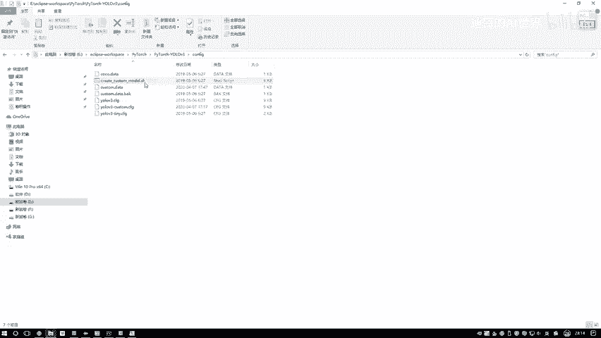

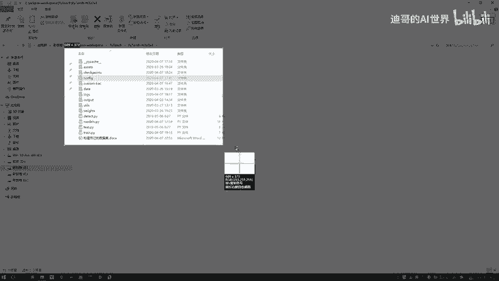

---

## 概述

上一节我们完成了数据的标注与整理。本节中，我们来看看如何根据自定义的数据集（例如，一个包含“人”和“吊车”两个类别的数据集）来生成和修改YOLOv3模型的配置文件。核心在于调整模型输出层的类别数，使其匹配我们的任务。

## 第一步：定位配置文件目录

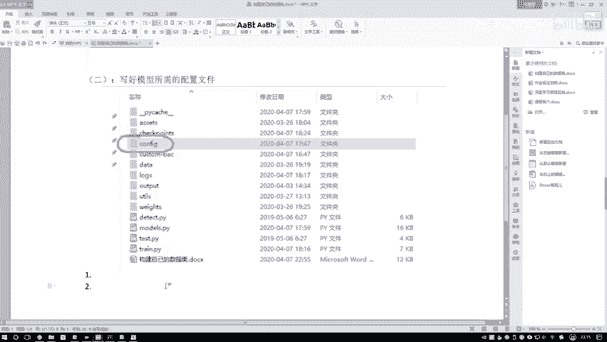

首先，需要进入YOLOv3项目中的配置文件夹。

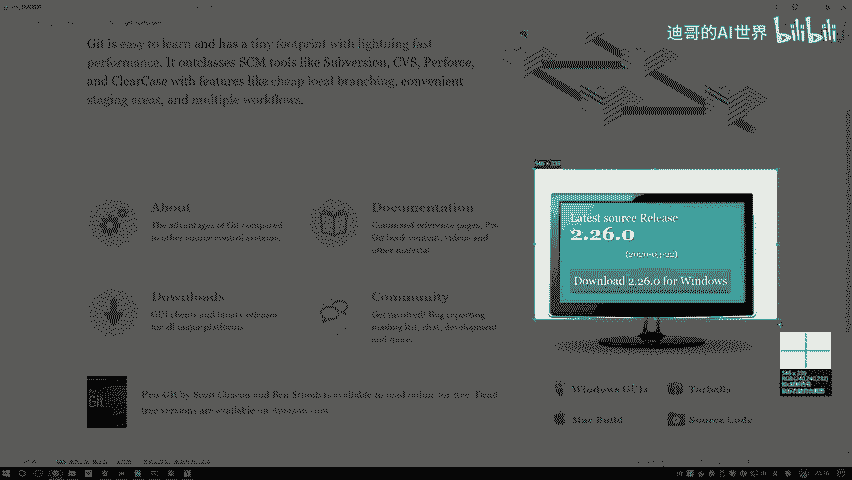

以下是具体步骤：
1.  进入当前YOLOv3项目目录。
2.  找到并进入 `config` 文件夹。

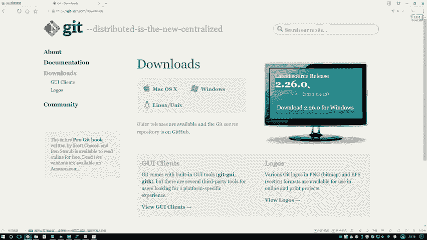

## 第二步：使用脚本生成自定义配置文件

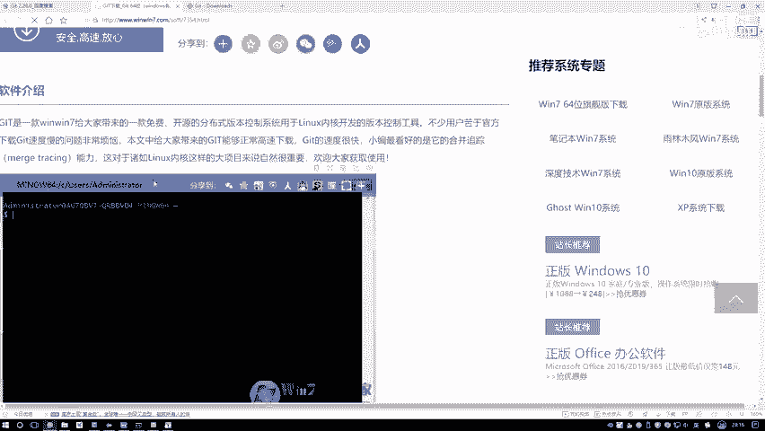

在 `config` 文件夹中，存在一个名为 `create_custom_model.sh` 的脚本文件。该脚本的作用是根据用户指定的类别数量，生成一个对应的自定义模型配置文件。因为我们的任务（例如，检测“人”和“吊车”）与COCO数据集（80个类别）的类别数不同，所以需要此步骤。

### 在Windows系统下运行.sh脚本

`.sh` 文件通常在Linux系统下直接运行。在Windows系统中，需要借助Git工具来执行。

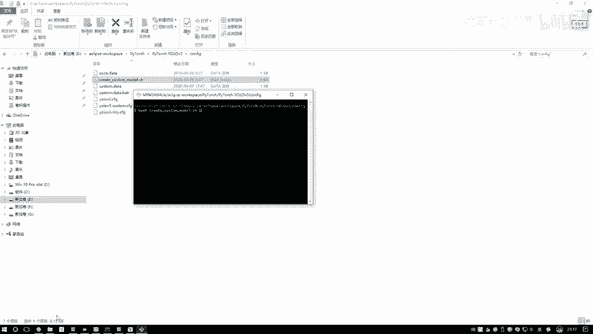

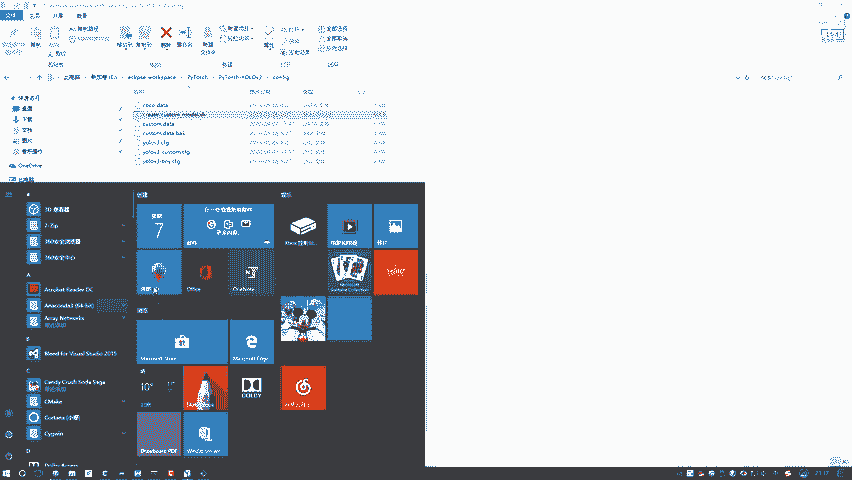

以下是获取和安装Git的步骤：
1.  访问Git官网或通过搜索引擎下载Windows版本的Git安装程序。
2.  下载完成后，按照提示完成安装。

安装Git后，即可在项目目录中运行.sh脚本。

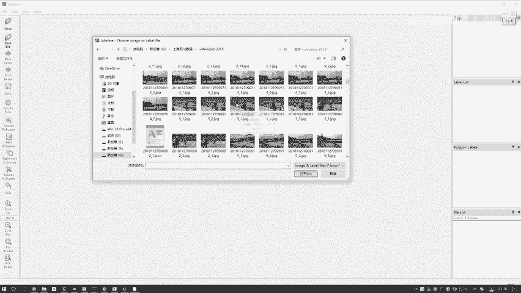

### 执行生成命令

安装Git后，进入YOLOv3项目的 `config` 目录。

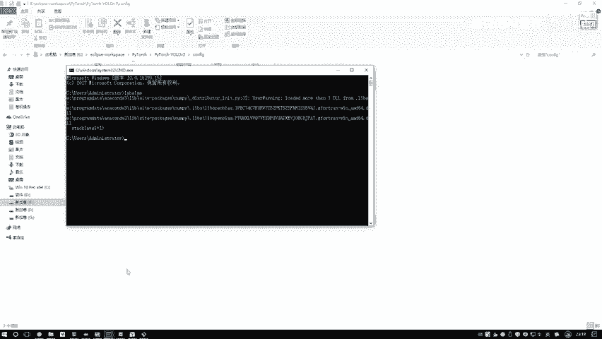

以下是运行脚本的步骤：
1.  在 `config` 文件夹内右键，选择 `Git Bash Here`，打开命令行窗口。
2.  输入命令 `bash create_custom_model.sh [类别数量]` 并执行。其中，`[类别数量]` 应替换为你的数据集中目标类别的总数。例如，我们的任务包含“人”和“吊车”，则类别数量为2。

执行该命令后，系统会自动生成一个新的配置文件（例如 `yolov3-custom.cfg`）。该文件基于原始模板创建，主要修改了网络最终输出层（YOLO层）中的 `classes` 参数，将其设置为用户指定的类别数量（本例中为2）。网络的其他架构（如特征提取部分）基本保持不变。

## 第三步：理解与进一步调整（可选）

新生成的配置文件已经适配了我们的类别数量。对于大多数任务，使用默认的锚框（Anchor Boxes）设置即可。

以下是可以根据任务需求进行的可选调整：
*   **修改锚框**：如果检测的目标尺寸与COCO数据集差异很大，可以重新聚类（K-means）自己的数据集，生成更合适的锚框尺寸，并更新配置文件中的对应参数。
*   **调整网络结构**：通常，特征提取等主体网络架构无需改动，保持默认即可。

## 总结

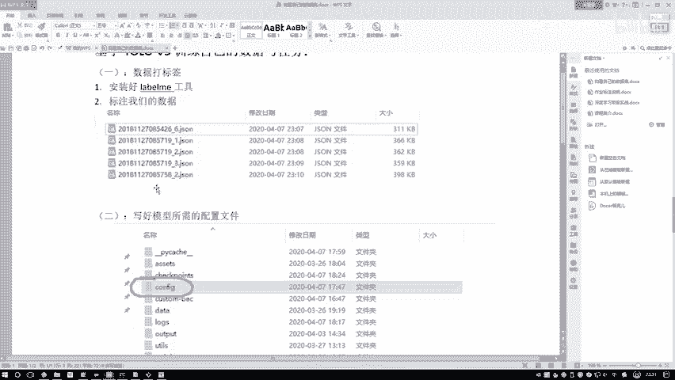

本节课中我们一起学习了为自定义目标检测任务生成YOLOv3配置文件的全过程。核心步骤是使用项目提供的 `create_custom_model.sh` 脚本，并传入自己数据集的类别数量，从而自动生成一个将最终输出类别数修改正确的配置文件。这为后续使用我们自己的数据训练模型做好了准备。