# 课程P88：JSON格式转换为YOLO-v3所需输入 🛠️

在本节课中，我们将学习如何将LabelMe标注工具生成的JSON格式标签，转换为YOLO-v3模型训练所需的特定格式。这是准备自定义数据集的关键一步。

## 概述：为何需要转换标签格式？

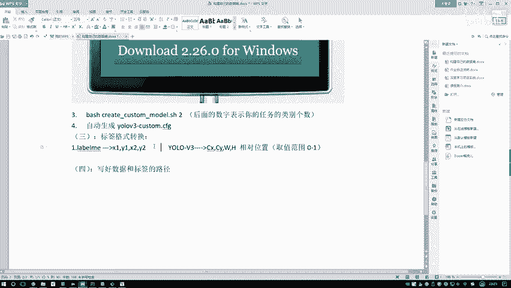

上一节我们介绍了配置文件的编写。本节中，我们来看看数据准备的核心环节——标签格式转换。

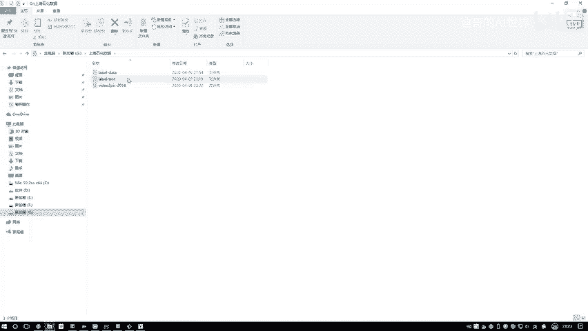

在LabelMe中，我们得到的标注结果是边界框的绝对坐标，即左上角点`(x1, y1)`和右下角点`(x2, y2)`的像素值。

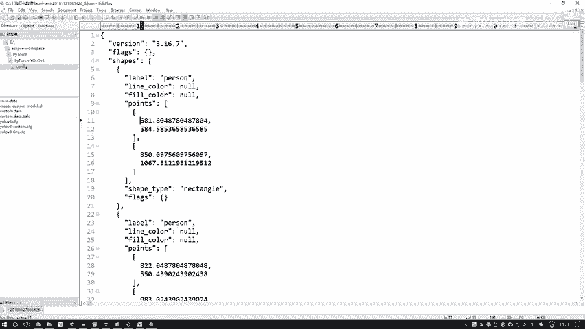

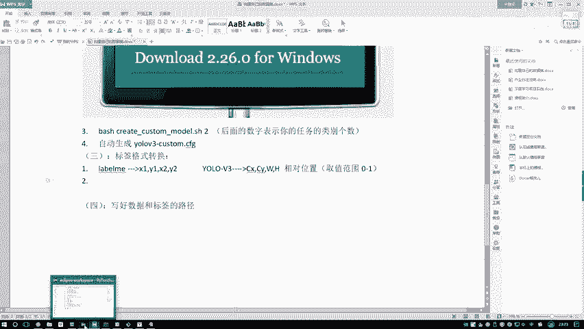

然而，YOLO-v3模型所需的输入格式与此不同。它需要的是边界框中心点的相对坐标以及相对的长宽。具体来说，其格式为：
`(class_id, cx, cy, w, h)`
其中：
*   `class_id` 是目标的类别索引（从0开始）。
*   `cx` 和 `cy` 是边界框中心点的x、y坐标，**其值是相对于图片宽度和高度的比例**，取值范围在0到1之间。
*   `w` 和 `h` 是边界框的宽度和高度，**同样是相对于图片宽度和高度的比例**。

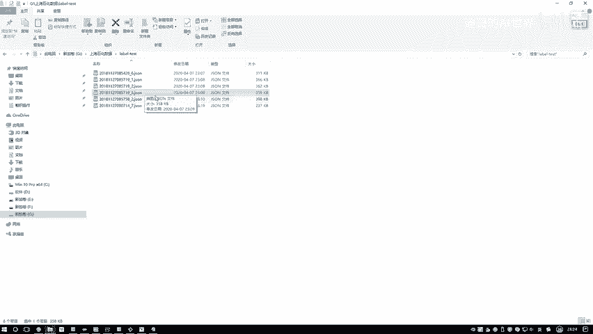

因此，我们必须将LabelMe的绝对坐标格式转换为YOLO所需的相对坐标格式。

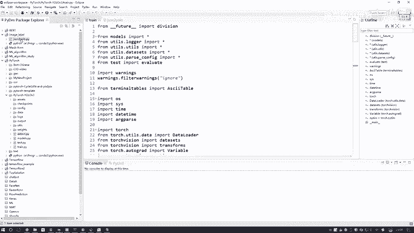

## 标签转换实战

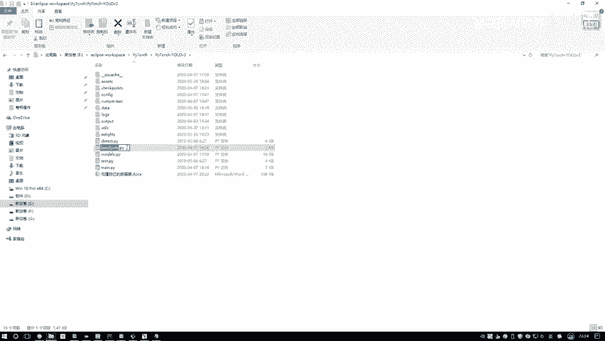

以下是进行标签格式转换的具体步骤和代码说明。

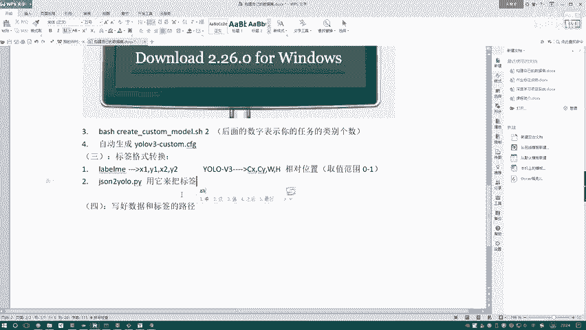

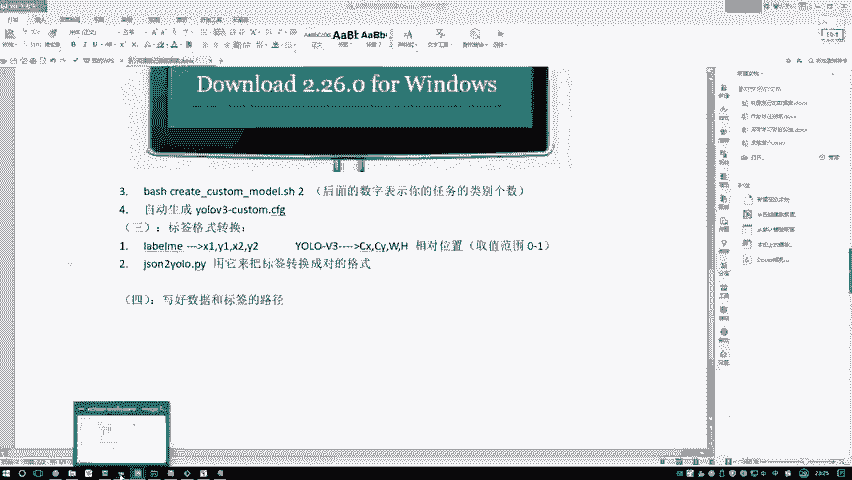

首先，我们需要明确类别及其对应的索引。这通过一个字典来定义。

```python
# 定义类别名称与索引的映射关系
# 索引从0开始，顺序需与后续的names文件保持一致
classes = {
    "person": 0,
    "crane": 1  # 示例类别“吊车”
}
```

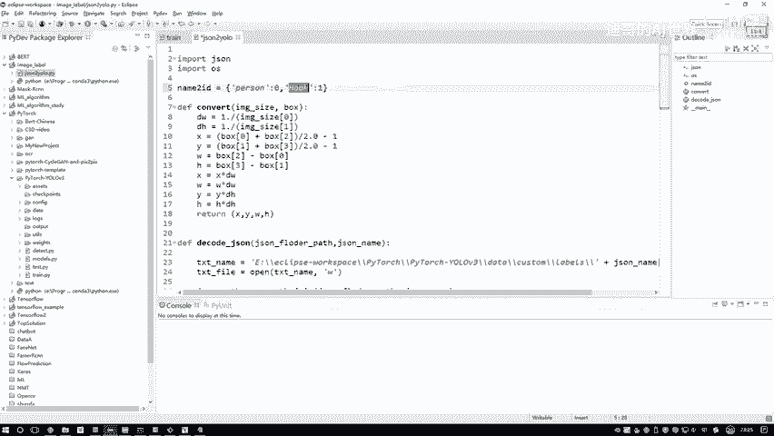

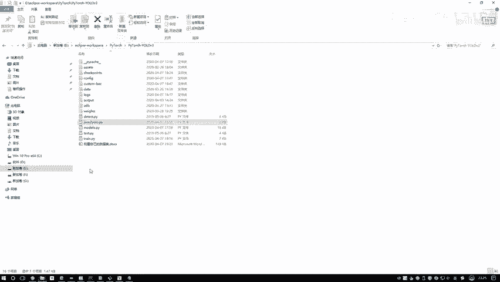

接下来，我们读取JSON文件并进行坐标转换。核心转换公式如下：

```python
# 假设图片宽度为 img_w，高度为 img_h
# LabelMe中的坐标：x1, y1, x2, y2
# YOLO格式转换：
cx = (x1 + x2) / 2.0 / img_w
cy = (y1 + y2) / 2.0 / img_h
w = abs(x2 - x1) / img_w
h = abs(y2 - y1) / img_h
```

为了方便大家使用，我已经编写好了一个完整的转换脚本 `json_to_yolo.py`。你需要根据你的项目结构修改两个关键路径：

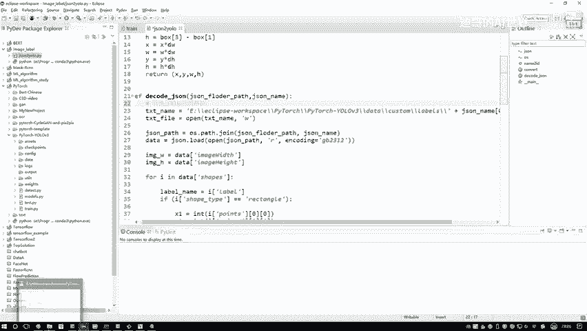

1.  **JSON文件所在路径**：指向你通过LabelMe标注生成的`.json`文件。
2.  **输出文件路径**：建议将转换后的`.txt`标签文件保存到项目目录的 `data/custom/labels/` 文件夹下，以便与后续的训练代码配置保持一致。

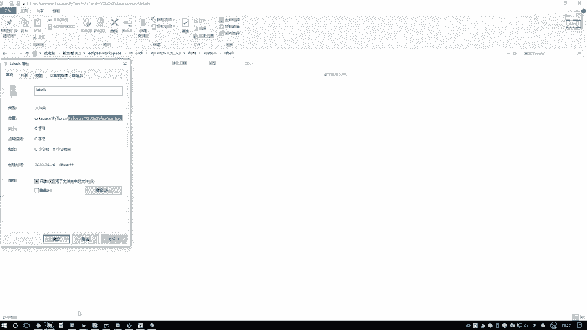

运行此脚本后，每个JSON文件都会生成一个同名的TXT文件，其中包含转换后的YOLO格式标签。

## 总结

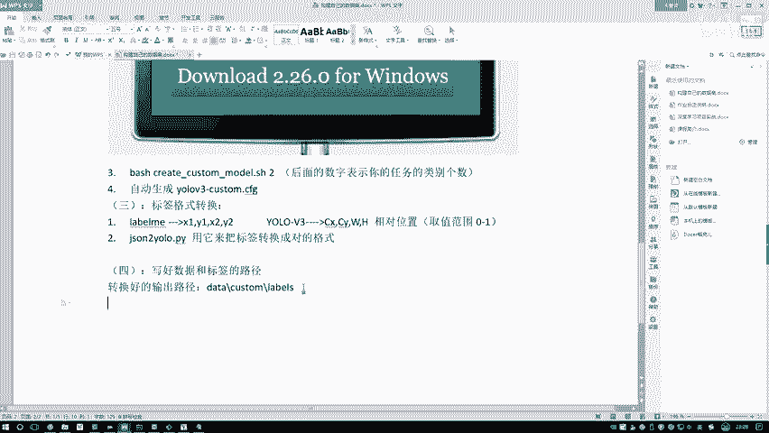

本节课中我们一起学习了将LabelMe的JSON标注格式转换为YOLO-v3训练格式的方法。我们理解了两种格式的核心差异：绝对坐标与相对坐标。通过使用提供的转换脚本并正确配置路径，你可以轻松完成自定义数据集的标签准备工作，为接下来的模型训练奠定基础。