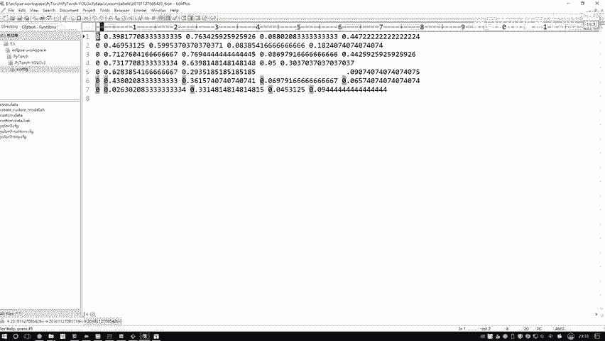
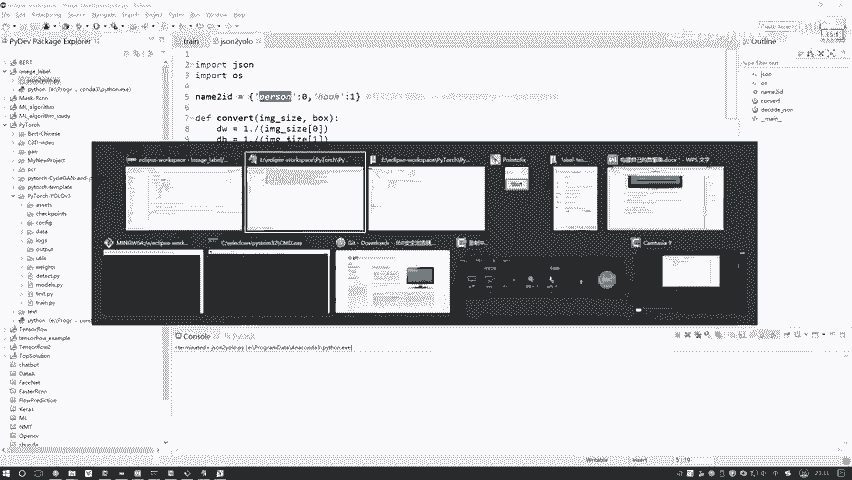
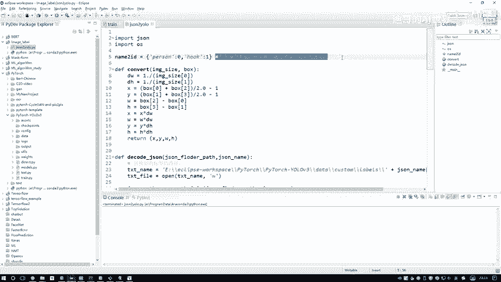
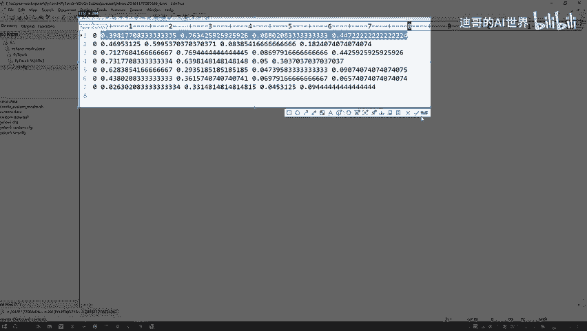
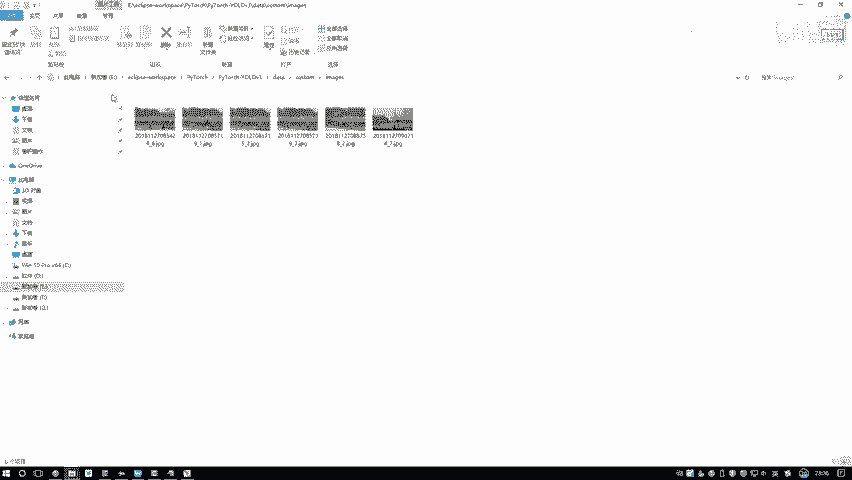
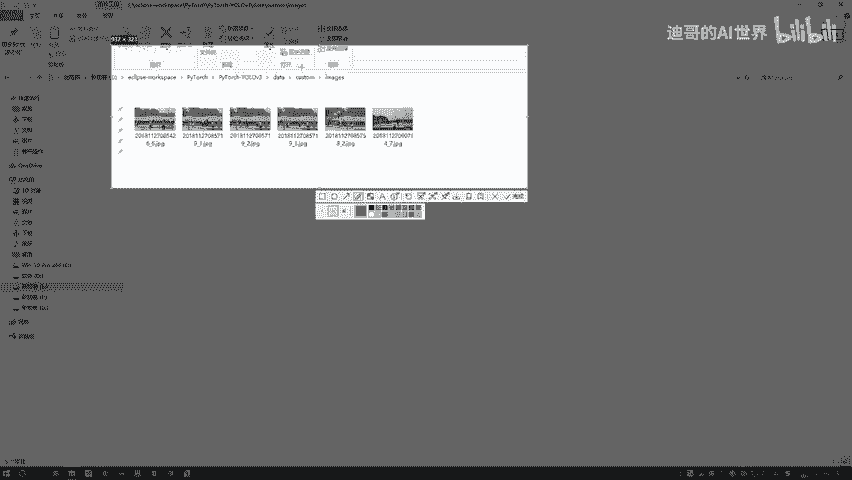
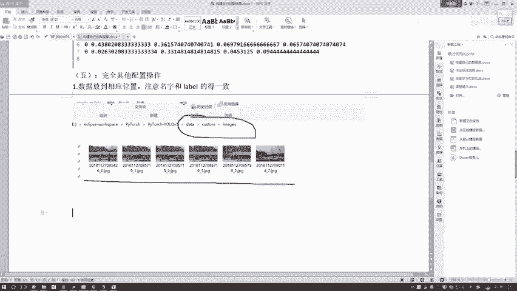

# 课程P89：6-完成输入数据准备工作 📝

在本节课中，我们将学习如何完成目标检测任务中输入数据的准备工作。具体内容包括将LabelMe标注的JSON文件转换为YOLO格式的标签文件，以及将对应的图像文件整理到正确的目录结构中。

---

## 指定JSON文件路径

上一节我们介绍了数据标注的概念，本节中我们来看看如何读取这些标注文件。

首先，需要在代码中指定存放LabelMe生成的JSON标签文件的文件夹路径。这里使用绝对路径以避免路径问题。

```python
json_dir = "C:\\Users\\YourName\\Desktop\\label_test"
```

**注意**：在Windows系统中，路径分隔符应使用双反斜杠 `\\` 或正斜杠 `/`，以防止被Python解释为转义字符。

---

## 读取并转换JSON文件

指定路径后，程序将遍历该文件夹中的所有JSON文件。对于每一个文件，都需要读取并进行格式转换。

在上述代码中，程序会打开一个输出文件用于写入转换后的标签。然后，读取当前的JSON文件内容。

JSON文件中包含了图像的宽度`W`和高度`H`，以及每一个标注对象（称为`shape`）的信息。我们的目标是获取每个对象的类别和边界框坐标，并将其转换为YOLO所需的中心点坐标和相对宽高。

以下是转换过程的核心步骤：

1.  **计算图像尺寸**：从JSON中获取图像的原始宽度`W`和高度`H`。
2.  **遍历每个标注对象**：对于JSON中的每一个`shape`（即一个标注框）：
    *   获取其类别标签`label_name`（例如“person”）。
    *   获取其矩形框的左上角`(x1, y1)`和右下角`(x2, y2)`坐标。
3.  **执行坐标转换**：通过一个`convert`操作，将绝对坐标转换为相对坐标（0到1之间）。
    *   中心点x坐标：`cx = (x1 + x2) / 2.0 / W`
    *   中心点y坐标：`cy = (y1 + y2) / 2.0 / H`
    *   框的相对宽度：`w = (x2 - x1) / W`
    *   框的相对高度：`h = (y2 - y1) / H`

转换完成后，每一行标签数据的格式为：`类别索引 cx cy w h`。

**注意**：类别索引需要根据之前定义的类别映射字典进行转换，例如“person”可能对应索引`0`。

---

## 生成转换后的标签文件

完成转换逻辑后，执行代码。程序会快速处理所有JSON文件，并在指定的输出目录（例如`data/custom/labels/`）下生成对应的`.txt`标签文件。

每个`.txt`文件与原始的JSON文件同名。文件内容如下所示：

```
0 0.5 0.5 0.3 0.4
0 0.2 0.7 0.1 0.2
```



这表示该图像中有两个标注框，类别都是`0`（例如“person”），后面四列分别是中心点坐标和宽高的相对值。






至此，标签文件的转换工作就完成了。



---

## 整理图像数据文件

标签准备完毕后，接下来需要整理对应的图像文件。

我们需要将训练和验证所用的图像文件放入指定的目录中（例如`data/custom/images/`）。

以下是操作要点：

*   **手动或代码复制**：可以将图像文件手动复制到目标文件夹。在数据量较大时，建议编写简单的脚本自动完成。
*   **保持文件名一致**：**至关重要的一点是，图像文件的名称（不含后缀）必须与对应的标签文件名称完全一致。**
    *   例如：图像 `image_001.jpg` 对应标签 `image_001.txt`。



通过以上步骤，我们就完成了输入数据的全部准备工作，得到了结构清晰、格式正确的图像和标签文件对。

---




## 课程总结

本节课中我们一起学习了目标检测数据准备的最后步骤。

我们首先指定了LabelMe标注文件的路径，然后编写代码读取JSON文件，并将其中以`(x1, y1, x2, y2)`格式存储的边界框坐标，转换为YOLO系列模型所需的`(cx, cy, w, h)`相对坐标格式，并生成了对应的文本标签文件。



最后，我们将图像文件整理到相应目录，并强调了图像文件名与标签文件名必须保持一致的关键要求。至此，数据已准备就绪，可用于后续的模型训练。