# 课程P9：ROI区域操作与通道分离 🖼️

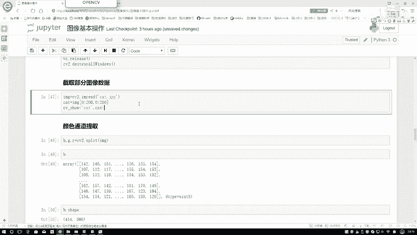

在本节课中，我们将学习OpenCV中两个核心的图像处理操作：**ROI（感兴趣区域）截取**和**BGR颜色通道的分离与合并**。这些操作是后续进行更复杂图像处理和分析的基础。

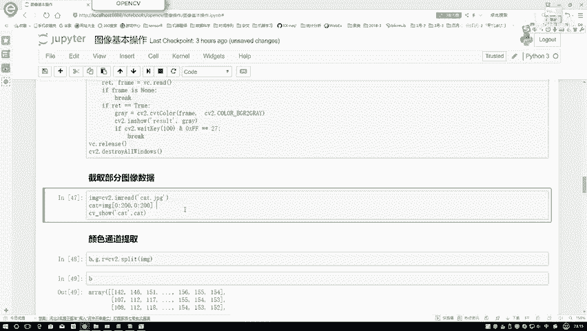

---

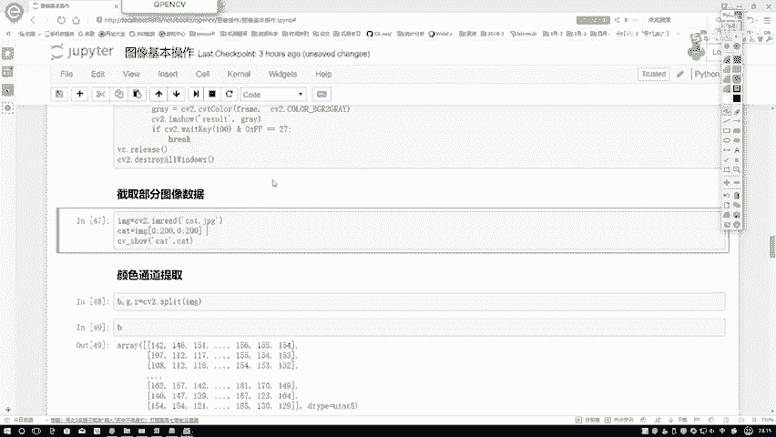

上一节我们介绍了图像的基本读取与显示，本节中我们来看看如何从图像中提取特定的部分。

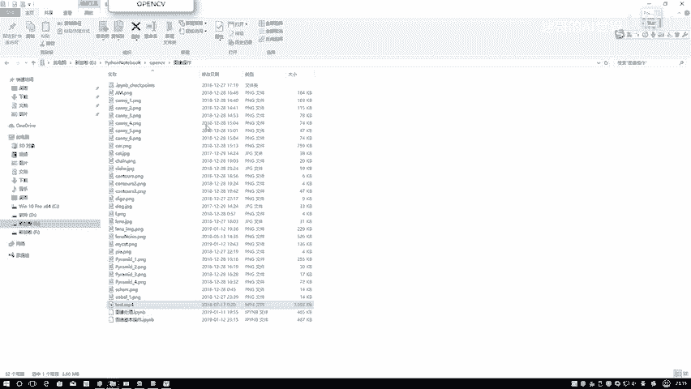

## ROI（感兴趣区域）截取

ROI是“Region of Interest”的缩写，意为感兴趣区域。它指的是从一张完整的图像中，截取出我们想要观察或处理的特定部分。

例如，给定一张小猫的图像，我们可能只对图像中间的某个区域感兴趣，而不是整张图。

以下是实现ROI截取的步骤：

1.  首先，将图像数据读入。在OpenCV中，图像数据本质上是一个多维数组（NumPy数组）。
2.  利用数组的切片（Slicing）操作，可以指定我们想要截取的区域范围。

具体操作如下面的代码所示：

```python
# 假设 `img` 是已经读取的图像
roi = img[50:200, 50:200]  # 截取纵坐标50到200，横坐标50到200的区域
```

在这行代码中，`img[50:200, 50:200]` 就是一个切片操作。它从原始图像中截取了一个高度为150像素（200-50）、宽度为150像素的矩形区域。这样，我们就得到了一个只包含感兴趣部分的新图像 `roi`。

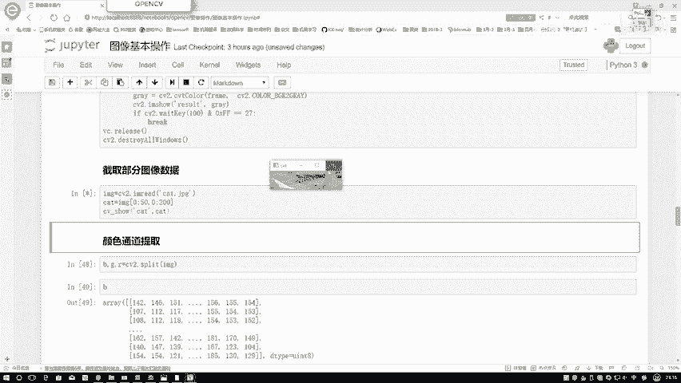

---

上一节我们学会了如何截取图像的局部区域，本节中我们来看看如何对彩色图像的各个颜色通道进行操作。

## BGR通道的分离与合并

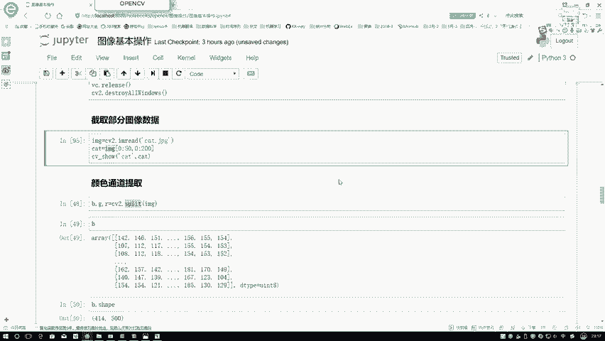

在OpenCV中，彩色图像默认以BGR（蓝、绿、红）顺序存储。有时我们需要分别分析或处理这三个颜色通道。

### 通道分离

我们可以使用 `cv2.split()` 函数将一张彩色图像分离成独立的B、G、R三个通道。

```python
b, g, r = cv2.split(img)
```

分离后得到的 `b`、`g`、`r` 分别是代表蓝色、绿色、红色通道的二维数组。它们的大小（`shape`）与原始图像的高度和宽度一致，只是失去了颜色维度。

### 通道合并

处理完单个通道后，我们可以使用 `cv2.merge()` 函数将它们重新合并成一张彩色图像。合并时需要按照B、G、R的顺序传入通道。

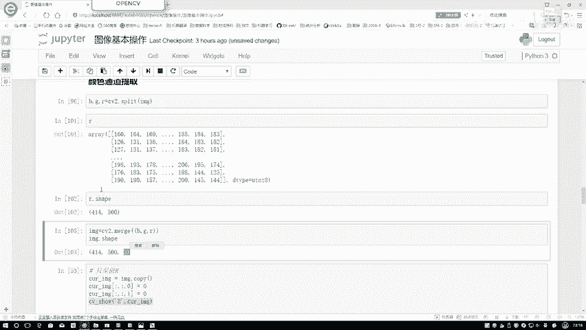

```python
img_merged = cv2.merge([b, g, r])
```

合并后的图像 `img_merged` 将恢复为原始的三通道BGR格式。

### 查看单一通道效果

为了直观理解每个通道的作用，我们可以通过将其他两个通道的值置为零，来观察仅保留一个通道时的图像效果。

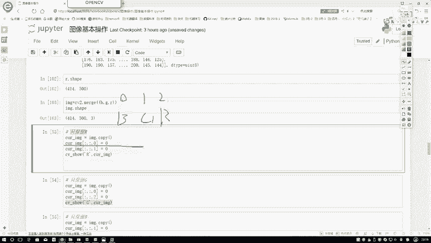

以下是分别仅保留R、G、B通道的代码：

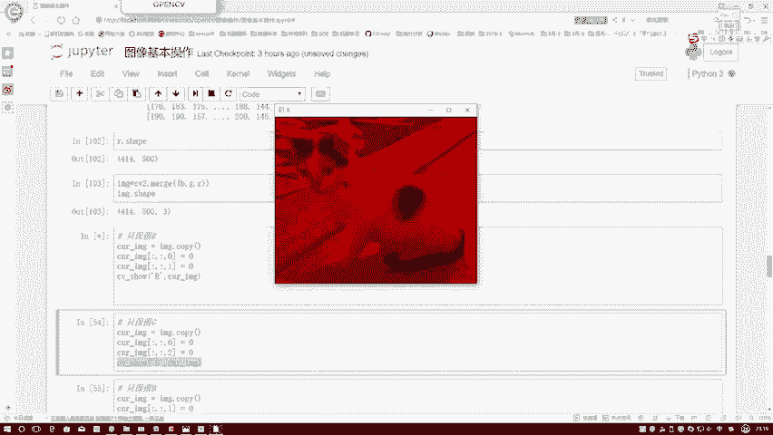

```python
# 仅保留红色通道
img_r = img.copy()
img_r[:, :, 0] = 0  # 将B通道置零
img_r[:, :, 1] = 0  # 将G通道置零
# R通道保持不变

# 仅保留绿色通道
img_g = img.copy()
img_g[:, :, 0] = 0  # 将B通道置零
img_g[:, :, 2] = 0  # 将R通道置零

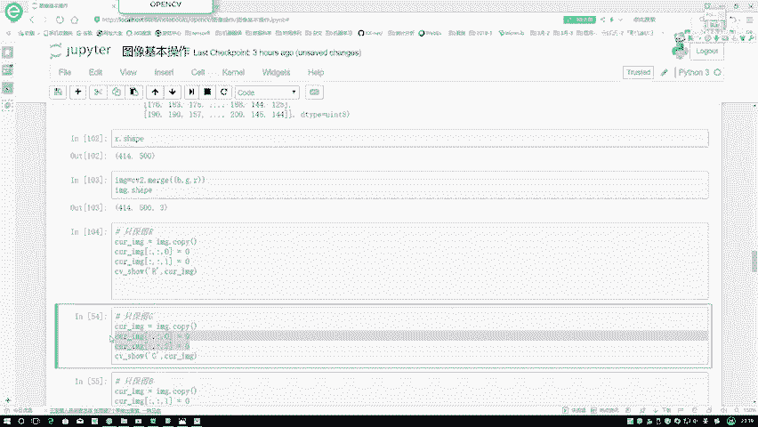

# 仅保留蓝色通道
img_b = img.copy()
img_b[:, :, 1] = 0  # 将G通道置零
img_b[:, :, 2] = 0  # 将R通道置零
```

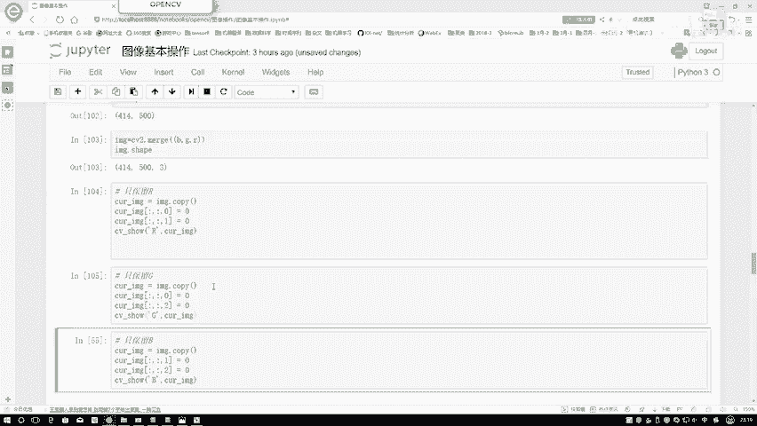

通过这种方式，我们可以看到：
*   仅保留R通道时，图像呈现偏红的色调。
*   仅保留G通道时，图像呈现偏绿的色调。
*   仅保留B通道时，图像呈现偏蓝的色调。
这三个单通道图像叠加在一起，才构成了我们看到的完整彩色图像。

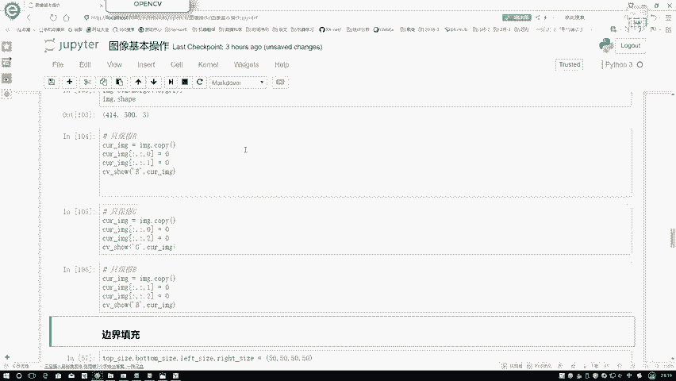

---

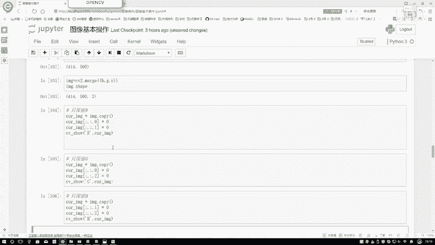

本节课中我们一起学习了两个重要的图像基础操作。首先，我们掌握了如何使用数组切片来截取图像的ROI区域，这能帮助我们将注意力集中在关键部分。接着，我们深入了解了彩色图像的BGR通道结构，学会了如何分离、合并通道，以及如何可视化单个通道的效果。这些技能是进行图像处理、特征提取等高级任务的基石。