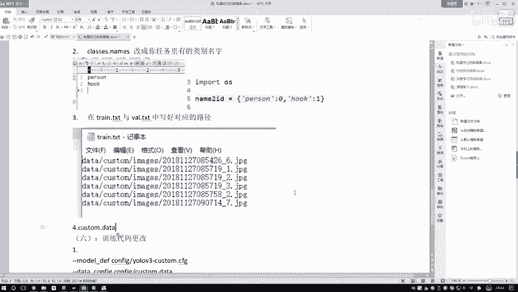
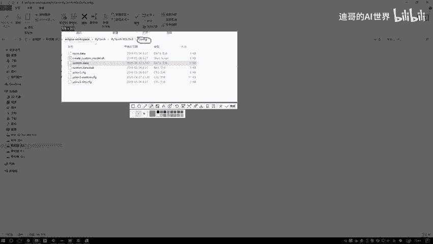
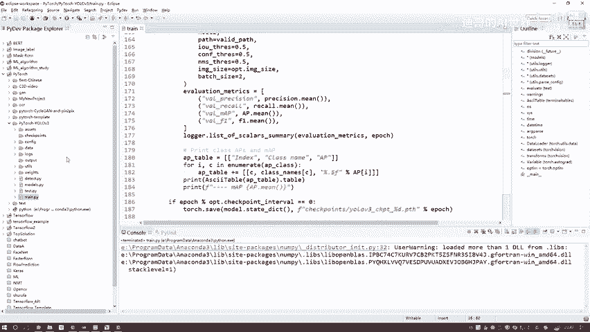

# 课程P90：7-训练代码与参数配置更改 🛠️

在本节课中，我们将学习如何修改YOLOv5项目的训练代码与参数配置文件，以适配我们自定义的数据集。我们将一步步讲解需要修改的关键位置，确保模型能够正确识别我们自己的类别。

---

## 概述

我们将从修改配置文件中的类别名称开始，然后处理训练和验证数据集的路径文件，最后调整训练脚本中的关键参数。整个过程旨在将通用模型框架应用于我们的特定任务。

---

## 第一步：修改类别名称文件

上一节我们准备好了数据集，本节中我们来看看如何让模型认识我们的数据类别。首先需要修改 `class.names` 文件，该文件定义了模型需要识别的所有类别名称。

以下是具体操作步骤：

1.  打开项目中的 `class.names` 文件。
2.  删除文件中所有与本任务无关的默认类别名称。
3.  按照顺序，逐行写入我们自定义的类别名称。例如，本任务有两个类别：`person` 和 `吊钩`。
4.  注意，在写完最后一个类别后，需要额外按一次回车键，确保光标移动到新的一行，以避免文件读取错误。
5.  保存文件。

**核心概念**：类别名称的顺序必须与数据标注文件中构建的类别ID字典顺序完全一致。例如，在标注字典中 `0` 对应 `person`，那么在 `class.names` 文件中，第一行也必须是 `person`。

---

## 第二步：配置数据路径文件

接下来，我们需要创建或修改训练集和验证集的路径文件，即 `train.txt` 和 `validation.txt`。这两个文件包含了所有用于训练和验证的图片的绝对路径。

以下是具体操作步骤：

1.  **创建 `train.txt`**：遍历你的训练集图片文件夹（例如 `data/custom/images/train/`），将每张图片的完整文件路径逐行写入 `train.txt`。
2.  **创建 `validation.txt`**：用同样的方法，为验证集图片创建路径文件。
3.  你可以编写一个简单的脚本来自动完成此过程，也可以手动复制粘贴路径。对于初学者，建议先手动操作以理解流程。
4.  确保文件中的路径在你的计算机上是有效的。如果你的项目目录结构不同，需要相应调整路径。

**代码示例**（生成路径文件的Python脚本思路）：
```python
import os

# 假设图片存放在此文件夹
image_dir = ‘data/custom/images/train/‘
# 获取所有图片文件的路径
image_paths = [os.path.join(image_dir, img) for img in os.listdir(image_dir) if img.endswith(('.jpg', '.png'))]

# 写入 train.txt
with open(‘train.txt’, ‘w’) as f:
    for path in image_paths:
        f.write(path + ‘\n’)
```

---



## 第三步：修改配置文件中的数据集设置



现在，我们需要修改YOLOv5的配置文件，以指向我们刚刚设置好的数据和类别。关键文件是 `custom.data`（或类似名称的配置文件）。

以下是具体操作步骤：

1.  在项目的 `config` 目录下找到 `custom.data` 文件并打开。
2.  修改其中的关键参数：
    *   `classes`：将其值改为我们自定义的类别数量，例如 `2`。
    *   `train`：指向我们创建的 `train.txt` 文件的路径。
    *   `val`：指向我们创建的 `validation.txt` 文件的路径。
    *   `names`：指向我们修改好的 `class.names` 文件的路径。
3.  保存修改。

---

## 第四步：调整训练脚本参数

最后，我们进入训练代码 `train.py`，对启动训练所需的参数进行配置。这是启动训练前的最后一步。

以下是 `train.py` 中需要关注和修改的主要参数：

1.  **`--model`**：指定我们自定义的模型配置文件路径（即上一步修改的 `custom.yaml` 文件路径）。例如：`--model ./config/custom.yaml`。
2.  **`--data`**：指定我们修改好的数据配置文件路径。例如：`--data ./config/custom.data`。
3.  **`--pretrained`**：是否加载预训练权重。**强烈建议设置为 `True`**，以便在预训练模型的基础上进行微调（迁移学习），这对于数据量较小的任务至关重要。除非你有数千张以上的图片，否则不要从头开始训练。
4.  **`--epochs`**：训练的总轮数。可以根据任务复杂度调整，例如设为 `100`。
5.  **`--batch-size`**：每次输入模型的图片数量。根据你的显卡显存大小调整，显存小则设置较小的值，如 `2` 或 `4`。
6.  **`--save-period`**：每隔多少轮保存一次模型权重。例如设为 `50`，则会在第50轮和第100轮结束时保存模型。
7.  **`--device`**：指定训练设备，如 `0` 代表使用第一块GPU。

**参数配置示例**：
```bash
python train.py --model ./config/custom.yaml --data ./config/custom.data --pretrained --epochs 100 --batch-size 2 --save-period 50 --device 0
```

完成这些参数的设置后，运行 `train.py` 脚本即可开始针对自定义数据集的模型训练。

---

## 总结



本节课中我们一起学习了将YOLOv5应用于自定义数据集的关键配置步骤。我们首先修改了 `class.names` 文件来定义新类别，然后创建了 `train.txt` 和 `validation.txt` 来指定数据路径，接着在 `custom.data` 配置文件中关联了这些设置，最后在 `train.py` 训练脚本中配置了模型、数据、预训练权重等核心参数。遵循这些步骤，你就可以成功地用自己的数据训练目标检测模型了。