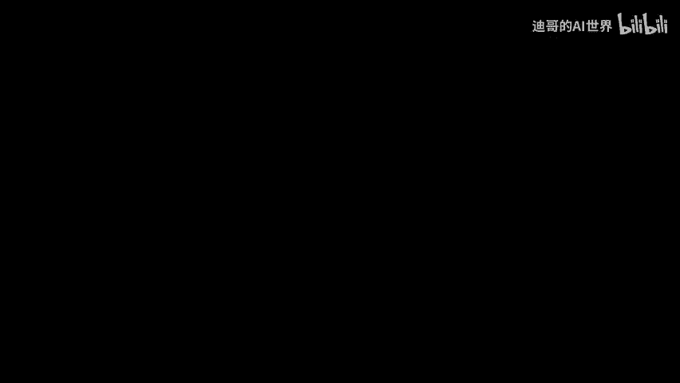
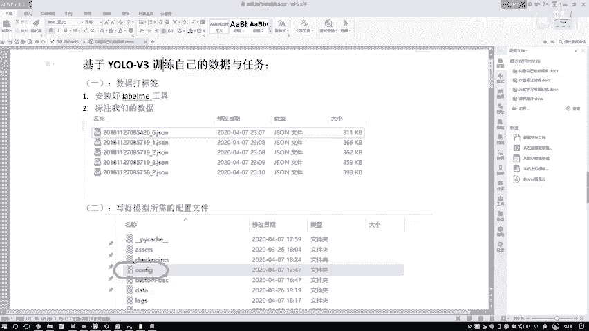

# 课程P91：8-训练模型并测试效果 🚀

在本节课中，我们将学习如何训练一个YOLOv3模型，并使用训练好的模型对图像进行目标检测预测。我们将涵盖从配置训练参数、运行训练过程到执行预测并查看结果的完整流程。

---

## 训练模型

上一节我们介绍了数据准备和配置文件，本节中我们来看看如何启动模型训练。

将参数配置好后，直接运行训练脚本即可。运行过程中，程序会打印出每一个epoch的损失值。由于我们提供的数据量较少，训练过程看起来会很快。

实际上，当数据量较大时，一个epoch的运行时间可能会很长。因此，不要误以为所有训练任务都很快，这只是因为当前数据量小，检测速度快。

以下是训练过程中的关键观察点：
*   当前损失值会持续下降，我们主要关注最终的损失值结果。
*   训练过程大约会运行100个epoch。
*   训练完成后，会得到一个最终的模型。

训练结束后，我们将实际查看模型在行人检测任务上的效果。我们仅使用了六张图像进行训练，需要验证模型是否能完成检测任务。

---

## 额外注意事项

在训练前，有一个重要的操作步骤需要强调。

当执行 `create_model.sh` 脚本时，不能重复执行。每次执行前，需要先删除旧的配置文件。

以下是具体操作步骤：
1.  先删除现有的配置文件（例如 `cfg` 文件）。
2.  然后再执行 `create_model.sh` 脚本。

如果不这样做，新配置会在旧配置基础上叠加，导致模型配置文件混乱。因此，在使用 `create_model.sh` 时，务必先清理旧的 `cfg` 文件。

---

## 加载训练好的模型

当模型训练完成后，在项目目录中会有一个 `train_weights` 文件夹用于保存模型权重。

在训练代码 `train.py` 的最后部分，设置了每50个epoch将模型保存到 `train_weights` 中。这个保存路径可以根据需要自行修改。

我们可以在 `train_weights` 文件夹中找到训练好的模型，例如 `yolov3_custom_100`，这就是我们训练了100个epoch的最终模型。

接下来进行预测时，我们将使用这个训练好的模型。

---

## 执行预测操作

现在，我们进入预测阶段，使用训练好的模型对图像进行检测。

我们打开 `detect.py` 文件，首先需要配置预测所需的参数。

以下是预测操作的核心参数配置：
*   **预测文件路径**：将所有需要预测的图像文件放在一个文件夹中。例如，我们将训练集中的图像放入 `data/samples` 目录。
*   **模型权重路径**：指定训练好的模型文件路径，例如 `train_weights/yolov3_custom_100`。
*   **类别名称文件**：用于在预测框上显示物体类别名称（如“person”），将模型输出的索引值转换为实际类别名。

参数配置完成后，直接运行 `detect.py` 脚本。第一次执行时速度可能较慢，后续会变快。

程序开始检测，完成后会得到结果。预测结果图像保存在 `output` 文件夹中。

我们查看 `output` 文件夹，里面保存了所有带检测框的结果图像。可以看到，模型成功检测出了图像中标注的行人。

需要说明的是，我们直接使用训练集进行预测属于“作弊”行为，因为数据量太少，模型在未见过的测试集上表现可能不佳。但在训练集上，它展示了良好的检测效果。

这个示例演示了完整的流程。建议大家在实际操作时，先从少量数据开始尝试，熟悉整个流程后，再应用到大型实际项目中。

---

## 总结

本节课中我们一起学习了YOLOv3模型训练与测试的完整流程。我们从配置参数、运行训练、注意配置清理，到加载训练好的模型并进行图像预测，逐步完成了目标检测任务。建议大家在课后亲自动手实践一遍，这是学习和熟练掌握的关键步骤，这些配置工作在实际项目中是常见任务。

整个YOLO系列课程到此结束。