# 001：K最近邻算法 (KNN) 实现教程 🧠

在本节课中，我们将学习并从头开始实现一个经典的机器学习算法——K最近邻算法。我们将只使用Python内置模块和NumPy库，不依赖任何高级机器学习框架，以帮助你深入理解其核心原理。

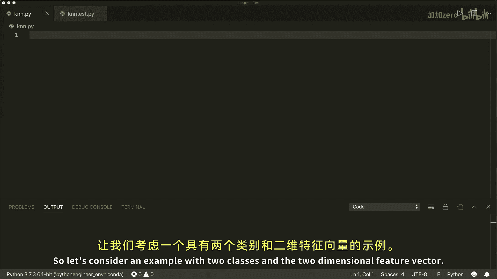

---

## 概述

K最近邻算法是一种简单直观的监督学习算法，常用于分类和回归任务。其核心思想是：一个样本的类别由其“邻居”中大多数样本的类别决定。本节课我们将实现一个用于分类的KNN模型。

## KNN算法核心概念

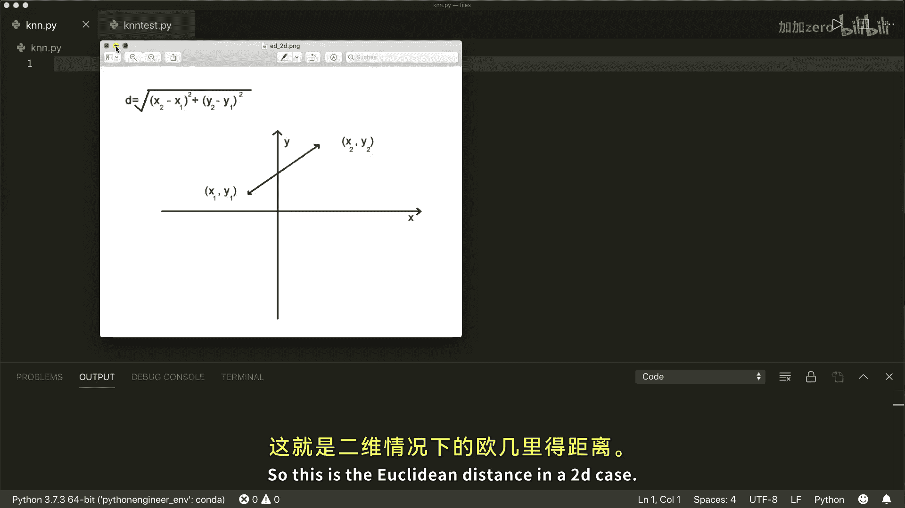

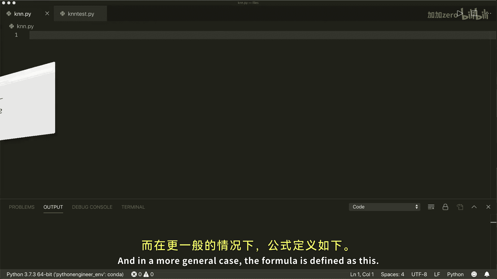

上一节我们概述了KNN的基本思想，本节中我们来看看其背后的数学原理。

KNN算法的核心在于“距离”计算和“多数投票”。对于一个待分类的新样本，算法会：

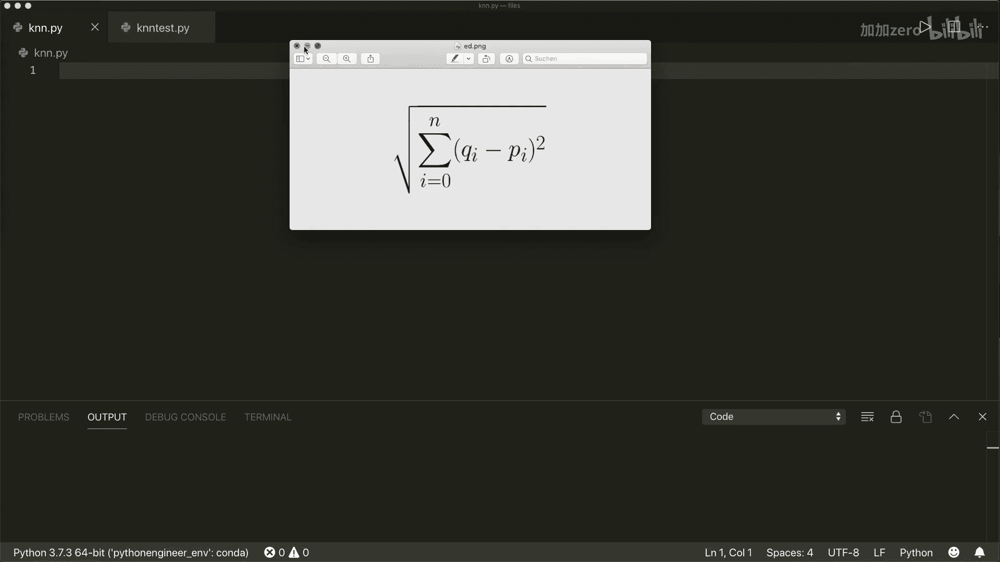

1.  计算它与数据集中每个已知类别样本的距离。
2.  找出距离最近的K个样本（即“最近邻”）。
3.  根据这K个邻居的类别，通过投票决定新样本的类别（即出现次数最多的类别）。

### 距离度量

我们通常使用**欧几里得距离**来衡量样本间的相似度。在二维空间中，两点 `(x1, y1)` 和 `(x2, y2)` 之间的欧几里得距离公式为：

**公式：**
`distance = √[(x2 - x1)² + (y2 - y1)²]`

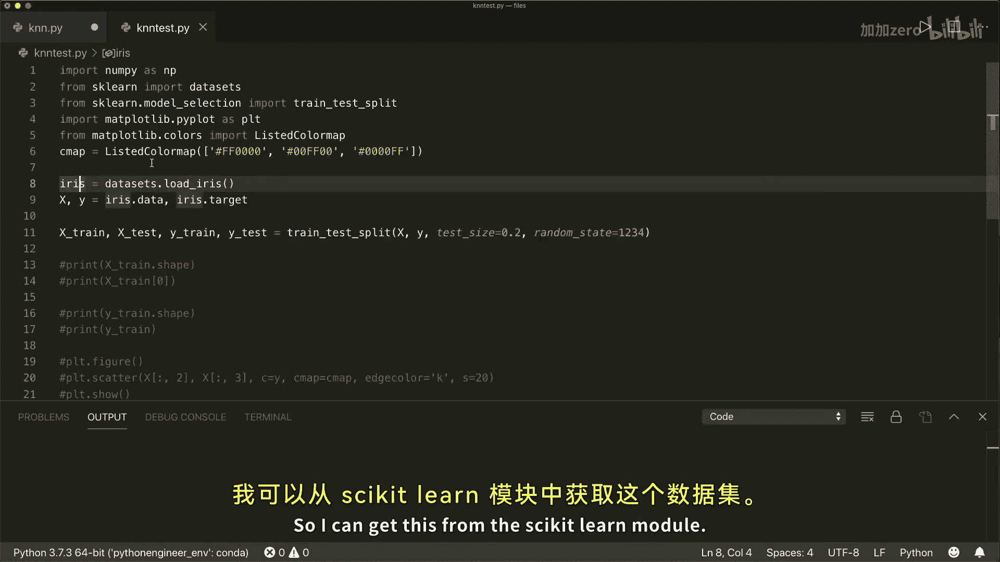

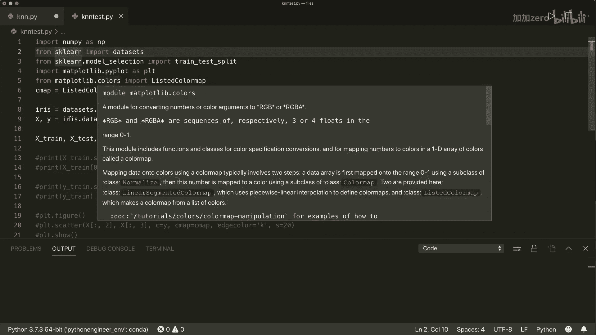

将其推广到n维空间，对于两个特征向量 `p` 和 `q`，其欧几里得距离定义为：

**公式：**
`distance(p, q) = √[ Σ (pi - qi)² ]`， 其中 `i` 从 1 到 n（n为特征维度）。

在代码中，我们可以用NumPy高效地实现这个计算。

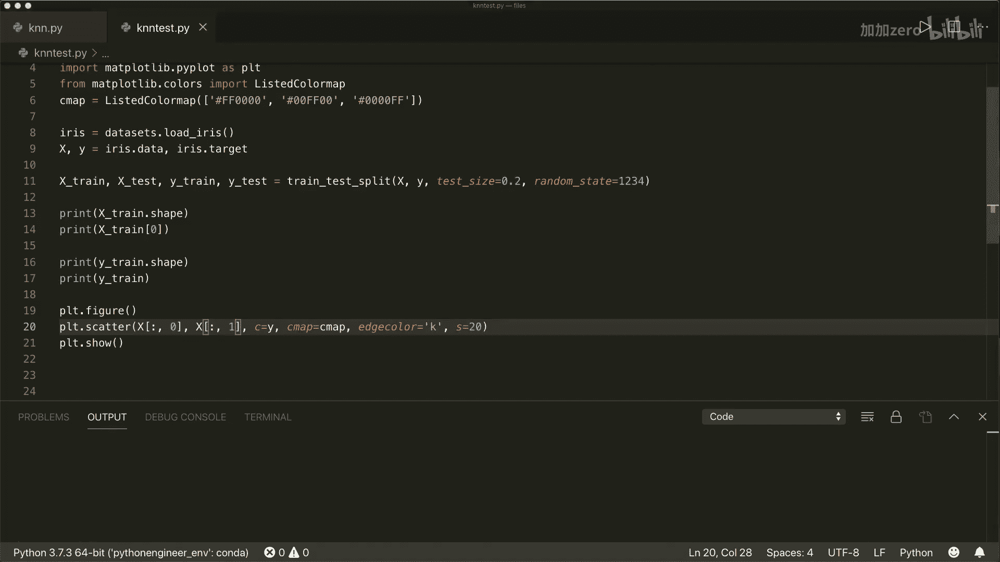

## 代码实现步骤

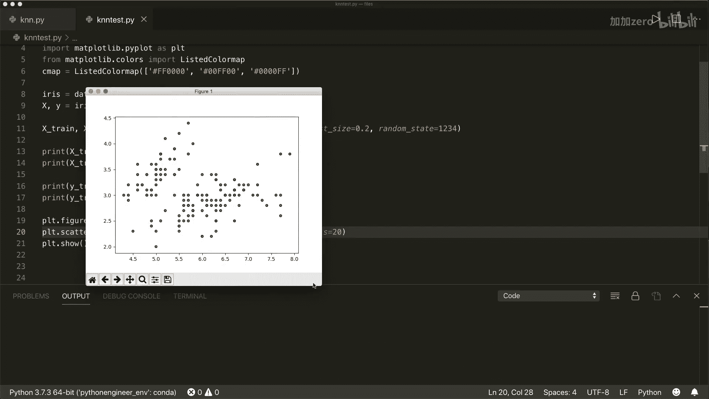

理解了核心概念后，我们现在开始动手实现。我们将遵循类似Scikit-learn库的API设计模式，创建包含 `fit` 和 `predict` 方法的类。

### 1. 创建KNN类框架

首先，我们定义一个 `KNN` 类。它的初始化方法接收一个参数 `k`，代表要考虑的最近邻居的数量。

**代码：**
```python
import numpy as np
from collections import Counter


class KNN:
    def __init__(self, k=3):
        self.k = k
```

### 2. 实现训练方法 (`fit`)

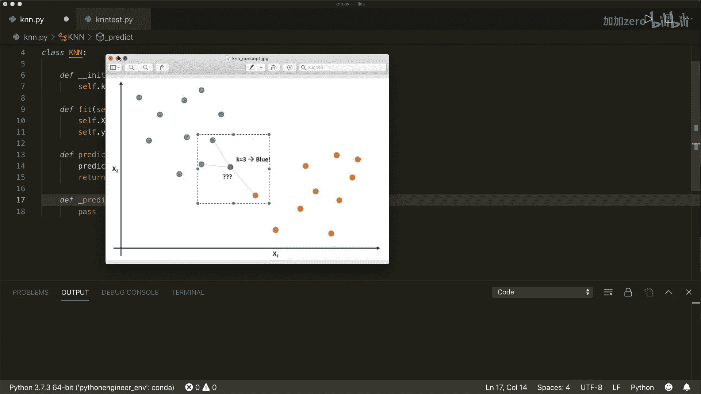

对于KNN算法，训练过程出奇地简单，仅仅是将训练数据存储起来，供后续预测时查询。因此，`fit` 方法只是保存数据。

**代码：**
```python
    def fit(self, X, y):
        self.X_train = X
        self.y_train = y
```


### 3. 实现辅助函数：欧几里得距离

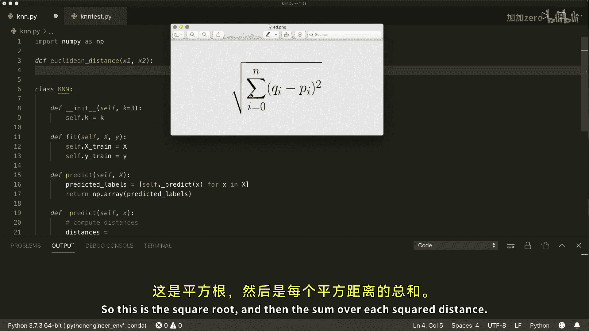

在编写预测逻辑前，我们需要一个计算两点间欧几里得距离的函数。

**代码：**
```python
def euclidean_distance(x1, x2):
    return np.sqrt(np.sum((x1 - x2) ** 2))
```

### 4. 实现核心预测方法 (`predict`)

`predict` 方法可以接收多个样本进行批量预测。其内部对每个样本调用一个辅助函数 `_predict`。

**代码：**
```python
    def predict(self, X):
        predicted_labels = [self._predict(x) for x in X]
        return np.array(predicted_labels)
```

现在，让我们实现最关键的 `_predict` 方法，它处理单个样本的预测。以下是该方法的步骤：

**代码：**
```python
    def _predict(self, x):
        # 1. 计算新样本与所有训练样本的距离
        distances = [euclidean_distance(x, x_train) for x_train in self.X_train]
        
        # 2. 获取K个最近邻的索引
        k_indices = np.argsort(distances)[:self.k]
        
        # 3. 获取这K个邻居的标签
        k_nearest_labels = [self.y_train[i] for i in k_indices]
        
        # 4. 多数投票，选出最常见的标签
        most_common = Counter(k_nearest_labels).most_common(1)
        return most_common[0][0]
```
让我们分解一下这段代码：
*   `np.argsort(distances)` 返回的是距离值从小到大排序后的**索引**数组。
*   `[:self.k]` 切片操作取出前K个最小距离对应的索引。
*   `Counter(...).most_common(1)` 返回一个列表，其中包含一个元组 `(最常见元素, 出现次数)`。

## 模型测试与验证

我们已经完成了KNN分类器的构建，现在用真实数据来测试它。我们将使用著名的鸢尾花数据集。

以下是加载数据、训练模型并评估准确率的步骤：

**代码：**
```python
# 1. 导入数据集并划分
from sklearn import datasets
from sklearn.model_selection import train_test_split

iris = datasets.load_iris()
X, y = iris.data, iris.target
X_train, X_test, y_train, y_test = train_test_split(X, y, test_size=0.2, random_state=42)

# 2. 使用我们的KNN类
classifier = KNN(k=3)
classifier.fit(X_train, y_train)
predictions = classifier.predict(X_test)

# 3. 计算准确率
accuracy = np.sum(predictions == y_test) / len(y_test)
print(f"模型准确率： {accuracy:.2f}")
```
运行上述代码，你将看到模型在测试集上的分类准确率。你可以尝试改变 `k` 的值（如5、7），观察准确率的变化。

## 总结

本节课中我们一起学习了K最近邻算法的原理并完成了从零实现。我们主要涵盖了：
1.  **算法思想**：基于最近邻居的多数投票进行分类。
2.  **关键数学概念**：欧几里得距离公式。
3.  **完整实现**：构建了具有 `fit` 和 `predict` 方法的 `KNN` 类，包括距离计算、邻居选取和多数投票。
4.  **模型测试**：使用鸢尾花数据集验证了模型的有效性。

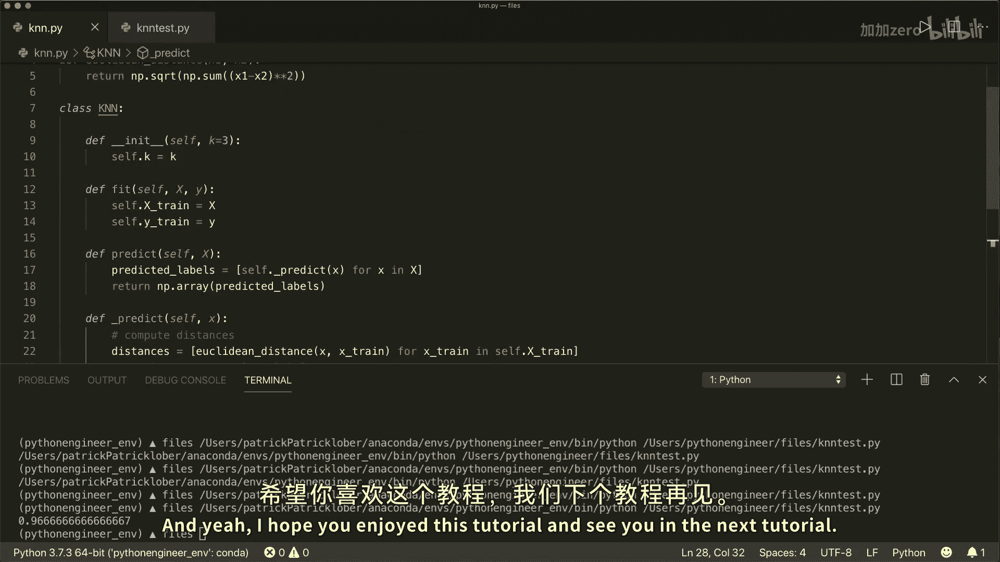

KNN是一种惰性学习算法，理解其实现有助于掌握机器学习的基本工作流程。在接下来的课程中，我们将探索其他更复杂的算法。