# 002：Python实现线性回归 📈

在本教程中，我们将学习线性回归算法的核心概念，并使用Python和NumPy库从零开始实现它。我们将涵盖线性回归的数学原理、梯度下降优化方法，并最终构建一个可用的线性回归模型类。

## 概述

线性回归是一种用于预测连续值的监督学习算法。其核心思想是找到一个线性函数（一条直线），使其能够最好地拟合给定的数据点。在本节中，我们将深入探讨其背后的数学原理。

## 线性回归概念

上一节我们介绍了本系列教程的目标。本节中，我们来看看线性回归的基本概念。

在回归任务中，我们的目标是预测连续值。这与分类任务不同，分类任务预测的是离散的类别标签（如0或1）。

观察示例散点图，数据点（蓝色圆点）分布呈现一定的趋势。线性回归的目标是使用一个线性函数来近似这些数据点，因此得名“线性回归”。

我们可以将近似函数定义为：
**y_hat = w * x + b**

这是一个直线方程。其中：
*   **w**（权重）代表直线的斜率。
*   **b**（偏置）代表直线在y轴上的截距（在二维情况下）。

我们的目标是找到最优的 **w** 和 **b**。

## 成本函数与梯度下降

我们已经定义了近似函数，那么如何找到最优的 **w** 和 **b** 呢？为此，我们需要定义一个成本函数。

在线性回归中，最常用的成本函数是**均方误差**。它衡量的是预测值 **y_hat** 与实际值 **y** 之间的差异。

均方误差的公式为：
**MSE = (1/n) * Σ(y_i - y_hat_i)²**

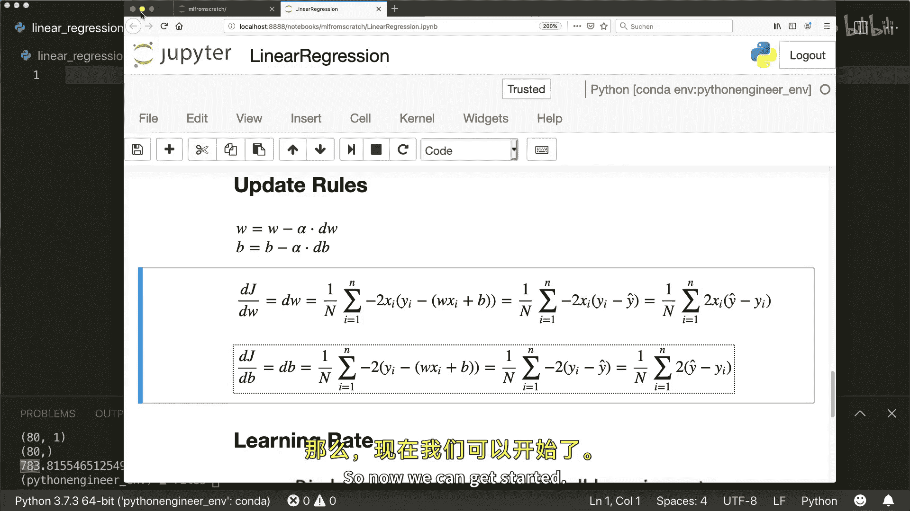

其中 **n** 是样本数量。这个值代表了模型的平均误差，我们自然希望它越小越好。因此，问题转化为寻找这个成本函数的最小值。

为了找到最小值，我们使用一种称为**梯度下降**的迭代优化方法。

梯度下降的核心思想是：从随机初始化的 **w** 和 **b** 开始，计算成本函数在当前点的梯度（即最陡下降的方向），然后沿着梯度的负方向更新参数，逐步逼近最小值。

参数更新规则如下：
**w_new = w_old - α * (∂MSE/∂w)**
**b_new = b_old - α * (∂MSE/∂b)**

其中：
*   **α** 是**学习率**，这是一个关键的超参数。
*   **∂MSE/∂w** 和 **∂MSE/∂b** 是成本函数对 **w** 和 **b** 的偏导数。

学习率决定了每次迭代更新的步长。学习率太小，收敛速度会变慢；学习率太大，可能导致在最小值附近震荡甚至无法收敛。

经过推导（此处省略详细过程），偏导数的计算公式可简化为：
**∂MSE/∂w = (2/n) * Σ( x_i * (y_hat_i - y_i) )**
**∂MSE/∂b = (2/n) * Σ( y_hat_i - y_i )**

常数因子2可以合并到学习率中，因此在实际计算时常常省略。

## 代码实现：LinearRegression类

理解了理论之后，现在让我们动手实现。我们将创建一个名为 `LinearRegression` 的类。

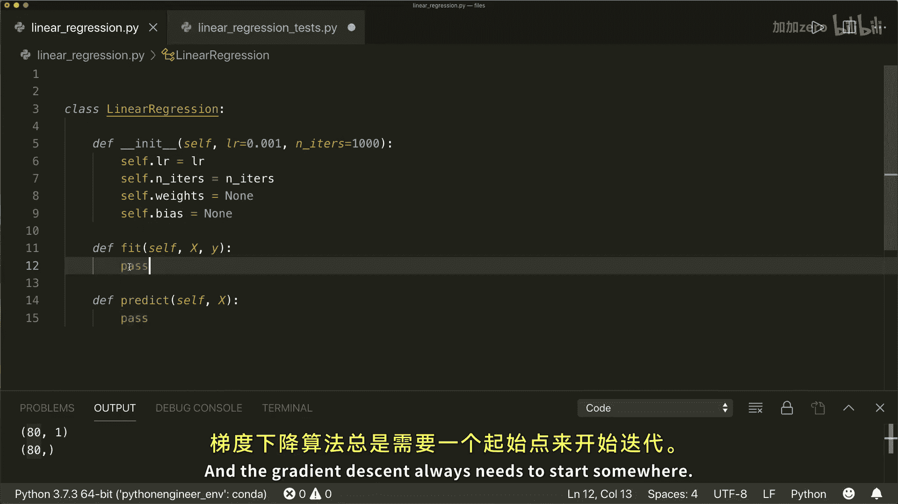

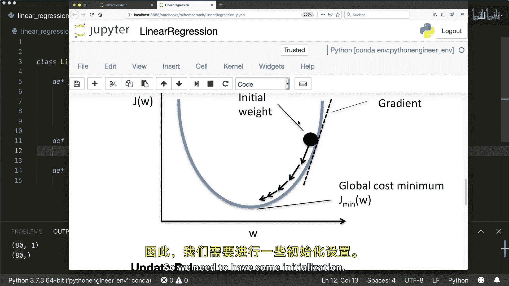

以下是该类的初始化方法 `__init__`：

```python
import numpy as np

class LinearRegression:
    def __init__(self, learning_rate=0.001, n_iters=1000):
        self.lr = learning_rate
        self.n_iters = n_iters
        self.weights = None
        self.bias = None
```
*   `learning_rate`: 学习率，默认值 `0.001`。
*   `n_iters`: 梯度下降的迭代次数，默认值 `1000`。
*   `weights` 和 `bias`: 模型参数，初始化为 `None`。

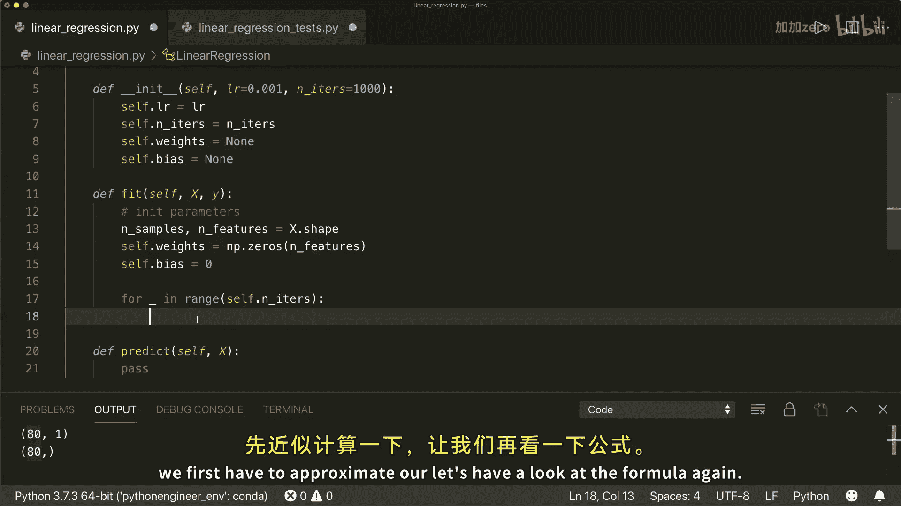

接下来，我们需要实现两个核心方法：`fit` 用于训练模型，`predict` 用于进行预测。

### 实现 `fit` 方法

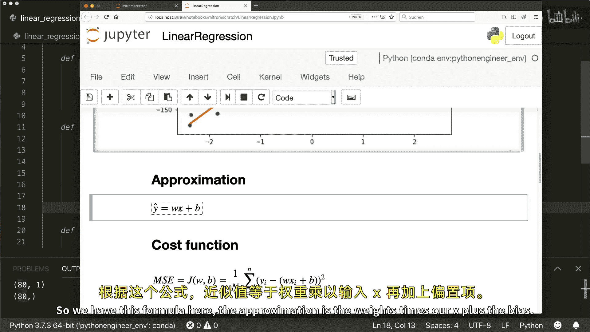

`fit` 方法接收训练数据 `X` 和对应的标签 `y`，并执行梯度下降来学习参数。

```python
    def fit(self, X, y):
        n_samples, n_features = X.shape

        # 初始化参数
        self.weights = np.zeros(n_features)
        self.bias = 0

        # 梯度下降
        for _ in range(self.n_iters):
            # 计算当前参数的预测值
            y_predicted = np.dot(X, self.weights) + self.bias

            # 计算梯度 (偏导数)
            dw = (1 / n_samples) * np.dot(X.T, (y_predicted - y))
            db = (1 / n_samples) * np.sum(y_predicted - y)

            # 更新参数
            self.weights -= self.lr * dw
            self.bias -= self.lr * db
```

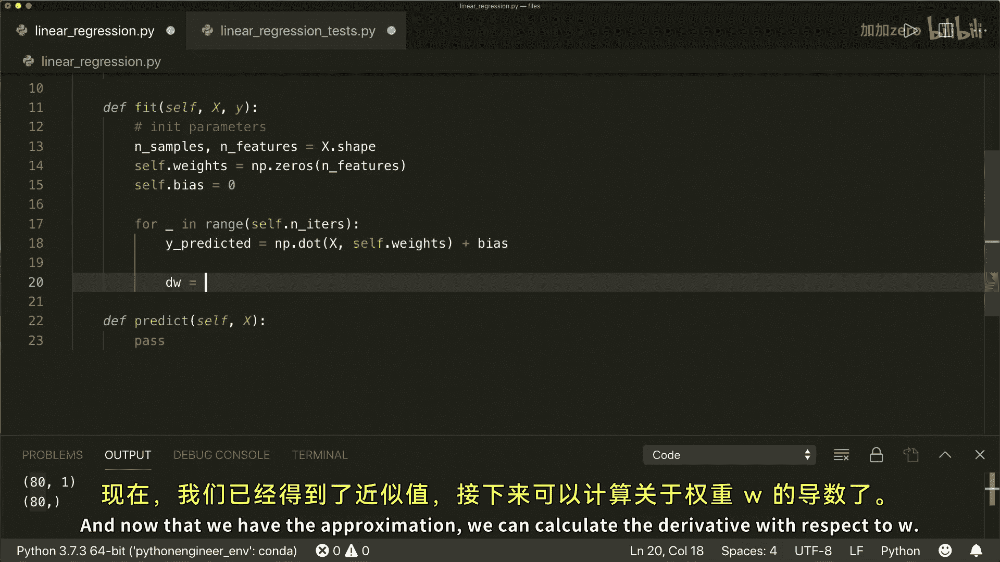

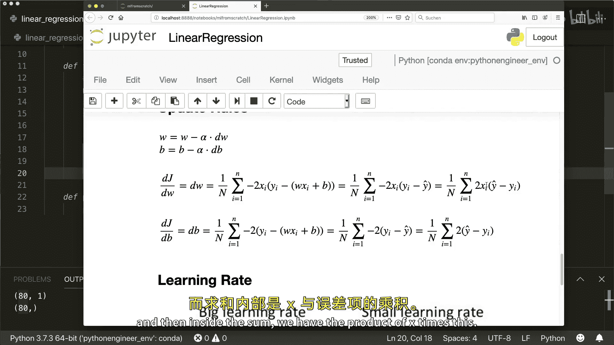

### 实现 `predict` 方法

`predict` 方法接收新的数据 `X`，并使用训练好的 `weights` 和 `bias` 进行预测。

```python
    def predict(self, X):
        y_approximated = np.dot(X, self.weights) + self.bias
        return y_approximated
```

## 模型测试与评估

我们的线性回归类已经完成。现在，让我们使用示例数据来测试它。

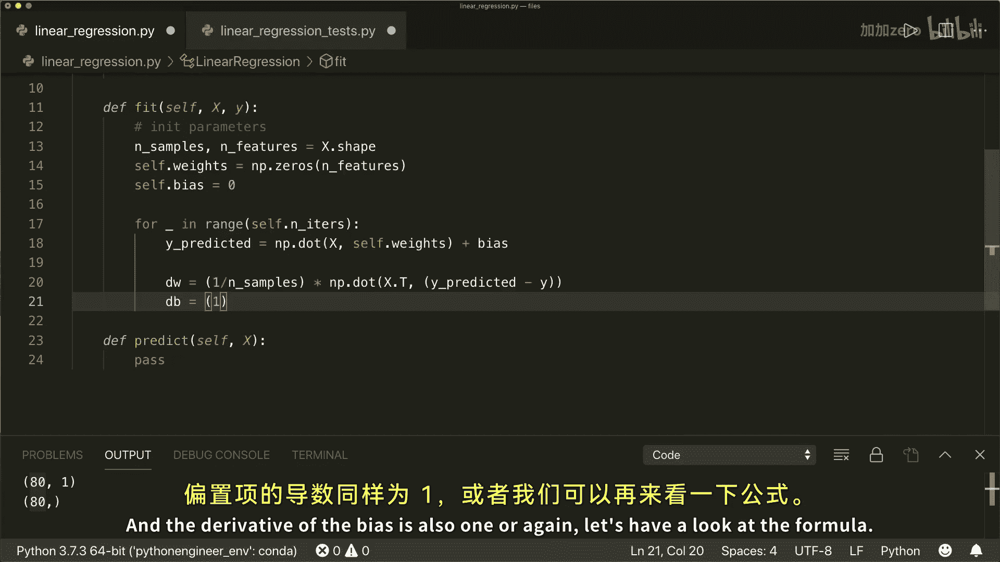

首先，我们生成一些线性数据，并将其分为训练集和测试集。

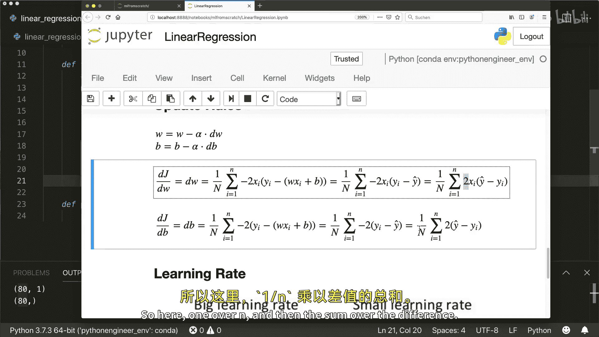

```python
from sklearn.model_selection import train_test_split
from sklearn import datasets
import matplotlib.pyplot as plt

# 生成示例数据
X, y = datasets.make_regression(n_samples=100, n_features=1, noise=20, random_state=4)
X_train, X_test, y_train, y_test = train_test_split(X, y, test_size=0.2, random_state=1234)
```

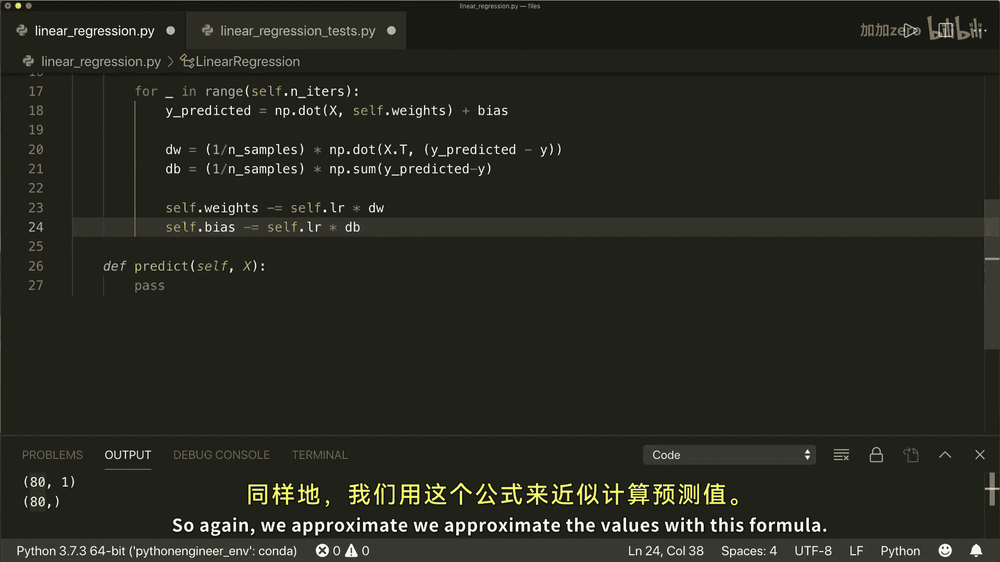

接下来，我们初始化模型、进行训练并做出预测。

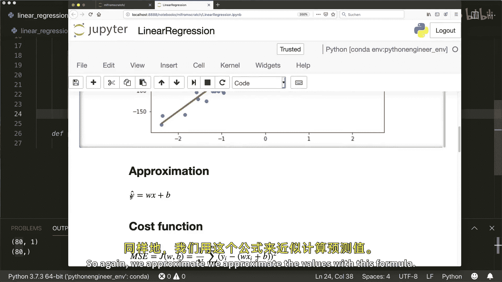

```python
# 导入并实例化模型
regressor = LinearRegression(learning_rate=0.01) # 尝试不同学习率
regressor.fit(X_train, y_train)
predictions = regressor.predict(X_test)
```

为了评估模型性能，我们实现均方误差函数。

```python
def mse(y_true, y_pred):
    return np.mean((y_true - y_pred) ** 2)

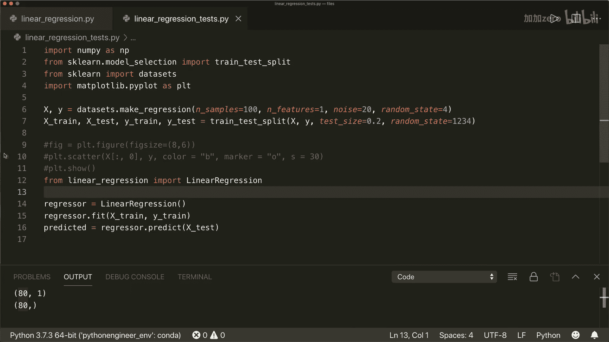

mse_value = mse(y_test, predictions)
print(f"模型的均方误差为: {mse_value}")
```

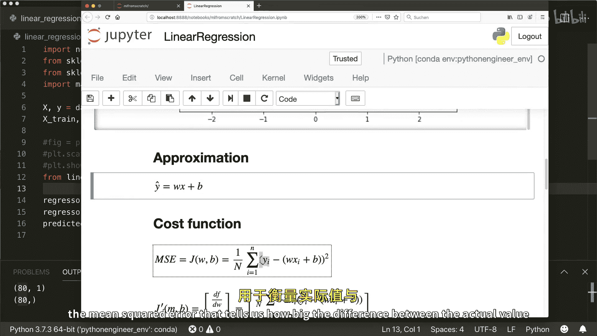

最后，我们可以绘制结果图，直观地查看拟合效果。

```python
# 绘制所有数据点
plt.scatter(X, y, color='b', s=10, label='Data')

# 绘制模型拟合的直线
# 生成一组x值用于画线
x_line = np.linspace(X.min(), X.max(), 100).reshape(-1, 1)
y_line = regressor.predict(x_line)
plt.plot(x_line, y_line, color='r', linewidth=2, label='Linear Regression Fit')

plt.xlabel('X')
plt.ylabel('y')
plt.legend()
plt.show()
```

通过调整学习率（例如从 `0.001` 改为 `0.01`），可以观察到均方误差的下降以及拟合直线更贴近数据分布。这证明了我们实现的正确性。

## 总结

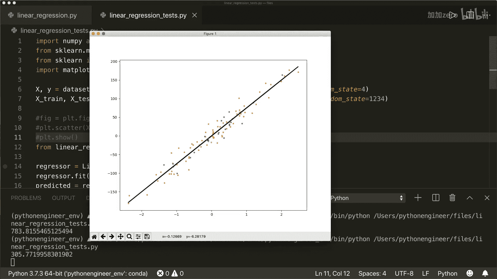

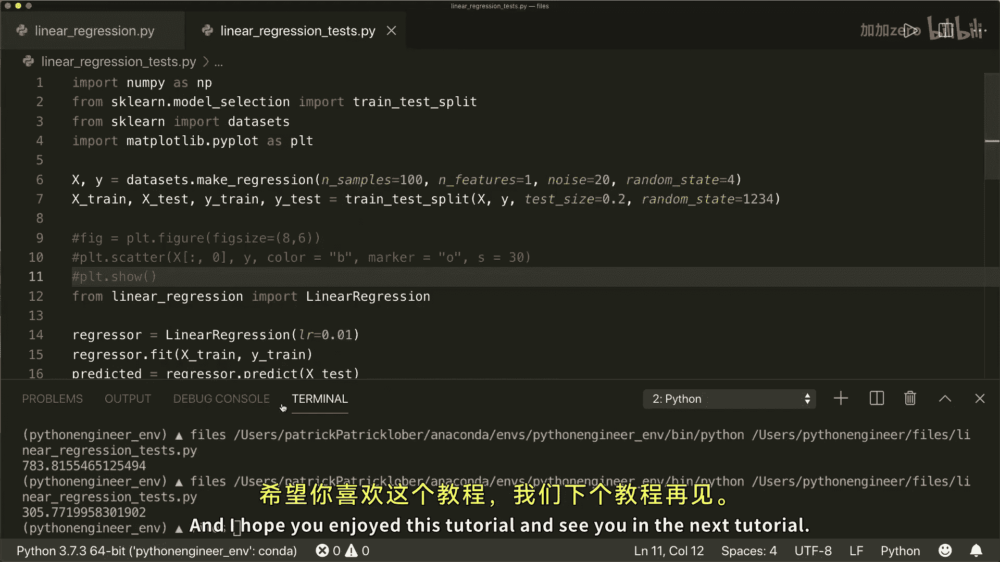

本节课中我们一起学习了线性回归算法。我们从基本概念出发，理解了如何使用线性函数拟合数据，并定义了均方误差作为衡量标准。我们重点介绍了梯度下降这一优化算法，它通过迭代更新参数来最小化成本函数。最后，我们使用Python和NumPy从零开始实现了一个完整的 `LinearRegression` 类，包括初始化、训练和预测功能，并用示例数据验证了其有效性。通过本教程，你掌握了线性回归的核心原理与实战实现。