# 003：Python实现逻辑回归 🧠

在本节课中，我们将要学习逻辑回归的核心概念，并使用Python和NumPy从零开始实现它。逻辑回归是一种用于解决二分类问题的经典算法，它通过一个S型函数将线性模型的输出映射到概率。

## 概念回顾 📚

上一节我们介绍了线性回归，它使用线性函数 `W * x + B` 来预测连续值。本节中我们来看看逻辑回归，它的目标不是连续值，而是预测一个概率。

为了将线性模型的输出转化为概率，我们使用Sigmoid函数。Sigmoid函数的公式如下：

**σ(x) = 1 / (1 + e^(-x))**

其中，`x` 是我们的线性模型 `W * x + B`。这个函数的输出值在0到1之间，正好可以表示概率。

## 参数学习：梯度下降法 📉

与线性回归类似，我们需要找到最优的参数 `W`（权重）和 `B`（偏置）。这通过梯度下降法实现。首先，我们需要一个衡量预测好坏的函数，即成本函数。逻辑回归使用交叉熵作为成本函数，其公式较为复杂，我们在此不深入推导，但会在描述中提供进一步阅读材料。

梯度下降法的核心思想是：从一个初始点开始，计算成本函数对参数的导数，然后沿着导数的负方向更新参数，逐步逼近最小值。更新规则如下：

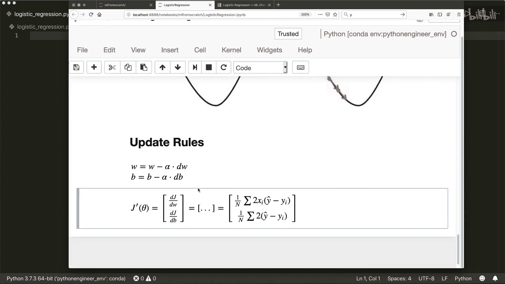

**W_new = W_old - learning_rate * dW**
**B_new = B_old - learning_rate * dB**

其中，`learning_rate`（学习率）决定了每次更新的步长。学习率不能太高，否则可能无法收敛；也不能太低，否则学习速度太慢。

以下是计算导数 `dW` 和 `dB` 的公式：

**dW = (1/n) * Σ( 2 * x * (y_pred - y) )**
**dB = (1/n) * Σ( y_pred - y )**

公式中的常数因子2可以省略，因为它只是一个缩放因子。

## 代码实现 💻

现在，我们开始用Python实现逻辑回归类。我们将遵循scikit-learn库的惯例，实现 `fit` 和 `predict` 方法。

首先，导入必要的库并定义类结构。

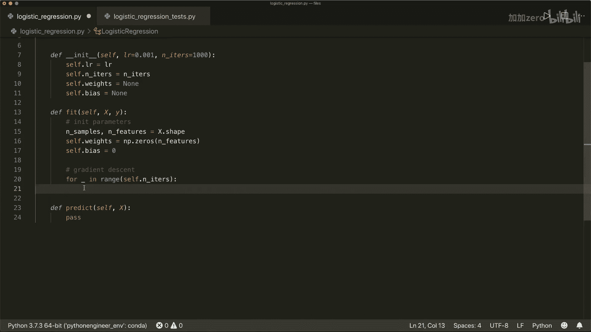

```python
import numpy as np

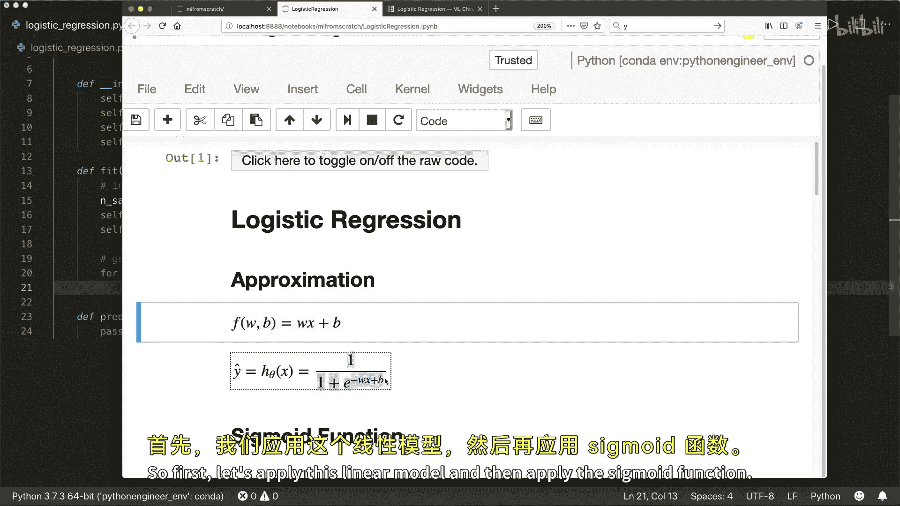

class LogisticRegression:
    def __init__(self, learning_rate=0.001, n_iters=1000):
        self.lr = learning_rate
        self.n_iters = n_iters
        self.weights = None
        self.bias = None
```

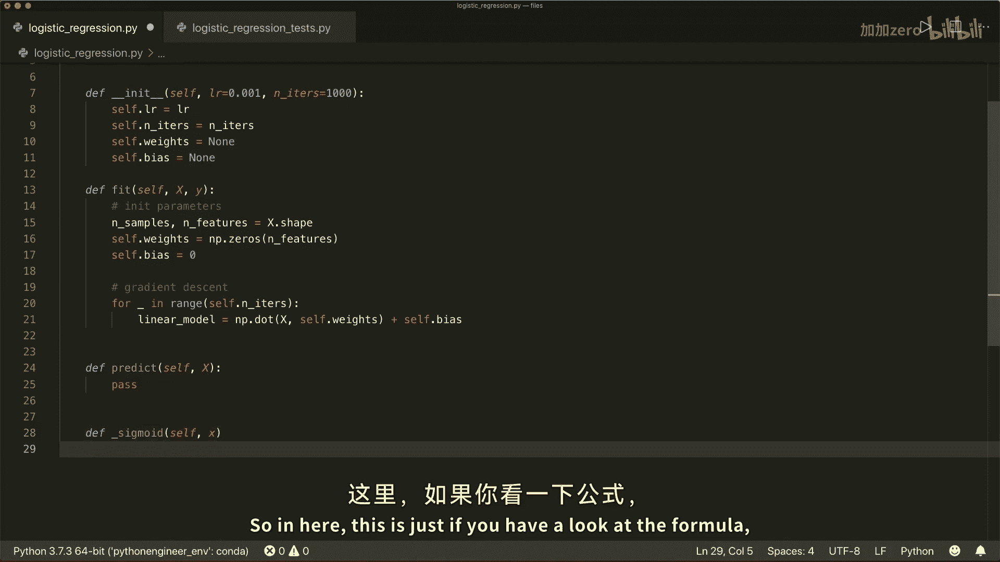

接下来，我们实现Sigmoid辅助函数。

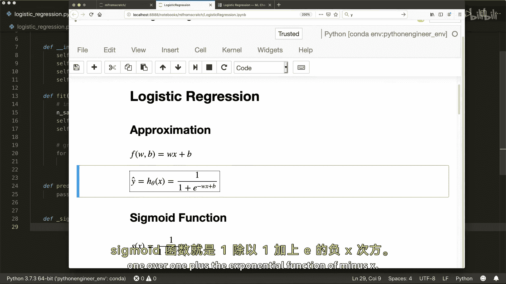

```python
    def _sigmoid(self, x):
        return 1 / (1 + np.exp(-x))
```

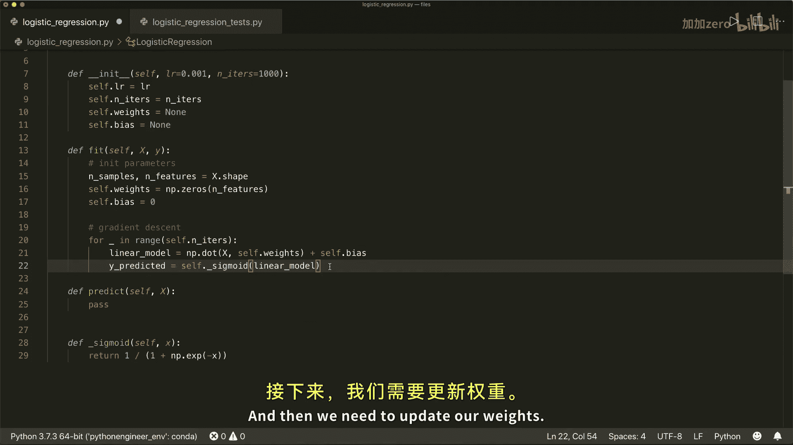

核心部分是 `fit` 方法，它使用梯度下降法来训练模型。

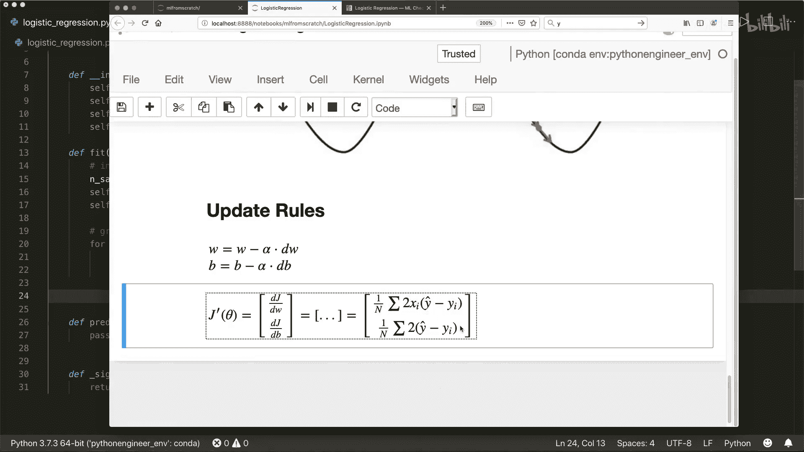

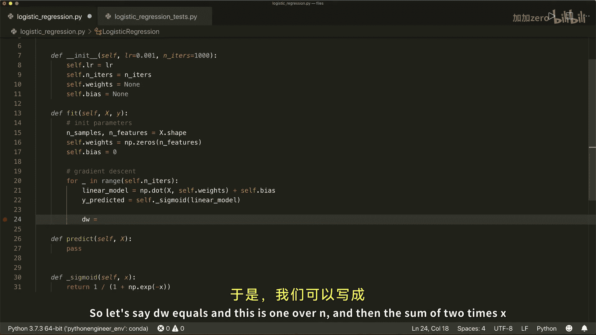

```python
    def fit(self, X, y):
        n_samples, n_features = X.shape
        self.weights = np.zeros(n_features)
        self.bias = 0

        for _ in range(self.n_iters):
            linear_model = np.dot(X, self.weights) + self.bias
            y_predicted = self._sigmoid(linear_model)

            dw = (1 / n_samples) * np.dot(X.T, (y_predicted - y))
            db = (1 / n_samples) * np.sum(y_predicted - y)

            self.weights -= self.lr * dw
            self.bias -= self.lr * db
```

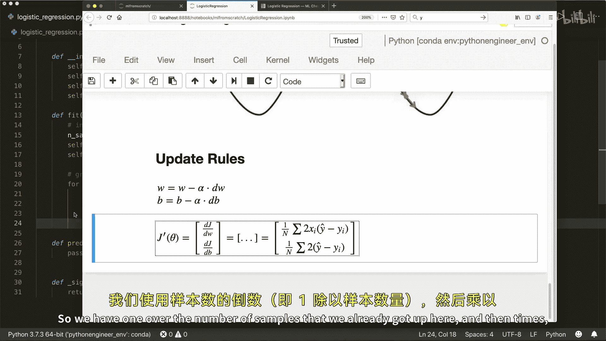

最后，我们实现 `predict` 方法。它首先计算概率，然后将概率大于0.5的样本预测为类别1，否则为类别0。

```python
    def predict(self, X):
        linear_model = np.dot(X, self.weights) + self.bias
        y_predicted = self._sigmoid(linear_model)
        y_predicted_cls = [1 if i > 0.5 else 0 for i in y_predicted]
        return np.array(y_predicted_cls)
```

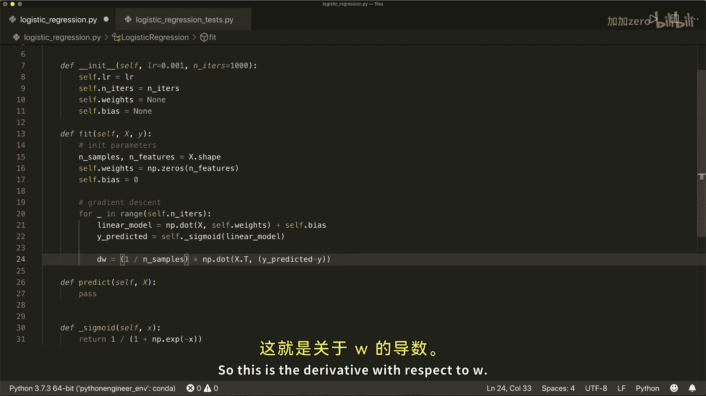

## 模型测试 ✅

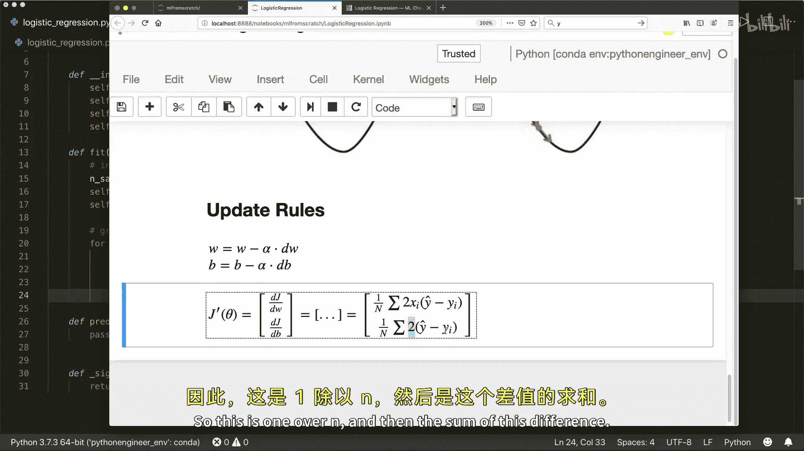

为了验证我们的实现，我们使用著名的威斯康星州乳腺癌数据集进行测试。以下是测试脚本：

```python
from sklearn.model_selection import train_test_split
from sklearn import datasets

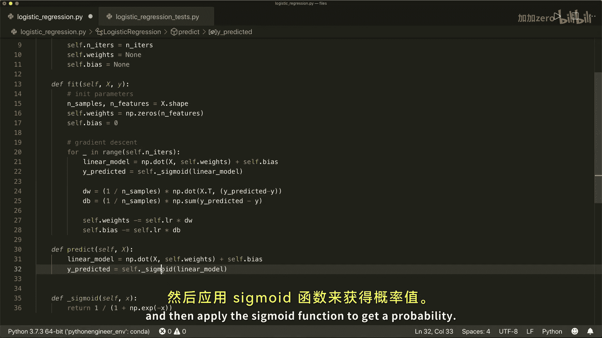

bc = datasets.load_breast_cancer()
X, y = bc.data, bc.target
X_train, X_test, y_train, y_test = train_test_split(X, y, test_size=0.2, random_state=1234)

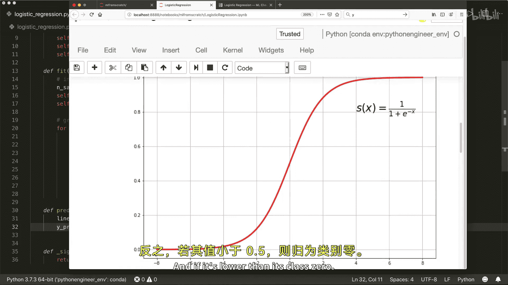

regressor = LogisticRegression(learning_rate=0.0001, n_iters=1000)
regressor.fit(X_train, y_train)
predictions = regressor.predict(X_test)

def accuracy(y_true, y_pred):
    accuracy = np.sum(y_true == y_pred) / len(y_true)
    return accuracy

print("LR classification accuracy:", accuracy(y_test, predictions))
```

运行此脚本，我们得到了约92%的准确率，这表明我们的逻辑回归实现是有效的。

## 总结 ✨

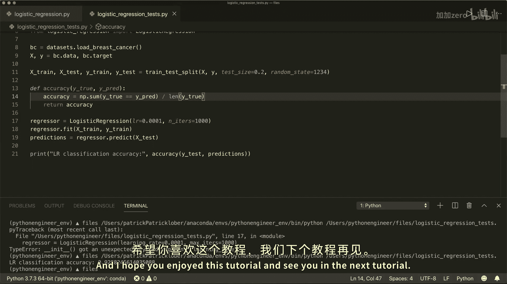

本节课中我们一起学习了逻辑回归。我们从概念入手，理解了如何用Sigmoid函数将线性输出转化为概率。接着，我们探讨了使用交叉熵成本函数和梯度下降法来学习模型参数的过程。最后，我们一步步地用Python和NumPy从零实现了逻辑回归类，并在真实数据集上验证了其有效性。通过这个过程，你应该对逻辑回归的工作原理和实现细节有了清晰的认识。