# 005：朴素贝叶斯分类器实现教程 🧠

在本节课中，我们将学习并动手实现一个朴素贝叶斯分类器。我们将从理解其背后的数学原理开始，然后仅使用Python内置模块和NumPy，一步步编写代码，最终在一个数据集上测试其性能。

## 理论基础：贝叶斯定理与“朴素”假设

上一节我们介绍了本课程的目标。本节中，我们来看看朴素贝叶斯分类器的核心数学基础。

朴素贝叶斯分类器基于**贝叶斯定理**。该定理描述了两个事件A和B之间的关系：在事件B已经发生的条件下，事件A发生的概率，等于在事件A发生的条件下事件B发生的概率，乘以事件A发生的概率，再除以事件B发生的概率。

用公式表示为：
**P(A|B) = P(B|A) * P(A) / P(B)**

将贝叶斯定理应用于分类问题，我们的目标是计算在给定特征向量 **x** 的条件下，样本属于类别 **y** 的概率。公式演变为：
**P(y|x) = P(x|y) * P(y) / P(x)**

其中，**x** 是我们的特征向量，可能包含多个特征。

之所以称为“朴素”贝叶斯，是因为我们做了一个关键假设：**所有特征之间是相互独立的**。这意味着，在给定类别的情况下，一个特征的出现不会影响其他特征的出现。虽然现实世界中许多特征并非完全独立，但这个简化假设使得计算变得可行，并且在很多问题上效果很好。

基于这个“朴素”的独立性假设，我们可以将联合概率 **P(x|y)** 分解为每个特征条件概率的乘积。因此，我们的分类公式可以进一步展开。

在分类时，我们选择使后验概率 **P(y|x)** 最大的那个类别 **y**。由于对于所有类别，分母 **P(x)** 是相同的，因此可以忽略。最终，我们最大化以下目标：
**y = argmax_y [ P(y) * ∏ P(x_i|y) ]**

为了避免多个小概率值连乘可能导致的数值下溢问题，我们通常对等式两边取对数，将连乘转换为连加，得到更稳定的计算形式：
**y = argmax_y [ log(P(y)) + ∑ log(P(x_i|y)) ]**

在这个公式中：
*   **P(y)** 称为**先验概率**，即每个类别在训练数据中出现的频率。
*   **P(x_i|y)** 称为**类条件概率**，即给定类别y时，特征x_i出现的概率。我们通常使用**高斯分布（正态分布）** 来建模连续特征。

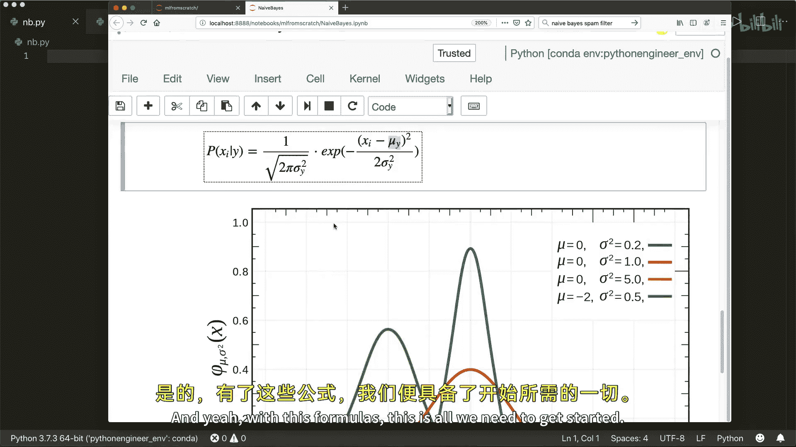

高斯分布的概率密度函数公式为：
**PDF(x) = (1 / √(2πσ²)) * exp( - (x - μ)² / (2σ²) )**

其中 **μ** 是均值，**σ²** 是方差。这个函数给出了特征x在给定均值和方差下的概率密度。

## 代码实现：构建朴素贝叶斯分类器 🛠️

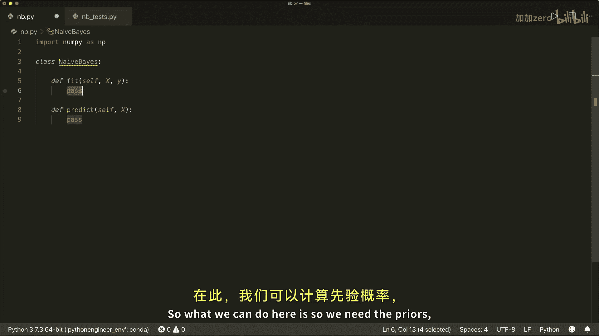

理解了核心公式后，本节我们将动手实现它。我们将创建一个名为 `NaiveBayes` 的类，包含 `fit` 和 `predict` 两个核心方法。

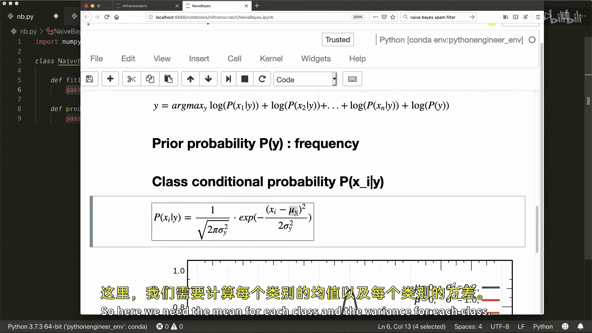

首先，导入必要的库并定义类结构。

```python
import numpy as np

class NaiveBayes:
    def fit(self, X, y):
        # 训练模型：计算先验概率、均值和方差
        pass

    def predict(self, X):
        # 预测新样本的类别
        pass

    def _predict_single(self, x):
        # 辅助函数：预测单个样本
        pass

    def _pdf(self, class_idx, x):
        # 辅助函数：计算高斯概率密度
        pass
```

### 实现训练（`fit`）方法

`fit` 方法的目标是根据训练数据计算每个类别的先验概率，以及每个类别下每个特征的高斯分布参数（均值和方差）。

以下是 `fit` 方法的具体步骤：

1.  获取数据的基本信息：样本数、特征数和所有唯一的类别标签。
2.  初始化存储均值、方差和先验概率的数组。
3.  遍历每个类别，从训练数据中提取属于该类别的样本子集。
4.  计算该子集在每个特征上的均值（μ）和方差（σ²），并保存。
5.  计算该类别的先验概率 **P(y)**，即该类样本数除以总样本数。

```python
def fit(self, X, y):
    n_samples, n_features = X.shape
    self._classes = np.unique(y)
    n_classes = len(self._classes)

    # 初始化数组
    self._mean = np.zeros((n_classes, n_features), dtype=np.float64)
    self._var = np.zeros((n_classes, n_features), dtype=np.float64)
    self._priors = np.zeros(n_classes, dtype=np.float64)

    # 为每个类别计算参数
    for idx, c in enumerate(self._classes):
        X_c = X[y == c] # 提取属于类别c的样本
        self._mean[idx, :] = X_c.mean(axis=0)
        self._var[idx, :] = X_c.var(axis=0)
        self._priors[idx] = X_c.shape[0] / float(n_samples) # 先验概率
```

### 实现概率密度函数（`_pdf`）

这是一个内部辅助函数，用于根据高斯分布公式计算给定特征值 `x` 在特定类别下的概率密度。

```python
def _pdf(self, class_idx, x):
    mean = self._mean[class_idx]
    var = self._var[class_idx]
    numerator = np.exp(- (x - mean) ** 2 / (2 * var))
    denominator = np.sqrt(2 * np.pi * var)
    return numerator / denominator
```

### 实现预测（`predict`）方法

`predict` 方法对新输入的样本集进行预测。它主要依赖一个处理单个样本的辅助函数 `_predict_single`。

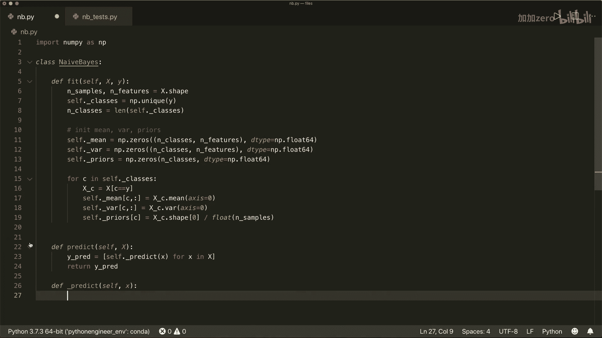

以下是 `predict` 和 `_predict_single` 方法的逻辑：

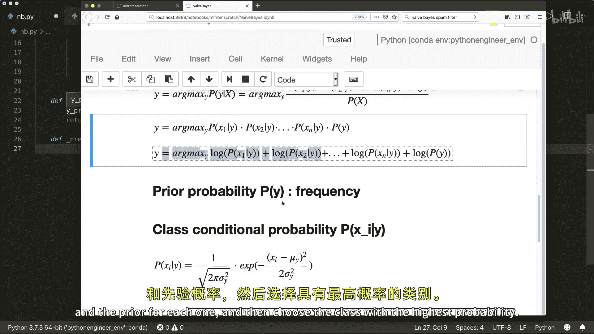

1.  `predict` 方法遍历测试集中的每个样本，调用 `_predict_single` 获取预测类别，并汇总结果。
2.  在 `_predict_single` 中，对于单个样本 `x`：
    *   遍历所有可能的类别。
    *   对于每个类别，计算对数先验概率 `log(P(y))`。
    *   计算该类别的对数类条件概率之和，即对每个特征，使用 `_pdf` 函数计算概率密度后取对数并求和 `∑ log(P(x_i|y))`。
    *   将两者相加，得到该类别对于样本 `x` 的对数后验概率得分。
    *   比较所有类别的得分，选择得分最高的类别作为预测结果。

```python
def predict(self, X):
    # 对每个样本调用 _predict_single 进行预测
    return np.array([self._predict_single(x) for x in X])

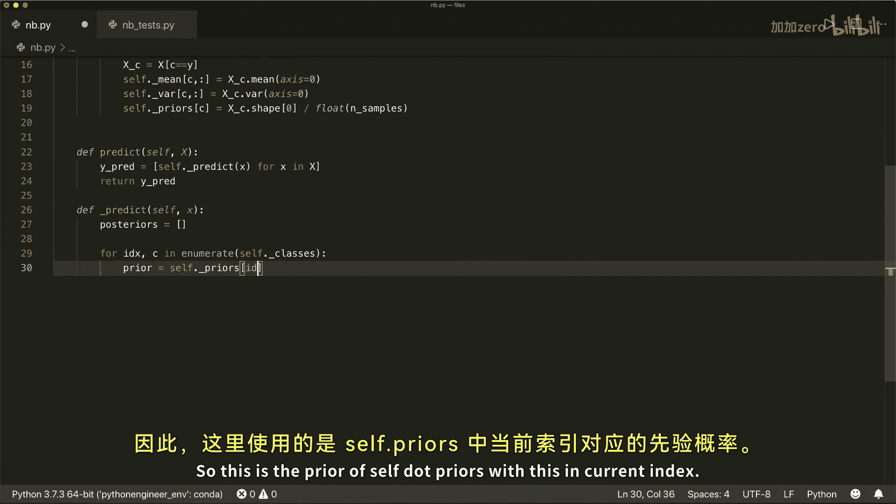

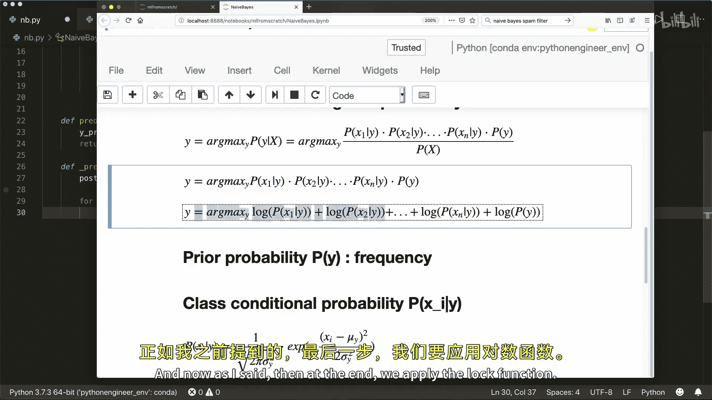

def _predict_single(self, x):
    posteriors = [] # 存储每个类别的后验概率得分

    # 遍历所有类别，计算对数后验概率
    for idx, c in enumerate(self._classes):
        prior = np.log(self._priors[idx]) # 对数先验
        # 对数类条件概率之和 (特征独立性假设)
        class_conditional = np.sum(np.log(self._pdf(idx, x)))
        posterior = prior + class_conditional
        posteriors.append(posterior)

    # 返回具有最高后验概率得分的类别
    return self._classes[np.argmax(posteriors)]
```

## 模型测试与评估 ✅

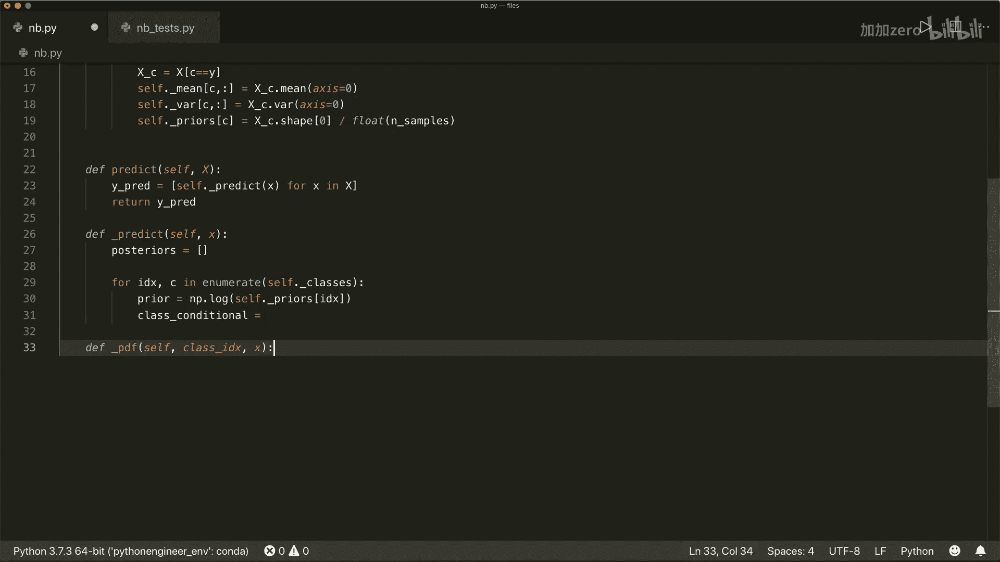

现在，我们已经完成了朴素贝叶斯分类器的实现。本节我们将使用一个示例数据集来测试它的性能。

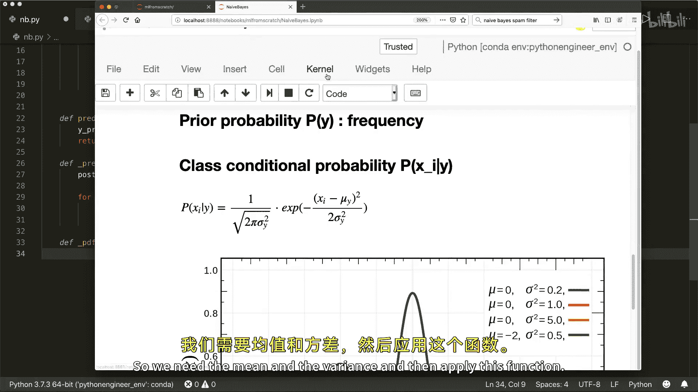

我们将使用 `scikit-learn` 库中的 `make_classification` 函数生成一个简单的数据集，并将其分为训练集和测试集。

```python
# 测试代码示例
from sklearn.datasets import make_classification
from sklearn.model_selection import train_test_split

# 生成数据集：1000个样本，10个特征，2个类别
X, y = make_classification(n_samples=1000, n_features=10, n_classes=2, random_state=42)
X_train, X_test, y_train, y_test = train_test_split(X, y, test_size=0.2, random_state=42)

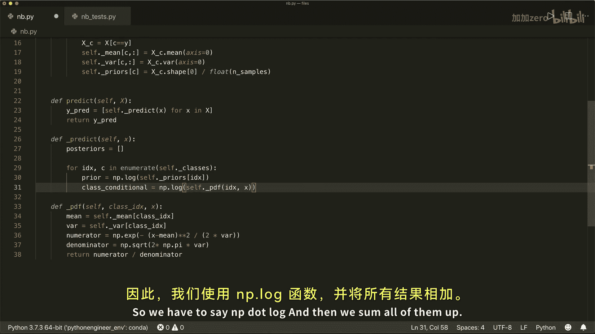

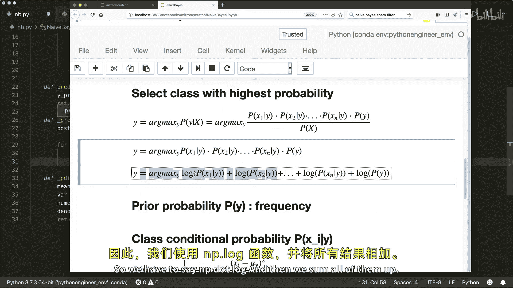

# 使用我们实现的分类器
model = NaiveBayes()
model.fit(X_train, y_train)    # 训练模型
predictions = model.predict(X_test) # 进行预测

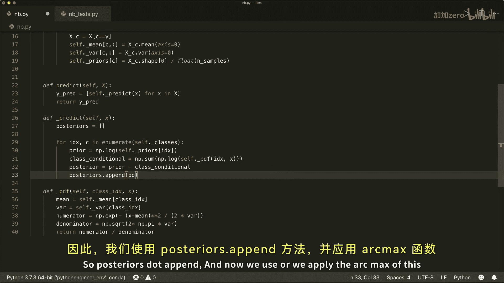

# 计算准确率
accuracy = np.sum(predictions == y_test) / len(y_test)
print(f"朴素贝叶斯分类器准确率: {accuracy:.2f}")
```

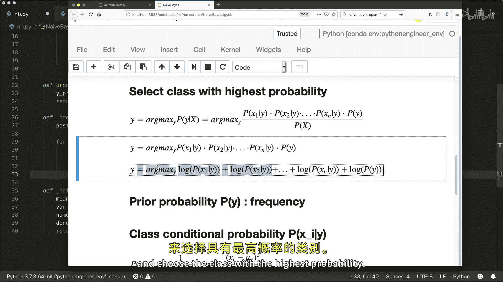

运行上述测试代码，我们的模型在这个合成数据集上可以达到约 **96%** 的分类准确率，这表明我们的实现是正确的且效果良好。

## 总结

本节课中我们一起学习了朴素贝叶斯分类器的原理与实现。我们从**贝叶斯定理**出发，理解了**后验概率**、**先验概率**和**类条件概率**的概念，并认识了“特征条件独立性”这一核心的“朴素”假设。

我们使用**高斯分布**来建模连续特征，并通过取对数来优化数值计算。随后，我们一步步用Python和NumPy实现了 `NaiveBayes` 类，完成了 `fit`（计算先验、均值、方差）、`_pdf`（计算概率密度）和 `predict`（选择最大后验概率类别）等核心方法。

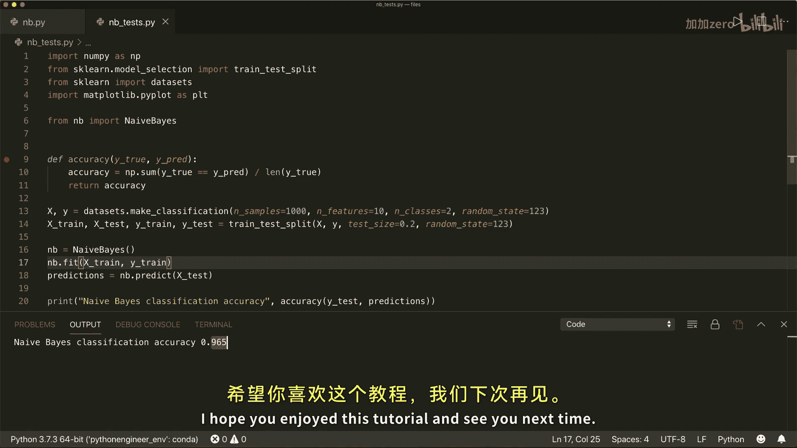

最后，我们在一个生成的数据集上测试了模型，获得了不错的准确率。这个从零开始的实现过程，帮助你深入理解了朴素贝叶斯分类器的工作机制。