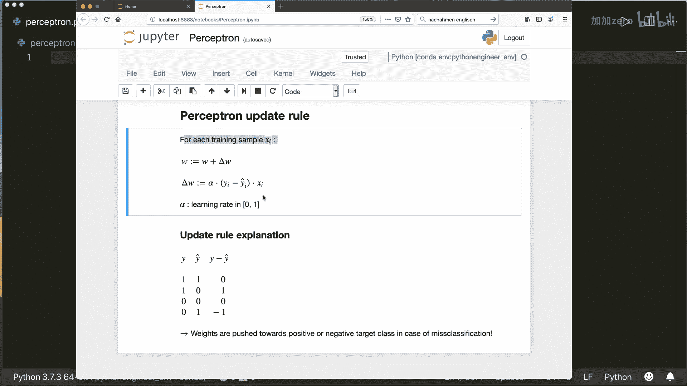
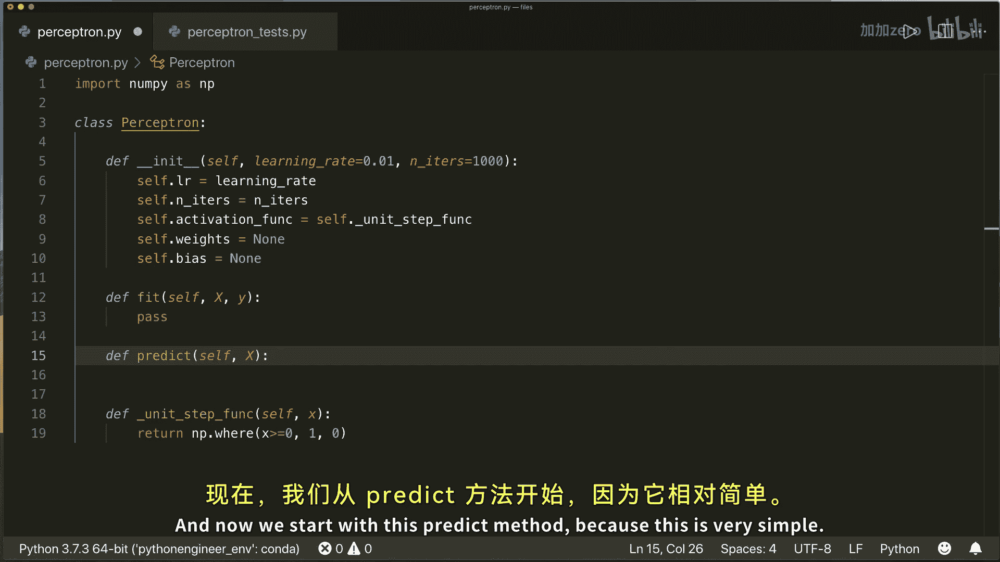
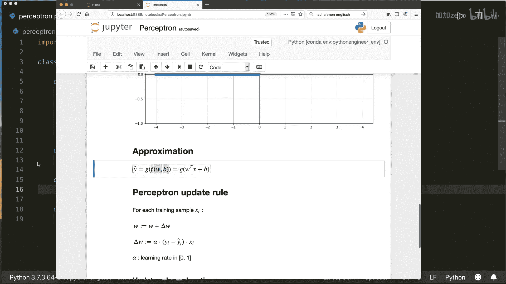
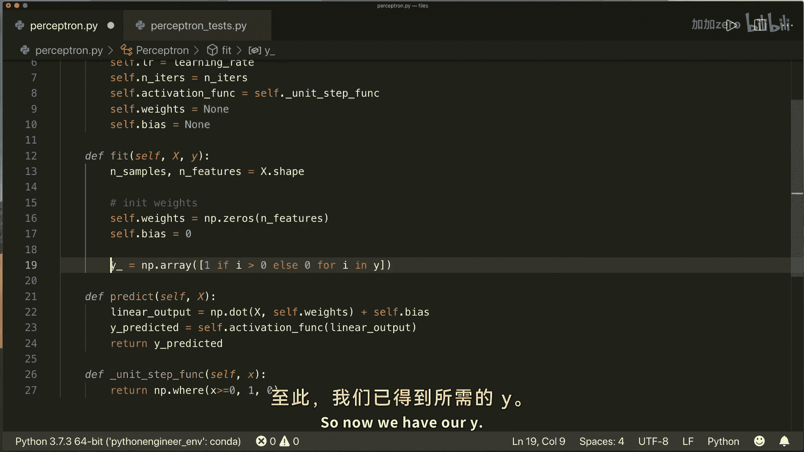
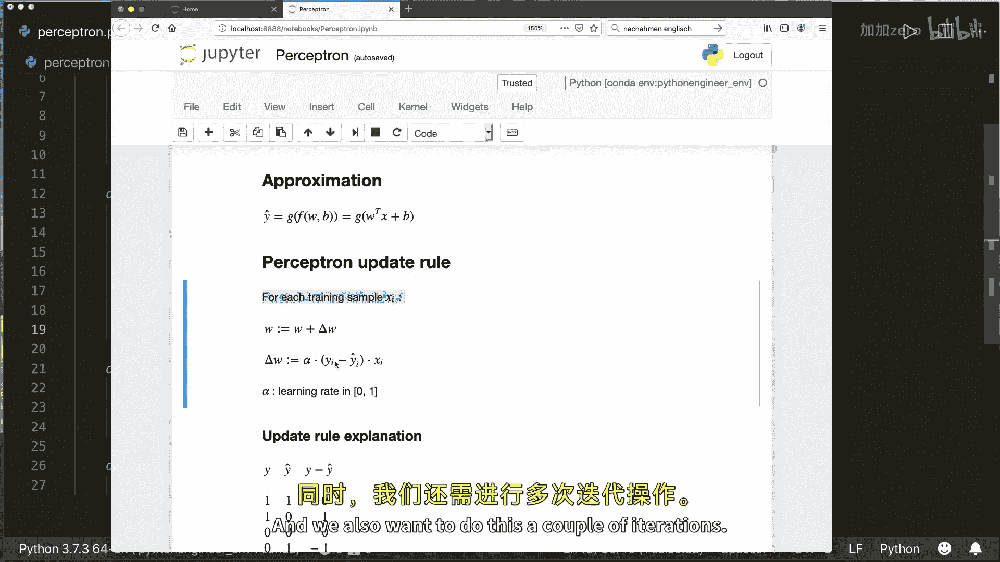
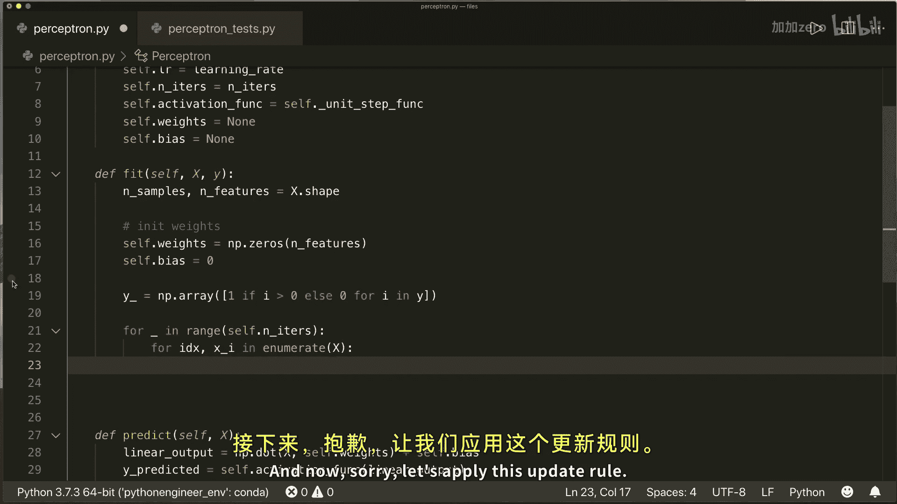
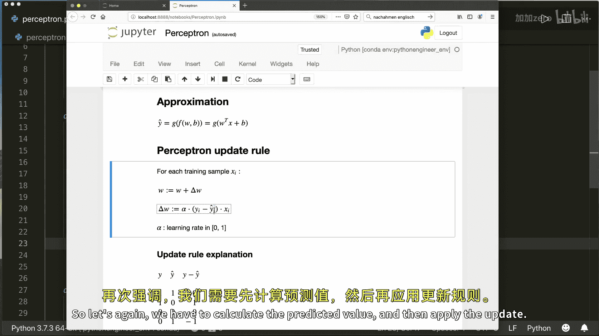
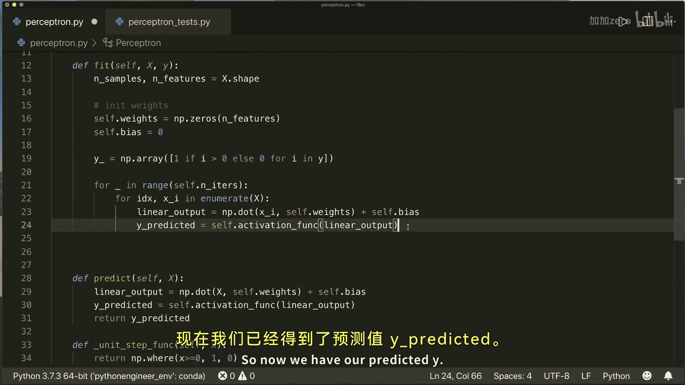
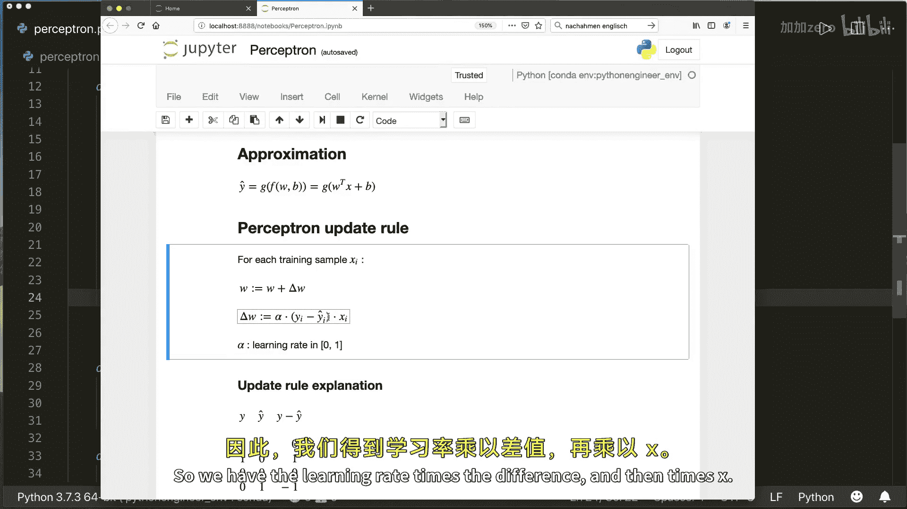
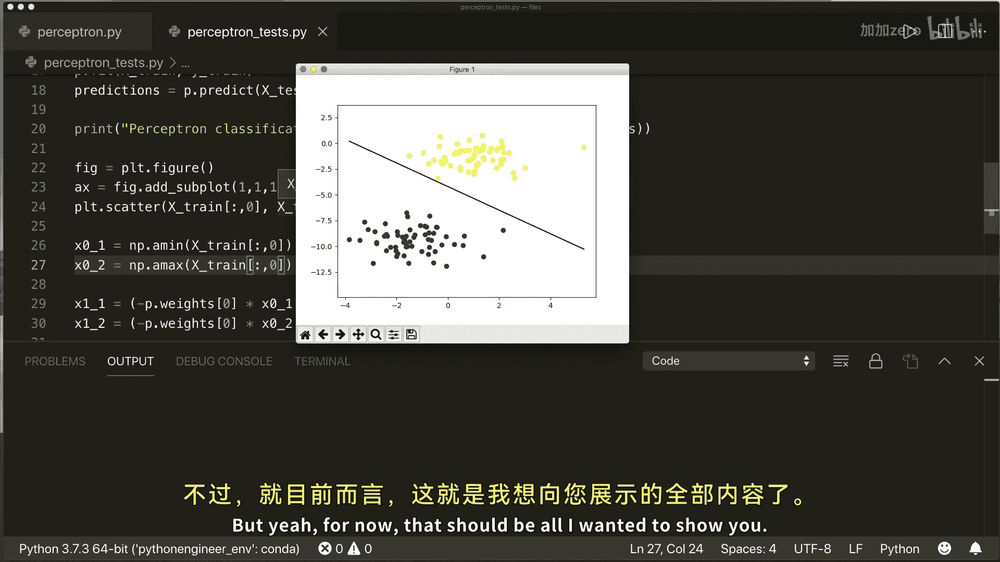

# 006：Python实现感知机算法 🧠

在本节课中，我们将学习感知机算法，并使用纯Python和NumPy库从零开始实现它。感知机是人工神经网络中最基础的单元，模拟了单个生物神经元的行为。我们将从数学原理入手，逐步完成代码实现，并最终测试其分类效果。

## 感知机模型概述

感知机可以被视为人工神经网络的一个简化单元。它模拟了生物神经元接收输入信号、加权求和、并通过激活函数产生输出的过程。

具体来说，一个细胞接收输入信号，这些信号被加权并求和。如果总输入信号达到某个阈值，细胞就会“激活”并产生一个输出信号。在我们的模型中，输出是1或0。

## 数学建模

上一节我们介绍了感知机的生物类比，本节中我们来看看如何用数学公式来描述它。

感知机的数学模型分为两部分：线性部分和激活函数部分。

*   **线性模型**：这是对输入信号加权求和的过程。公式为：
    `线性输出 = w^T * x + b`
    其中，`w` 是权重向量，`x` 是输入特征向量，`b` 是偏置项（相当于图中的 `w0`）。

*   **激活函数**：在线性模型的结果上，我们应用一个激活函数来决定最终输出。在最简单的情况下，我们使用**单位阶跃函数**：
    `输出 = 1 (如果 线性输出 >= 0), 否则 输出 = 0`
    这里的阈值设为0。

因此，整个感知机的输出可以表示为：
`输出 = 激活函数(w^T * x + b)`

## 权重更新规则：感知机学习规则

模型建立后，我们需要找到合适的权重 `w` 和偏置 `b`。为此，我们使用感知机学习规则。

以下是权重更新的核心步骤：
1.  遍历每个训练样本 `(x_i, y_i)`。
2.  对每个样本，计算感知机的预测值 `y_hat`。
3.  根据预测值与真实值的差异来更新权重。

权重更新公式为：
`w_new = w_old + Δw`
其中，`Δw = α * (y - y_hat) * x_i`
`α` 是学习率，一个介于0和1之间的缩放因子。



这个规则非常直观。让我们分析一个二分类问题中可能出现的四种情况：

*   **正确分类（真实=1， 预测=1）**：`(y - y_hat) = 0`，权重不变。
*   **正确分类（真实=0， 预测=0）**：`(y - y_hat) = 0`，权重不变。
*   **错误分类（真实=1， 预测=0）**：`(y - y_hat) = 1`，权重增加，使模型更倾向于输出1。
*   **错误分类（真实=0， 预测=1）**：`(y - y_hat) = -1`，权重减少，使模型更倾向于输出0。

通过多次迭代整个训练集，权重会逐渐调整到能够正确分类大多数样本的值。

## Python代码实现 💻

理解了原理和规则后，现在我们可以开始动手实现感知机类了。我们将主要实现两个方法：`fit`（训练）和 `predict`（预测）。

首先，导入必要的库并创建感知机类。

```python
import numpy as np

class Perceptron:
    def __init__(self, learning_rate=0.01, n_iters=1000):
        self.lr = learning_rate
        self.n_iters = n_iters
        self.activation_func = self._unit_step_func
        self.weights = None
        self.bias = None
```



接下来，定义单位阶跃激活函数。我们使用 `np.where` 使其能同时处理单个数值和数组。



```python
    def _unit_step_func(self, x):
        return np.where(x >= 0, 1, 0)
```

然后，实现 `predict` 方法。它简单地执行 `线性变换 -> 激活函数` 的过程。

```python
    def predict(self, X):
        linear_output = np.dot(X, self.weights) + self.bias
        y_predicted = self.activation_func(linear_output)
        return y_predicted
```

最后，实现核心的 `fit` 训练方法。步骤如下：

1.  初始化权重和偏置为0。
2.  确保标签 `y` 为0或1。
3.  进行指定次数的迭代，在每次迭代中：
    *   遍历每个训练样本。
    *   计算预测值。
    *   应用感知机规则更新权重和偏置。

```python
    def fit(self, X, y):
        n_samples, n_features = X.shape

        # 初始化参数
        self.weights = np.zeros(n_features)
        self.bias = 0

        # 确保y是0和1的数组
        y_ = np.array([1 if i > 0 else 0 for i in y])

        # 训练循环
        for _ in range(self.n_iters):
            for idx, x_i in enumerate(X):
                # 计算线性输出和预测
                linear_output = np.dot(x_i, self.weights) + self.bias
                y_predicted = self.activation_func(linear_output)

                # 感知机权重更新规则
                update = self.lr * (y_[idx] - y_predicted)
                self.weights += update * x_i
                self.bias += update
```

## 测试与结论 🧪



现在，让我们用生成的模拟数据来测试我们实现的感知机。



```python
# 测试代码示例
from sklearn.model_selection import train_test_split
from sklearn import datasets
import matplotlib.pyplot as plt



def accuracy(y_true, y_pred):
    return np.sum(y_true == y_pred) / len(y_true)



# 生成数据集
X, y = datasets.make_blobs(n_samples=150, n_features=2, centers=2, cluster_std=1.05, random_state=2)
X_train, X_test, y_train, y_test = train_test_split(X, y, test_size=0.2, random_state=123)

# 训练感知机
p = Perceptron(learning_rate=0.01, n_iters=1000)
p.fit(X_train, y_train)
predictions = p.predict(X_test)

# 评估
print(f"感知机分类准确率: {accuracy(y_test, predictions):.2f}")





# 可视化决策边界
fig = plt.figure()
ax = fig.add_subplot(1, 1, 1)
plt.scatter(X_train[:, 0], X_train[:, 1], marker="o", c=y_train)

x0_1 = np.amin(X_train[:, 0])
x0_2 = np.amax(X_train[:, 0])

x1_1 = (-p.weights[0] * x0_1 - p.bias) / p.weights[1]
x1_2 = (-p.weights[0] * x0_2 - p.bias) / p.weights[1]

ax.plot([x0_1, x0_2], [x1_1, x1_2], "k")

ymin = np.amin(X_train[:, 1])
ymax = np.amax(X_train[:, 1])
ax.set_ylim([ymin - 3, ymax + 3])

plt.show()
```

运行测试代码后，我们将看到感知机成功找到了一个线性决策边界，将两个类别的数据完美分开，并且准确率达到1.0。

**本节课中我们一起学习了：**
1.  感知机是神经网络的基本单元，模拟了神经元的激活过程。
2.  其数学模型由线性部分 `(w^T * x + b)` 和激活函数（如单位阶跃函数）组成。
3.  感知机使用一个简单直观的规则来更新权重：`Δw = α * (真实值 - 预测值) * 输入`。
4.  我们使用纯Python和NumPy从零实现了一个完整的感知机类，包括 `fit` 和 `predict` 方法。
5.  感知机**仅适用于线性可分**的数据集。对于更复杂的数据，需要考虑使用其他激活函数（如Sigmoid）和更强大的优化算法（如梯度下降）的神经网络模型。



通过本教程，你已经掌握了感知机的基础原理和实现方法，这是通往更复杂神经网络模型的重要第一步。