# 007：Python实现支持向量机 (SVM) 🚀

在本教程中，我们将学习支持向量机（SVM）算法的基本原理，并使用纯Python和NumPy库从零开始实现它。SVM是一种非常流行的分类算法，其核心思想是寻找一个最优的线性决策边界（超平面）来分隔数据。

## 概述

支持向量机（SVM）的目标是找到一个超平面，使得两类数据点之间的间隔最大化。我们将从数学原理开始，理解其损失函数和优化过程，然后逐步将其转化为可运行的Python代码。

## 数学原理

上一节我们了解了SVM的目标。本节中，我们来看看其背后的数学公式。

SVM使用一个线性模型：

**f(x) = w · x - b**

其中，**w** 是权重向量，**b** 是偏置项。最优超平面满足 **f(x) = 0**。

对于分类，我们要求：
*   对于标签 **y_i = +1** 的样本，需满足 **f(x_i) ≥ 1**。
*   对于标签 **y_i = -1** 的样本，需满足 **f(x_i) ≤ -1**。

这可以统一写为一个约束条件：

**y_i * (w · x_i - b) ≥ 1**

我们的目标是最大化间隔（Margin），间隔定义为 **2 / ||w||**。因此，最大化间隔等价于最小化 **||w||**。

## 损失函数与优化

为了同时满足分类正确和间隔最大，我们使用合页损失（Hinge Loss）并加入正则化项。以下是构建的损失函数（成本函数）：

**J = λ * ||w||² + (1/n) * Σ max(0, 1 - y_i * (w · x_i - b))**

其中，**λ** 是一个超参数，用于平衡“最大化间隔”和“减少分类错误”这两个目标。

为了找到最优的 **w** 和 **b**，我们使用梯度下降法进行优化。需要对损失函数求导。

以下是两种情况的梯度：

1.  当 **y_i * f(x_i) ≥ 1** （样本被正确分类且在间隔边界之外）时：
    *   **∂J/∂w = 2λw**
    *   **∂J/∂b = 0**

2.  当 **y_i * f(x_i) < 1** （样本被错误分类或在间隔边界之内）时：
    *   **∂J/∂w = 2λw - y_i * x_i**
    *   **∂J/∂b = y_i**

得到梯度后，我们使用以下更新规则（梯度下降）：
*   **w_new = w_old - learning_rate * ∂J/∂w**
*   **b_new = b_old - learning_rate * ∂J/∂b**

## Python代码实现

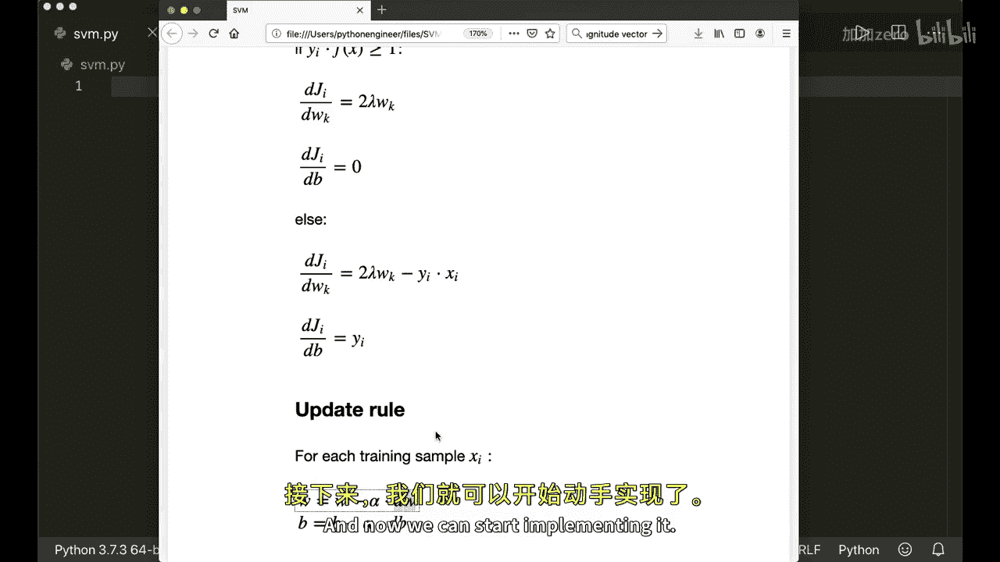

理解了数学原理后，我们现在可以开始实现SVM类。我们将主要实现两个方法：`fit` 用于训练模型，`predict` 用于进行预测。

首先，导入必要的库并初始化类。

```python
import numpy as np

class SVM:
    def __init__(self, learning_rate=0.001, lambda_param=0.01, n_iters=1000):
        self.lr = learning_rate
        self.lambda_param = lambda_param
        self.n_iters = n_iters
        self.w = None
        self.b = None
```

### 预测方法

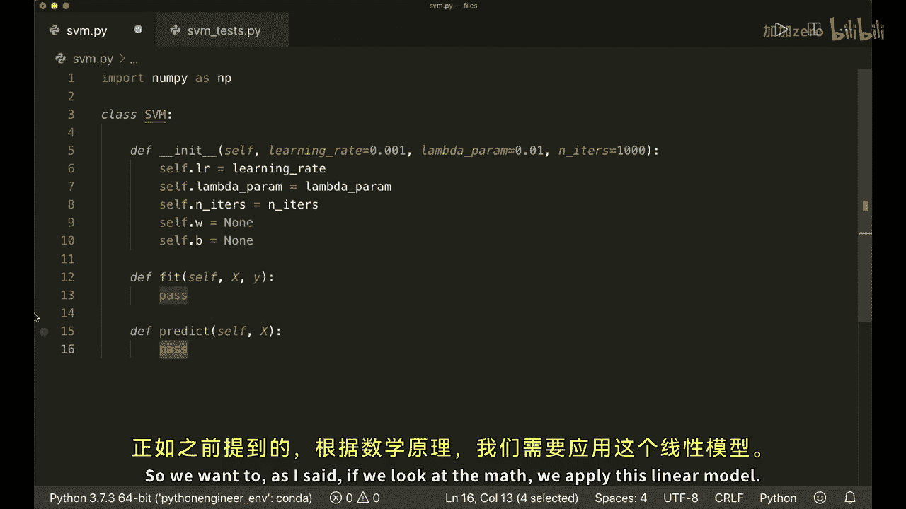

预测方法很简单，计算线性模型的输出并取其符号（sign）作为预测类别（+1 或 -1）。

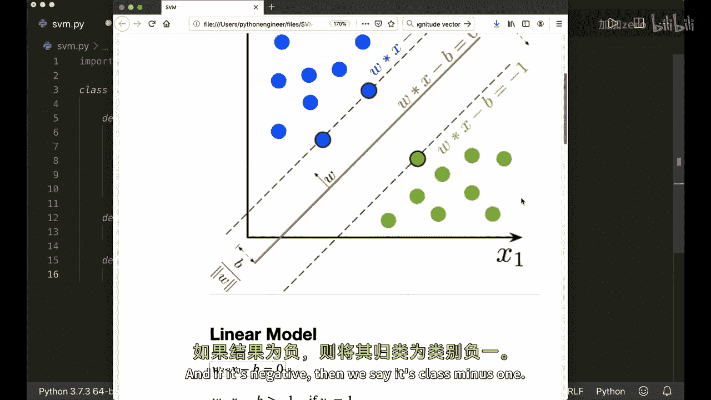

```python
    def predict(self, X):
        linear_output = np.dot(X, self.w) - self.b
        return np.sign(linear_output)
```

### 训练方法

训练方法是核心，它使用梯度下降来优化权重 **w** 和偏置 **b**。

以下是 `fit` 方法的实现步骤：

1.  确保标签为 +1 和 -1。
2.  初始化权重 **w** 和偏置 **b**。
3.  进行多轮迭代，对每个样本计算梯度并更新参数。

```python
    def fit(self, X, y):
        # 1. 转换标签为 +1 和 -1
        y_ = np.where(y <= 0, -1, 1)

        n_samples, n_features = X.shape

        # 2. 初始化参数
        self.w = np.zeros(n_features)
        self.b = 0

        # 3. 梯度下降
        for _ in range(self.n_iters):
            for idx, x_i in enumerate(X):
                condition = y_[idx] * (np.dot(x_i, self.w) - self.b) >= 1

                if condition:
                    # 情况1的梯度更新
                    self.w -= self.lr * (2 * self.lambda_param * self.w)
                else:
                    # 情况2的梯度更新
                    self.w -= self.lr * (2 * self.lambda_param * self.w - np.dot(x_i, y_[idx]))
                    self.b -= self.lr * y_[idx]
```

## 测试模型

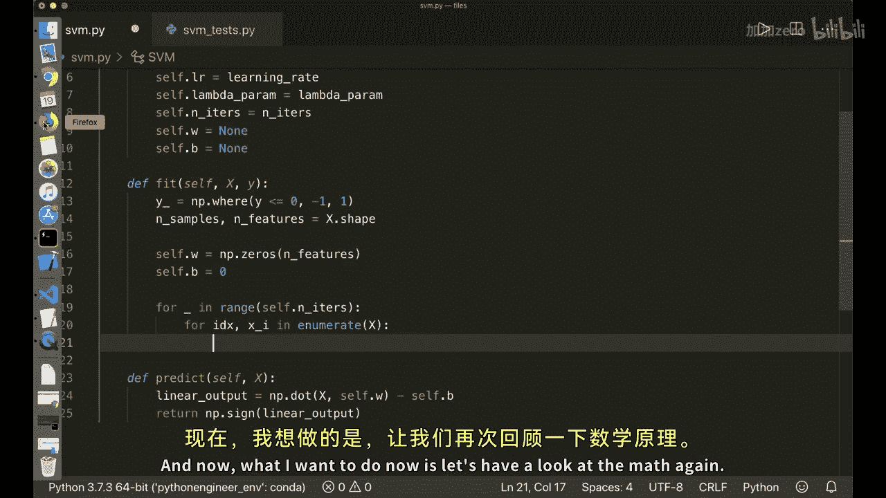

实现完成后，我们可以用一些合成数据来测试模型的性能。以下是一个简单的测试脚本框架：

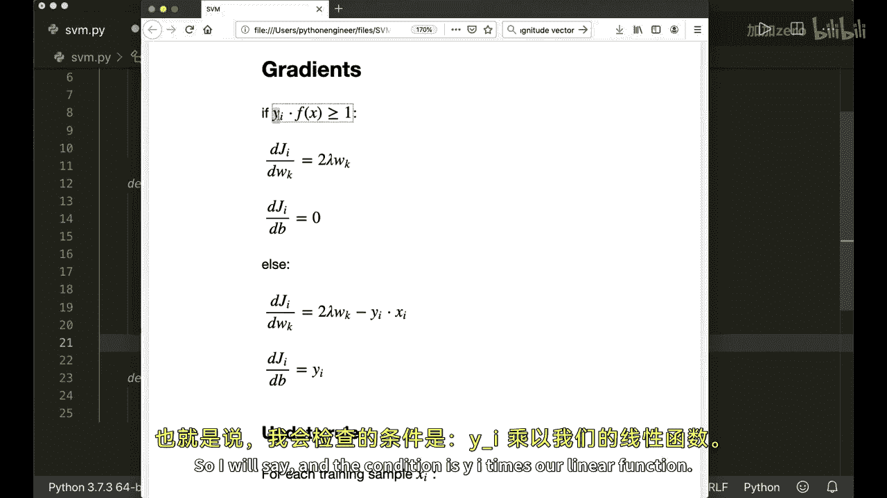

```python
# 导入SVM类 (假设代码保存在 svm.py)
from svm import SVM
import matplotlib.pyplot as plt
from sklearn.model_selection import train_test_split
from sklearn import datasets

# 生成数据
X, y = datasets.make_blobs(n_samples=50, n_features=2, centers=2, cluster_std=1.05, random_state=40)
y = np.where(y == 0, -1, 1) # 确保标签为-1和1

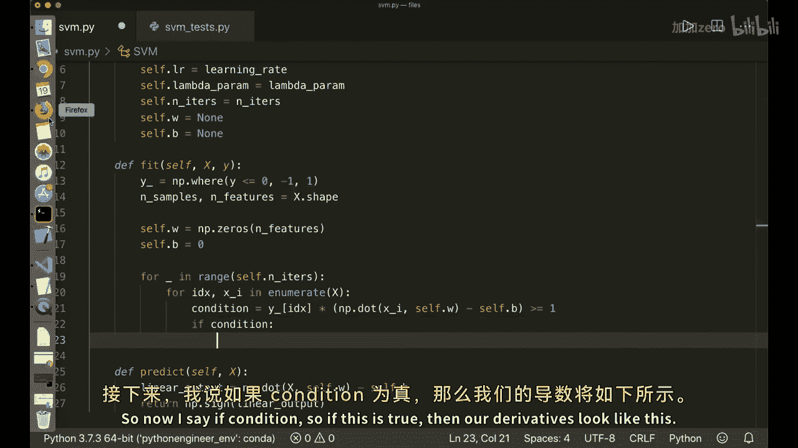

# 划分训练集
X_train, X_test, y_train, y_test = train_test_split(X, y, test_size=0.2, random_state=123)

# 训练模型
clf = SVM()
clf.fit(X_train, y_train)

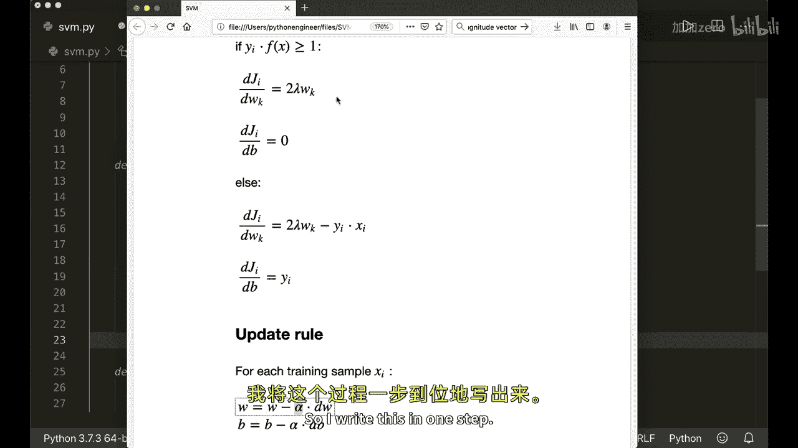

# 进行预测
predictions = clf.predict(X_test)

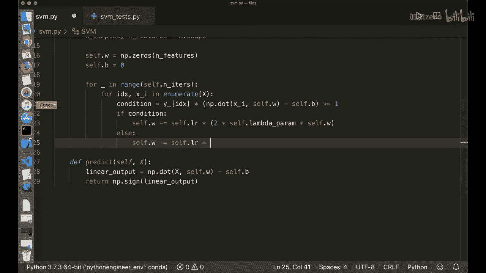

# 计算准确率
accuracy = np.sum(predictions == y_test) / len(y_test)
print(f"SVM 分类准确率: {accuracy}")

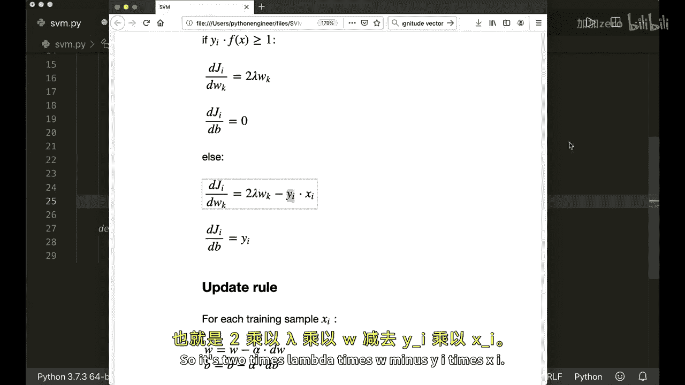

# （可选）可视化决策边界
def visualize_svm():
    ...
# 调用可视化函数
visualize_svm()
```

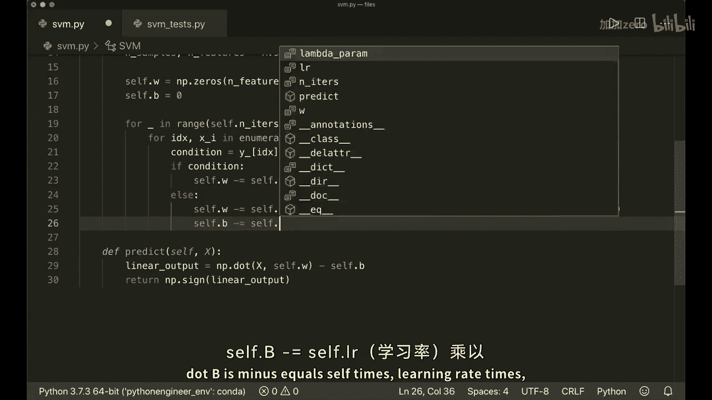

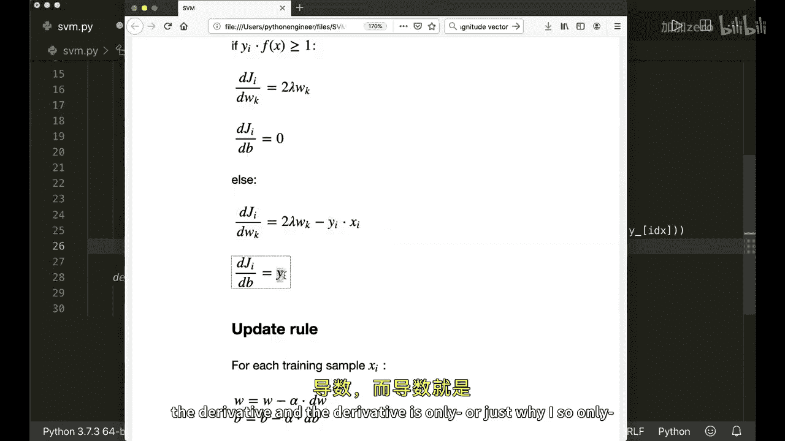

运行测试脚本后，模型会计算出决策边界。如果实现正确，你将看到一条能够有效分隔两类数据的直线，以及两侧的间隔边界。

## 总结

本节课中，我们一起学习了支持向量机（SVM）的基本原理与实现。

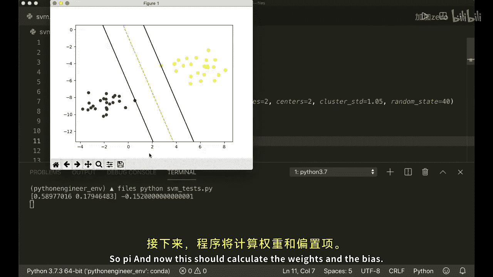

我们首先了解了SVM的核心思想：寻找最大化分类间隔的最优超平面。接着，我们深入探讨了其数学基础，包括线性模型、合页损失函数以及通过梯度下降法进行优化的过程。

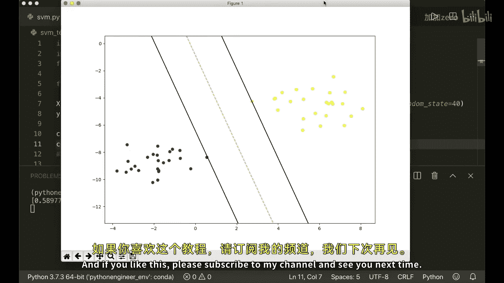

最后，我们一步步地用Python和NumPy从零实现了SVM算法，并了解了如何用合成数据测试模型。通过本教程，你应该对SVM的工作机制有了扎实的理解，并掌握了将其转化为代码的能力。