# 009：决策树实现（下）🎯

在本节课中，我们将继续学习决策树的实现。上一节我们介绍了决策树的理论基础，本节中我们将使用Python从零开始，一步步构建一个完整的决策树分类器。我们将实现熵计算、节点类、树生长、信息增益计算以及预测功能。

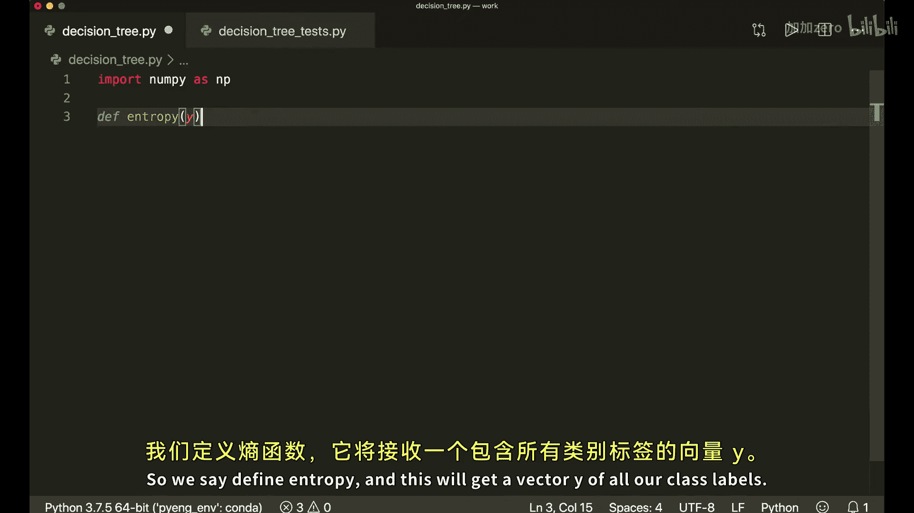

## 概述 📋

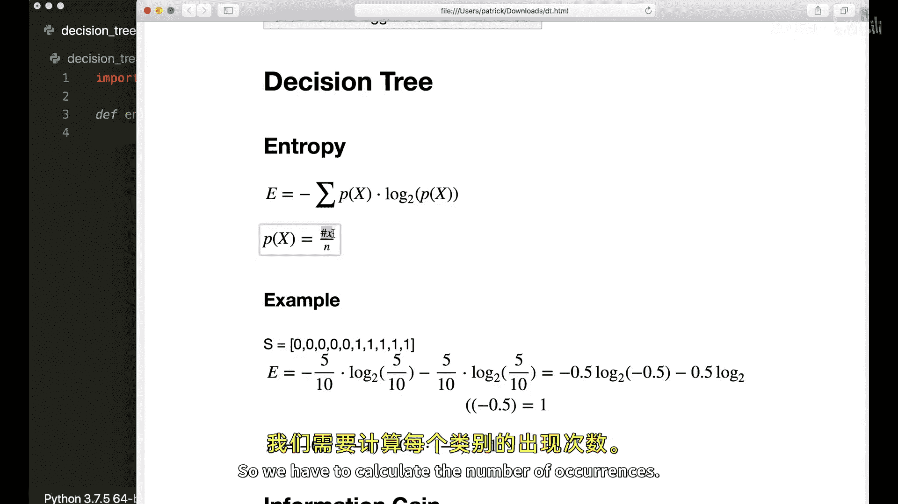

我们将实现一个决策树分类器，核心步骤包括：
1.  计算熵以衡量数据的不纯度。
2.  创建节点类来存储树的结构信息。
3.  实现树的生长逻辑，包括递归分割和停止条件判断。
4.  计算信息增益以选择最佳分割点。
5.  实现预测功能，遍历树对新样本进行分类。

## 熵的计算 📉

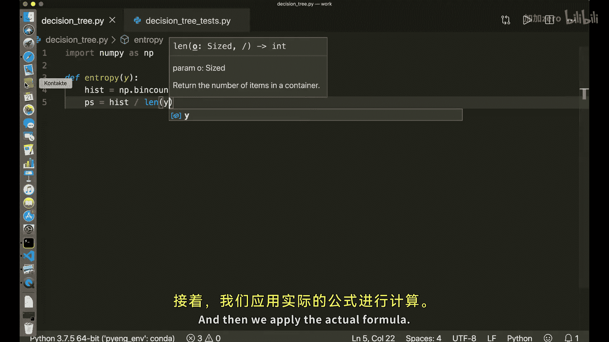

首先，我们需要一个函数来计算数据集的熵。熵的公式如下：

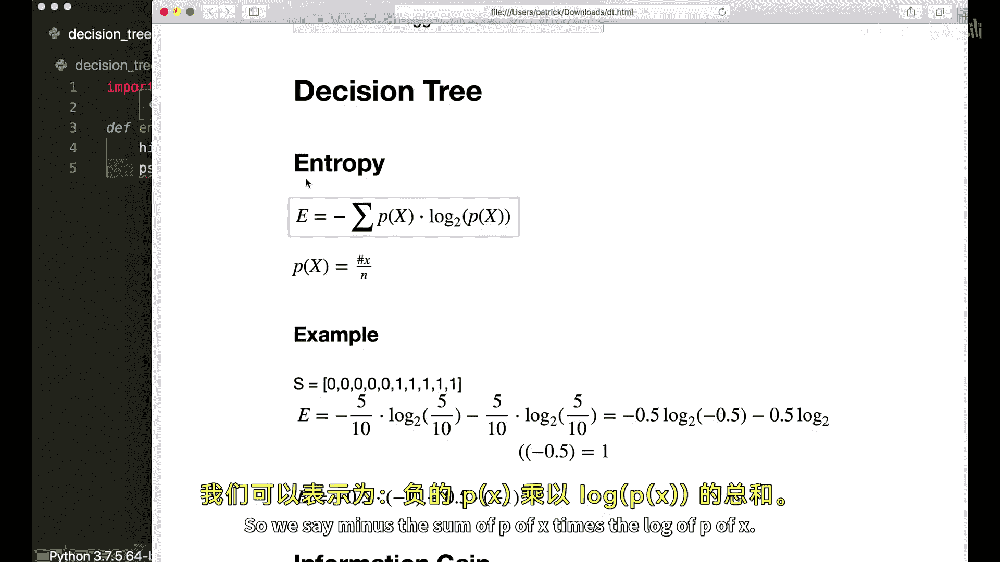

**公式：** `H(p) = - Σ p(x) * log₂(p(x))`

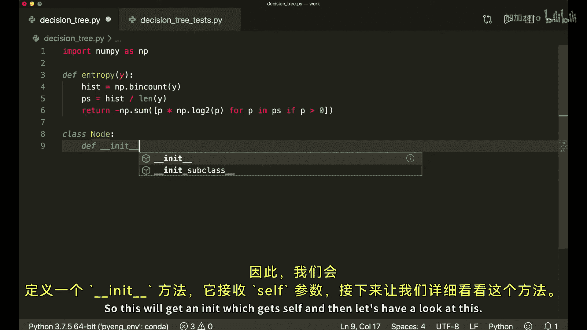

其中 `p(x)` 是每个类别在数据集中出现的概率。

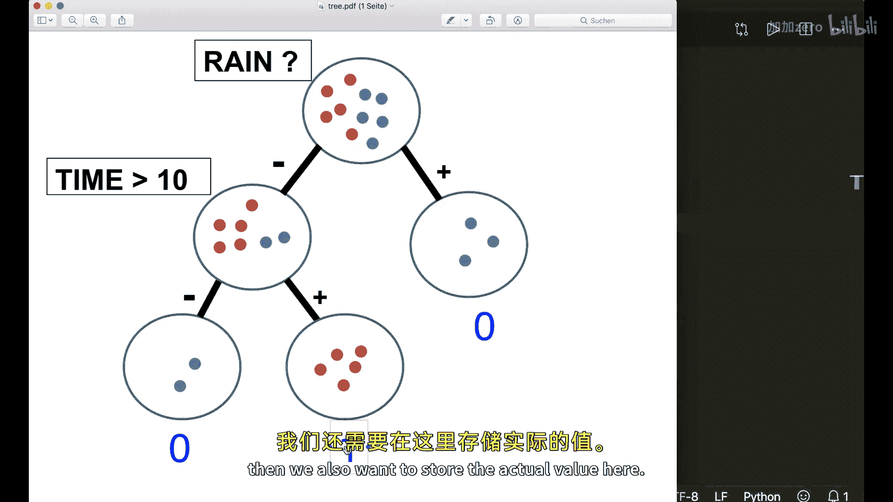

以下是计算熵的Python函数实现：

```python
import numpy as np

def entropy(y):
    # 计算每个类别出现的次数
    hist = np.bincount(y)
    # 计算每个类别的概率
    ps = hist / len(y)
    # 应用熵公式，避免对0取对数
    return -np.sum([p * np.log2(p) for p in ps if p > 0])
```

## 节点类 🧱

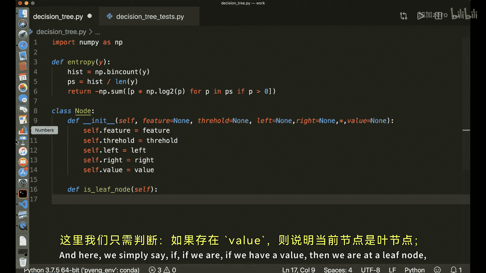

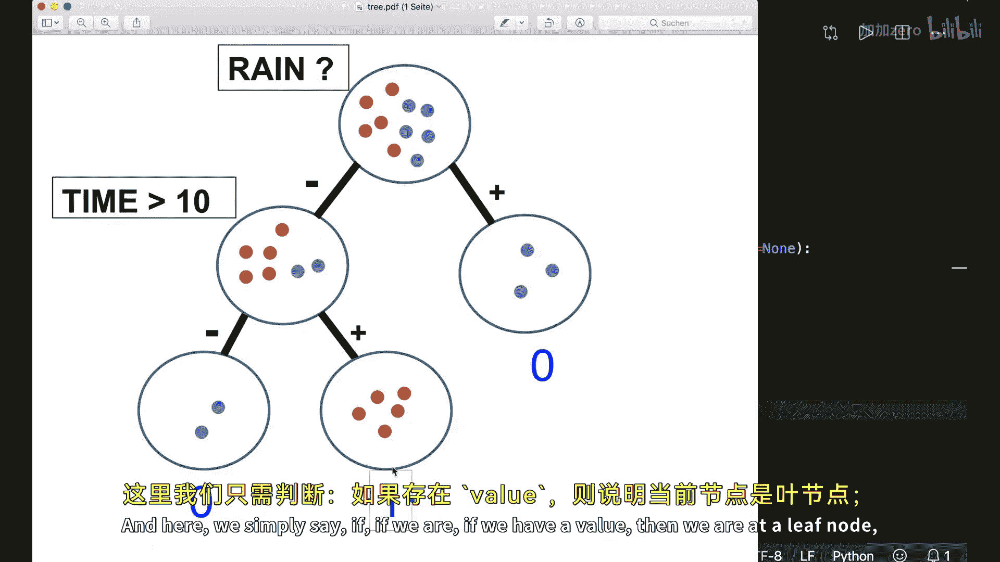

决策树由节点构成。我们需要一个`Node`类来存储每个节点的信息，例如分割特征、阈值、子节点或叶节点的预测值。

以下是节点类的实现：

```python
class Node:
    def __init__(self, feature=None, threshold=None, left=None, right=None, *, value=None):
        self.feature = feature
        self.threshold = threshold
        self.left = left
        self.right = right
        self.value = value

    def is_leaf_node(self):
        # 如果value不为None，则为叶节点
        return self.value is not None
```

*   **内部节点**：存储`feature`（分割特征索引）、`threshold`（分割阈值）、`left`（左子树）和`right`（右子树）。
*   **叶节点**：存储`value`（该节点最常出现的类别标签）。使用`*`强制`value`为关键字参数，使创建叶节点时的意图更清晰。

## 决策树类 🌳

现在，我们开始实现决策树的主类。它将包含树的生长和预测方法。

以下是决策树类的初始化方法：

```python
class DecisionTree:
    def __init__(self, min_samples_split=2, max_depth=100, n_features=None):
        self.min_samples_split = min_samples_split
        self.max_depth = max_depth
        self.n_features = n_features
        self.root = None
```

*   `min_samples_split`：节点继续分割所需的最小样本数。
*   `max_depth`：树的最大深度。
*   `n_features`：每次分割时考虑的特征数量（用于随机森林的随机性）。
*   `root`：树的根节点。

## 辅助方法：获取最常见标签 🏷️

在创建叶节点时，我们需要知道该节点数据中最常见的类别。

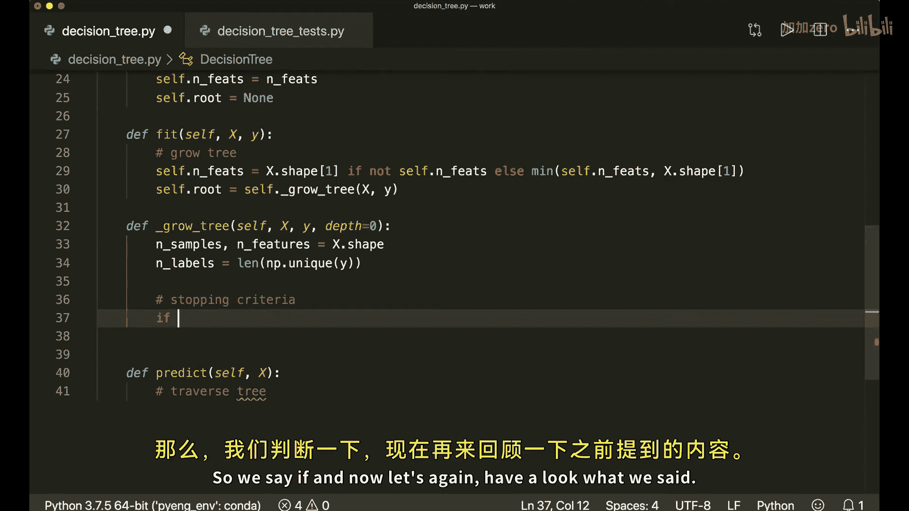

以下是获取最常见标签的方法：

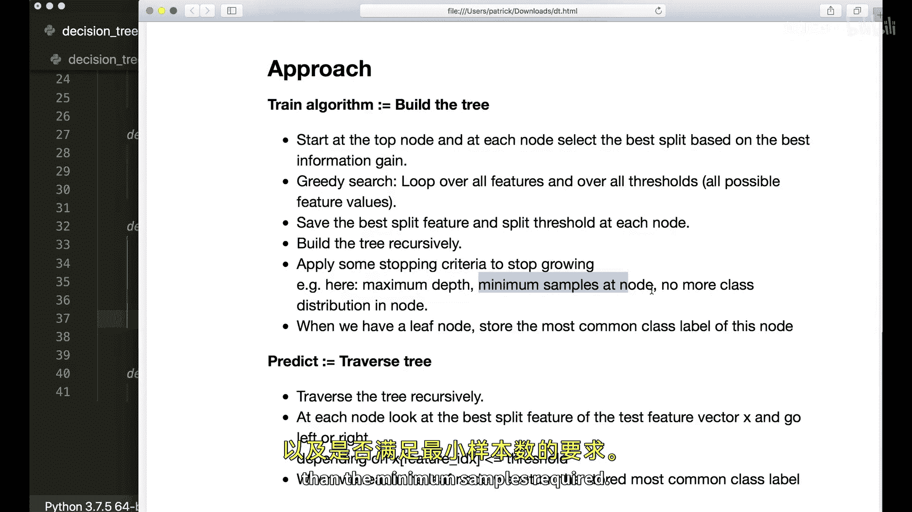

```python
from collections import Counter

def _most_common_label(self, y):
    counter = Counter(y)
    most_common = counter.most_common(1)[0][0]
    return most_common
```

## 核心方法：训练（拟合）模型 🌱

`fit`方法用于根据训练数据生长决策树。

以下是`fit`方法的框架：

```python
def fit(self, X, y):
    # 确定实际使用的特征数量
    self.n_features = X.shape[1] if not self.n_features else min(self.n_features, X.shape[1])
    # 从根节点开始生长树
    self.root = self._grow_tree(X, y)
```

### 递归生长树

`_grow_tree`是递归方法，负责树的构建。

以下是`_grow_tree`方法的实现步骤：

1.  **检查停止条件**：如果满足以下任一条件，则创建叶节点。
    *   达到最大深度 (`depth >= self.max_depth`)。
    *   节点中样本数少于最小分割样本数 (`n_samples < self.min_samples_split`)。
    *   节点中所有样本属于同一类别 (`n_labels == 1`)。
2.  **寻找最佳分割**：如果不满足停止条件，则在随机选择的特征子集中，遍历所有可能的分割阈值，计算信息增益，选择增益最大的特征和阈值。
3.  **递归分割**：根据最佳分割点，将数据分为左右两部分，并递归调用`_grow_tree`创建左右子树。
4.  **返回节点**：返回一个包含最佳分割信息和左右子树的内部节点。

以下是`_grow_tree`方法的核心代码：

```python
def _grow_tree(self, X, y, depth=0):
    n_samples, n_feats = X.shape
    n_labels = len(np.unique(y))

    # 停止条件
    if (depth >= self.max_depth or n_labels == 1 or n_samples < self.min_samples_split):
        leaf_value = self._most_common_label(y)
        return Node(value=leaf_value)

    # 随机选择特征索引
    feat_idxs = np.random.choice(n_feats, self.n_features, replace=False)

    # 贪婪搜索最佳分割
    best_feat, best_thresh = self._best_criteria(X, y, feat_idxs)

    # 根据最佳分割创建子节点
    left_idxs, right_idxs = self._split(X[:, best_feat], best_thresh)
    left = self._grow_tree(X[left_idxs, :], y[left_idxs], depth+1)
    right = self._grow_tree(X[right_idxs, :], y[right_idxs], depth+1)
    return Node(best_feat, best_thresh, left, right)
```

### 寻找最佳分割标准

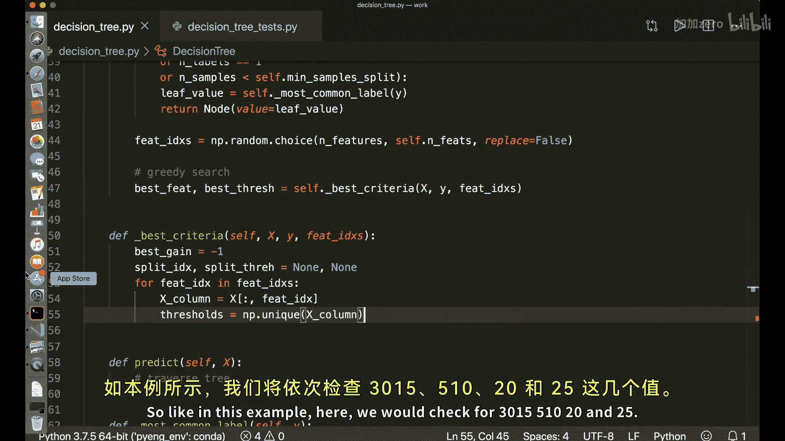

`_best_criteria`方法遍历给定的特征和阈值，计算信息增益，并返回增益最大的特征索引和阈值。

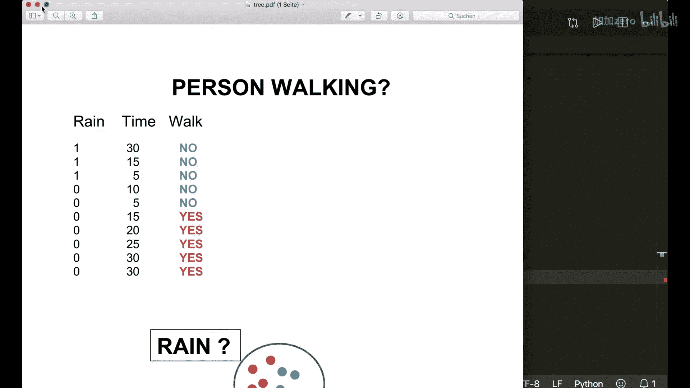

以下是`_best_criteria`方法的实现：

```python
def _best_criteria(self, X, y, feat_idxs):
    best_gain = -1
    split_idx, split_thresh = None, None

    for feat_idx in feat_idxs:
        X_column = X[:, feat_idx]
        thresholds = np.unique(X_column)

        for threshold in thresholds:
            gain = self._information_gain(y, X_column, threshold)
            if gain > best_gain:
                best_gain = gain
                split_idx = feat_idx
                split_thresh = threshold
    return split_idx, split_thresh
```

### 计算信息增益

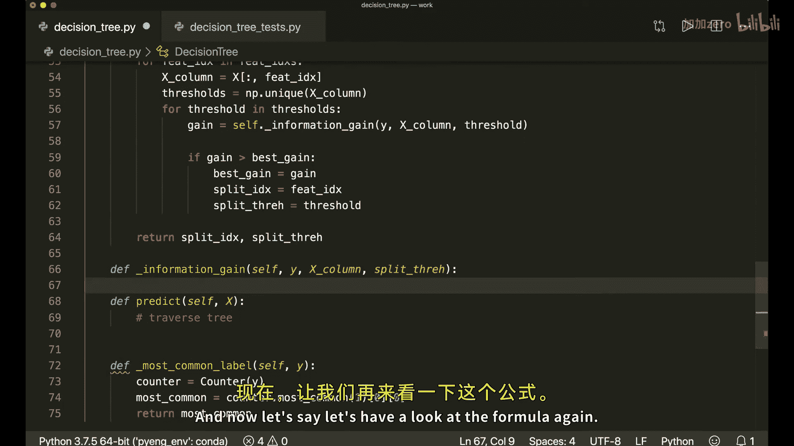

信息增益衡量了通过某个特征和阈值分割数据后，不确定性减少的程度。公式为：

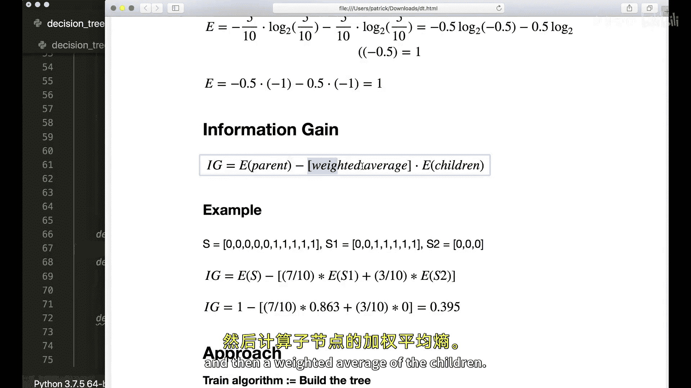

**公式：** `信息增益 = 父节点熵 - 子节点加权平均熵`

以下是`_information_gain`方法的实现：

```python
def _information_gain(self, y, X_column, threshold):
    # 父节点熵
    parent_entropy = entropy(y)
    # 生成分割
    left_idxs, right_idxs = self._split(X_column, threshold)
    if len(left_idxs) == 0 or len(right_idxs) == 0:
        return 0

    # 子节点加权平均熵
    n = len(y)
    n_l, n_r = len(left_idxs), len(right_idxs)
    e_l, e_r = entropy(y[left_idxs]), entropy(y[right_idxs])
    child_entropy = (n_l / n) * e_l + (n_r / n) * e_r

    # 计算信息增益
    information_gain = parent_entropy - child_entropy
    return information_gain
```

### 数据分割

`_split`方法根据给定的特征列和阈值，将数据索引分为左右两组。

以下是`_split`方法的实现：

```python
def _split(self, X_column, split_thresh):
    left_idxs = np.argwhere(X_column <= split_thresh).flatten()
    right_idxs = np.argwhere(X_column > split_thresh).flatten()
    return left_idxs, right_idxs
```

## 核心方法：预测 🔮

`predict`方法用于对新的数据集进行分类预测。

以下是`predict`方法的实现：

```python
def predict(self, X):
    # 对X中的每个样本进行遍历预测
    return np.array([self._traverse_tree(x, self.root) for x in X])
```

### 遍历树进行预测

`_traverse_tree`是一个递归方法，根据节点的规则，从根节点开始遍历树，直到到达叶节点并返回预测值。

以下是`_traverse_tree`方法的实现：

```python
def _traverse_tree(self, x, node):
    # 如果到达叶节点，返回预测值
    if node.is_leaf_node():
        return node.value

    # 根据特征和阈值决定向左还是向右子树遍历
    if x[node.feature] <= node.threshold:
        return self._traverse_tree(x, node.left)
    return self._traverse_tree(x, node.right)
```

## 测试与验证 ✅

实现完成后，我们可以使用一个数据集（例如scikit-learn的乳腺癌数据集）来测试决策树的性能。

以下是测试脚本的示例：

```python
from sklearn import datasets
from sklearn.model_selection import train_test_split

# 加载数据
data = datasets.load_breast_cancer()
X, y = data.data, data.target

# 划分训练集和测试集
X_train, X_test, y_train, y_test = train_test_split(X, y, test_size=0.2, random_state=1234)

# 创建并训练决策树
clf = DecisionTree(max_depth=10)
clf.fit(X_train, y_train)

# 预测并计算准确率
predictions = clf.predict(X_test)
accuracy = np.sum(predictions == y_test) / len(y_test)
print(f"决策树准确率: {accuracy}")
```

运行此脚本，可以评估我们实现的决策树分类器的性能。

## 总结 📝

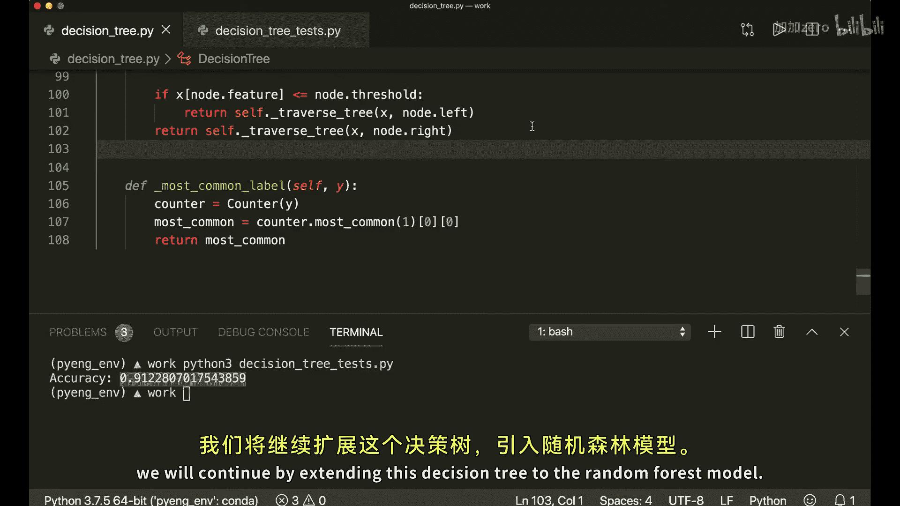

本节课中我们一起学习了决策树的完整实现过程。我们从计算熵开始，定义了节点结构，实现了递归生长树的逻辑，包括停止条件判断、基于信息增益的最佳分割点搜索。最后，我们实现了树的遍历预测功能。通过手动实现，我们深入理解了决策树如何通过一系列简单的“是/否”问题对数据进行分类。在接下来的课程中，我们将以此为基础，扩展构建更强大的集成模型——随机森林。