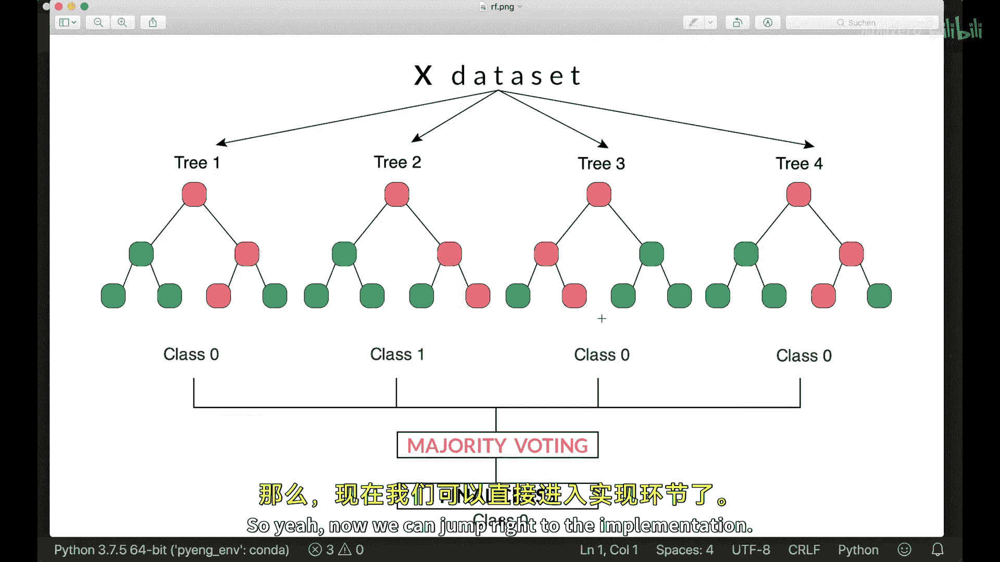
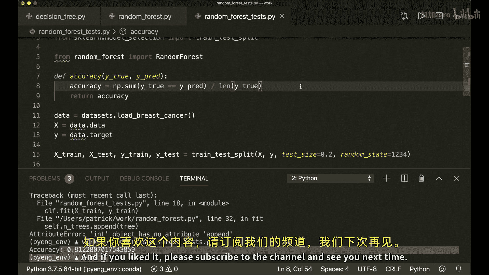

# 010：Python实现随机森林 🌲

在本教程中，我们将学习并实现一个强大的机器学习算法——随机森林。我们将仅使用Python内置模块和NumPy库，从零开始构建一个完整的随机森林分类器。

## 概述

随机森林算法是最强大和最流行的算法之一。它的核心思想是将多个决策树组合成一个“森林”。通过训练多棵树，并对它们的预测结果进行“多数投票”来得到最终预测，这种方法通常比单一决策树具有更高的准确性和更低的过拟合风险。

在上一节中，我们介绍了单个决策树的工作原理。本节中，我们将基于上次的决策树模型，构建一个完整的随机森林。

## 实现随机森林类



首先，我们需要导入必要的库和之前实现的决策树类。

```python
import numpy as np
from collections import Counter
from decision_tree import DecisionTree
```

接下来，我们创建 `RandomForest` 类。它的初始化函数需要接收一些参数，包括森林中树的数量以及决策树的相关参数。

```python
class RandomForest:
    def __init__(self, n_trees=100, min_samples_split=2, max_depth=100, n_feats=None):
        self.n_trees = n_trees
        self.min_samples_split = min_samples_split
        self.max_depth = max_depth
        self.n_feats = n_feats
        self.trees = []
```

## 训练模型：构建森林

在 `fit` 方法中，我们将训练指定数量的决策树。关键步骤是为每棵树提供一个随机的训练数据子集，这个过程称为“自助采样”。

以下是 `fit` 方法的实现步骤：

1.  清空树列表。
2.  循环创建指定数量的决策树。
3.  对每棵树，使用自助采样方法生成一个随机训练子集。
4.  用该子集训练决策树。
5.  将训练好的树添加到列表中。

```python
    def fit(self, X, y):
        self.trees = []
        for _ in range(self.n_trees):
            tree = DecisionTree(min_samples_split=self.min_samples_split,
                                max_depth=self.max_depth,
                                n_feats=self.n_feats)
            X_sample, y_sample = self._bootstrap_sample(X, y)
            tree.fit(X_sample, y_sample)
            self.trees.append(tree)
```

自助采样函数 `_bootstrap_sample` 的实现如下。它通过有放回地随机选择样本索引，来创建一个与原始数据集大小相同但包含重复和缺失样本的子集。

```python
    def _bootstrap_sample(self, X, y):
        n_samples = X.shape[0]
        idxs = np.random.choice(n_samples, n_samples, replace=True)
        return X[idxs], y[idxs]
```

## 进行预测：多数投票

在 `predict` 方法中，我们需要用森林中的每一棵树对输入数据进行预测，然后通过“多数投票”机制决定最终结果。

以下是 `predict` 方法的实现步骤：

1.  收集每棵树的预测结果。
2.  调整数组结构，使每一行对应一个样本在所有树上的预测。
3.  对每个样本的预测结果进行多数投票，选出最常见的标签作为最终预测。

```python
    def predict(self, X):
        tree_preds = np.array([tree.predict(X) for tree in self.trees])
        # 将形状从 (n_trees, n_samples) 转换为 (n_samples, n_trees)
        tree_preds = np.swapaxes(tree_preds, 0, 1)
        y_pred = [self._most_common_label(tree_pred) for tree_pred in tree_preds]
        return np.array(y_pred)
```

多数投票函数 `_most_common_label` 使用 `Counter` 来找出数组中出现次数最多的元素。

```python
    def _most_common_label(self, y):
        counter = Counter(y)
        most_common = counter.most_common(1)[0][0]
        return most_common
```

## 测试模型

最后，我们可以使用一个简单的测试脚本来验证我们的随机森林模型。这里我们使用乳腺癌数据集进行演示。

```python
from sklearn.datasets import load_breast_cancer
from sklearn.model_selection import train_test_split
from sklearn.metrics import accuracy_score

data = load_breast_cancer()
X = data.data
y = data.target

X_train, X_test, y_train, y_test = train_test_split(X, y, test_size=0.2, random_state=42)

clf = RandomForest(n_trees=3) # 为快速演示，仅使用3棵树
clf.fit(X_train, y_train)
predictions = clf.predict(X_test)

acc = accuracy_score(y_test, predictions)
print(f"模型准确率: {acc:.2f}")
```

运行上述代码，如果一切正常，你将看到模型在测试集上的准确率。

## 总结



本节课中我们一起学习了随机森林算法的核心思想与实现。我们了解到，随机森林通过集成多个在随机数据子集上训练的决策树，并采用多数投票的方式进行预测，从而提升了模型的整体性能和鲁棒性。我们成功地从零开始，用Python和NumPy实现了一个功能完整的随机森林分类器，并对其进行了简单的测试。