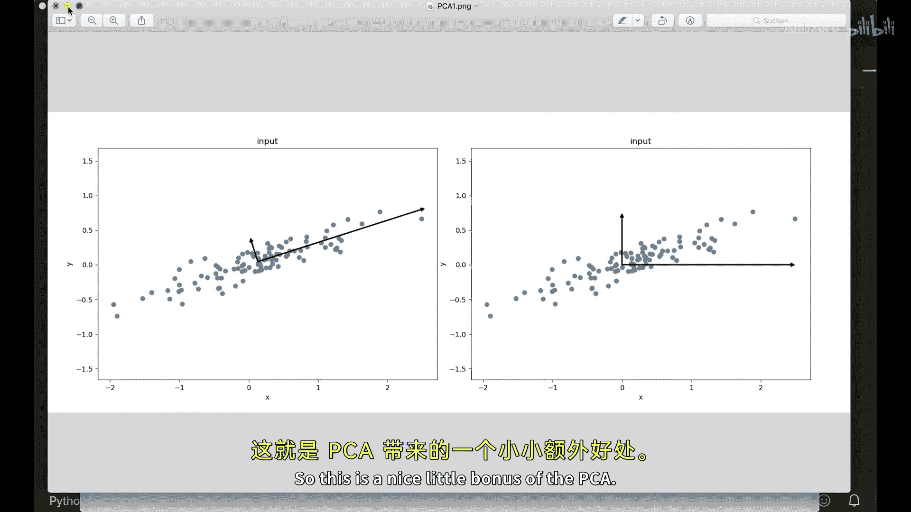
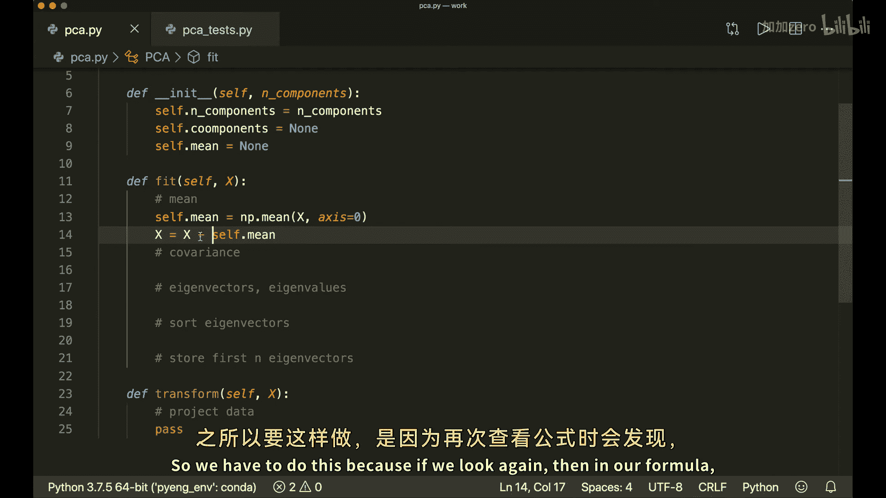
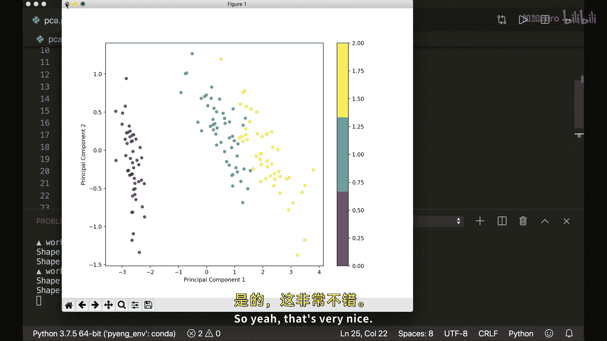
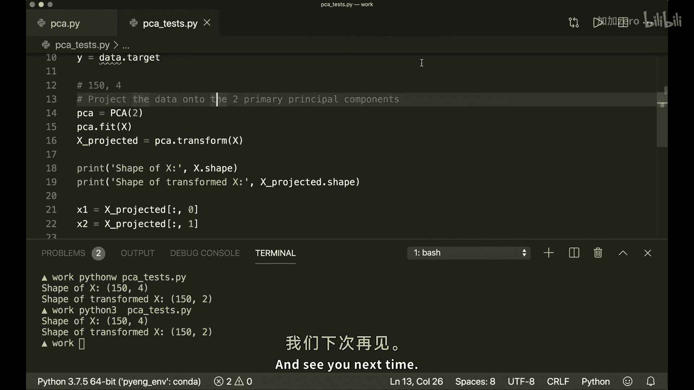

# 011：主成分分析（PCA）📊

## 概述
在本节课中，我们将学习并实现主成分分析（PCA）。PCA是一种用于获取线性无关特征并降低数据集维度的工具。我们将仅使用Python和NumPy库来完成实现。

## 核心概念
主成分分析的目标是找到一组新的维度，使得所有维度彼此正交（即线性无关），并根据数据沿这些维度的方差大小进行排序。这意味着我们希望找到一个变换，使得变换后的特征是线性无关的。通过仅保留重要性最高的维度，可以实现降维。

这些新找到的维度应最小化投影误差，并且投影点应具有最大的散布范围，即最大方差。

为了更直观地理解，请看下图。假设我们的二维数据分布如图所示，我们希望将其投影到一维空间。我们需要找到彼此正交的轴，当数据投影到这些轴上时，新的投影数据应具有最大的散布范围。



左侧是正确的**主成分轴**。如果我们将数据投影到最大的主成分（即左侧的轴）上，数据将具有最大的散布范围。例如，观察右侧的轴，这些是不正确的轴。如果我们将数据投影到右侧的Y轴上，效果会更差。我们可以清楚地看到，许多数据点重叠在同一位置，因此我们无法获得更多信息。而在左侧，投影数据具有最大的散布范围，因此我们保留了数据的大部分信息。

此外，投影误差（即从数据点到轴的垂直距离）在左侧是最小的。而在右侧，每个点都需要很长的投影线。因此，左侧是正确的答案。

## 数学原理
那么，我们如何找到这些主成分呢？如前所述，我们希望最大化方差，因此需要一些数学计算。

首先，我们需要样本 **x** 的方差，计算公式为：
**方差 = (1 / n) * Σ (x_i - x̄)²**
其中，**x̄** 是均值，我们需要从数据集中减去均值。

其次，我们需要**协方差矩阵**。协方差表示两个变量一起变化的程度。两个变量的协方差矩阵定义为：
**Cov(X, Y) = (1 / n) * Σ (x_i - x̄)(y_i - ȳ)**
在我们的案例中，我们需要计算 **X** 与自身的协方差矩阵，这也称为**自协方差矩阵**。

计算协方差矩阵后，我们的问题就简化为一个**特征向量**和**特征值**问题。特征向量指向最大方差的方向，而对应的特征值表示该特征向量的重要性。


再次观察左侧的图像，这里绘制的两个向量对应于我们数据集协方差矩阵的特征向量。这就是我们需要做的。

## 实现步骤
以下是实现PCA的步骤：

1.  **减去均值**：从数据集中减去均值。
2.  **计算协方差矩阵**。
3.  **计算特征向量和特征值**。
4.  **按特征值降序排序特征向量**。
5.  **选择前K个特征向量**：指定要保留的维度数量K，然后选择前K个特征向量作为新的K个维度。
6.  **转换原始数据**：通过将原始数据与选定的特征向量进行点积运算，将数据投影到这些新维度上。

完成以上步骤后，我们就实现了PCA。PCA和特征向量的一个优点是它们彼此正交，这意味着我们的新数据也是线性无关的，这是PCA的一个额外好处。



## 代码实现
现在我们可以开始编写代码。首先导入NumPy库，然后创建一个PCA类。

```python
import numpy as np

class PCA:
    def __init__(self, n_components):
        self.n_components = n_components
        self.components = None
        self.mean = None

    def fit(self, X):
        # 减去均值
        self.mean = np.mean(X, axis=0)
        X = X - self.mean

        # 计算协方差矩阵
        cov = np.cov(X.T)

        # 计算特征值和特征向量
        eigenvalues, eigenvectors = np.linalg.eig(cov)
        eigenvectors = eigenvectors.T

        # 按特征值降序排序特征向量
        sorted_indices = np.argsort(eigenvalues)[::-1]
        eigenvalues = eigenvalues[sorted_indices]
        eigenvectors = eigenvectors[sorted_indices]

        # 存储前n_components个特征向量
        self.components = eigenvectors[0:self.n_components]

    def transform(self, X):
        # 减去均值
        X = X - self.mean

        # 投影数据
        return np.dot(X, self.components.T)
```

## 测试与结果
为了测试我们的PCA实现，我们使用著名的Iris数据集。该数据集有150个样本和4个特征。我们将使用PCA将其降维到2维，并进行可视化。

```python
from sklearn.datasets import load_iris
import matplotlib.pyplot as plt

# 加载Iris数据集
data = load_iris()
X = data.data
y = data.target

# 创建PCA实例并拟合数据
pca = PCA(n_components=2)
pca.fit(X)
X_projected = pca.transform(X)

print('原始数据形状:', X.shape)
print('转换后数据形状:', X_projected.shape)

# 可视化
plt.scatter(X_projected[:, 0], X_projected[:, 1],
            c=y, edgecolor='none', alpha=0.8,
            cmap=plt.cm.get_cmap('viridis', 3))
plt.xlabel('主成分 1')
plt.ylabel('主成分 2')
plt.colorbar()
plt.show()
```

运行上述代码后，我们将4维特征向量转换（投影）到2维空间。从图中可以看出，三个不同的类别用不同的颜色表示，我们仍然可以轻松地区分它们。这表明PCA在降维的同时，有效地保留了数据的主要结构信息。






## 总结
在本节课中，我们一起学习了主成分分析（PCA）的核心概念、数学原理和实现步骤。我们使用Python和NumPy从零开始实现了一个PCA类，并通过Iris数据集验证了其效果。PCA通过找到数据方差最大的方向（主成分），实现了数据降维并保留了最重要的信息，同时确保新特征是线性无关的。这是一个在数据预处理和特征工程中非常强大的工具。