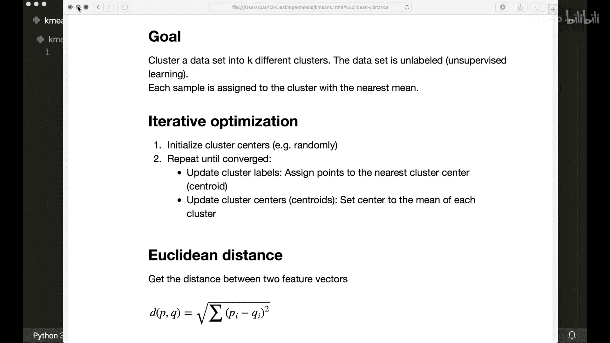
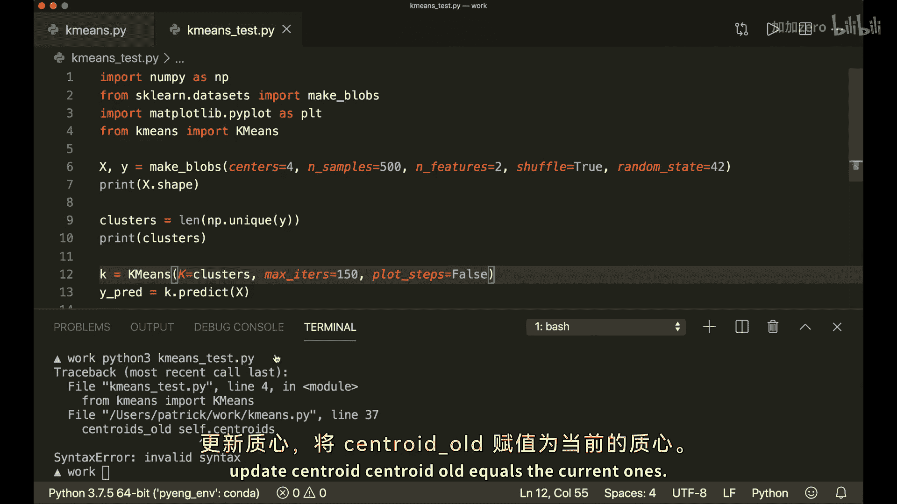
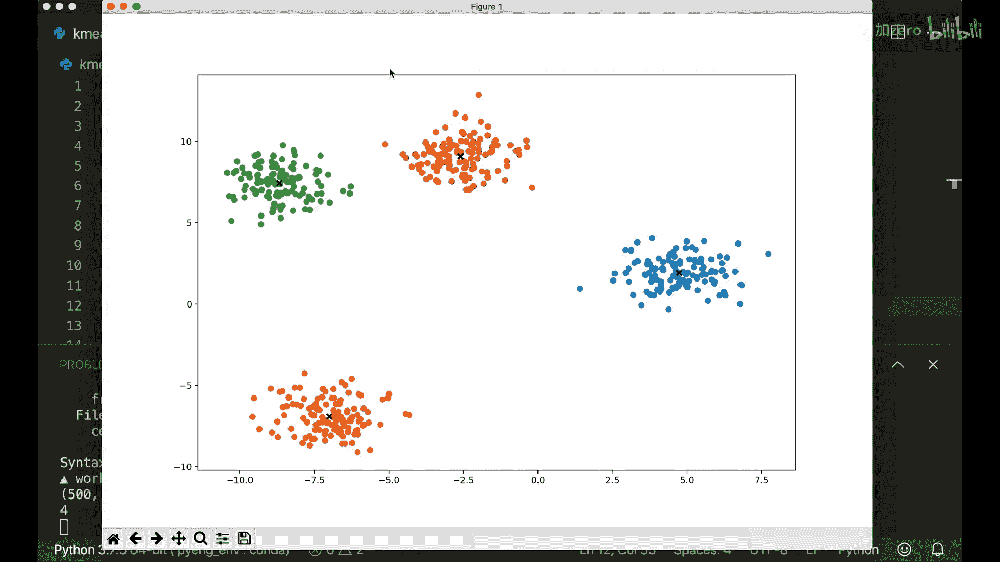
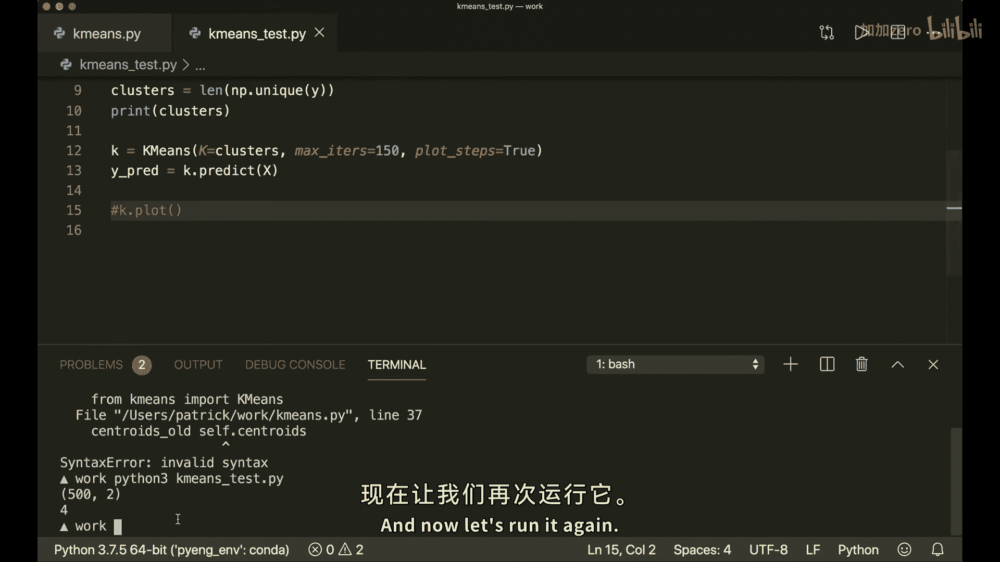
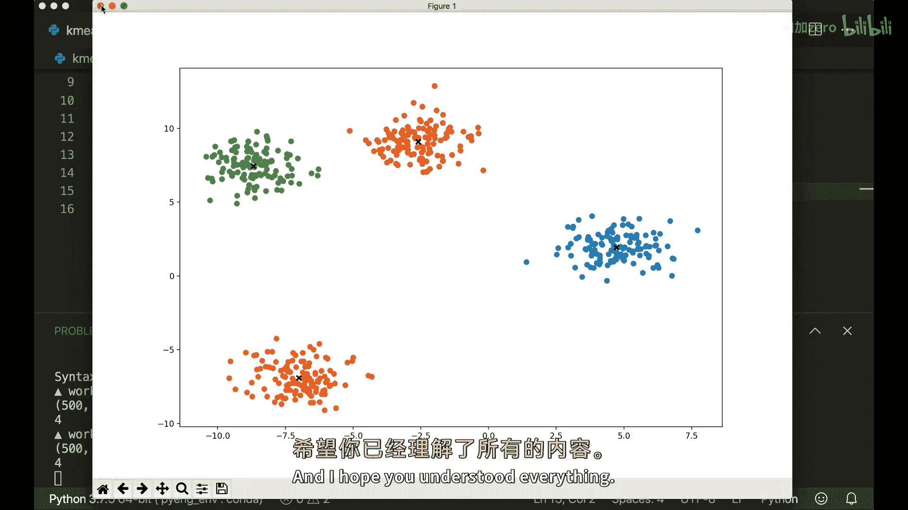
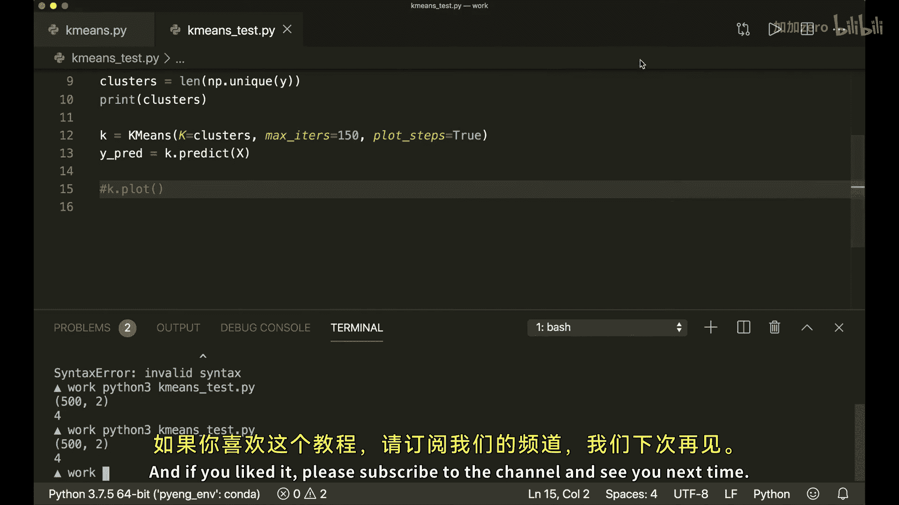

# 012：K-Means聚类算法Python实现 🧠

在本节课中，我们将学习并从头开始实现K-Means聚类算法。这是一种无监督学习技术，用于将数据集划分为K个不同的簇。我们将仅使用Python内置模块和NumPy来完成实现。

## 概述

K-Means算法的目标是将一个未标记的数据集聚类成K个不同的簇。每个样本将被分配到距离其最近的簇中心（质心）所在的簇。这是一个迭代优化过程，主要包含两个步骤：更新簇标签和更新质心位置。

## 核心概念与数学基础



算法实现的核心是计算样本点之间的距离。我们使用**欧几里得距离**来衡量两个向量之间的相似度。

**欧几里得距离公式**如下：

`distance = sqrt(sum((x1_i - x2_i)^2))`

其中，`x1`和`x2`是两个特征向量，`i`代表向量的每个维度。

## 算法步骤详解

上一节我们介绍了K-Means的基本思想，本节中我们来看看其具体的迭代步骤。

以下是K-Means算法的核心迭代过程：

1.  **初始化质心**：从数据集中随机选择K个样本点作为初始质心。
2.  **分配簇标签**：对于数据集中的每一个样本，计算其到所有质心的欧几里得距离，并将其分配到距离最近的质心所在的簇。
3.  **更新质心位置**：对于每一个簇，计算其所有成员样本点的平均值，并将该平均值设置为新的质心。
4.  **检查收敛**：比较新旧质心的位置。如果所有质心都不再发生变化（或变化小于某个阈值），则算法收敛，停止迭代。否则，返回步骤2继续迭代。

## Python代码实现

现在，让我们开始动手实现。首先，我们需要导入必要的库并定义计算欧几里得距离的函数。

```python
import numpy as np

def euclidean_distance(x1, x2):
    """
    计算两个向量之间的欧几里得距离。
    """
    return np.sqrt(np.sum((x1 - x2) ** 2))
```

接下来，我们实现KMeans类。这个类将包含初始化、预测（即聚类）以及一些辅助方法。

```python
class KMeans:
    def __init__(self, K=5, max_iters=100, plot_steps=False):
        self.K = K
        self.max_iters = max_iters
        self.plot_steps = plot_steps

        # 存储每个簇的样本索引列表
        self.clusters = [[] for _ in range(self.K)]
        # 存储每个簇的质心（特征向量）
        self.centroids = []

    def predict(self, X):
        """
        对输入数据X进行聚类。
        """
        self.X = X
        self.n_samples, self.n_features = X.shape

        # 1. 初始化质心
        random_sample_idxs = np.random.choice(self.n_samples, self.K, replace=False)
        self.centroids = [self.X[idx] for idx in random_sample_idxs]

        # 优化循环
        for _ in range(self.max_iters):
            # 2. 更新簇（分配样本到最近的质心）
            self.clusters = self._create_clusters(self.centroids)

            if self.plot_steps:
                self.plot()

            # 保存旧的质心以检查收敛
            centroids_old = self.centroids
            # 3. 更新质心（计算簇的平均值）
            self.centroids = self._get_centroids(self.clusters)

            if self.plot_steps:
                self.plot()

            # 4. 检查收敛
            if self._is_converged(centroids_old, self.centroids):
                break

        # 5. 返回每个样本的簇标签
        return self._get_cluster_labels(self.clusters)

    def _create_clusters(self, centroids):
        """
        将每个样本分配到最近的质心，形成簇。
        """
        clusters = [[] for _ in range(self.K)]
        for idx, sample in enumerate(self.X):
            centroid_idx = self._closest_centroid(sample, centroids)
            clusters[centroid_idx].append(idx)
        return clusters

    def _closest_centroid(self, sample, centroids):
        """
        找到距离给定样本最近的质心的索引。
        """
        distances = [euclidean_distance(sample, point) for point in centroids]
        closest_idx = np.argmin(distances)
        return closest_idx

    def _get_centroids(self, clusters):
        """
        计算每个簇中所有样本的平均值，作为新的质心。
        """
        centroids = np.zeros((self.K, self.n_features))
        for cluster_idx, cluster in enumerate(clusters):
            cluster_mean = np.mean(self.X[cluster], axis=0)
            centroids[cluster_idx] = cluster_mean
        return centroids

    def _is_converged(self, centroids_old, centroids):
        """
        通过比较新旧质心之间的距离来判断算法是否收敛。
        """
        distances = [euclidean_distance(centroids_old[i], centroids[i]) for i in range(self.K)]
        return sum(distances) == 0

    def _get_cluster_labels(self, clusters):
        """
        为每个样本生成其所属簇的标签（索引）。
        """
        labels = np.empty(self.n_samples)
        for cluster_idx, cluster in enumerate(clusters):
            for sample_idx in cluster:
                labels[sample_idx] = cluster_idx
        return labels

    def plot(self):
        """
        可视化数据点、簇分配和质心（需要matplotlib）。
        """
        import matplotlib.pyplot as plt
        fig, ax = plt.subplots(figsize=(12, 8))

        for i, index in enumerate(self.clusters):
            point = self.X[index].T
            ax.scatter(*point)

        for point in self.centroids:
            ax.scatter(*point, marker='x', color='black', linewidth=2)

        plt.show()
```

## 算法运行与可视化

为了理解算法的动态过程，我们可以创建一个简单的数据集并运行我们的KMeans类，同时开启`plot_steps`选项来观察每一步的变化。

以下是使用示例：

```python
# 设置随机种子以确保结果可复现
np.random.seed(42)
# 创建一个简单的测试数据集（例如，使用make_blobs）
from sklearn.datasets import make_blobs
X, y = make_blobs(n_samples=300, centers=4, random_state=42, cluster_std=0.60)

# 初始化并运行KMeans
kmeans = KMeans(K=4, max_iters=150, plot_steps=True)
labels = kmeans.predict(X)

# 最终聚类结果
print("聚类完成。")
```

运行上述代码，你将看到算法从随机初始化开始，通过迭代更新质心和重新分配样本，最终收敛到稳定的四个簇的过程。





## 总结



本节课中我们一起学习了K-Means聚类算法的原理，并从头实现了它。我们了解了其作为无监督学习技术的核心思想：通过迭代优化，将数据点划分到K个簇中，使得每个点到其所属簇质心的距离平方和最小。

关键点回顾：
1.  K-Means需要预先指定簇的数量K。
2.  算法从随机初始化质心开始。
3.  通过交替执行“分配样本”和“更新质心”两个步骤进行迭代优化。
4.  使用欧几里得距离作为相似性度量。
5.  当质心不再移动时，算法收敛。





这个实现虽然基础，但它清晰地展示了K-Means的工作原理。你可以尝试调整K值、使用不同的数据集，或改进初始化方法（如K-Means++）来进一步探索。